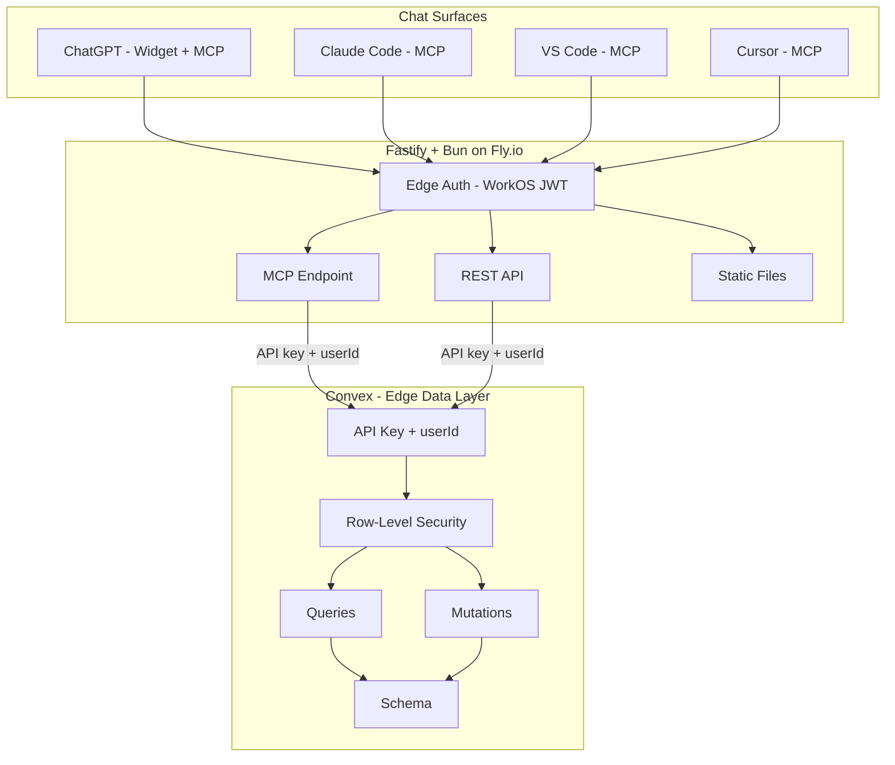
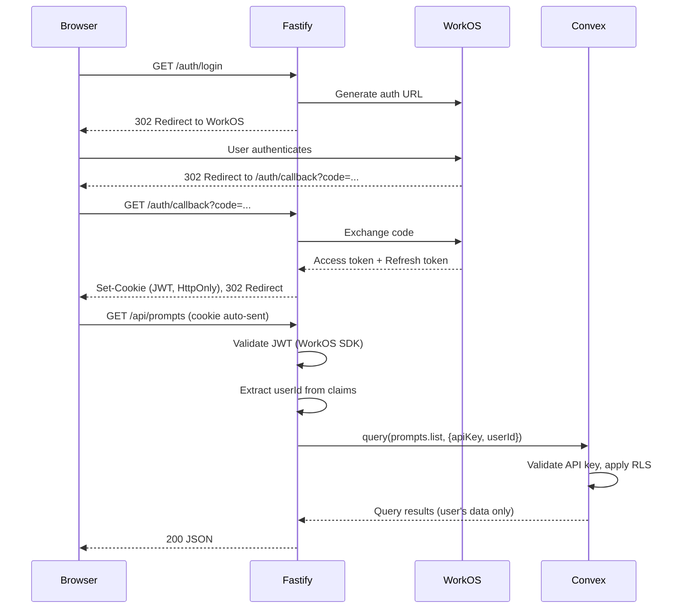
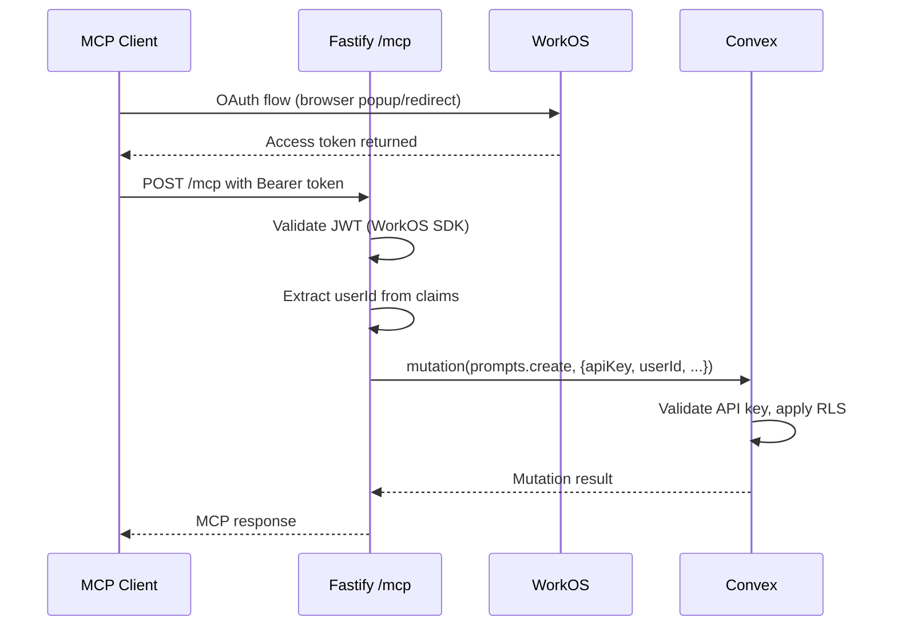
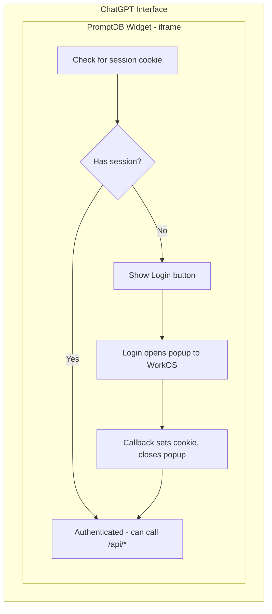
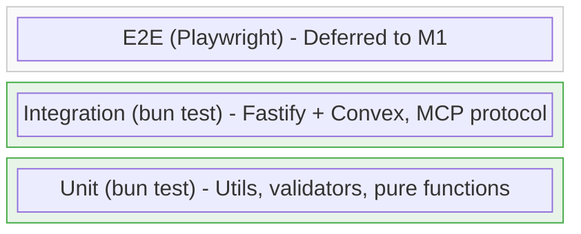
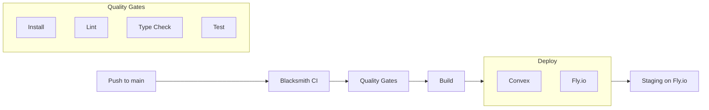

# PromptDB Architecture Document

_This document serves as the single source of truth for all architectural decisions. It is organized into shardable sections that can be extracted as context for AI coding agents._

---

## 1. Product Summary

<!-- SHARD: product-context -->

**PromptDB** captures emerging AI collaboration wisdom and provides frictionless access across every chat surface.

```
User develops prompt patterns → Wisdom scatters across surfaces → Lost
                                        ↓
                              PromptDB captures in flow → Available everywhere
```

### Core Value Proposition

1. **Interface IS the chat** - invoke via MCP, don't visit a separate app
2. **Portability as core** - wisdom follows you across ChatGPT, Claude, Cursor, VS Code
3. **Inference arbitrage** - host (OpenAI/Anthropic) pays for AI, user pays for storage
4. **Harvest feature** - "review this session, extract valuable prompts"

### Target User

The **AI Power User**: uses AI daily across surfaces, crafts prompts carefully, hates friction, will pay $5/mo for "just works."

### Milestones

| Milestone | Goal | Key Deliverables |
|-----------|------|------------------|
| **M0** | Production Hello World | Stack wired, deployed to staging, testing pyramid |
| **M1** | Dogfood | Basic CRUD, harvest, works in Claude Code + VS Code |
| **M2** | App Store | ChatGPT widget, web UI, Stripe billing, submission |

<!-- END SHARD: product-context -->

---

## 2. Requirements

<!-- SHARD: requirements -->

### 2.1 Functional Requirements

| ID | Requirement | Milestone |
|----|-------------|-----------|
| FR-01 | Save prompt from any MCP-enabled surface | M1 |
| FR-02 | Retrieve prompt by name, description, or topic | M1 |
| FR-03 | List all user prompts with filtering | M1 |
| FR-04 | Harvest: review session, extract prompt candidates | M1 |
| FR-05 | User authentication via OAuth (Google, GitHub, email) | M0 |
| FR-06 | Health check endpoints for all layers | M0 |
| FR-07 | ChatGPT widget for prompt access | M2 |
| FR-08 | Web UI for billing and settings | M2 |
| FR-09 | Stripe subscription management | M2 |

### 2.2 Non-Functional Requirements

| ID | Requirement | Target | Rationale |
|----|-------------|--------|-----------|
| NFR-01 | API response time | < 200ms p90 | MCP calls must feel instant |
| NFR-02 | Simultaneous requests | 2,000 | Handle viral ChatGPT spikes |
| NFR-03 | Monthly infrastructure cost | < $100 (pre-scale) | Affordable while building users |
| NFR-04 | Availability | 99.5% | Critical for chat surface integration |
| NFR-05 | GDPR compliance | User data exportable/deletable | Privacy policy requirement |
| NFR-06 | Model-friendly architecture | Tech choices scale with model capabilities | AI as primary coder |

**NFR-06 Rationale:** The system is designed to maximize a coding model's ability to be the primary implementer. Technology choices play to model strengths and scale linearly with model capabilities:

- **HTML + vanilla JS over React** - Simpler patterns scale linearly with model ability; React's simultaneous constraints (hooks rules, re-render optimization, state management) create compounding complexity that doesn't scale as well with model capabilities
- **TypeScript throughout** - Models excel at type-aware code generation
- **Zod schemas** - Declarative validation that models can reason about
- **Explicit over magic** - Fewer framework conventions to remember

### 2.3 Constraints

1. **ChatGPT App Store requirements** - Must meet OpenAI submission guidelines (privacy policy, reliability, atomic tools)
2. **Budget constraint** - Infrastructure must remain affordable during user acquisition phase
3. **Solo developer** - Architecture must minimize operational overhead

### 2.4 Architectural Limitations

1. **All Convex operations require userId** - API key + userId architecture means all Convex calls are scoped to a specific user. Background jobs or system-level operations without user context require workarounds (e.g., internal Convex functions that bypass RLS, or a dedicated "system user").

<!-- END SHARD: requirements -->

---

## 3. System Overview

<!-- SHARD: system-overview -->

### 3.1 High-Level Architecture



### 3.2 Layer Responsibilities

| Layer | Responsibility | Technology |
|-------|----------------|------------|
| **Chat Surfaces** | User interaction, MCP client | ChatGPT, Claude, VS Code |
| **API Layer** | Request handling, auth enforcement, MCP protocol | Fastify + Bun |
| **Auth** | Identity, session management | WorkOS AuthKit |
| **Data Layer** | Persistence, real-time, user scoping | Convex |
| **Hosting** | Compute, load balancing, SSL | Fly.io |
| **CI/CD** | Build, test, deploy | Blacksmith |

### 3.3 Why This Architecture

**Fastify between surfaces and Convex** - not standard Convex usage, but intentional:

1. **MCP control** - MCP protocol requires streaming/SSE patterns that Convex actions don't handle well
2. **No cold starts** - VPS instances are always warm, critical for MCP responsiveness
3. **Auth transformation** - Edge validates user JWT, passes to Convex with user context
4. **Widget serving** - Static files served from same origin, no CORS complexity

**Convex as lightweight data access layer** (not a reactive backend powering a React frontend):

1. **ORM baked in** - Object-relational mapping works intuitively and seamlessly, reducing cognitive load when navigating object-to-datastore conversion
2. **Strongly typed stored procedures** - Queries and mutations are TypeScript functions with full type safety, accessed via edge API calls
3. **High performance storage** - Optimized data storage and retrieval with automatic indexing
4. **No Node.js actions** - Edge runtime only; all Node.js work happens in Fastify layer
5. **Schema as code** - Fully specified in TypeScript, no separate schema language

<!-- END SHARD: system-overview -->

---

## 4. Core Architectural Decisions

<!-- SHARD: decisions -->

### 4.1 Runtime & Package Management

| Decision | Choice | Version | Rationale |
|----------|--------|---------|-----------|
| Runtime | Bun | 1.1.x | Fast startup, native TS, built-in bundler |
| Package Manager | Bun | 1.1.x | Unified toolchain |

### 4.2 API Framework

| Decision | Choice | Version | Rationale |
|----------|--------|---------|-----------|
| HTTP Framework | Fastify | 5.6.2 | Fast, low overhead, plugin ecosystem |
| CORS | @fastify/cors | 10.x | Required for widget cross-origin |
| Static Files | @fastify/static | 8.x | Serve widget assets |
| Cookies | @fastify/cookie | 11.x | Session cookie handling |
| Logging | Pino (built-in) | - | Structured JSON, zero config |

### 4.3 MCP Integration

| Decision | Choice | Version | Rationale |
|----------|--------|---------|-----------|
| MCP SDK | @modelcontextprotocol/sdk | 1.25.1 | Official TypeScript SDK |
| Fastify Plugin | fastify-mcp | 2.1.0 | Native Fastify integration |
| Transport | Streamable HTTP + SSE fallback | - | Modern standard with backwards compat |
| Validation | Zod | 4.2.1 | MCP SDK uses Zod for schemas |
| Fastify + Zod | fastify-type-provider-zod | latest | Official type provider pattern |

**Zod + Fastify Integration:**

Fastify natively uses JSON Schema via AJV. To use Zod, the `fastify-type-provider-zod` package provides both validator and serializer compilers that must be registered together. This enables Zod schemas to drive request validation, response serialization, and TypeScript type inference.

**Why Zod over TypeBox:**
- MCP SDK has native Zod integration for tool schemas - single source of truth
- Same validation library for MCP tools and API routes
- Type inference from schemas without duplication
- Model-friendly: declarative, easy to reason about

### 4.4 Data Layer

| Decision | Choice | Version | Rationale |
|----------|--------|---------|-----------|
| Database | Convex | 1.31.2 | Real-time, managed, TypeScript-native |
| Local Dev | `npx convex dev --local` | - | No cloud quotas, faster sync |
| Staging/Prod | Convex Cloud | - | Managed, auto-scaling |

### 4.5 Authentication

| Decision | Choice | Version | Rationale |
|----------|--------|---------|-----------|
| Auth Provider | WorkOS AuthKit | - | Free to 1M MAU, enterprise SSO path |
| Node SDK | @workos-inc/node | 7.77.0 | OAuth flow, session management |
| JWT Validation | jose | 6.x | JWKS validation, multi-issuer support |
| Session Storage | HttpOnly sealed cookie | - | XSS-proof, automatic with requests |

### 4.6 Frontend

| Decision | Choice | Rationale |
|----------|--------|-----------|
| Framework | Plain HTML + Vanilla JS | No build complexity for simple widgets |
| Bundler | Bun build | Already have Bun, no extra tooling |
| CSS | Plain CSS | Minimal UI for M0-M2 |
| Reactivity | None (revisit if needed) | YAGNI - add Alpine.js later if painful |

### 4.7 Infrastructure & Deployment

| Decision | Choice | Rationale |
|----------|--------|-----------|
| Hosting | Fly.io | Easy scaling, no cold starts, built-in LB |
| CI/CD | Blacksmith | Faster than GitHub Actions |
| Container | Dockerfile (oven/bun:1) | Bun-native base image |
| Environments | Local → Staging (main branch) | Prod added in M1 |

### 4.8 Code Quality

| Decision | Choice | Version | Rationale |
|----------|--------|---------|-----------|
| Linter/Formatter | Biome | 2.3.10 | 10-25x faster than ESLint+Prettier, one config |
| Type Checking | TypeScript | 5.x | Strict mode |
| Testing | bun test | - | Built-in, fast, Jest-compatible |
| E2E Testing | Deferred to M1 | - | Add Playwright when real flows exist |

<!-- END SHARD: decisions -->

---

## 5. Authentication Architecture

<!-- SHARD: auth-architecture -->

### 5.1 Auth Design Choices

1. **Auth validated at edge** - Fastify validates JWT before any processing
2. **API key + userId to Convex** - Fastify authenticates to Convex with API key, passes userId for RLS
3. **User-scoped data** - Convex RLS enforces user can only access their own data
4. **HttpOnly cookies** - Tokens never exposed to client JavaScript

**Separation of concerns:** Fastify handles all JWT validation (WorkOS SDK). Convex doesn't know about JWTs - it trusts Fastify (via API key) and enforces data access via RLS based on userId.

**Limitation:** All access requires userId. Background jobs or system operations without user context require workarounds. See Section 5.7.

### 5.2 Auth Environments

| Environment | WorkOS Environment | Notes |
|-------------|-------------------|-------|
| Local | WorkOS Local (dedicated) | Requested additional environment |
| Staging | WorkOS Staging | Auto-provisioned |
| Production | WorkOS Production | Configured when ready |

### 5.3 Auth Flow: Web Application



### 5.4 Auth Flow: MCP Endpoint

MCP clients (ChatGPT, Claude Code, VS Code) authenticate via OAuth before making MCP calls.



### 5.5 Auth Flow: ChatGPT Widget (iframe)

ChatGPT widgets run in iframes. OAuth is initiated from the widget, redirects through WorkOS, returns to widget callback.



### 5.6 Convex Auth Configuration

Convex does not validate JWTs. Instead, it uses API key + userId authentication:

- **API key** - Environment variable shared between Fastify and Convex, proves request came from trusted Fastify server
- **userId** - WorkOS user ID passed from Fastify after JWT validation, used for RLS
- **RLS wrapper** - All queries/mutations wrapped with row-level security that filters by userId

Convex functions receive userId as an argument and use RLS to ensure users can only access their own data. No JWKS or JWT validation needed in Convex.

### 5.7 Why User-Scoped Operations

**Design choice:** All Convex operations require a userId. The API key authenticates Fastify as a trusted caller, but operations are still scoped to a user via RLS.

**Trade-offs:**

| Aspect | Impact |
|--------|--------|
| Security | Higher - RLS limits blast radius to single user's data if API key compromised |
| Coupling | Lower - Convex doesn't need to understand JWTs or WorkOS |
| Simplicity | Lower - can't have background jobs without user context |
| Audit | Better - all actions traceable to specific user |

**Mitigation for background jobs (future):** Internal Convex functions that bypass RLS for system operations, or a dedicated "system user" ID for scheduled tasks.

<!-- END SHARD: auth-architecture -->

---

## 6. MCP Architecture

<!-- SHARD: mcp-architecture -->

### 6.1 MCP Overview

Model Context Protocol (MCP) is the standard for extending AI chat surfaces with external tools and data.

**PromptDB exposes:**

| Tool | Purpose | Read/Write |
|------|---------|------------|
| `get_prompt` | Retrieve prompt by name or ID | Read |
| `list_prompts` | List user's prompts with filters | Read |
| `save_prompt` | Save or update a prompt | Write |
| `harvest_session` | Extract prompts from session | Write |
| `health_check` | Verify connectivity (M0) | Read |

### 6.2 MCP Transport

| Transport | Protocol Version | Usage |
|-----------|-----------------|-------|
| **Streamable HTTP** | 2025-11-25 | Modern clients (ChatGPT, Claude Desktop) |
| **SSE (deprecated)** | 2024-11-05 | Backwards compatibility |
| **Stdio** | - | Local spawned processes (Claude Code) |

### 6.3 MCP Server Pattern

The MCP server is created using `@modelcontextprotocol/sdk` and integrated with Fastify via `fastify-mcp`:

- **Server factory** - Creates McpServer instance with tool registrations
- **Stateless mode** - No session tracking required for PromptDB tools
- **Tool registration** - Each tool defines input/output schemas using Zod
- **Fastify plugin** - Mounts MCP handler at `/mcp` endpoint

### 6.4 MCP + Auth Integration

MCP clients discover how to authenticate via RFC 9728 OAuth discovery:

1. **401 Response** - Unauthorized requests receive `WWW-Authenticate` header pointing to metadata
2. **Discovery** - `/.well-known/oauth-protected-resource` returns WorkOS as authorization server
3. **OAuth Flow** - MCP client handles OAuth directly with WorkOS (DCR/PKCE)
4. **Bearer Token** - Subsequent requests include `Authorization: Bearer <token>`
5. **Token Validation** - JWT validated via jose library with multi-issuer support
6. **User Context** - userId extracted from claims, passed to Convex with API key
7. **RLS** - Convex enforces user-scoped data access

**Multi-issuer support**: Tokens may come from User Management API (web auth) or AuthKit OAuth (MCP/DCR). Both are validated against the same JWKS.

<!-- END SHARD: mcp-architecture -->

---

## 7. Project Structure

<!-- SHARD: project-structure -->

### 7.1 Layer Organization

| Layer | Location | Contents |
|-------|----------|----------|
| **Root** | `/` | Package config, Dockerfile, fly.toml, biome.json |
| **Convex** | `/convex` | Schema, queries, mutations, auth config |
| **API** | `/src/api` | Fastify routes (health, auth, MCP) |
| **Middleware** | `/src/middleware` | Auth validation, error handling |
| **Lib** | `/src/lib` | Client setup (Convex, WorkOS), config |
| **Widget** | `/src/widget` | Frontend source (HTML, JS, CSS) |
| **Public** | `/public` | Built widget assets (served by Fastify) |
| **Tests** | `/tests` | Unit and integration tests |
| **Docs** | `/docs` | Architecture and planning documents |
| **CI/CD** | `/.github/workflows` | Blacksmith deployment workflow |

### 7.2 Key Architectural Files

| Purpose | Location |
|---------|----------|
| Fastify server entry | `src/index.ts` |
| MCP server setup | `src/api/mcp.ts` |
| Auth middleware | `src/middleware/auth.ts` |
| Convex JWT config | `convex/auth.config.ts` |
| Database schema | `convex/schema.ts` |
| Deployment config | `fly.toml` |

<!-- END SHARD: project-structure -->

---

## 8. Dependency Inventory

<!-- SHARD: dependencies -->

### 8.1 Runtime Dependencies

| Package | Version | Purpose |
|---------|---------|---------|
| `fastify` | 5.6.2 | HTTP framework |
| `@fastify/cors` | 10.x | CORS support |
| `@fastify/static` | 8.x | Static file serving |
| `@fastify/cookie` | 11.x | Cookie parsing/setting |
| `fastify-type-provider-zod` | latest | Zod type provider (validatorCompiler + serializerCompiler) |
| `@modelcontextprotocol/sdk` | 1.25.1 | MCP SDK for tools and resources |
| `convex` | 1.31.2 | Convex client |
| `@workos-inc/node` | 7.77.0 | WorkOS SDK for OAuth flow |
| `jose` | 6.x | JWT validation with JWKS |
| `zod` | 4.2.1 | Schema validation (MCP + API) |

### 8.2 Development Dependencies

| Package | Version | Purpose |
|---------|---------|---------|
| `typescript` | 5.x | Type checking |
| `@types/bun` | latest | Bun type definitions |
| `@biomejs/biome` | 2.3.10 | Linting and formatting |

### 8.3 External Services

| Service | Environment | Purpose |
|---------|-------------|---------|
| Convex | Cloud (free → $25/mo) | Database, real-time |
| WorkOS | Free to 1M MAU | Authentication |
| Fly.io | ~$15/mo (3 instances) | Hosting |
| Blacksmith | Free tier | CI/CD |

### 8.4 Monthly Cost Estimates

| Phase | Services | Estimated Cost |
|-------|----------|----------------|
| **M0 (Staging only)** | Convex (free tier) + Fly (1 instance) | ~$5/mo |
| **M1+ (Staging + Prod)** | Convex Pro + Fly (3 instances) + Domain | ~$41/mo |

<!-- END SHARD: dependencies -->

---

## 9. Security & Hardening

<!-- SHARD: security -->

### 9.1 Security Principles

1. **Defense in depth** - Auth validated at multiple layers (Fastify + Convex)
2. **Least privilege** - User JWT scopes all data access
3. **No secrets in client** - All tokens in HttpOnly cookies
4. **Audit trail** - All actions traceable to user identity

### 9.2 Threat Model

| Threat | Mitigation |
|--------|------------|
| XSS stealing tokens | HttpOnly cookies, no localStorage |
| CSRF | SameSite=Lax cookies |
| Token theft | Short expiry, refresh tokens |
| Convex URL discovery | All queries require valid JWT |
| Fastify compromise | Convex re-validates JWT, blast radius per-user |
| Man-in-the-middle | TLS everywhere (Fly.io provides) |

### 9.3 Auth Token Flow Security

```
Token Lifecycle:
1. WorkOS issues access token (short-lived, ~1 hour)
2. WorkOS issues refresh token (longer-lived)
3. Fastify stores in sealed cookie (encrypted with COOKIE_SECRET)
4. Cookie is HttpOnly, Secure, SameSite=Lax
5. Refresh happens server-side before expiry
6. Logout invalidates session
```

### 9.4 Input Validation

- **MCP tools:** Zod schemas for all inputs
- **API routes:** Fastify schema validation
- **Convex:** TypeScript types + runtime validation

<!-- END SHARD: security -->

---

## 10. Scalability & Performance

<!-- SHARD: scalability -->

### 10.1 Performance Targets

| Metric | Target | Strategy |
|--------|--------|----------|
| API latency p90 | < 200ms | VPS (no cold starts), edge Convex |
| Simultaneous requests | 2,000 | Bun + Fastify performance |

### 10.2 Scaling Strategy

| Traffic Level | Instances | Monthly Cost |
|---------------|-----------|--------------|
| Dev/Low (<1k DAU) | 1 staging, 2 prod | ~$15 |
| Growing (1k-10k DAU) | 1 staging, 4 prod | ~$25 |
| Viral spike | Scale horizontally via Fly CLI | Variable |

### 10.3 Why VPS Over Serverless

| Factor | VPS (Fly.io) | Serverless (Vercel/Lambda) |
|--------|--------------|---------------------------|
| Cold starts | None | 100-500ms |
| Long connections | Native | Timeout issues |
| MCP SSE | Works | Awkward |
| Predictable cost | Yes | Variable |
| Concurrency | High | Limited per instance |

### 10.4 Future: Redis Scratch Layer

When GenAI text processing grows, add Redis for:
- Streaming buffers
- Pub/sub coordination
- Rate limiting
- Ephemeral scratch space

Options:
- Upstash (managed, free tier)
- Fly Redis (same network, low latency)

<!-- END SHARD: scalability -->

---

## 11. Testing Strategy

<!-- SHARD: testing -->

### 11.1 Testing Pyramid



<!-- END SHARD: testing -->

---

## 12. CI/CD Pipeline

<!-- SHARD: cicd -->

### 12.1 Pipeline Overview



**Pipeline stages:**
1. **Quality gates** - Install, lint, type check, test
2. **Build** - Bundle frontend assets
3. **Deploy** - Push to Convex and Fly.io

_Detailed CI/CD configuration will be specified during M0 implementation._

### 12.2 Required Secrets

| Secret | Source | Purpose |
|--------|--------|---------|
| `CONVEX_DEPLOY_KEY` | Convex Dashboard | Deploy Convex functions |
| `FLY_API_TOKEN` | `fly tokens create deploy` | Deploy to Fly.io |

<!-- END SHARD: cicd -->

---

## 13. Trade-offs & Constraints

<!-- SHARD: tradeoffs -->

### 13.1 Architectural Trade-offs

| Decision | Trade-off | Rationale |
|----------|-----------|-----------|
| Fastify between client and Convex | Extra layer, more code | MCP control, no cold starts |
| API key + userId (not JWT passthrough) | Fastify must be trusted | Clean separation, Convex doesn't need JWT knowledge |
| VPS over serverless | Must manage scaling manually | Predictable performance, cost |
| Vanilla JS over React | Less component reuse | Simpler build, faster load |
| Biome over ESLint | Smaller plugin ecosystem | 20x faster, one config |

### 13.2 Security Trade-offs

| Decision | Security Impact | Usability Impact |
|----------|-----------------|------------------|
| API key + userId | RLS limits blast radius per-user | Convex trusts Fastify |
| HttpOnly cookies | XSS-proof tokens | No client-side token access |
| Short token expiry | Limited blast radius | More frequent auth |

### 13.3 Constraints Accepted

1. **All Convex calls require userId** - No system-level access without workarounds
2. **Fastify is auth boundary** - If Fastify compromised, Convex trusts it
3. **Widget complexity limited** - No React means no component libraries
4. **E2E testing deferred** - Playwright adds weight, defer to M1

<!-- END SHARD: tradeoffs -->

---

## 14. Architecture Validation

<!-- SHARD: validation -->

### 14.1 Requirements Coverage

| Requirement | Architectural Support | Status |
|-------------|----------------------|--------|
| FR-01: Save prompt | MCP tool → Fastify → Convex | Supported |
| FR-02: Retrieve prompt | MCP tool → Fastify → Convex | Supported |
| FR-05: User auth | WorkOS → Fastify → Convex JWT | Supported |
| FR-06: Health checks | All layers have /health | Supported |
| NFR-01: < 200ms p90 | VPS (no cold starts), edge Convex | Supported |
| NFR-02: 2k simultaneous | Bun + Fastify | Supported |
| NFR-03: < $100/mo | Fly + Convex ≈ $41 | Supported |

### 14.2 Coherence Check

| Integration | Compatible? | Notes |
|-------------|-------------|-------|
| Bun + Fastify | Yes | Fastify runs on Bun natively |
| Fastify + fastify-mcp | Yes | Official plugin |
| WorkOS + Convex | Yes | Native integration (July 2025) |
| Biome + TypeScript | Yes | Full TS support |
| Fly.io + Bun | Yes | oven/bun Docker image |

<!-- END SHARD: validation -->

---

## 15. Future Architectural Considerations

<!-- SHARD: future-considerations -->

The following topics require architectural decisions in subsequent reviews. They are not blockers for M0-M2 but will need resolution as the system evolves.

### 15.1 System Operations Without User Context

Current architecture requires userId for all Convex operations. Future needs may include:

- **Background jobs** - Scheduled tasks without user context
- **Webhook handlers** - External services calling our API
- **Admin operations** - System-level data management

Options to evaluate:
- Internal Convex functions that bypass RLS
- Dedicated "system user" ID for scheduled tasks
- Separate admin API with different auth model

### 15.2 Redis Integration

When to add Redis as a scratch layer:

- **Streaming buffers** - Accumulate LLM output before persistence
- **Pub/sub** - Real-time coordination between processes
- **Caching** - Reduce Convex query load for hot data
- **Rate limiting** - Per-user request throttling
- **Async job queues** - Deferred processing

Stack options: Upstash (managed) vs Fly Redis (same network)

### 15.3 Search Architecture

PromptDB will need search capabilities beyond simple filtering:

- **Full-text search** - Search prompt content, not just metadata
- **Semantic search** - Find prompts by meaning, not just keywords
- **Embedding storage** - Vector DB for semantic similarity

Options to evaluate:
- Convex full-text search (if/when available)
- External search service (Typesense, Meilisearch, Algolia)
- Vector DB for embeddings (Pinecone, Qdrant, pgvector)

### 15.4 Multi-Tenant Considerations

If PromptDB expands to team/org support:

- **Data isolation** - User prompts vs shared team prompts
- **Permission model** - Read/write/admin roles
- **Billing structure** - Per-seat vs per-org

### 15.5 Offline/Local-First

Power users may want:

- **Local prompt cache** - Work offline, sync later
- **Local-only prompts** - Never synced to cloud
- **Export formats** - Portable prompt libraries

### 15.6 Rate Limiting

As usage scales:

- **Per-user API limits** - Prevent abuse, ensure fair usage
- **Per-endpoint throttling** - Protect expensive operations
- **MCP-specific limits** - Chat surfaces can generate burst traffic
- **Billing tier integration** - Different limits for different plans

Implementation options: Fastify plugin, Redis-backed, Convex-side

### 15.7 LLM Integration

Future features may require direct LLM access:

- **Chat assistants** - Help users manage their prompt library, skill DB, and reference layers
- **Phone a Friend** - Standalone product and PromptDB add-on providing OpenRouter access to chat assistants
- **Content analysis** - Suggest tags, detect duplicates, recommend organization
- **Harvest enhancement** - LLM-powered session review and prompt extraction

Architecture considerations:
- OpenRouter as provider abstraction layer
- Token usage tracking and billing passthrough
- Streaming responses through Fastify to chat surfaces

<!-- END SHARD: future-considerations -->

---

## Appendix A: Environment Variables

```bash
# Server
PORT=3000
NODE_ENV=development|staging|production

# Convex
CONVEX_URL=https://your-deployment.convex.cloud
CONVEX_DEPLOY_KEY=prod:your-deploy-key
CONVEX_API_KEY=pdb_live_your-64-char-hex-key  # Shared with Convex for auth

# WorkOS
WORKOS_CLIENT_ID=client_01XXXXX
WORKOS_API_KEY=sk_test_XXXXX
WORKOS_REDIRECT_URI=http://localhost:3000/auth/callback
COOKIE_SECRET=your-32-character-minimum-secret
```

---

## Appendix B: Shard Index

For AI agents, these sections can be extracted as standalone context:

| Shard ID | Section | Use Case |
|----------|---------|----------|
| `product-context` | Section 1 | Understanding what we're building |
| `requirements` | Section 2 | What must be achieved |
| `system-overview` | Section 3 | High-level architecture |
| `decisions` | Section 4 | Technology choices |
| `auth-architecture` | Section 5 | Auth implementation |
| `mcp-architecture` | Section 6 | MCP implementation |
| `project-structure` | Section 7 | File organization |
| `dependencies` | Section 8 | Package versions |
| `security` | Section 9 | Security requirements |
| `scalability` | Section 10 | Performance targets |
| `testing` | Section 11 | Test strategy |
| `cicd` | Section 12 | Deployment pipeline |
| `tradeoffs` | Section 13 | Design rationale |
| `validation` | Section 14 | Coherence checks |
| `future-considerations` | Section 15 | Deferred architectural decisions |

---

**Architecture Status:** APPROVED (2025-12-21), Updated (2025-12-24)

---

_Document generated: 2025-12-21_
_Last updated: 2025-12-24 - Added MCP OAuth discovery, updated dependencies (jose, removed @convex-dev/workos)_
_BMAD Workflow: create-architecture_
