# LiminalDB Auth Design

Detailed technical design for authentication and authorization implementation.

**Related:** [Auth Architecture](./auth-architecture.md) for decisions, trade-offs, and rationale.

---

## Table of Contents

1. [Overview](#1-overview)
2. [File Layout](#2-file-layout)
3. [Types and Interfaces](#3-types-and-interfaces)
4. [Sequence Diagrams](#4-sequence-diagrams)
5. [Fastify Auth Module](#5-fastify-auth-module)
6. [Convex Auth Module](#6-convex-auth-module)
7. [RLS Configuration](#7-rls-configuration)
8. [OAuth Routes](#8-oauth-routes)
9. [Testing Approach](#9-testing-approach)

---

## 1. Overview

### System Boundaries

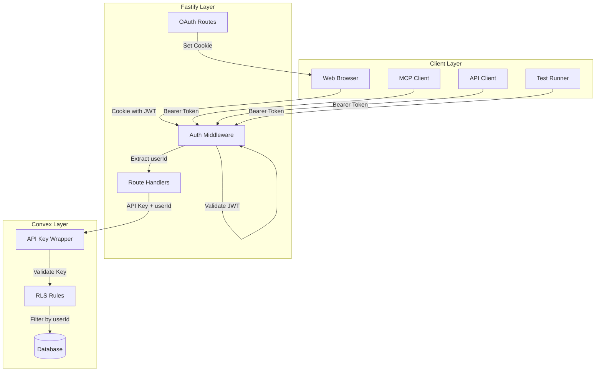

### Auth Flow Summary

| Entry Point | Token Transport | JWT Validation | Convex Auth |
|-------------|-----------------|----------------|-------------|
| Web Browser | HttpOnly Cookie | Fastify (jose) | API Key + userId |
| MCP Client | Bearer Header | Fastify (jose) | API Key + userId |
| API Client | Bearer Header | Fastify (jose) | API Key + userId |
| Tests | Bearer Header | Fastify (jose) | API Key + userId |

---

## 2. File Layout

```
src/
├── lib/
│   ├── workos.ts                 # WorkOS client
│   ├── config.ts                 # Environment configuration
│   └── auth/
│       ├── index.ts              # Re-exports
│       ├── types.ts              # Auth types
│       ├── tokenExtractor.ts     # Extract JWT from request
│       ├── jwtValidator.ts       # Validate via jose library
│       └── jwtDecoder.ts         # Decode JWT claims
├── middleware/
│   └── auth.ts                   # Auth middleware
├── routes/
│   ├── auth.ts                   # OAuth routes (login, callback, logout)
│   └── well-known.ts             # MCP OAuth discovery endpoint
├── api/
│   ├── health.ts                 # Health check endpoint
│   └── mcp.ts                    # MCP server and handlers
└── index.ts                      # Fastify app

convex/
├── auth/
│   ├── apiKey.ts                 # API key validation wrapper
│   ├── rls.ts                    # RLS rules and wrapped functions
│   └── types.ts                  # Convex auth types
├── schema.ts                     # Schema with userId fields
└── [domain].ts                   # Domain functions using RLS wrappers

tests/
├── service/
│   └── auth/
│       ├── middleware.test.ts    # Handler-level with mocks
│       ├── routes.test.ts        # OAuth route handlers
│       └── mcp.test.ts           # MCP auth handlers
│   └── mcp/
│       ├── well-known.test.ts    # OAuth discovery endpoint tests
│       ├── auth-challenge.test.ts # WWW-Authenticate tests
│       ├── tools.test.ts         # MCP tool auth tests
│       └── resources.test.ts     # MCP resource tests
├── convex/
│   └── auth/
│       ├── apiKey.test.ts        # API key validation
│       └── rls.test.ts           # RLS rule enforcement
├── integration/
│   ├── auth-api.test.ts          # Full API auth flow
│   ├── auth-cookie.test.ts       # Cookie-based web auth flow
│   └── auth-mcp.test.ts          # Full MCP auth flow
├── fixtures/
│   ├── auth.ts                   # Real WorkOS tokens
│   ├── jwt.ts                    # Test JWT generator
│   ├── mockRequest.ts            # Fastify request factory
│   └── mockReply.ts              # Fastify reply factory
└── helpers/
    └── testUser.ts               # Test user management
```

---

## 3. Types and Interfaces

### Fastify Types (`src/lib/auth/types.ts`)

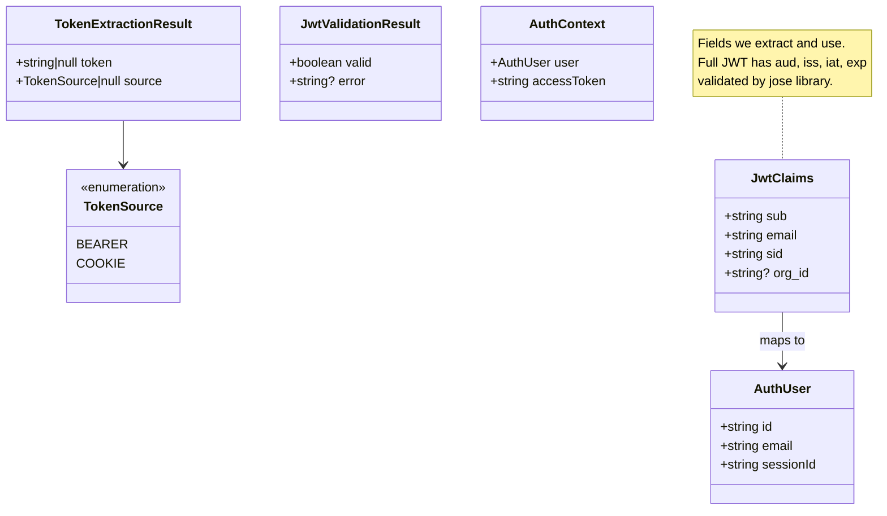

### Type Definitions

**TokenExtractionResult**
- `token`: The extracted JWT string, or null if not found
- `source`: Where the token was found (bearer header or cookie)

**JwtValidationResult**
- `valid`: Whether the token passed validation
- `error`: Error message if validation failed

**JwtClaims** (fields we extract and use)
- `sub`: WorkOS user ID (e.g., `user_01KD3AV9594M4F6S0H8X47DB6P`) - **required**
- `email`: User's email address - **optional** (not present in DCR/MCP tokens)
- `sid`: WorkOS session ID - **optional** (format differs for MCP tokens)
- `org_id`: Optional organization ID

Note: The full JWT contains additional fields (`aud`, `iss`, `iat`, `exp`) used for validation by the jose library. Email and sessionId are optional because DCR tokens from MCP clients may not include them (the JWT template doesn't apply to DCR-issued tokens).

**AuthUser**
- `id`: WorkOS user ID (from `sub` claim)
- `email`: User's email
- `sessionId`: WorkOS session ID (from `sid` claim)

**AuthContext**
- `user`: The authenticated user
- `accessToken`: Original JWT (for any downstream needs)

### Convex Types (`convex/lib/types.ts`)

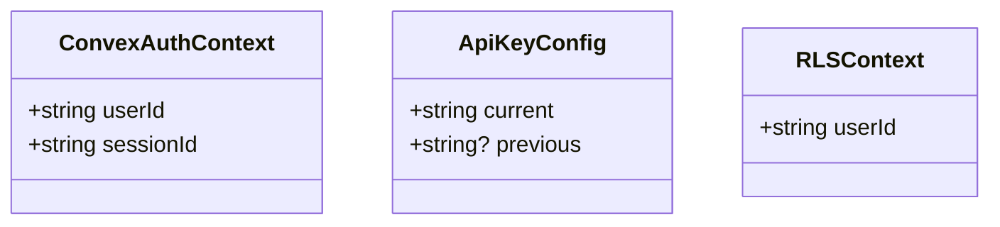

**ConvexAuthContext**
- `userId`: WorkOS user ID passed from Fastify
- `sessionId`: Session ID for future deny list checking

**ApiKeyConfig**
- `current`: Current valid API key
- `previous`: Previous key (for rotation)

---

## 4. Sequence Diagrams

### 4.1 Web Browser Flow (Cookie)

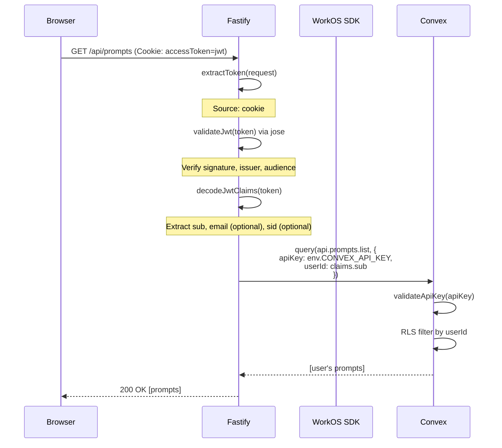

### 4.2 MCP Client Flow (Bearer)

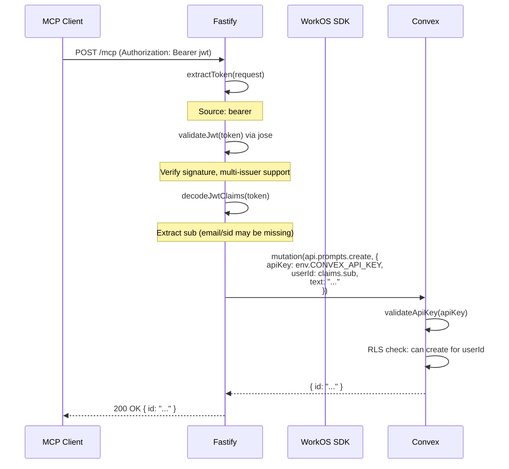

### 4.3 OAuth Login Flow

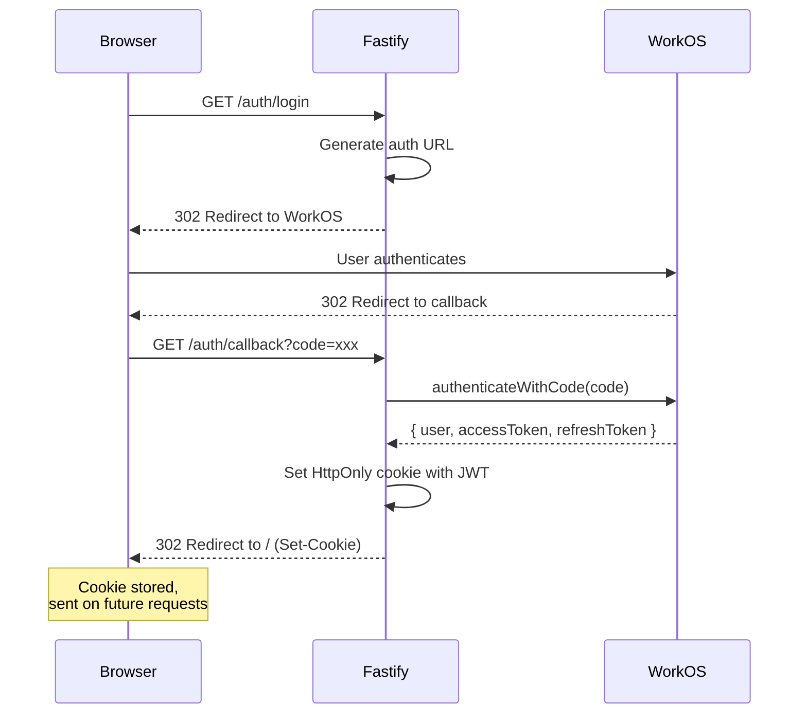

### 4.4 Auth Middleware Internal Flow

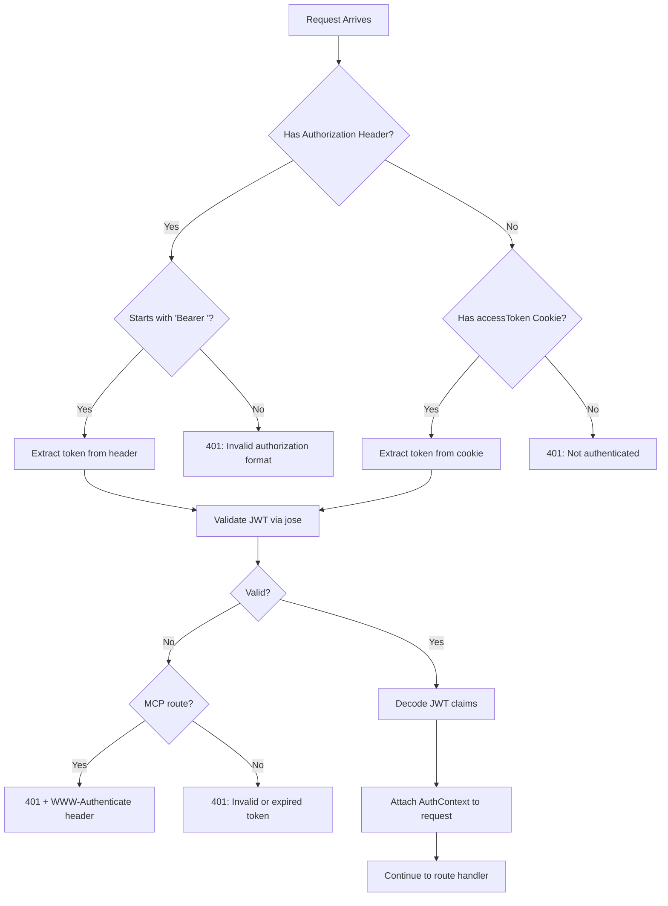

### 4.5 Convex Function Flow

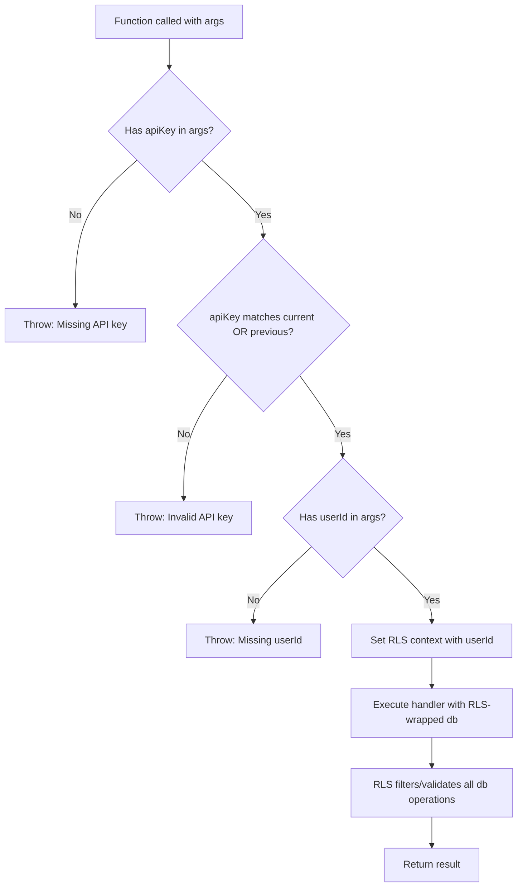

---

## 5. Fastify Auth Module

### 5.1 Token Extractor (`src/lib/auth/tokenExtractor.ts`)

**Purpose:** Extract JWT from request (Bearer header or cookie)

**Method Signature:**
```
extractToken(request: FastifyRequest): TokenExtractionResult
```

**Logic:**
1. Check `Authorization` header
2. If present and starts with `Bearer `, extract token, return with source `bearer`
3. Else check `accessToken` cookie
4. If present, extract token, return with source `cookie`
5. Else return `{ token: null, source: null }`

**Notes:**
- Bearer header takes precedence over cookie
- No validation here, just extraction
- Pure function, no async

### 5.2 JWT Validator (`src/lib/auth/jwtValidator.ts`)

**Purpose:** Validate JWT signature, issuer, audience, and expiry

**Method Signature:**
```
validateJwt(token: string): Promise<JwtValidationResult>
```

**Logic:**
1. Create JWKS keyset via `jose.createRemoteJWKSet()` pointing to WorkOS JWKS URL
2. Call `jose.jwtVerify(token, keySet, { issuer, audience })`
3. Return `{ valid: true }` or `{ valid: false, error: "..." }`

**Multi-Issuer Support:**
Accepts tokens from both:
- User Management API: `https://api.workos.com/user_management/{clientId}`
- AuthKit OAuth: `https://{subdomain}.authkit.app`

**Notes:**
- Uses `jose` library (not WorkOS SDK's internal methods)
- JWKS cached after first fetch (~0ms subsequent calls)
- Both issuers use the same JWKS endpoint

### 5.3 JWT Decoder (`src/lib/auth/jwtDecoder.ts`)

**Purpose:** Decode JWT payload to extract claims

**Method Signature:**
```
decodeJwtClaims(token: string): JwtClaims
```

**Logic:**
1. Split token by `.`
2. Base64url decode the payload (second part)
3. Parse JSON
4. Return typed claims object

**Notes:**
- No validation (already validated)
- Pure function, synchronous
- Throws if malformed (shouldn't happen post-validation)

### 5.4 Auth Middleware (`src/middleware/auth.ts`)

**Purpose:** Orchestrate auth for protected routes

**Method Signature:**
```
authMiddleware(request: FastifyRequest, reply: FastifyReply): Promise<void>
```

**Logic:**
1. `extractToken(request)` → token, source
2. If no token → 401
3. `validateJwt(token)` → result
4. If invalid → 401
5. `decodeJwtClaims(token)` → claims
6. Attach to request:
   - `request.user = { id: claims.sub, email: claims.email, sessionId: claims.sid }`
   - `request.accessToken = token`

**FastifyRequest Extension:**
```typescript
declare module "fastify" {
  interface FastifyRequest {
    user?: AuthUser;
    accessToken?: string;
  }
}
```

---

## 6. Convex Auth Module

### 6.1 API Key Validator (`convex/auth/apiKey.ts`)

**Purpose:** Validate API key and extract userId for RLS

**Wrapper Pattern:**
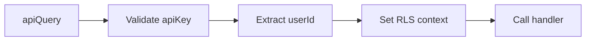

**Exported Functions:**
- `apiQuery` - Wrapper for queries requiring API key
- `apiMutation` - Wrapper for mutations requiring API key
- `apiAction` - Wrapper for actions requiring API key

**Common Args Added:**
- `apiKey: v.string()` - Required API key
- `userId: v.string()` - Required user ID

### 6.2 API Key Validation Logic

**Method:** `isValidApiKey(key: string): boolean`

**Logic:**
1. Get `CONVEX_API_KEY` from env
2. Get `CONVEX_API_KEY_PREVIOUS` from env (optional)
3. Return true if key matches either
4. Use constant-time comparison if available

---

## 7. RLS Configuration

### 7.1 RLS Rules (`convex/lib/rls.ts`)

**Purpose:** Define row-level security rules per table

**Pattern:**
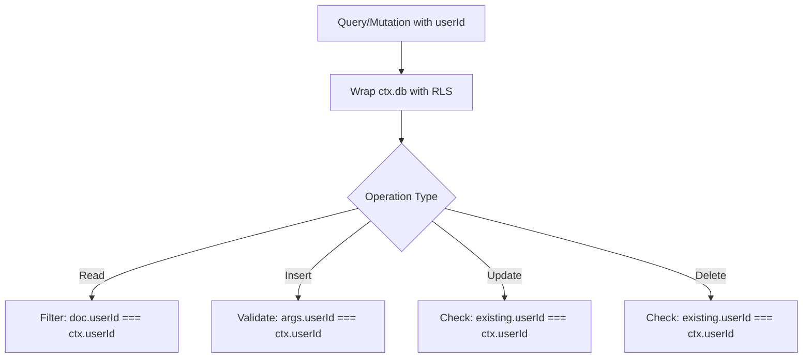

**Rules Structure:**
```
rules = {
  prompts: {
    read: (ctx, doc) => doc.userId === ctx.userId,
    insert: (ctx, doc) => doc.userId === ctx.userId,
    modify: (ctx, doc) => doc.userId === ctx.userId,
  },
  // ... other tables
}
```

**Default Policy:** `deny` - Tables without explicit rules are inaccessible

### 7.2 Schema Pattern

All user-scoped tables include:
- `userId: v.string()` - WorkOS user ID, indexed
- Standard timestamps as needed

**Example:**
```
prompts: defineTable({
  userId: v.string(),
  text: v.string(),
  // ... other fields
}).index("by_user", ["userId"])
```

---

## 8. OAuth Routes

### 8.1 Login (`GET /auth/login`)

**Purpose:** Redirect to WorkOS for authentication

**Logic:**
1. Generate authorization URL via WorkOS SDK
2. Redirect browser to WorkOS

### 8.2 Callback (`GET /auth/callback`)

**Purpose:** Handle OAuth callback, set cookie

**Logic:**
1. Extract `code` from query params
2. Call `workos.userManagement.authenticateWithCode({ code, clientId })`
3. Receive `{ user, accessToken, refreshToken }`
4. Set HttpOnly cookie with `accessToken`
5. Redirect to `/`

**Cookie Configuration:**
- `httpOnly: true`
- `secure: true` (production)
- `sameSite: 'lax'`
- `path: '/'`
- `maxAge: 7 days`

### 8.3 Logout (`GET /auth/logout`)

**Purpose:** Clear auth cookie

**Logic:**
1. Clear `accessToken` cookie
2. Redirect to `/`

**Future:** Consider calling WorkOS to revoke session

### 8.4 Me (`GET /auth/me`)

**Purpose:** Get current user info

**Logic:**
1. Extract and validate token (use middleware)
2. Return user info from decoded claims

**Note:** No longer calls `getUser()` API - uses JWT claims

---

## 9. Testing Approach

### 9.1 Unit Tests

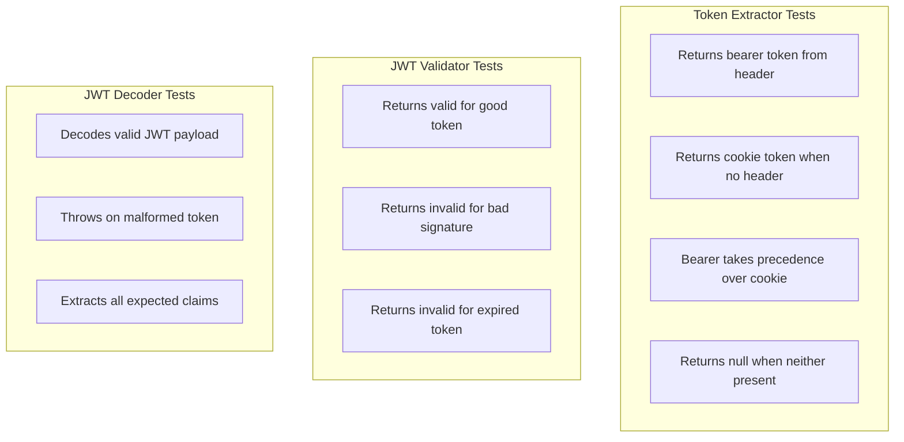

### 9.2 Integration Tests

**Auth Flow Tests:**
- Request with valid Bearer token → 200, correct user
- Request with valid Cookie → 200, correct user
- Request with invalid token → 401
- Request with expired token → 401
- Request with no token → 401

**RLS Tests:**
- User A can read User A's data
- User A cannot read User B's data
- User A can create with own userId
- User A cannot create with User B's userId
- User A can update own data
- User A cannot update User B's data

### 9.3 Test Fixtures

**`getTestAuth()`** - Already exists
- Returns `{ accessToken, userId, email }`
- Uses `authenticateWithPassword()` for real WorkOS token

**`getTestApiKey()`** - New
- Returns API key from env for Convex calls in tests

**Test Request Helper:**
```
makeAuthenticatedRequest(method, path, options?)
  → Adds Bearer header with test token
```

---

## Appendix: Environment Variables

### Fastify

| Variable | Purpose |
|----------|---------|
| `WORKOS_API_KEY` | WorkOS API key |
| `WORKOS_CLIENT_ID` | WorkOS client ID |
| `WORKOS_REDIRECT_URI` | OAuth callback URL |
| `WORKOS_AUTH_SERVER_URL` | AuthKit URL for MCP OAuth discovery |
| `CONVEX_URL` | Convex deployment URL |
| `CONVEX_API_KEY` | API key for Convex calls |
| `COOKIE_SECRET` | Secret for signing cookies |
| `BASE_URL` | Public URL for MCP metadata |
| `MCP_RESOURCE_URL` | MCP resource URL |
| `CORS_ALLOWED_ORIGINS` | Allowed CORS origins (production) |

### Convex

| Variable | Purpose |
|----------|---------|
| `CONVEX_API_KEY` | Current valid API key |
| `CONVEX_API_KEY_PREVIOUS` | Previous key (for rotation) |

---

*Document Version: 1.1*
*Last Updated: 2025-12-24*

**Changes in 1.1:**
- Updated file paths to match actual implementation
- Changed JWT validation from WorkOS SDK to jose library
- Added multi-issuer support for MCP tokens
- Added MCP OAuth discovery flow
- Marked email and sessionId as optional claims
