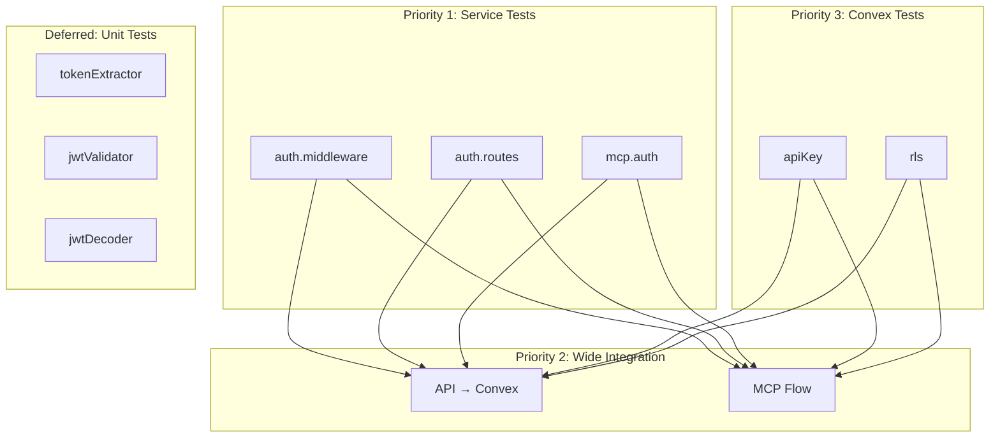

# Auth TDD Test Plan

## Overview

This document defines the Test-Driven Development approach for PromptDB's auth system. Tests are written first (red phase), then implementation makes them pass (green phase).

## TDD Philosophy

### Why TDD

This skeleton → TDD red → TDD green workflow is our standard development approach for all features. It keeps agents on track, minimizes drift, and prevents careless implementations.

**The cycle:**
1. **Skeleton**: Define interfaces, types, method signatures with `throw new Error("Not implemented")`
2. **Red**: Write failing tests that define expected behavior
3. **Green**: Implement minimum code to pass tests
4. **Refactor**: Clean up while keeping tests green

### Test Priority

Start from the outside in:

1. **Service tests** - Handler-level tests with mocked dependencies
2. **Integration tests** - Full HTTP flow against running services
3. **Convex tests** - API key and RLS validation
4. **Unit tests** - Add later if finer-grained coverage needed

## Test Layers



### Layer Characteristics

| Layer | Entry Point | Execution | Purpose |
|-------|-------------|-----------|---------|
| Service | Handler function | In-process (bun test) | Test orchestration with mocks |
| Integration | HTTP fetch | Requires Fastify + Convex | Prove full system works |
| Convex | Convex function | In-process via convex-test | Test Convex auth logic |
| Unit | Direct function call | In-process (bun test) | Fine-grained logic (deferred) |

## Mock Boundaries

### Service Tests - What's Mocked vs Real

#### `middleware.test.ts`

| Component | Mocked/Real | Notes |
|-----------|-------------|-------|
| `extractToken()` | **Real** | Testing actual extraction logic |
| `validateJwt()` | **Mocked** | Returns configured valid/invalid |
| `decodeJwtClaims()` | **Real** | Testing actual decoding |
| WorkOS SDK | **Mocked** | `isValidJwt()` returns mock value |
| Convex client | **Not used** | Middleware doesn't call Convex |
| Fastify request | **Mock object** | Created via `createMockRequest()` |
| Fastify reply | **Mock object** | Created via `createMockReply()` |

#### `routes.test.ts`

| Component | Mocked/Real | Notes |
|-----------|-------------|-------|
| WorkOS SDK | **Mocked** | `getAuthorizationUrl()`, `authenticateWithCode()` |
| Convex client | **Mocked** | Any Convex calls in routes |
| Cookie handling | **Real** | Via mock reply's setCookie/clearCookie spies |
| Redirect logic | **Real** | Via mock reply's redirect spy |
| Fastify request | **Mock object** | With query params for callback |
| Fastify reply | **Mock object** | With cookie and redirect spies |

#### `mcp.test.ts`

| Component | Mocked/Real | Notes |
|-----------|-------------|-------|
| Auth middleware | **Real** | Testing MCP uses same auth |
| `validateJwt()` | **Mocked** | Returns configured valid/invalid |
| MCP handler logic | **Real** | Testing actual handler |
| Convex client | **Mocked** | MCP tools that call Convex |
| Fastify request | **Mock object** | With Authorization header |
| Fastify reply | **Mock object** | For response verification |

### Integration Tests - Everything Real

| Component | Mocked/Real | Notes |
|-----------|-------------|-------|
| All auth components | **Real** | Full auth flow |
| WorkOS tokens | **Real** | Via `getTestAuth()` |
| Fastify server | **Real** | Running on localhost:5001 |
| Convex backend | **Real** | Running on localhost:3210 |
| HTTP calls | **Real** | Via native fetch |

### Convex Tests - Convex Runtime Real

| Component | Mocked/Real | Notes |
|-----------|-------------|-------|
| Convex functions | **Real** | Via convex-test harness |
| API key config | **Real** | From test environment |
| RLS rules | **Real** | Testing actual enforcement |

## Test Infrastructure

### Service Tests (In-Process)

Service tests call handler functions directly. No servers needed.

```typescript
import { authMiddleware } from "../../src/middleware/auth";
import { createMockRequest, createMockReply, createMockWorkos } from "../fixtures";

test("valid Bearer token attaches user", async () => {
  const mockWorkos = createMockWorkos({ isValidJwt: true });
  const request = createMockRequest({
    headers: { authorization: "Bearer valid.test.token" }
  });
  const reply = createMockReply();

  await authMiddleware(request, reply, mockWorkos);

  expect(request.user).toBeDefined();
  expect(request.user.id).toBe("user_123");
});
```

### Integration Tests (Live Services)

Require Fastify and Convex running locally:

```bash
# Terminal 1: Fastify
bun run dev

# Terminal 2: Convex
bun run convex:dev

# Terminal 3: Tests
bun run test:integration
```

### CI/CD Strategy

| Environment | What Runs | Against |
|-------------|-----------|---------|
| Local dev | All tests | localhost services |
| CI runner | Service + Convex tests | In-process only |
| Post-deploy | Integration tests | Deployed staging |

Wide integration tests do NOT run in CI runner. They run against deployed staging after deployment.

## Test File Structure

```
tests/
├── service/
│   └── auth/
│       ├── middleware.test.ts
│       ├── routes.test.ts
│       └── mcp.test.ts
├── convex/
│   └── auth/
│       ├── apiKey.test.ts
│       └── rls.test.ts
├── integration/
│   ├── auth-api.test.ts
│   └── auth-mcp.test.ts
├── unit/
│   └── auth/
│       └── (deferred)
├── fixtures/
│   ├── auth.ts              # Real WorkOS token helper (exists)
│   ├── jwt.ts               # Test JWT generator
│   ├── mockRequest.ts       # Fastify request factory
│   ├── mockReply.ts         # Fastify reply factory
│   └── mockWorkos.ts        # WorkOS SDK mock
└── helpers/
    └── testUser.ts          # Test user management
```

## Fixtures

### `fixtures/auth.ts` (Exists)

Real WorkOS tokens via `authenticateWithPassword`:

```typescript
export async function getTestAuth(): Promise<TestAuth | null>
export function hasTestAuth(): boolean
export function clearAuthCache(): void
```

### `fixtures/jwt.ts` (Create)

Test JWTs for service tests where validator is mocked:

```typescript
interface TestJwtOptions {
  sub?: string;        // Default: "user_test123"
  email?: string;      // Default: "test@example.com"
  sid?: string;        // Default: "session_test123"
  org_id?: string;     // Default: undefined
  exp?: number;        // Default: 1 hour from now
  iat?: number;        // Default: now
}

// Valid structure JWT (won't pass signature validation)
export function createTestJwt(claims?: TestJwtOptions): string;

// JWT with exp in the past
export function createExpiredJwt(claims?: TestJwtOptions): string;

// Malformed JWTs for error testing
export function createMalformedJwt(
  type: "not-three-parts" | "invalid-base64" | "invalid-json" | "missing-claims"
): string;
```

### `fixtures/mockRequest.ts` (Create)

Fastify request factory:

```typescript
interface MockRequestOptions {
  headers?: Record<string, string>;
  cookies?: Record<string, string>;
  url?: string;
  method?: string;
  query?: Record<string, string>;
  body?: unknown;
}

export function createMockRequest(opts?: MockRequestOptions): FastifyRequest;
```

### `fixtures/mockReply.ts` (Create)

Fastify reply with spies:

```typescript
import { mock, type Mock } from "bun:test";

export interface MockReply {
  code: Mock<(status: number) => MockReply>;
  send: Mock<(body: unknown) => MockReply>;
  redirect: Mock<(url: string) => MockReply>;
  setCookie: Mock<(name: string, value: string, opts?: CookieOptions) => MockReply>;
  clearCookie: Mock<(name: string, opts?: CookieOptions) => MockReply>;

  // Helpers for assertions
  getStatus(): number | undefined;
  getBody(): unknown | undefined;
  getRedirectUrl(): string | undefined;
}

export function createMockReply(): MockReply;
```

### `fixtures/mockWorkos.ts` (Create)

WorkOS SDK mock:

```typescript
interface MockWorkosOptions {
  // isValidJwt behavior
  isValidJwt?: boolean | Error;

  // authenticateWithCode behavior
  authenticateResult?: {
    accessToken: string;
    refreshToken: string;
    user: { id: string; email: string };
  } | Error;

  // getAuthorizationUrl behavior
  authorizationUrl?: string;
}

export interface MockUserManagement {
  isValidJwt: Mock<(token: string) => Promise<boolean>>;
  authenticateWithCode: Mock<(opts: unknown) => Promise<unknown>>;
  getAuthorizationUrl: Mock<(opts: unknown) => string>;
}

export function createMockWorkos(opts?: MockWorkosOptions): {
  userManagement: MockUserManagement;
};
```

### `helpers/testUser.ts` (Create)

Test user management (uses existing `scripts/create-test-user.ts` logic):

```typescript
export async function ensureTestUser(): Promise<{
  email: string;
  password: string;
  userId: string;
}>;

// Note: We use a persistent test user, not per-test creation
// This function exists for setup scripts, not test teardown
```

## Test Cases

### Service Tests: `middleware.test.ts`

#### Token Extraction

| Test | Input | Expected | Error Message |
|------|-------|----------|---------------|
| Extracts Bearer token | `Authorization: Bearer abc123` | Token extracted, source=bearer | - |
| Extracts cookie token | Cookie: `accessToken=abc123` | Token extracted, source=cookie | - |
| **Bearer takes precedence** | Both header AND cookie present | Uses Bearer token | - |
| No token present | Neither header nor cookie | 401 | "Not authenticated" |
| Empty Bearer | `Authorization: Bearer ` | 401 | "Not authenticated" |
| Malformed Bearer | `Authorization: Bear abc` | 401 | "Not authenticated" |
| Wrong auth scheme | `Authorization: Basic abc123` | 401 | "Not authenticated" |
| Bearer no space | `Authorization: Bearerabc123` | 401 | "Not authenticated" |

#### Token Validation

| Test | Setup | Expected | Error Message |
|------|-------|----------|---------------|
| Valid token → user attached | Mock `isValidJwt` → true | `request.user` populated | - |
| Invalid token → 401 | Mock `isValidJwt` → false | 401 response | "Invalid token" |
| Expired token → 401 | Mock `isValidJwt` → false (expired) | 401 response | "Token expired" |
| Validator throws → 401 | Mock `isValidJwt` → throws Error | 401 response | "Invalid token" |

#### User Attachment

| Test | Setup | Expected |
|------|-------|----------|
| User has correct id | Valid token with sub="user_123" | `request.user.id === "user_123"` |
| User has correct email | Valid token with email claim | `request.user.email` matches |
| User has correct sessionId | Valid token with sid claim | `request.user.sessionId` matches |
| accessToken attached | Valid token | `request.accessToken` === original token |

### Service Tests: `routes.test.ts`

#### `/auth/login`

| Test | Input | Expected |
|------|-------|----------|
| Redirects to WorkOS | GET /auth/login | `reply.redirect` called with WorkOS URL |
| URL contains client_id | GET /auth/login | Redirect URL has correct client_id |
| URL contains redirect_uri | GET /auth/login | Redirect URL has callback URI |
| Preserves redirect param | GET /auth/login?redirect=/dashboard | State includes redirect |

#### `/auth/callback`

| Test | Input | Expected |
|------|-------|----------|
| Valid code → sets cookie | `?code=valid_code` | `reply.setCookie("accessToken", ...)` |
| Cookie is httpOnly | `?code=valid_code` | Cookie options include httpOnly: true |
| Cookie is secure (prod) | `?code=valid_code` + NODE_ENV=production | Cookie options include secure: true |
| Redirects to app | `?code=valid_code` | `reply.redirect("/")` |
| Redirects to saved location | `?code=valid_code` + state with redirect | `reply.redirect("/dashboard")` |
| Missing code → error | No code param | 400 or redirect to login |
| Invalid code → error | `?code=invalid` (WorkOS rejects) | 401 or redirect to login |

#### `/auth/logout`

| Test | Input | Expected |
|------|-------|----------|
| Clears cookie | GET /auth/logout | `reply.clearCookie("accessToken")` |
| Redirects to home | GET /auth/logout | `reply.redirect("/")` |

#### `/auth/me`

| Test | Input | Expected |
|------|-------|----------|
| Returns user when authenticated | request.user populated | 200 with user object |
| Returns 401 when not authenticated | request.user undefined | 401 "Not authenticated" |
| Response includes id | Authenticated | `{ user: { id: "..." } }` |
| Response includes email | Authenticated | `{ user: { email: "..." } }` |

### Service Tests: `mcp.test.ts`

| Test | Input | Expected |
|------|-------|----------|
| MCP with valid Bearer → authenticated | Valid token in Authorization header | Handler proceeds, user attached |
| MCP without auth → 401 | No Authorization header | 401 response |
| MCP with invalid token → 401 | Invalid/expired token | 401 response |
| MCP error format is JSON | Invalid token | `{ error: "..." }` not HTML |
| MCP tools receive user context | Valid token | Tool handlers get userId |

### Convex Tests: `apiKey.test.ts`

| Test | Input | Expected |
|------|-------|----------|
| Valid current key → true | Current API key from env | `validateApiKey` returns true |
| Valid previous key → true | Previous API key (rotation) | `validateApiKey` returns true |
| Invalid key → false | Random string | `validateApiKey` returns false |
| Empty key → false | Empty string | `validateApiKey` returns false |
| Null/undefined key → false | null or undefined | `validateApiKey` returns false |
| Wrong length key → false | Truncated valid key | `validateApiKey` returns false |

### Convex Tests: `rls.test.ts`

#### Read Operations

| Test | Setup | Expected |
|------|-------|----------|
| User reads own record | userId matches document | Record returned |
| User cannot read other's record | userId mismatch | Empty result or error |
| User reads multiple own records | Multiple docs with matching userId | All matching returned |
| Mixed ownership query | Some docs match, some don't | Only matching returned |

#### Insert Operations

| Test | Setup | Expected |
|------|-------|----------|
| User inserts with own userId | Document userId matches caller | Insert succeeds |
| User cannot insert other's userId | Document userId differs from caller | Insert rejected |
| Insert without userId field | Missing userId in document | Insert rejected |

#### Update Operations

| Test | Setup | Expected |
|------|-------|----------|
| User updates own record | Document userId matches caller | Update succeeds |
| User cannot update other's record | Document userId differs | Update rejected |
| Cannot change userId field | Attempt to modify userId | Update rejected |

#### Delete Operations

| Test | Setup | Expected |
|------|-------|----------|
| User deletes own record | Document userId matches caller | Delete succeeds |
| User cannot delete other's record | Document userId differs | Delete rejected |

### Integration Tests: `auth-api.test.ts`

| Test | Flow | Expected |
|------|------|----------|
| Bearer → API → success | Real token in Authorization header | 200, user-scoped response |
| Cookie → API → success | Real token in Cookie header | 200, same behavior |
| Bearer takes precedence | Both Bearer and Cookie (different tokens) | Uses Bearer identity |
| Invalid token → 401 | Garbage token | 401 at API layer |
| Expired token → 401 | Expired real token | 401 |
| No auth → 401 | No token | 401 |
| Protected endpoint returns user data | Valid token | Response scoped to user |

### Integration Tests: `auth-mcp.test.ts`

| Test | Flow | Expected |
|------|------|----------|
| MCP with Bearer → authenticated | Real token, MCP endpoint | Authenticated response |
| MCP returns user-scoped data | With token, tool call | Only user's data |
| MCP without auth → 401 | No token | 401 JSON error |
| MCP tool execution respects RLS | Call tool that queries Convex | Only user's records |

## Deferred Tests

### OAuth Provider Endpoints (M2 - ChatGPT Integration)

When implementing ChatGPT App Store integration, add tests for:

- `GET /.well-known/oauth-protected-resource`
- `GET /.well-known/openid-configuration`
- `GET /oauth2/authorize`
- `POST /oauth2/token`

### Unit Tests (Add If Needed)

Fine-grained tests for edge cases in:
- `tokenExtractor` - extraction logic
- `jwtValidator` - validation wrapper
- `jwtDecoder` - base64 decoding, claim extraction

## Running Tests

### Commands

```bash
# All tests
bun run test

# By layer
bun run test:service       # Service tests only
bun run test:convex        # Convex tests only
bun run test:integration   # Integration tests (requires services)

# Full check
bun run check
```

### Environment

`.env.local` requirements:

```bash
# WorkOS
WORKOS_API_KEY=sk_test_...
WORKOS_CLIENT_ID=client_...

# Test user
TEST_USER_EMAIL=test@promptdb.local
TEST_USER_PASSWORD=TestPassword123!

# Convex
CONVEX_URL=http://localhost:3210
CONVEX_API_KEY=...

# Server
TEST_BASE_URL=http://localhost:5001
```

---

*Document version: 2.0*
*Last updated: 2025-12-22*
