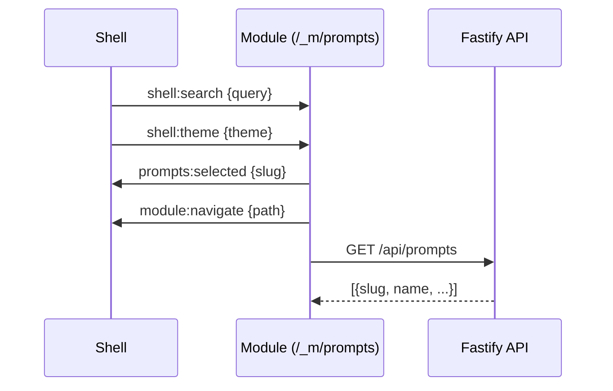
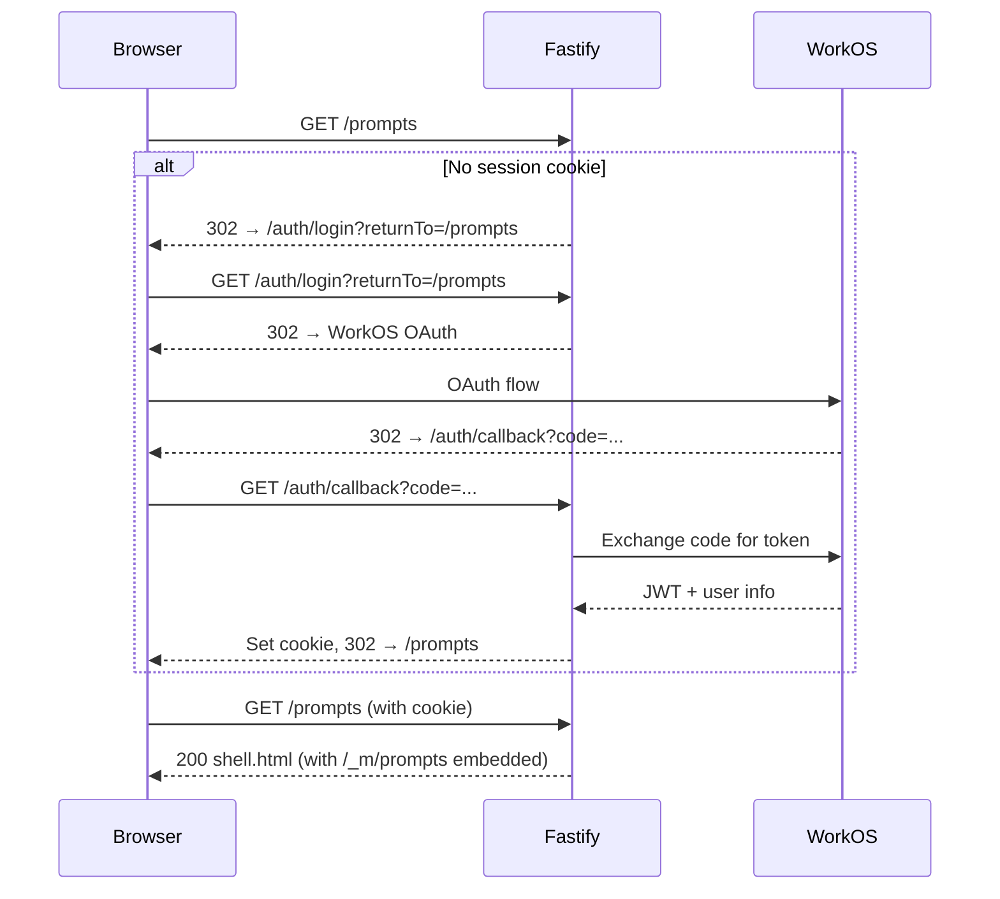

# Phase 4: Technical Design

**Story:** [phase-4-story.md](./phase-4-story.md)
**Status:** Draft
**Created:** 2025-01-03

---

## Summary

Phase 4 delivers a web UI for viewing and creating prompts. This is the first user-facing interface for LiminalDB, building on the REST API and MCP tools completed in Phases 1-2.

The UI follows a **shell + module architecture** where an auth-gated shell provides chrome (header, search, footer) and embeds domain-specific modules via iframes. For Phase 4, we implement two modules: a prompt browser for listing and viewing prompts, and a prompt editor for creating new ones.

**Key technical decisions:**
- Server-rendered HTML templates (not SPA) for simplicity and auth control
- Shell auth-gated at route level; modules rely on API auth
- Iframe isolation allows modules to be developed and tested independently
- postMessage protocol for shell↔module communication

**What we're building:**
1. Auth gate on `/prompts` that redirects unauthenticated users to login
2. Shell template with search, user info, and theme switching
3. Prompts module that lists, displays, and searches prompts
4. Editor module at `/prompts/new` for creating new prompts with validation

**What we're not building (out of scope):**
- Edit existing prompts
- Delete via UI (API exists, UI deferred)
- Settings, tag management, batch operations

**Testing approach:**
- Service tests use Vitest + jsdom for UI component logic with mocked fetch
- Integration tests use real Fastify server with HTML response assertions
- Coverage focuses on the three user flows: auth, browse/view, create

---

## Functional Requirements

The story defines three user flows with 11 acceptance criteria total:

**F1: Access & Authentication** — Users must authenticate before accessing the UI. Unauthenticated requests redirect to WorkOS OAuth, then return to the UI with a session cookie.

**F2: Browse & View Prompts** — Authenticated users see their prompts listed in a sidebar. Clicking a prompt displays its content. Search filters the list (server-side, temporary implementation). Copy button puts content in clipboard.

**F3: Create Prompt** — Users open an editor form, fill in prompt details, and save. Client-side validation catches format errors; server returns 409 on duplicate slugs.

| Flow | AC | Requirement |
|------|----|-------------|
| F1 | AC-1.1 | Unauthenticated → redirect to `/auth/login` |
| F1 | AC-1.2 | Post-OAuth → return to `/prompts` with session |
| F1 | AC-1.3 | Authenticated → see prompts view |
| F2 | AC-2.1 | Prompts listed on page load |
| F2 | AC-2.2 | Click prompt → content displayed |
| F2 | AC-2.3 | Search filters list (temporary*) |
| F2 | AC-2.4 | Copy → clipboard |
| F3 | AC-3.1 | New Prompt → editor module at `/prompts/new` |
| F3 | AC-3.2 | Valid submit → created, list updated |
| F3 | AC-3.3 | Validation errors shown |
| F3 | AC-3.4 | Duplicate slug → 409 error shown |

*Search uses server-side filtering with known limitations; replaced in Feature 4.

---

## Architecture

### Shell + Module Pattern

The UI uses an iframe-based architecture where:
- **Shell** - Outer chrome: header, search, user info, theme selector
- **Modules** - Embedded iframes with domain-specific functionality

User-facing routes (`/prompts`, `/prompts/new`) serve the shell with the appropriate module embedded. Internal module paths (`/_m/prompts`, `/_m/prompt-editor`) are iframe sources that users never see in the URL bar.

```
┌─────────────────────────────────────────────────────────┐
│                        SHELL                            │
│  ┌─────────────────────────────────────────────────┐   │
│  │  Logo    [ Search... ]           [User] Theme   │   │
│  └─────────────────────────────────────────────────┘   │
│  ┌─────────────────────────────────────────────────┐   │
│  │                                                  │   │
│  │              MODULE (iframe)                    │   │
│  │                                                  │   │
│  │   /_m/prompts  or  /_m/prompt-editor           │   │
│  │                                                  │   │
│  └─────────────────────────────────────────────────┘   │
│  ┌─────────────────────────────────────────────────┐   │
│  │  Footer                                          │   │
│  └─────────────────────────────────────────────────┘   │
└─────────────────────────────────────────────────────────┘

URL Mapping:
  /prompts      → shell + /_m/prompts
  /prompts/new  → shell + /_m/prompt-editor
```

### Communication Protocol

Shell and modules communicate via `postMessage`:



**Message Types:**

| Direction | Type | Payload | Purpose |
|-----------|------|---------|---------|
| Shell → Module | `shell:search` | `{query: string}` | Broadcast search input |
| Shell → Module | `shell:theme` | `{theme: string}` | Theme changed |
| Module → Shell | `prompts:selected` | `{slug: string}` | Prompt was selected |
| Module → Shell | `module:navigate` | `{path: string}` | Request navigation |

**Security Requirements:**

All postMessage handlers must validate origin to prevent cross-origin attacks:
- Receivers check `event.origin === window.location.origin` before processing
- Senders use explicit origin: `postMessage(data, window.location.origin)`
- Never use wildcard `'*'` as target origin

---

## File System Layout

### Current State (needs adjustment)

```
src/
├── routes/
│   ├── ui.ts              # UI routes (auth: false, uses /ui paths)
│   └── prompts.ts         # API routes
└── ui/
    └── templates/
        ├── shell.html
        ├── prompts.html
        └── prompt-editor.html

public/
├── index.html             # Mockup (to be removed)
└── ui/
    └── shared/
        └── themes/
            ├── base.css
            ├── tokyo-night.css
            ├── modern-dark.css
            └── teal.css
```

### Target State

```
src/
├── routes/
│   ├── app.ts             # User-facing routes with auth gate
│   ├── modules.ts         # Internal module routes (/_m/*)
│   └── prompts.ts         # API routes (unchanged)
└── ui/
    └── templates/
        ├── shell.html     # Shell template (module embedded via param)
        ├── prompts.html   # Prompt list + view module
        └── prompt-editor.html  # Create module

public/
├── index.html             # Redirect to /prompts (or remove)
└── shared/
    └── themes/            # (unchanged, move out of /ui/)

tests/
├── service/
│   └── ui/
│       ├── prompts-module.test.ts
│       └── prompt-editor.test.ts
└── integration/
    └── ui/
        ├── ui-auth.test.ts
        └── ui-prompts.test.ts
```

### Route Structure

| User-Facing Route | Auth | Serves |
|-------------------|------|--------|
| `GET /prompts` | Required | Shell with `/_m/prompts` embedded |
| `GET /prompts/new` | Required | Shell with `/_m/prompt-editor` embedded |

| Internal Route | Auth | Serves |
|----------------|------|--------|
| `GET /_m/prompts` | None | Prompts module template |
| `GET /_m/prompt-editor` | None | Editor module template |

Modules don't need route-level auth because all data access goes through `/api/*` which requires auth.

### Changes Required

| File | Change |
|------|--------|
| `src/routes/ui.ts` | Rename to `app.ts`, add auth gate, route `/prompts` and `/prompts/new` |
| New `src/routes/modules.ts` | Internal `/_m/*` routes for module templates |
| `public/index.html` | Redirect to `/prompts` or remove |
| `public/ui/shared/` | Move to `public/shared/` |
| `tests/service/ui/*` | New - jsdom service tests |
| `tests/integration/ui/*` | New - integration tests |

### Template Disposition

The POC templates in `src/ui/templates/` will be **deleted and reimplemented** from scratch according to the specifications in this document. This ensures:

1. No leftover POC code or dead paths
2. Clean implementation matching the specs exactly
3. No ambiguity about what's production vs prototype

**Files to delete:**
- `src/ui/templates/shell.html`
- `src/ui/templates/prompts.html`
- `src/ui/templates/prompt-editor.html`
- `public/index.html` (mockup)

**Files to create:**
- `src/ui/templates/shell.html` — New, per Shell specification below
- `src/ui/templates/prompts.html` — New, per Prompts Module specification below
- `src/ui/templates/prompt-editor.html` — New, per Editor Module specification below

The POC templates can be referenced for styling patterns (CSS custom properties, Tokyo Night theme) but the JavaScript and HTML structure should be written fresh to match the test specifications.

---

## Authentication Flow

### Auth Gate Implementation



### Route-Level Auth

| Route | Auth | Reason |
|-------|------|--------|
| `GET /prompts` | Required | User-facing, shell with user context |
| `GET /prompts/new` | Required | User-facing, shell with editor |
| `GET /_m/prompts` | None | Internal module, API calls require auth |
| `GET /_m/prompt-editor` | None | Internal module, API calls require auth |
| `GET /api/prompts` | Required | Data access |
| `POST /api/prompts` | Required | Data mutation |

**Design Decision:** User-facing routes (`/prompts`, `/prompts/new`) are auth-gated. Internal module routes (`/_m/*`) are not auth-gated at template load, but all API calls from modules require auth. This allows modules to load quickly and handle auth errors gracefully.

### Auth Context Injection

Shell template receives auth context at render time via string replacement. The route handler reads the template file and replaces placeholders before sending:

```typescript
// In app.ts route handler
const template = await readFile('src/ui/templates/shell.html', 'utf8');
const html = template
  .replace('{{userId}}', user.id)
  .replace('{{email}}', user.email)
  .replace('{{modulePath}}', modulePath);
reply.type('text/html').send(html);
```

The template contains placeholder markers:

```html
<script>
  window.__AUTH__ = {
    userId: "{{userId}}",
    email: "{{email}}"
  };
</script>
<iframe src="{{modulePath}}" class="module-frame" id="main-module"></iframe>
```

This simple string replacement approach avoids adding a template engine dependency. Values are injected server-side before the HTML reaches the browser.

### Shell Module Selection

Route handlers inject the appropriate module path:

| Route | Module Path Injected |
|-------|---------------------|
| `/prompts` | `/_m/prompts` |
| `/prompts/new` | `/_m/prompt-editor` |

This keeps the shell template generic while route handlers control which module loads.

---

## API Layer

### Existing Endpoints

| Method | Path | Status | Notes |
|--------|------|--------|-------|
| `GET /api/prompts` | New (uncommitted) | Needs tests |
| `GET /api/prompts?q=` | New (uncommitted) | Search param |
| `POST /api/prompts` | Exists | Tested |
| `GET /api/prompts/:slug` | Exists | Tested |
| `DELETE /api/prompts/:slug` | Exists | Tested |

### List Endpoint Specification

**Request:**
```
GET /api/prompts?q={query}&limit={n}
Authorization: Bearer {token} | Cookie
```

**Response (200):**
```json
[
  {
    "slug": "code-review",
    "name": "Code Review Assistant",
    "description": "...",
    "content": "...",
    "tags": ["code", "review"],
    "parameters": []
  }
]
```

**Errors:**
| Code | Condition |
|------|-----------|
| 401 | Missing/invalid auth |
| 500 | Server error |

### API Adjustments Needed

1. **List endpoint tests** - TC-2.1 requires test coverage
2. **Search param** - Verify `?q=` flows through correctly

---

## Convex Layer

### Schema (existing)

```
prompts
├── userId: string (indexed)
├── slug: string (indexed with userId)
├── name: string
├── description: string
├── content: string
├── tagNames: string[]
└── parameters: optional array
```

### Functions

| Function | Type | Status |
|----------|------|--------|
| `insertPrompts` | mutation | Exists, tested |
| `getPromptBySlug` | query | Exists, tested |
| `listPrompts` | query | New (uncommitted) |
| `deletePromptBySlug` | mutation | Exists, tested |

### Row-Level Security

All Convex functions:
1. Validate API key (constant-time comparison)
2. Filter by userId (enforced in query)

```
┌─────────────────────────────────────────┐
│              Fastify                     │
│  - Validates JWT                        │
│  - Extracts userId                      │
│  - Passes apiKey + userId to Convex     │
└─────────────────────────────────────────┘
                    │
                    ▼
┌─────────────────────────────────────────┐
│              Convex                      │
│  - Validates apiKey                     │
│  - Queries with userId filter           │
│  - Returns only user's data             │
└─────────────────────────────────────────┘
```

### Convex Adjustments Needed

1. **listPrompts tests** - New function needs test coverage
2. **Verify DTO shape** - Ensure `tags` (not `tagNames`) returned

---

## UI Templates

### Shell (`shell.html`)

**Responsibilities:**
- Header with logo, search, user info
- Iframe container for modules
- Footer with theme selector
- Broadcast search/theme to modules
- Fetch user info on load

**Current Issues:**
- Fetches `/auth/me` but doesn't handle 401
- No loading state for user info

**Adjustments:**
- Server injects auth context (no client fetch needed)
- Remove `/auth/me` fetch

### Prompts Module (`prompts.html`)

**Responsibilities:**
- Sidebar with prompt list
- Main content area for selected prompt
- New Prompt button (navigates to editor)
- Copy, Edit, Delete actions

**Current State:**
- Fetches `/api/prompts` on load ✓
- Renders list with name, slug, tags ✓
- Handles search via postMessage ✓
- Copy to clipboard works ✓

**Phase 4 Scope:**
- Edit and Delete buttons are out of scope
- Do not include them in the new template (they will be added in a future phase when edit/delete functionality is implemented)

### Prompt Editor (`prompt-editor.html`)

**Responsibilities:**
- Form for creating prompts
- Client-side validation with feedback
- Submit to API
- Navigate back to `/prompts` on success

**Phase 4 Scope:**
- Create mode only (no edit)
- Fields: slug, name, description, content, tags
- Client-side validation before submit
- API error handling (409 duplicate, 400 validation)

**Client-Side Validation Rules:**

| Field | Rule | Error Message |
|-------|------|---------------|
| slug | Required, matches `/^[a-z0-9]+(-[a-z0-9]+)*$/` | "Slug must be lowercase letters, numbers, and dashes" |
| slug | Max 200 chars | "Slug must be 200 characters or less" |
| name | Required | "Name is required" |
| name | Max 200 chars | "Name must be 200 characters or less" |
| content | Required | "Content is required" |
| content | Max 100,000 chars | "Content must be 100,000 characters or less" |
| description | Max 2,000 chars | "Description must be 2,000 characters or less" |
| tags | Each tag max 100 chars | "Each tag must be 100 characters or less" |
| tags | Max 50 tags | "Maximum 50 tags allowed" |

Validation triggers on blur and on submit. Submit is blocked until all validations pass. Error messages appear inline below each field.

---

## Test Plan

Phase 4 introduces UI testing to the project for the first time. We extend the existing service/integration test pattern to cover frontend code while maintaining TDD discipline.

### Testing Strategy

The UI consists of server-rendered HTML templates with embedded JavaScript. Unlike React or other component frameworks, we're testing vanilla DOM manipulation and fetch calls. This shapes our approach:

**Service tests** isolate UI logic by loading templates into jsdom and mocking `fetch`. These tests verify that the JavaScript correctly renders data, handles clicks, and makes API calls. They run fast and catch logic errors early.

**Integration tests** verify the full request/response cycle. For UI routes, this means making real HTTP requests, checking auth redirects, and asserting on HTML structure. We don't need a browser—jsdom can parse the response HTML for assertions.

The existing API service and integration tests continue unchanged. Phase 4 adds a `ui` test project to Vitest for jsdom environment tests.

### Test Pyramid

```
┌─────────────────────────────────────────────────────────┐
│                    Test Pyramid                         │
├─────────────────────────────────────────────────────────┤
│                                                         │
│     ┌─────────────────────┐                            │
│     │   Integration (UI)   │  Real server + HTML parse │
│     │   (happy paths only) │                           │
│     └─────────────────────┘                            │
│                                                         │
│  ┌───────────────────────────┐                         │
│  │     Service (UI)          │  jsdom + mocked fetch   │
│  │     (component logic)     │                         │
│  └───────────────────────────┘                         │
│                                                         │
│  ┌───────────────────────────┐                         │
│  │     Service (API)         │  Fastify inject + mock  │
│  │     (route handlers)      │                         │
│  └───────────────────────────┘                         │
│                                                         │
│  ┌───────────────────────────────────────────┐         │
│  │           Integration (API)                │         │
│  │    (real HTTP, real Convex)               │         │
│  └───────────────────────────────────────────┘         │
│                                                         │
└─────────────────────────────────────────────────────────┘
```

Service tests form the base—fast, isolated, comprehensive. Integration tests sit above—slower, fewer, focused on happy paths and critical flows. We don't use Playwright or browser automation; OAuth providers block automated browsers, and jsdom gives us sufficient confidence for server-rendered HTML.

### Test File Structure

```
tests/
├── service/
│   ├── ui/
│   │   ├── setup.ts                 # jsdom helpers, mock factories
│   │   ├── prompts-module.test.ts   # TC-2.2, TC-2.3, TC-2.4, TC-2.5, TC-3.1
│   │   └── prompt-editor.test.ts    # TC-3.3, TC-3.4
│   └── prompts/
│       └── listPrompts.test.ts      # TC-2.1, TC-2.1b, TC-2.1c
└── integration/
    ├── ui/
    │   ├── ui-auth.test.ts          # TC-1.1, TC-1.2, TC-1.3
    │   └── ui-prompts.test.ts       # Happy path flow
    └── prompts/
        └── prompts-api.test.ts      # TC-3.2, TC-3.5 (may exist)
```

### Dependencies to Add

```bash
bun add -d jsdom @types/jsdom
```

### Vitest Configuration Update

Add a third project for UI tests with jsdom environment:

```typescript
// vitest.config.ts - add to projects array
{
  extends: true,
  test: {
    name: 'ui',
    include: ['tests/service/ui/**/*.test.ts'],
    environment: 'jsdom',
    environmentOptions: {
      jsdom: {
        url: 'http://localhost:5001',
        runScripts: 'dangerously',
      }
    }
  }
}
```

The `runScripts: 'dangerously'` option enables script execution in jsdom, required for testing templates with embedded JavaScript.

---

## Service Tests: UI Layer

### Test Setup (`tests/service/ui/setup.ts`)

**Dependencies:**
- `jsdom` - DOM simulation
- `vi` from vitest - mocking

**Mock Factories:**

```typescript
// Prompt data factory
export const mockPrompts = [
  {
    slug: 'code-review',
    name: 'Code Review',
    description: 'Reviews code for issues',
    content: 'You are a code reviewer...',
    tags: ['code', 'review'],
    parameters: []
  },
  {
    slug: 'meeting-notes',
    name: 'Meeting Notes',
    description: 'Summarizes meetings',
    content: 'Summarize the following meeting...',
    tags: ['meetings'],
    parameters: []
  }
];

// DOM setup helper
export async function loadTemplate(templatePath: string): Promise<JSDOM> {
  const html = await readFile(templatePath, 'utf8');
  const dom = new JSDOM(html, {
    runScripts: 'dangerously',
    url: 'http://localhost:5001'
  });
  return dom;
}

// Fetch mock helper
export function mockFetch(responses: Record<string, any>) {
  return vi.fn((url: string) => {
    const response = responses[url];
    return Promise.resolve({
      ok: response.ok ?? true,
      status: response.status ?? 200,
      json: () => Promise.resolve(response.data)
    });
  });
}

// Clipboard mock
export function mockClipboard() {
  const written: string[] = [];
  return {
    writeText: vi.fn((text: string) => {
      written.push(text);
      return Promise.resolve();
    }),
    getWritten: () => written
  };
}

// Inject clipboard mock into jsdom window
export function setupClipboard(dom: JSDOM) {
  Object.defineProperty(dom.window.navigator, 'clipboard', {
    value: mockClipboard(),
    writable: true
  });
}

// Wait for async operations (fetch calls, DOM updates)
export function waitForAsync(ms = 0): Promise<void> {
  return new Promise(resolve => setTimeout(resolve, ms));
}

// Wait for element to appear in DOM
export async function waitForElement(
  dom: JSDOM,
  selector: string,
  timeout = 1000
): Promise<Element> {
  const start = Date.now();
  while (Date.now() - start < timeout) {
    const el = dom.window.document.querySelector(selector);
    if (el) return el;
    await waitForAsync(10);
  }
  throw new Error(`Element ${selector} not found within ${timeout}ms`);
}
```

**Async Testing Pattern:**

Templates execute scripts on load, including `fetch()` calls. To test the rendered result:

1. Load template with mocked fetch
2. Wait for async operations to complete
3. Query DOM for expected elements

```typescript
test('renders prompt list on load', async () => {
  const dom = await loadTemplate('prompts.html');
  dom.window.fetch = mockFetch({'/api/prompts': {data: mockPrompts}});

  // Wait for fetch and render cycle
  await waitForAsync(50);

  // Now query the populated DOM
  const items = dom.window.document.querySelectorAll('.prompt-item');
  expect(items.length).toBe(2);
});
```

---

### TC-2.2: Page load fetches and renders prompt list

**File:** `tests/service/ui/prompts-module.test.ts`

**Verifies:** AC-2.1 (Prompts listed in sidebar on page load)

**Setup:**
- Load `prompts.html` template into jsdom
- Mock `fetch('/api/prompts')` to return `mockPrompts`

**Input:**
- Template loaded, fetch mock configured

**Test Steps:**
1. Wait for `loadPrompts()` to complete (script runs on load)
2. Query `.prompt-item` elements in DOM

**Assertions:**
- `fetch` called with `/api/prompts`
- 2 `.prompt-item` elements exist
- First item contains text "code-review"
- First item contains text "Code Review"
- Tags rendered: "code", "review"

**Expected Result:** List displays both prompts with correct data

---

### TC-2.3: Click prompt item → content displayed

**File:** `tests/service/ui/prompts-module.test.ts`

**Verifies:** AC-2.2 (Click prompt → content displayed)

**Setup:**
- Load template with mocked fetch returning `mockPrompts`
- Wait for initial render

**Input:**
- Click event on first `.prompt-item`

**Test Steps:**
1. Trigger click on `.prompt-item[data-slug="code-review"]`
2. Query `#main-content` for updated content

**Assertions:**
- `.prompt-title` contains "code-review"
- `.prompt-description` contains "Reviews code for issues"
- `.prompt-content` contains "You are a code reviewer..."
- Clicked item has `.selected` class
- `postMessage` called with `{type: 'prompts:selected', slug: 'code-review'}`

**Expected Result:** Main area shows selected prompt content

---

### TC-2.4: Search triggers API call with query param

**File:** `tests/service/ui/prompts-module.test.ts`

**Verifies:** AC-2.3 (Search filters list - server-side)

**Setup:**
- Load template with mocked fetch
- Configure fetch mock for `/api/prompts?q=code` returning filtered results

**Input:**
- `postMessage` event: `{type: 'shell:search', query: 'code'}`

**Test Steps:**
1. Dispatch message event to window
2. Wait for debounce (150ms in template)
3. Check fetch calls

**Assertions:**
- `fetch` called with `/api/prompts?q=code`
- List re-renders with filtered results

**Expected Result:** Search query passed to API

**Note:** Minimal test - search is temporary implementation per story. The 150ms debounce is in the shell; the module receives already-debounced messages via postMessage. The wait here accounts for the fetch/render cycle after receiving the message.

---

### TC-2.5: Copy writes to clipboard, shows feedback

**File:** `tests/service/ui/prompts-module.test.ts`

**Verifies:** AC-2.4 (Copy button copies content to clipboard)

**Setup:**
- Load template, mock fetch with `mockPrompts`
- Mock `navigator.clipboard.writeText`
- Select a prompt first (click to render content area)

**Input:**
- Click on `#copy-btn`

**Test Steps:**
1. Click prompt to select it
2. Click copy button
3. Check clipboard mock

**Assertions:**
- `navigator.clipboard.writeText` called with prompt content
- Button text changes to "Copied!" (or checkmark icon appears)

**Expected Result:** Content copied, visual feedback shown

---

### TC-3.1: New Prompt button triggers navigation

**File:** `tests/service/ui/prompts-module.test.ts`

**Verifies:** AC-3.1 (New Prompt loads editor module)

**Setup:**
- Load `prompts.html` template
- Mock `parent.postMessage`

**Input:**
- Click on `#new-prompt-btn`

**Test Steps:**
1. Click New Prompt button
2. Check postMessage calls

**Assertions:**
- `postMessage` called with `{type: 'module:navigate', path: '/prompts/new'}`

**Expected Result:** Shell receives navigation request to load editor module

---

### TC-3.3: Submit valid form → success flow

**File:** `tests/service/ui/prompt-editor.test.ts`

**Verifies:** AC-3.2 (Valid form creates prompt, updates list)

**Setup:**
- Load `prompt-editor.html` template
- Mock `fetch('/api/prompts')` POST to return `{ids: ['abc123']}`
- Mock `parent.postMessage`

**Input Form Data:**
```javascript
{
  slug: 'new-prompt',
  name: 'New Prompt',
  description: 'A test prompt',
  content: 'This is the prompt content',
  tags: 'test, example'
}
```

**Test Steps:**
1. Fill form fields with input data
2. Click submit button
3. Check fetch and navigation

**Assertions:**
- `fetch` called with `POST /api/prompts`
- Request body contains correct prompt object
- `postMessage` called with `{type: 'module:navigate', path: '/prompts'}`
- No error messages visible

**Expected Result:** Prompt created, navigates back to prompts list

---

### TC-3.4: Invalid slug shows validation error

**File:** `tests/service/ui/prompt-editor.test.ts`

**Verifies:** AC-3.3 (Validation errors shown)

**Setup:**
- Load `prompt-editor.html` template

**Input Form Data:**
```javascript
{
  slug: 'INVALID SLUG!',  // Invalid: uppercase, spaces, special chars
  name: 'Test',
  description: 'Test',
  content: 'Test'
}
```

**Test Steps:**
1. Fill slug field with invalid value
2. Trigger validation (blur or submit attempt)

**Assertions:**
- Error message visible near slug field
- Error text mentions valid slug format
- Form not submitted (fetch not called)

**Expected Result:** Client-side validation prevents submission

---

## Service Tests: API Layer

### TC-2.1: GET /api/prompts returns user's prompts

**File:** `tests/service/prompts/listPrompts.test.ts`

**Verifies:** AC-2.1 (Prompts listed)

**Setup:**
- Create Fastify instance with prompt routes
- Mock Convex client
- Mock auth middleware to inject user

**Mocks:**
```typescript
const mockConvex = {
  query: vi.fn().mockResolvedValue([
    { slug: 'test-1', name: 'Test 1', description: '...', content: '...', tags: [] },
    { slug: 'test-2', name: 'Test 2', description: '...', content: '...', tags: ['code'] }
  ])
};

const mockUser = { id: 'user_123', email: 'test@example.com' };
```

**Input:**
- `GET /api/prompts` with auth

**Assertions:**
- Response status 200
- Response body is array with 2 items
- Convex query called with `{ apiKey, userId: 'user_123', query: undefined, limit: undefined }`

**Expected Result:** Returns user's prompts from Convex

---

### TC-2.1b: GET /api/prompts with search param

**File:** `tests/service/prompts/listPrompts.test.ts`

**Verifies:** AC-2.3 (Search filters)

**Setup:**
- Same as TC-2.1

**Input:**
- `GET /api/prompts?q=code&limit=10`

**Assertions:**
- Convex query called with `{ apiKey, userId, query: 'code', limit: 10 }`

**Expected Result:** Query params passed to Convex

---

### TC-2.1c: GET /api/prompts without auth returns 401

**File:** `tests/service/prompts/listPrompts.test.ts`

**Verifies:** Auth requirement

**Setup:**
- Create Fastify instance
- No auth mock (middleware rejects)

**Input:**
- `GET /api/prompts` without auth header/cookie

**Assertions:**
- Response status 401
- Response body contains error message

**Expected Result:** Unauthorized access rejected

---

## Integration Tests: UI Layer

### TC-1.1: Unauthenticated request redirects to login

**File:** `tests/integration/ui/ui-auth.test.ts`

**Verifies:** AC-1.1 (Redirect to /auth/login)

**Setup:**
- Start real Fastify server
- No authentication

**Input:**
- `GET /prompts` with no cookies

**Test Steps:**
1. Make HTTP request to `/prompts`
2. Check response

**Assertions:**
- Response status 302
- `Location` header contains `/auth/login`
- `returnTo` param equals `/prompts`

**Expected Result:** Unauthenticated user redirected

---

### TC-1.2: Authenticated request returns shell HTML

**File:** `tests/integration/ui/ui-auth.test.ts`

**Verifies:** AC-1.3 (Authenticated user sees prompts view)

**Setup:**
- Start real Fastify server
- Authenticate via `authenticateWithPassword()` fixture
- Get session cookie

**Input:**
- `GET /prompts` with valid session cookie

**Test Steps:**
1. Authenticate and get cookie
2. Make HTTP request with cookie
3. Parse response HTML

**Assertions:**
- Response status 200
- Content-Type is `text/html`
- HTML contains `.shell` element
- HTML contains `#main-module` iframe with `/_m/prompts` src
- HTML contains user email (injected by server)

**Expected Result:** Authenticated user receives shell with prompts module

---

### TC-1.3: OAuth flow establishes session and redirects

**File:** `tests/integration/ui/ui-auth.test.ts`

**Verifies:** AC-1.2 (After OAuth, returns to /prompts with session)

**Setup:**
- Start real Fastify server
- Use `authenticateWithPassword()` fixture (same as other integration tests)

**Test Steps:**
1. Call `authenticateWithPassword()` fixture which handles full OAuth flow
2. Extract session cookie from response
3. Make request to `/prompts` with cookie
4. Verify access granted

**Assertions:**
- `authenticateWithPassword()` returns valid session cookie
- Cookie has `HttpOnly` flag
- Subsequent `GET /prompts` with cookie returns 200

**Expected Result:** OAuth flow produces valid session, user can access protected routes

**Note:** We test the outcome (valid session enables access) rather than the raw callback mechanics. The `authenticateWithPassword()` fixture exercises the callback internally.

---

### Integration Happy Path: Create and View Prompt

**File:** `tests/integration/ui/ui-prompts.test.ts`

**Verifies:** End-to-end flow (AC-2.1, AC-3.2)

**Setup:**
- Start real Fastify server
- Authenticate and get cookie
- Ensure test user has no prompts (or use unique slug)

**Test Steps:**
1. `POST /api/prompts` with test prompt
2. `GET /api/prompts` and verify prompt in list
3. `GET /prompts` and verify shell HTML loaded (module embeds prompt data)

**Input Prompt:**
```javascript
{
  prompts: [{
    slug: 'integration-test-prompt',
    name: 'Integration Test',
    description: 'Created by integration test',
    content: 'Test content',
    tags: ['test']
  }]
}
```

**Assertions:**
- POST returns 201 with ids
- GET list includes new prompt
- HTML response contains "integration-test-prompt"

**Cleanup:**
- `DELETE /api/prompts/integration-test-prompt`

**Expected Result:** Full create → list → view flow works

---

## Integration Tests: API Layer

### TC-3.2: POST /api/prompts with valid data returns 201

**File:** `tests/integration/prompts/prompts-api.test.ts`

**Verifies:** AC-3.2 (Valid form creates prompt)

**Note:** May already exist in `tests/integration/prompts-api.test.ts`

**Setup:**
- Start real Fastify server
- Authenticate via fixture
- Generate unique slug for test

**Input:**
```javascript
{
  prompts: [{
    slug: 'api-test-{timestamp}',
    name: 'API Test Prompt',
    description: 'Test description',
    content: 'Test content',
    tags: ['test']
  }]
}
```

**Assertions:**
- Response status 201
- Response body has `ids` array with 1 element
- Subsequent GET returns the prompt

**Cleanup:**
- Delete created prompt

**Expected Result:** Prompt created successfully

---

### TC-3.5: POST /api/prompts with duplicate slug returns 409

**File:** `tests/integration/prompts/prompts-api.test.ts`

**Verifies:** AC-3.4 (Duplicate slug error)

**Setup:**
- Start real Fastify server
- Authenticate via fixture
- Create a prompt first

**Test Steps:**
1. Create prompt with slug "duplicate-test"
2. Attempt to create another prompt with same slug

**Input (second request):**
```javascript
{
  prompts: [{
    slug: 'duplicate-test',  // Same as first
    name: 'Duplicate',
    description: 'Should fail',
    content: 'Content',
    tags: []
  }]
}
```

**Assertions:**
- Response status 409
- Response body contains error message about duplicate/exists

**Cleanup:**
- Delete "duplicate-test" prompt

**Expected Result:** Duplicate rejected with 409

---

## Test Coverage Matrix

| TC ID | Test Name | Type | File | AC |
|-------|-----------|------|------|-----|
| TC-1.1 | Unauthenticated redirects to login | Integration | ui-auth.test.ts | AC-1.1 |
| TC-1.2 | Authenticated returns shell | Integration | ui-auth.test.ts | AC-1.3 |
| TC-1.3 | OAuth callback sets cookie | Integration | ui-auth.test.ts | AC-1.2 |
| TC-2.1 | GET /api/prompts returns prompts | Service | listPrompts.test.ts | AC-2.1 |
| TC-2.1b | GET /api/prompts with ?q= | Service | listPrompts.test.ts | AC-2.3 |
| TC-2.1c | GET /api/prompts without auth | Service | listPrompts.test.ts | AC-2.1 |
| TC-2.2 | Page load renders prompt list | Service | prompts-module.test.ts | AC-2.1 |
| TC-2.3 | Click prompt shows content | Service | prompts-module.test.ts | AC-2.2 |
| TC-2.4 | Search calls API with query | Service | prompts-module.test.ts | AC-2.3 |
| TC-2.5 | Copy button copies content | Service | prompts-module.test.ts | AC-2.4 |
| TC-3.1 | New Prompt navigates to editor | Service | prompts-module.test.ts | AC-3.1 |
| TC-3.2 | POST /api/prompts returns 201 | Integration | prompts-api.test.ts | AC-3.2 |
| TC-3.3 | Submit form → success flow | Service | prompt-editor.test.ts | AC-3.2 |
| TC-3.4 | Invalid slug shows error | Service | prompt-editor.test.ts | AC-3.3 |
| TC-3.5 | Duplicate slug returns 409 | Integration | prompts-api.test.ts | AC-3.4 |
| - | Create and view happy path | Integration | ui-prompts.test.ts | AC-2.1, AC-3.2 |

---

## Test Data Summary

### Mock Prompts (Service Tests)

```typescript
export const mockPrompts = [
  {
    slug: 'code-review',
    name: 'Code Review',
    description: 'Reviews code for issues',
    content: 'You are a code reviewer. Analyze the following code...',
    tags: ['code', 'review'],
    parameters: []
  },
  {
    slug: 'meeting-notes',
    name: 'Meeting Notes',
    description: 'Summarizes meetings',
    content: 'Summarize the following meeting transcript...',
    tags: ['meetings'],
    parameters: []
  }
];
```

### Mock User (Service Tests)

```typescript
export const mockUser = {
  id: 'user_test123',
  email: 'test@example.com'
};
```

### Integration Test Prompts

Use unique slugs with timestamps to avoid collision:

```typescript
function testSlug() {
  return `test-${Date.now()}`;
}
```

Always clean up created prompts in `afterEach` or `afterAll`.

---

## Implementation Sequence

1. **Route restructure** - Create `app.ts` and `modules.ts`, set up `/prompts`, `/prompts/new`, `/_m/*` routes
2. **Auth gate** - Add auth middleware to user-facing routes in `app.ts`
3. **API tests** - Add tests for `GET /api/prompts` (TC-2.1)
4. **Auth integration tests** - TC-1.1, TC-1.2, TC-1.3
5. **UI service test setup** - jsdom fixtures, mock factories
6. **Prompts module tests** - TC-2.2, TC-2.3, TC-2.4, TC-2.5
7. **Editor module tests** - TC-3.1, TC-3.3, TC-3.4
8. **Create flow integration** - TC-3.2, TC-3.5
9. **Template adjustments** - Update module postMessage paths, remove out-of-scope features
10. **Final validation** - All tests pass, lint, typecheck

---

## Definition of Done

- [ ] POC templates deleted, new templates implemented per spec
- [ ] All TC-1, TC-2, TC-3 tests passing
- [ ] `GET /api/prompts` has test coverage
- [ ] Auth gate on `/prompts` working
- [ ] Routes structured: `/prompts`, `/prompts/new`, `/_m/*`
- [ ] UI renders prompts from API
- [ ] Create prompt works end-to-end
- [ ] Passes lint, typecheck, format
- [ ] Merged to main via PR
