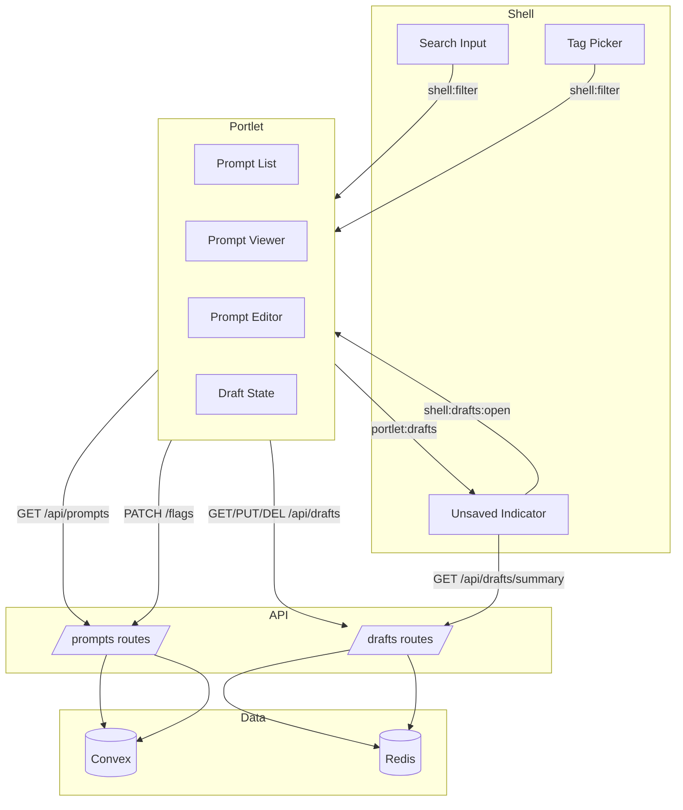
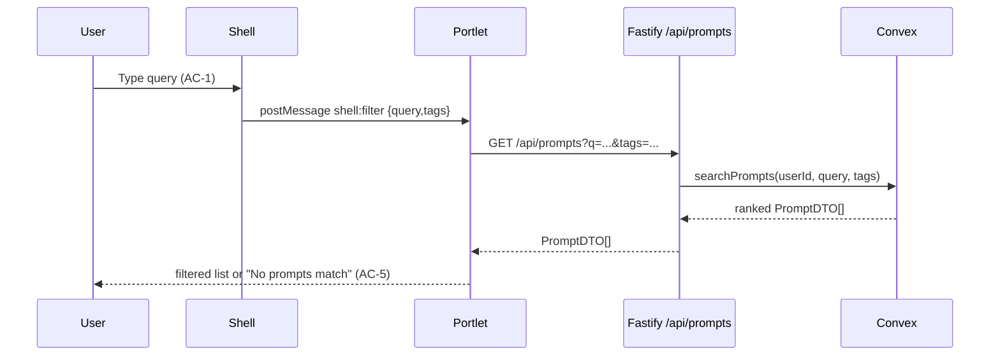
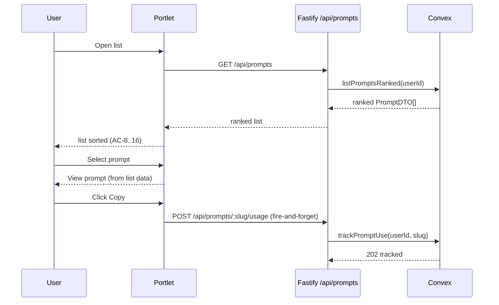
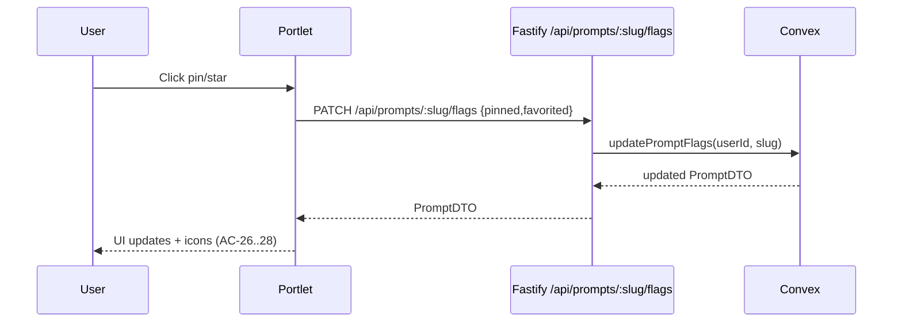
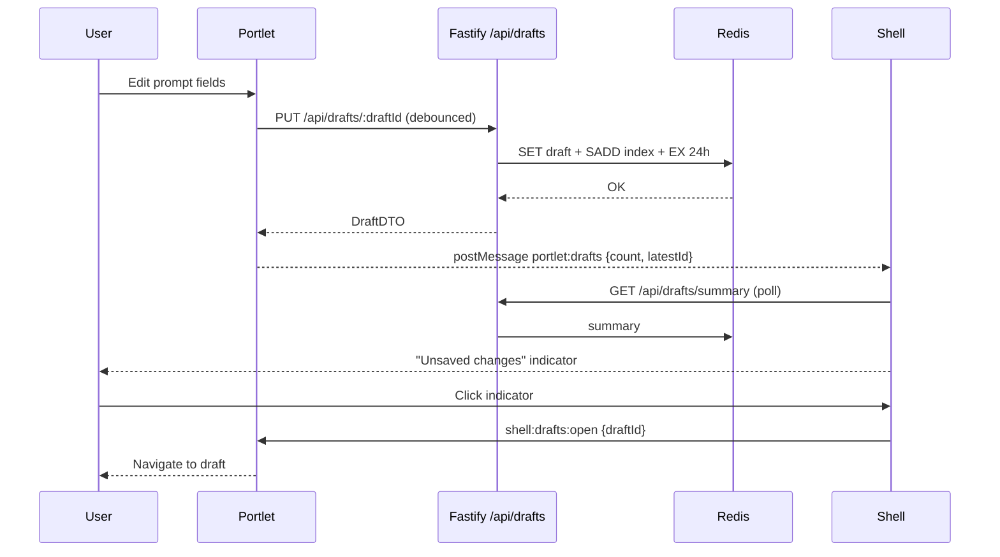
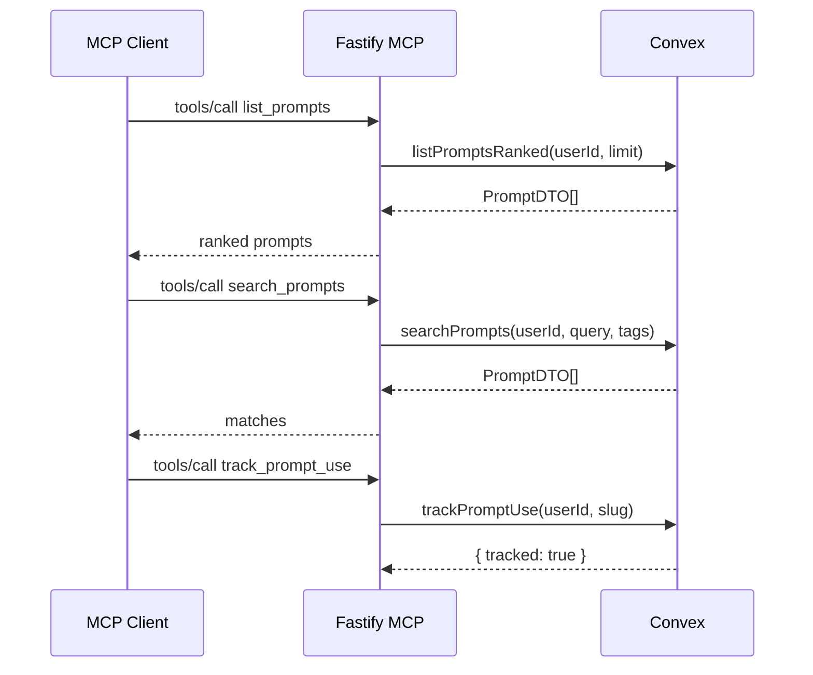

# Technical Design: Search & Select

## Purpose

This document translates Search & Select requirements into implementable architecture. It is written for:

| Audience | Value |
|----------|-------|
| Reviewers | Validate design before implementation |
| Developers | Blueprint for Convex + Fastify + UI changes |
| Phase Prompts | Source of file paths, interfaces, and test mapping |

**Prerequisite:** Feature spec complete with ACs/TCs in `01.search.select.feature.md`.

---

## Context

Epic 01 delivered prompt CRUD across Fastify, Convex, and the vanilla JS shell/portlet UI. Epic 02 adds full‑text search, ranking, pin/favorite, durable drafts (via Redis), and MCP parity. We must follow existing shell/portlet message protocol, keep API compatibility, and keep Convex as the source of truth for prompts while using Redis only for ephemeral drafts and user state.

Key constraints:
- No breaking changes to existing API endpoints.
- Convex search index is the sole search engine.
- Redis is for drafts and user state only.
- Usage tracking updates on copy (web) or track_prompt_use (MCP), never on list/search.

---

## High Altitude: System View

### System Context Diagram

```mermaid
flowchart LR
  subgraph Surfaces
    Web[Web UI
Shell + Portlet]
    MCP[MCP Clients
Claude/Cursor/VS Code/ChatGPT]
  end

  subgraph API[Fastify + Bun]
    REST[/REST API
/api/prompts + /api/drafts/]
    MCPServer[/MCP Server
/mcp/]
    RedisClient[Redis Client
(Bun wrapper)]
  end

  subgraph Data
    Convex[(Convex
Source of Truth)]
    Redis[(Redis: local/managed)
Drafts + User State]
  end

  Web -->|JWT cookie| REST
  MCP -->|Bearer JWT| MCPServer

  REST -->|query/mutation| Convex
  MCPServer -->|query/mutation| Convex

  REST --> RedisClient --> Redis
  Web <-->|poll + postMessage| REST
```

### External Contracts

#### REST API (new + modified)

| Method | Path | Request | Response | Notes / ACs |
|--------|------|---------|----------|-------------|
| GET | `/api/prompts` | `q?`, `tags?`, `limit?` | `PromptDTO[]` (ranked) | AC-1..6, AC-8..15, AC-19..20 |
| GET | `/api/prompts/:slug` | — | `PromptDTO` | Read only (no usage tracking) |
| POST | `/api/prompts/:slug/usage` | — | `202 { tracked: true }` | Usage tracking on copy/run (AC-17..18, AC-21) |
| PATCH | `/api/prompts/:slug/flags` | `{ pinned?: boolean, favorited?: boolean }` | `{ updated: boolean, prompt?: PromptDTO }` | AC-22..28 |
| GET | `/api/prompts/tags` | — | `string[]` | AC-6, AC-47 |
| GET | `/api/drafts` | — | `DraftDTO[]` | AC-29..37 |
| GET | `/api/drafts/summary` | — | `DraftSummary` | AC-35..37, AC-42 |
| PUT | `/api/drafts/:draftId` | `DraftUpsertRequest` | `DraftDTO` | AC-29..33 |
| DELETE | `/api/drafts/:draftId` | — | `{ deleted: boolean }` | AC-39 |

**No breaking changes:** existing endpoints retain paths; new fields are additive.

#### Redis Key Patterns

| Key Pattern | Type | TTL | Value |
|------------|------|-----|-------|
| `liminal:draft:{userId}:{draftId}` | String (JSON) | 24h | `DraftDTO` |
| `liminal:drafts:index:{userId}` | Set | 25h* | Draft IDs for user |
| `liminal:drafts:updated:{userId}` | String | 25h* | `updatedAt` timestamp for quick polling |
| `liminal:userstate:{userId}` | Hash/JSON | 30d | Optional UI state (reserved) |


*Index + updated keys TTL keep memory bounded; they refresh on each draft write.

#### Error Response Shapes

| Source | Status | Shape | UI Handling |
|--------|--------|-------|-------------|
| REST validation | 400 | `{ error: string }` | Show inline error / toast |
| REST auth | 401 | `{ error: "Not authenticated" }` | Redirect to login |
| REST not found | 404 | `{ error: string }` | Show not found message |
| REST conflict | 409 | `{ error: string }` | Show conflict banner |
| REST server | 500 | `{ error: string }` | Show generic error |
| MCP tool error | 200 + `isError: true` | `content: [{ type:'text', text:'...' }]` | Display error text |

---

## Medium Altitude: Module Boundaries

### Module Architecture (new + modified)

```
src/
├── index.ts                                 # MOD: register Redis plugin + drafts routes
├── lib/
│   ├── config.ts                            # MOD: Redis env config
│   ├── convex.ts                            # (unchanged)
│   └── redis.ts                             # NEW: Bun Redis client wrapper
├── routes/
│   ├── prompts.ts                           # MOD: ranking/search + flags endpoints
│   ├── drafts.ts                            # NEW: drafts API
│   └── app.ts                               # MOD: shell indicator bootstrapping
├── schemas/
│   ├── prompts.ts                           # MOD: new fields + flag patch schema
│   └── drafts.ts                            # NEW: draft schemas
├── ui/templates/
│   ├── shell.html                           # MOD: drafts indicator + polling
│   └── prompts.html                         # MOD: ranking UI, pin/star, drafts
public/
├── js/
│   ├── components/                          # (existing)
│   ├── prompt-editor.js                     # MOD: draft hooks
│   └── prompt-viewer.js                     # MOD: line edit → draft
convex/
├── schema.ts                                # MOD: new prompt fields + search index
├── prompts.ts                               # MOD: list/search/flags/usage
├── model/
│   ├── prompts.ts                           # MOD: searchText + ranking + usage tracking
│   └── ranking.ts                           # NEW: rank scoring + weights
├── migrations/
│   └── backfillSearchText.ts                # NEW: populate searchText + defaults
│   └── migrationStatus.ts                   # NEW: counts missing fields for verification
└── triggers.ts                              # MOD? (optional) tag/search sync

tests/
├── convex/prompts/                          # MOD + NEW tests
├── service/prompts/                         # MOD + NEW tests
├── service/drafts/                          # NEW tests
├── service/mcp/                             # MOD tests
└── service/ui/                              # MOD tests for shell + portlet
```

### Module Responsibility Matrix

| Module | Type | Responsibility | Dependencies | Entry Points |
|--------|------|----------------|--------------|--------------|
| `src/lib/redis.ts` | Lib | Create Redis client wrapper (Bun) | config | `getRedis()` |
| `src/routes/drafts.ts` | Route | Draft CRUD endpoints, Redis access | redis, schemas | REST calls |
| `src/routes/prompts.ts` | Route | Search/list/flags + usage tracking via Convex | convex, schemas | REST calls |
| `convex/model/prompts.ts` | Model | searchText generation, ranking, usage tracking | ranking.ts | Convex queries/mutations |
| `convex/model/ranking.ts` | Model | Rank score computation + weights | env defaults | `computeRankScore()` |
| `convex/prompts.ts` | API | Convex query/mutation wrappers | model | Fastify + MCP |
| `src/ui/templates/shell.html` | UI | Search input, tag filters, drafts indicator | postMessage, REST | Browser UI |
| `src/ui/templates/prompts.html` | UI | Render list, pin/star, drafts + save/discard | REST, postMessage | Portlet UI |

### Component Interaction Diagram



---

## Medium Altitude: Flow-by-Flow Design

### Flow 1: Search Prompts

**Covers:** AC-1..AC-7

Search runs in shell (debounced), filters via portlet, uses Convex search index.
Implementation details:
- **Debounce**: keep existing 150ms shell debounce; add `AbortController` in portlet to cancel stale requests.
- **Case-insensitive**: lower-case `searchText` + query normalization.
- **Tag filter**: intersects search results with **any-of** selected tags (current UI semantics).
- **Re-rank within matches only**: search returns *matched prompts only*; pinned/favorite provide a small score boost but **do not** auto-include unmatched prompts.
- **Rerank cap**: fetch up to `searchRerankLimit` matches (default 200), then rerank and return `min(requestedLimit, searchRerankLimit)`.



**Skeleton Requirements:**

| What | Where | Stub Signature |
|------|-------|----------------|
| Convex search query | `convex/prompts.ts` | `export const searchPrompts = query({...})` |
| Rank scoring | `convex/model/ranking.ts` | `computeRankScore(prompt, now, weights)` |
| REST search handler | `src/routes/prompts.ts` | `listPromptsHandler()` (updated) |
| UI filter handler | `src/ui/templates/prompts.html` | `loadPrompts(query,tags)` |

**TC Mapping (Flow 1):**

| TC | Tests | Entry Point | Assert |
|----|-------|-------------|--------|
| TC-1 | `tests/service/ui/prompts-module.test.ts` | `shell:filter` | Matching prompts shown |
| TC-2 | `tests/convex/prompts/searchPrompts.test.ts` | `searchPrompts()` | Case-insensitive match |
| TC-3 | `tests/service/ui/prompts-module.test.ts` | load list | Empty query shows all |
| TC-4 | `tests/service/ui/prompts-module.test.ts` | `shell:filter` | "No prompts match" visible |
| TC-5 | `tests/service/prompts/listPrompts.test.ts` | `/api/prompts` | Tag intersection enforced |
| TC-6 | `tests/service/ui/shell-history.test.ts` | search debounce | UI remains responsive |

---

### Flow 2: Ranked Prompt List

**Covers:** AC-8..AC-21

Ranking is computed in Convex queries. Usage tracking is performed only on prompt retrieval.



**Skeleton Requirements:**

| What | Where | Stub Signature |
|------|-------|----------------|
| Ranked list query | `convex/prompts.ts` | `listPromptsRanked()` |
| Usage tracking mutation | `convex/prompts.ts` | `trackPromptUse()` |
| Rank formula | `convex/model/ranking.ts` | `computeRankScore()` |
| REST list handler | `src/routes/prompts.ts` | `listPromptsHandler()` |
| REST get handler | `src/routes/prompts.ts` | `getPromptHandler()` |
| REST usage handler | `src/routes/prompts.ts` | `trackUsageHandler()` |

**TC Mapping (Flow 2):**

| TC | Tests | Entry Point | Assert |
|----|-------|-------------|--------|
| TC-7 | `tests/convex/prompts/ranking.test.ts` | `listPromptsRanked()` | Score-based order |
| TC-8 | `tests/convex/prompts/ranking.test.ts` | `listPromptsRanked()` | Pinned above unpinned |
| TC-9 | `tests/convex/prompts/ranking.test.ts` | `listPromptsRanked()` | Pinned sorted by score |
| TC-10 | `tests/convex/prompts/ranking.test.ts` | `listPromptsRanked()` | Favorite boost |
| TC-11 | `tests/convex/prompts/ranking.test.ts` | `listPromptsRanked()` | Usage boosts rank |
| TC-12 | `tests/convex/prompts/ranking.test.ts` | `listPromptsRanked()` | Recency boosts rank |
| TC-13 | `tests/convex/prompts/ranking.test.ts` | `listPromptsRanked()` | Never-used lower |
| TC-14 | `tests/service/ui/prompts-module.test.ts` | list render | CTA shown on empty |
| TC-15 | `tests/convex/prompts/usageTracking.test.ts` | `trackPromptUse()` | usageCount++ |
| TC-16 | `tests/convex/prompts/usageTracking.test.ts` | `trackPromptUse()` | lastUsedAt updated |
| TC-17 | `tests/service/prompts/listPrompts.test.ts` | `/api/prompts` | No usage change |
| TC-18 | `tests/service/prompts/listPrompts.test.ts` | `/api/prompts?q=` | No usage change |
| TC-19 | `tests/service/prompts/mcpTools.test.ts` | MCP `track_prompt_use` | Usage tracked |

---

### Flow 3: Pin/Favorite

**Covers:** AC-22..AC-28

Pin/star state updates a prompt’s metadata and re‑ranks list immediately.
UI uses optimistic updates with rollback on failure.



**Skeleton Requirements:**

| What | Where | Stub Signature |
|------|-------|----------------|
| Flags mutation | `convex/prompts.ts` | `updatePromptFlags()` |
| REST flags route | `src/routes/prompts.ts` | `patchPromptFlagsHandler()` |
| UI header controls | `src/ui/templates/prompts.html` | `togglePin() / toggleFavorite()` |
| UI rollback | `src/ui/templates/prompts.html` | `rollbackOptimisticFlag()` |

**TC Mapping (Flow 3):**

| TC | Tests | Entry Point | Assert |
|----|-------|-------------|--------|
| TC-20 | `tests/service/ui/prompts-module.test.ts` | pin click | prompt becomes pinned |
| TC-21 | `tests/service/ui/prompts-module.test.ts` | pin click | prompt unpinned |
| TC-22 | `tests/service/ui/prompts-module.test.ts` | star click | prompt favorited |
| TC-23 | `tests/service/ui/prompts-module.test.ts` | star click | prompt unfavorited |
| TC-24 | `tests/service/ui/prompts-module.test.ts` | list render | changes reflected |
| TC-25 | `tests/service/ui/prompts-module.test.ts` | list render | pin icon shown |
| TC-26 | `tests/service/ui/prompts-module.test.ts` | list render | star icon shown |

---

### Flow 4: Durable Drafts

**Covers:** AC-29..AC-42

Drafts are stored in Redis and are available across refresh and tabs. Line edits accumulate into the same draft until saved or discarded.
Polling + notification:
- Shell polls `/api/drafts/summary` every 15s (cross‑tab visibility).
- Portlet posts `portlet:drafts` on each draft write for immediate updates.
- Summary includes `latestDraftId` so the indicator can jump to the most recent draft.



**Skeleton Requirements:**

| What | Where | Stub Signature |
|------|-------|----------------|
| Redis client | `src/lib/redis.ts` | `getRedis()` |
| Draft routes | `src/routes/drafts.ts` | `listDraftsHandler()` / `upsertDraftHandler()` / `deleteDraftHandler()` |
| Draft schemas | `src/schemas/drafts.ts` | `DraftUpsertRequestSchema` |
| Shell indicator | `src/ui/templates/shell.html` | `renderDraftIndicator()` |
| Portlet draft manager | `src/ui/templates/prompts.html` | `saveDraft() / loadDrafts()` |

**TC Mapping (Flow 4):**

| TC | Tests | Entry Point | Assert |
|----|-------|-------------|--------|
| TC-27 | `tests/service/ui/prompts-module.test.ts` | edit mode change | draft saved |
| TC-28 | `tests/service/ui/prompts-module.test.ts` | line edit | draft saved |
| TC-29 | `tests/service/ui/prompts-module.test.ts` | multiple line edits | single draft accumulates |
| TC-30 | `tests/service/ui/prompts-module.test.ts` | new prompt | draft saved |
| TC-31 | `tests/service/ui/prompts-module.test.ts` | +New multiple | multiple drafts |
| TC-32 | `tests/service/drafts/drafts.test.ts` | refresh load | drafts restored |
| TC-33 | `tests/service/ui/shell-history.test.ts` | tab B load | indicator visible |
| TC-34 | `tests/service/ui/shell-history.test.ts` | summary | indicator visible |
| TC-35 | `tests/service/ui/prompts-module.test.ts` | indicator click | navigates to draft |
| TC-36 | `tests/service/prompts/updatePrompt.test.ts` | Save draft | committed to Convex |
| TC-37 | `tests/service/drafts/drafts.test.ts` | Discard | removed from Redis |
| TC-38 | `tests/service/prompts/updatePrompt.test.ts` | Save fail | draft preserved |
| TC-39 | `tests/service/drafts/drafts.test.ts` | TTL | expired after 24h |
| TC-40 | `tests/service/ui/prompts-module.test.ts` | near expiry | warning shown |

---

### Flow 5: MCP Tool Parity

**Covers:** AC-43..AC-49 (plus proposed AC-50 for `track_prompt_use`)

MCP tools mirror web capabilities, sharing the same Convex queries/mutations.



**Skeleton Requirements:**

| What | Where | Stub Signature |
|------|-------|----------------|
| MCP list/search tools | `src/lib/mcp.ts` | `registerTool("list_prompts"...)` |
| MCP update tool | `src/lib/mcp.ts` | `registerTool("update_prompt"...)` |
| MCP usage tool | `src/lib/mcp.ts` | `registerTool("track_prompt_use"...)` |
| Convex list/search | `convex/prompts.ts` | `listPromptsRanked()` / `searchPrompts()` |

**TC Mapping (Flow 5):**

| TC | Tests | Entry Point | Assert |
|----|-------|-------------|--------|
| TC-41 | `tests/service/prompts/mcpTools.test.ts` | `list_prompts` | ranked list |
| TC-42 | `tests/service/prompts/mcpTools.test.ts` | `list_prompts` | limit enforced |
| TC-43 | `tests/service/prompts/mcpTools.test.ts` | `search_prompts` | matches returned |
| TC-44 | `tests/service/prompts/mcpTools.test.ts` | `search_prompts` | tag filter |
| TC-45 | `tests/service/prompts/mcpTools.test.ts` | `list_tags` | unique tags |
| TC-46 | `tests/service/prompts/mcpTools.test.ts` | `update_prompt` | updates prompt |
| TC-47 | `tests/service/prompts/mcpTools.test.ts` | tool error | clear error text |
| TC-48 | `tests/service/prompts/mcpTools.test.ts` | `track_prompt_use` | usage incremented |

---

## Low Altitude: Interface Definitions

### Redis Integration (Bun client + thin wrapper)

```ts
// src/lib/redis.ts
import { RedisClient } from "bun";
import { config } from "./config";

// Thin wrapper so we can swap to ioredis without touching call sites
export interface RedisWrapper {
  get(key: string): Promise<string | null>;
  set(key: string, value: string, ttlSeconds?: number): Promise<"OK" | null>;
  del(key: string): Promise<number>;
  sadd(key: string, ...members: string[]): Promise<number>;
  smembers(key: string): Promise<string[]>;
}

let client: RedisClient | null = null;

export const getRedis = (): RedisWrapper => {
  if (!client) {
    client = new RedisClient(config.redisUrl); // local dev uses local Redis
  }

  return {
    get: (key) => client!.get(key),
    set: async (key, value, ttlSeconds) => {
      if (ttlSeconds) {
        return client!.set(key, value, "EX", ttlSeconds);
      }
      return client!.set(key, value);
    },
    del: (key) => client!.del(key),
    sadd: (key, ...members) => client!.sadd(key, ...members),
    smembers: (key) => client!.smembers(key),
  };
};
```

Fastify routes import `getRedis()` directly (singleton). This avoids per‑request connections and keeps the integration minimal. In `src/index.ts`, we can optionally `fastify.decorate("redis", getRedis())` to formalize the plugin boundary without changing usage.

**Config additions (src/lib/config.ts):**
- `REDIS_URL` (primary; local dev uses local Redis)

### Types (TypeScript)

```ts
// src/schemas/prompts.ts (additive)
export interface PromptMeta {
  pinned: boolean;
  favorited: boolean;
  usageCount: number;
  lastUsedAt?: number; // epoch ms
}

export interface PromptDTOv2 extends PromptInput {
  pinned: boolean;
  favorited: boolean;
  usageCount: number;
  lastUsedAt?: number;
}

export interface RankingWeights {
  usage: number;      // default: 3
  recency: number;    // default: 2
  favorite: number;   // default: 1
  pinned: number;     // small boost in search mode
  halfLifeDays: number; // default: 14
}

export interface RankingConfig {
  weights: RankingWeights;
  searchRerankLimit: number; // default 200
}

// src/schemas/drafts.ts
export type DraftType = "edit" | "new" | "line";

export interface DraftDTO {
  draftId: string;
  type: DraftType;
  promptSlug?: string;     // present for existing prompt drafts
  data: PromptInput;       // full prompt payload
  createdAt: number;       // epoch ms
  updatedAt: number;       // epoch ms
  expiresAt: number;       // epoch ms
}

export interface DraftSummary {
  count: number;
  latestDraftId?: string;
  nextExpiryAt?: number;
  hasExpiringSoon: boolean;
}
```

### Convex Schema Changes

```ts
// convex/schema.ts (prompts table)
prompts: defineTable({
  userId: v.string(),
  slug: v.string(),
  name: v.string(),
  description: v.string(),
  content: v.string(),
  tagNames: v.array(v.string()),
  parameters: v.optional(parameterSchema),
  // NEW
  searchText: v.string(),          // lowercased concat
  pinned: v.boolean(),
  favorited: v.boolean(),
  usageCount: v.number(),
  lastUsedAt: v.optional(v.number())
})
  .index("by_user_slug", ["userId", "slug"])
  .index("by_user", ["userId"])
  .searchIndex("search_prompts", {
    searchField: "searchText",
    filterFields: ["userId"],
    staged: false, // explicit for immediate backfill
  });

rankingConfig: defineTable({
  key: v.string(), // singleton key, e.g. "global"
  // Global singleton row
  weights: v.object({
    usage: v.number(),
    recency: v.number(),
    favorite: v.number(),
    pinned: v.number(),
    halfLifeDays: v.number(),
  }),
  searchRerankLimit: v.number(),
}).index("by_key", ["key"]);
```

**SearchText generation:**
- Populated in model layer (`insertMany`, `updateBySlug`) using a shared helper:
  `buildSearchText({slug,name,description,content})` → lowercased string.
- Trigger-based updates are **not** required because searchText only derives from prompt fields.
- Search query normalization: `query.trim().toLowerCase()`.

### Convex Search Query (example)

```ts
// convex/prompts.ts
export const searchPrompts = query({
  args: {
    apiKey: v.string(),
    userId: v.string(),
    query: v.string(),
    tags: v.optional(v.array(v.string())),
    limit: v.optional(v.number()),
  },
  returns: v.array(PromptDtoSchema),
  handler: async (ctx, { apiKey, userId, query, tags, limit }) => {
    // validate apiKey...
    const cfg = await getRankingConfig(ctx); // helper in convex/model/ranking.ts
    const max = cfg.searchRerankLimit;
    const requested = limit ?? 50;

    const matches = await ctx.db
      .query("prompts")
      .withSearchIndex("search_prompts", (q) =>
        q.search("searchText", query.toLowerCase()).eq("userId", userId),
      )
      .take(max);

    const tagged = tags?.length
      ? matches.filter((p) => tags.some((t) => p.tagNames.includes(t)))
      : matches;

    const ranked = rerank(tagged, cfg.weights, { mode: "search" }); // helper in convex/model/ranking.ts
    return ranked.slice(0, Math.min(requested, max)).map(toPromptDto); // helper in convex/model/prompts.ts
  },
});
```

### Ranking Computation

```ts
// convex/model/ranking.ts
export function computeRankScore(prompt, now, weights): number {
  const usageScore = Math.log1p(prompt.usageCount) * weights.usage;
  const recencyScore = prompt.lastUsedAt
    ? Math.exp(-(now - prompt.lastUsedAt) / (weights.halfLifeDays * 86400000)) * weights.recency
    : 0;
  const favoriteScore = prompt.favorited ? weights.favorite : 0;
  const pinnedScore = prompt.pinned ? weights.pinned : 0;
  return usageScore + recencyScore + favoriteScore + pinnedScore;
}

// Sorting rules
// List mode (no query):
// 1) pinned desc
// 2) usageCount > 0 desc (ensures AC-14)
// 3) rankScore desc
// 4) lastUsedAt desc (tie-break)
//
// Search mode (query present):
// - Only matched results are considered
// - rankScore desc (pinned is a small boost, not forced top)

### Ranking Config Bootstrap (global)

- Create a single row in `rankingConfig` with `key: "global"` during migration.
- Provide a helper `getRankingConfig(ctx)` that:
  - fetches by key
  - if missing, inserts defaults (weights + `searchRerankLimit: 200`)
```

### Redis Draft Structures

```json
// Value stored at liminal:draft:{userId}:{draftId}
{
  "draftId": "edit:sql-query",
  "type": "edit",
  "promptSlug": "sql-query",
  "data": { "slug":"sql-query", "name":"SQL", "description":"...", "content":"...", "tags":["sql"] },
  "createdAt": 1736312000000,
  "updatedAt": 1736312300000,
  "expiresAt": 1736398400000
}
```

**Draft ID scheme:**
- Existing prompt edits + line edits: `edit:{slug}` (single draft per slug)
- New prompts: `new:{uuid}` (front-end generated)

### Message Protocol Additions (Shell ↔ Portlet)

```ts
// Portlet → Shell (draft state)
{
  type: "portlet:drafts",
  count: number,
  latestDraftId?: string,
  hasExpiringSoon?: boolean
}

// Shell → Portlet (open draft)
{
  type: "shell:drafts:open",
  draftId: string
}
```

### REST API Signatures

```http
GET /api/prompts?q=...&tags=tag1,tag2&limit=50
200: PromptDTOv2[]

GET /api/prompts/:slug
200: PromptDTOv2

POST /api/prompts/:slug/usage
202: { tracked: true }

PATCH /api/prompts/:slug/flags
Body: { pinned?: boolean, favorited?: boolean }
200: { updated: true, prompt: PromptDTOv2 }
404: { error: "Prompt not found" }

GET /api/drafts
200: DraftDTO[]

GET /api/drafts/summary
200: DraftSummary

PUT /api/drafts/:draftId
Body: { type, promptSlug?, data }
200: DraftDTO

DELETE /api/drafts/:draftId
200: { deleted: true }
```

### MCP Tool Signatures

```ts
// list_prompts
input: { limit?: number }
output: { prompts: PromptDTOv2[] }

// search_prompts
input: { query: string, tags?: string[], limit?: number }
output: { prompts: PromptDTOv2[] }

// list_tags
input: {}
output: { tags: string[] }

// update_prompt
// NOTE: In this repo, the Convex mutation for content updates requires a full `updates` object.
// The MCP tool therefore supports partial updates but must read/merge/write:
// 1) get_prompt (by slug) to load current values
// 2) merge provided fields into a full payload
// 3) call Convex update by slug with full updates
// Flags are handled via the separate Convex mutation.
input: {
  slug: string,
  name?: string,
  description?: string,
  content?: string,
  tags?: string[],
  pinned?: boolean,
  favorited?: boolean,
}
output: { updated: boolean }

// track_prompt_use
input: { slug: string }
output: { tracked: boolean }
```

**Error Handling (MCP):** return `isError: true` with a user‑readable message (AC-49).
**Output Format:** tool responses return JSON **stringified** into `content: [{ type: "text", text: "..." }]` to match existing MCP behavior.

### Schema Migration

**Existing prompt records** require backfill before enabling search index:

- `searchText`: computed from existing `slug`, `name`, `description`, `content`
- `pinned`: default `false`
- `favorited`: default `false`
- `usageCount`: default `0`
- `lastUsedAt`: `undefined`

Migration path:

1. Add fields to schema as optional in code (for zero‑downtime deploy).
2. Run `convex/migrations/backfillSearchText.ts` to patch all existing prompts.
3. Create `rankingConfig` singleton row (`key: "global"`) with default weights and `searchRerankLimit: 200`.
4. Flip fields to required and enable search index once backfill completes.

**Spec alignment note:** Feature spec currently says “retrieving a prompt increments usage.” This design now tracks usage on **copy/run** instead. Update the feature spec AC‑17/18/21 accordingly.

**Verification steps (specific):**
1. Run a migration status query to confirm all prompts have defaults:
   - `missingSearchText === 0`
   - `missingPinned === 0`
   - `missingFavorited === 0`
   - `missingUsageCount === 0`
2. Run a sample search query against `search_prompts` and confirm results returned.
3. Run a list query and verify pinned defaults to `false` and usageCount defaults to `0`.

**Migration status query (internal, for local + staging verification):**
```ts
// convex/migrations/migrationStatus.ts
export const migrationStatus = internalQuery({
  args: { },
  returns: v.object({
    missingSearchText: v.number(),
    missingPinned: v.number(),
    missingFavorited: v.number(),
    missingUsageCount: v.number(),
  }),
  handler: async (ctx) => {
    // Count prompts where fields are missing or defaulted incorrectly
  },
});
```
**How to run:** use the Convex CLI function runner in local/staging admin context (e.g., `npx convex run migrations:migrationStatus`), then verify all counts are `0`.

---

## Testing Strategy

> **Reference:** `docs/reference/sdd/ui-tdd-test-approach.md`

### Test Pyramid for This Feature

```
         /\
        /  \  Manual (browser)
       /----\  - Verify drafts & ranking visually
      /      \
     /--------\  UI (JSDOM) - prompts/shell
    /          \
   /------------\  Service (Fastify routes + Redis mock)
  /              \
 /----------------\  Convex model (ranking/search/usage)
```

### Mock Boundaries

| Layer | Mock? | Strategy | Why |
|-------|-------|----------|-----|
| Convex in service tests | Yes | mock `convex.query/mutation` | Isolate Fastify logic |
| Redis in service tests | Yes | in‑memory stub | Deterministic drafts |
| Portlet UI tests | Yes | mock `fetch` and `postMessage` | No network |
| MCP tools | Yes | mock Convex only | Validate tool wiring |
| Convex model tests | No | use Convex test runtime | Validate ranking/search |

### TC-to-Test-File Mapping (Consolidated)

| TC | Layer | Test File | Description |
|----|-------|-----------|-------------|
| TC-1 | UI | `tests/service/ui/prompts-module.test.ts` | Search matches content |
| TC-2 | Convex | `tests/convex/prompts/searchPrompts.test.ts` | Case-insensitive search |
| TC-3 | UI | `tests/service/ui/prompts-module.test.ts` | Empty search shows all |
| TC-4 | UI | `tests/service/ui/prompts-module.test.ts` | No matches message |
| TC-5 | Service | `tests/service/prompts/listPrompts.test.ts` | Tag intersection |
| TC-6 | UI | `tests/service/ui/shell-history.test.ts` | Debounce responsiveness |
| TC-7 | Convex | `tests/convex/prompts/ranking.test.ts` | Ranking order |
| TC-8 | Convex | `tests/convex/prompts/ranking.test.ts` | Pinned above unpinned |
| TC-9 | Convex | `tests/convex/prompts/ranking.test.ts` | Pinned sorted by score |
| TC-10 | Convex | `tests/convex/prompts/ranking.test.ts` | Favorite boost |
| TC-11 | Convex | `tests/convex/prompts/ranking.test.ts` | Usage boost |
| TC-12 | Convex | `tests/convex/prompts/ranking.test.ts` | Recency boost |
| TC-13 | Convex | `tests/convex/prompts/ranking.test.ts` | Never-used lower |
| TC-14 | UI | `tests/service/ui/prompts-module.test.ts` | Empty list CTA |
| TC-15 | Convex | `tests/convex/prompts/usageTracking.test.ts` | usageCount++ |
| TC-16 | Convex | `tests/convex/prompts/usageTracking.test.ts` | lastUsedAt updated |
| TC-17 | Service | `tests/service/prompts/listPrompts.test.ts` | list does not increment usage |
| TC-18 | Service | `tests/service/prompts/listPrompts.test.ts` | search does not increment usage |
| TC-19 | MCP | `tests/service/prompts/mcpTools.test.ts` | usage tracked via MCP |
| TC-20 | UI | `tests/service/ui/prompts-module.test.ts` | pin prompt |
| TC-21 | UI | `tests/service/ui/prompts-module.test.ts` | unpin prompt |
| TC-22 | UI | `tests/service/ui/prompts-module.test.ts` | favorite prompt |
| TC-23 | UI | `tests/service/ui/prompts-module.test.ts` | unfavorite prompt |
| TC-24 | UI | `tests/service/ui/prompts-module.test.ts` | list updates immediately |
| TC-25 | UI | `tests/service/ui/prompts-module.test.ts` | pin icon visible |
| TC-26 | UI | `tests/service/ui/prompts-module.test.ts` | star icon visible |
| TC-27 | UI | `tests/service/ui/prompts-module.test.ts` | edit draft saved |
| TC-28 | UI | `tests/service/ui/prompts-module.test.ts` | line edit draft saved |
| TC-29 | UI | `tests/service/ui/prompts-module.test.ts` | line edits accumulate |
| TC-30 | UI | `tests/service/ui/prompts-module.test.ts` | new prompt draft |
| TC-31 | UI | `tests/service/ui/prompts-module.test.ts` | multiple drafts |
| TC-32 | Service | `tests/service/drafts/drafts.test.ts` | draft survives refresh |
| TC-33 | UI | `tests/service/ui/shell-history.test.ts` | cross-tab indicator |
| TC-34 | UI | `tests/service/ui/shell-history.test.ts` | indicator shows |
| TC-35 | UI | `tests/service/ui/prompts-module.test.ts` | indicator navigates |
| TC-36 | Service | `tests/service/prompts/updatePrompt.test.ts` | save draft commits |
| TC-37 | Service | `tests/service/drafts/drafts.test.ts` | discard clears |
| TC-38 | Service | `tests/service/prompts/updatePrompt.test.ts` | save failure preserves draft |
| TC-39 | Service | `tests/service/drafts/drafts.test.ts` | TTL expiration |
| TC-40 | UI | `tests/service/ui/prompts-module.test.ts` | near‑expiry warning |
| TC-41 | MCP | `tests/service/prompts/mcpTools.test.ts` | list_prompts |
| TC-42 | MCP | `tests/service/prompts/mcpTools.test.ts` | list_prompts limit |
| TC-43 | MCP | `tests/service/prompts/mcpTools.test.ts` | search_prompts |
| TC-44 | MCP | `tests/service/prompts/mcpTools.test.ts` | search_prompts tags |
| TC-45 | MCP | `tests/service/prompts/mcpTools.test.ts` | list_tags |
| TC-46 | MCP | `tests/service/prompts/mcpTools.test.ts` | update_prompt |
| TC-47 | MCP | `tests/service/prompts/mcpTools.test.ts` | MCP error messages |
| TC-48 | MCP | `tests/service/prompts/mcpTools.test.ts` | track_prompt_use increments usage |

---

## Skeleton → TDD Red → TDD Green Workplan

### Phase 1: Skeleton

**Deliverables:**

| Deliverable | Path | Notes |
|------------|------|-------|
| Redis client stub | `src/lib/redis.ts` | `getRedis()` returns NotImplementedError |
| Draft schemas | `src/schemas/drafts.ts` | Zod shapes |
| Draft routes stub | `src/routes/drafts.ts` | Handlers throw NotImplementedError |
| Prompt flags route | `src/routes/prompts.ts` | PATCH handler stub |
| Convex ranking module | `convex/model/ranking.ts` | `computeRankScore()` stub |
| Convex list/search/usage | `convex/prompts.ts` | new query/mutations stubs |
| Ranking config bootstrap | `convex/migrations/` | `rankingConfig` singleton + defaults |
| Migration status query | `convex/migrations/migrationStatus.ts` | internalQuery stub |
| UI stubs | `src/ui/templates/shell.html`, `prompts.html` | wire new elements, no logic |

**Exit Criteria:** `bun run typecheck` passes. Routes exist but throw NotImplementedError. UI renders without runtime errors (except stubs).

### Phase 2: TDD Red

**Deliverables:**

| Test File | Covers |
|-----------|--------|
| `tests/convex/prompts/ranking.test.ts` | TC-7..13 |
| `tests/convex/prompts/searchPrompts.test.ts` | TC-2 |
| `tests/convex/prompts/usageTracking.test.ts` | TC-15..16 |
| `tests/service/drafts/drafts.test.ts` | TC-32,37,39 |
| `tests/service/prompts/mcpTools.test.ts` | TC-41..48 |
| `tests/service/ui/prompts-module.test.ts` | TC-1,3,4,20..31,35,40 |
| `tests/service/ui/shell-history.test.ts` | TC-6,33,34 |

**Exit Criteria:** New tests ERROR due to stubs. Existing tests PASS.

### Phase 3: TDD Green

**Implementation Notes:**
- Implement Redis client + drafts routes with TTL handling.
- Implement Convex search index, ranking, usage tracking mutation.
- Update UI to use drafts + pin/favorite controls + indicator.
- Implement MCP tools and prompt flags.

**Exit Criteria:** `bun run test` passes. Manual check: create draft, refresh, save/discard, pin/favorite, search.

---

## Open Questions

| # | Question | Owner | Blocking? | Notes |
|---|----------|-------|-----------|-------|
| Q1 | Draft expiry warning threshold (e.g., 2h vs 4h)? | Product | No | Defaults to 2h; configurable constant. |
| Q2 | Should tags be included in `searchText`? | Product | No | Spec does not require; can add later with trigger. |

---

## Deferred Items

| Item | Related AC | Reason | Future Work |
|------|-----------|--------|-------------|
| Semantic/vector search | — | Out of scope | Epic 03+ |
| Draft conflict resolution | AC-29..40 | Explicitly out of scope | Future versioning feature |
| Server‑side search relevance tuning | AC-7 | Not required now | Revisit with analytics |
| MCP `run_prompt` tool | AC-43..49 | Deferred | Build XML packaging + call `track_prompt_use` |

---

## Related Documentation

- Feature Spec: `docs/epics/02-search-select/01.search.select.feature.md`
- UI Architecture: `docs/ui-arch-patterns-design.md`
- Auth Design: `docs/auth-design.md`
- SDD Methodology: `docs/reference/sdd/meta-spec-design.md`
- Tech Design Template: `docs/reference/sdd/tech-design.template.md`
