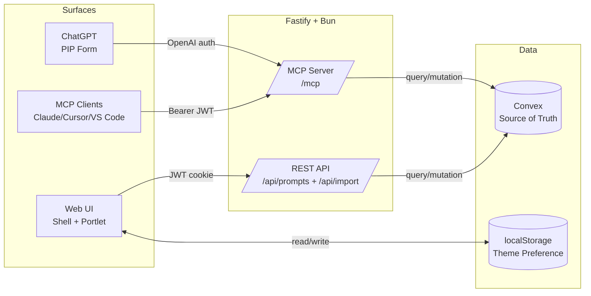
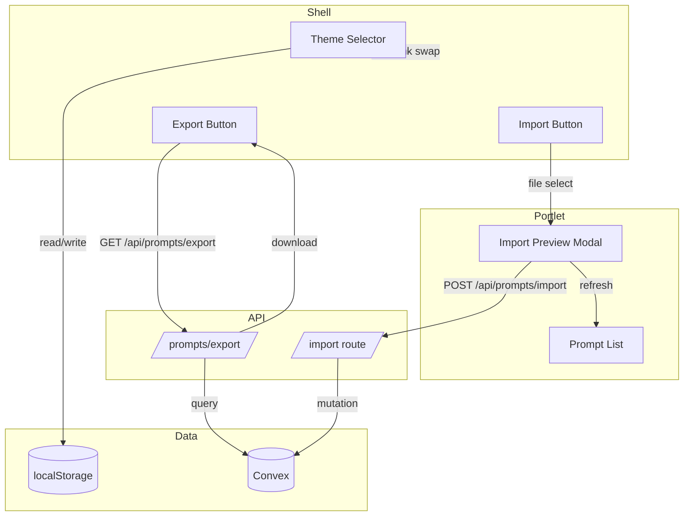
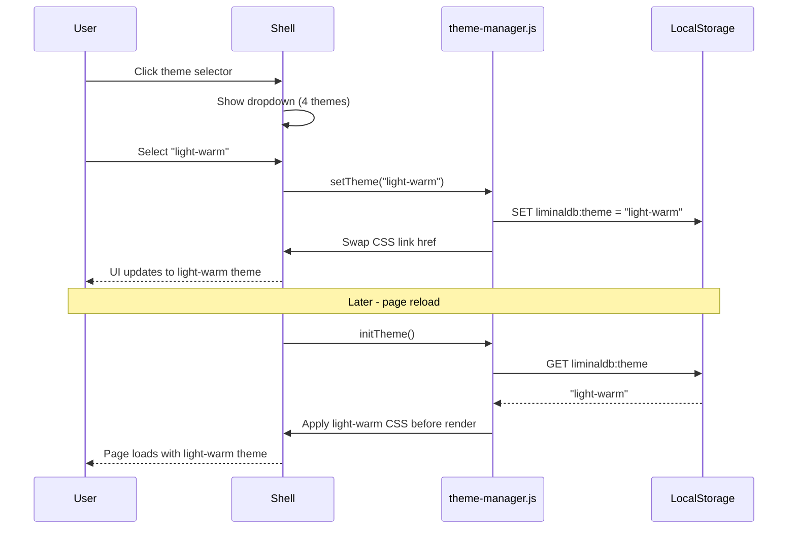
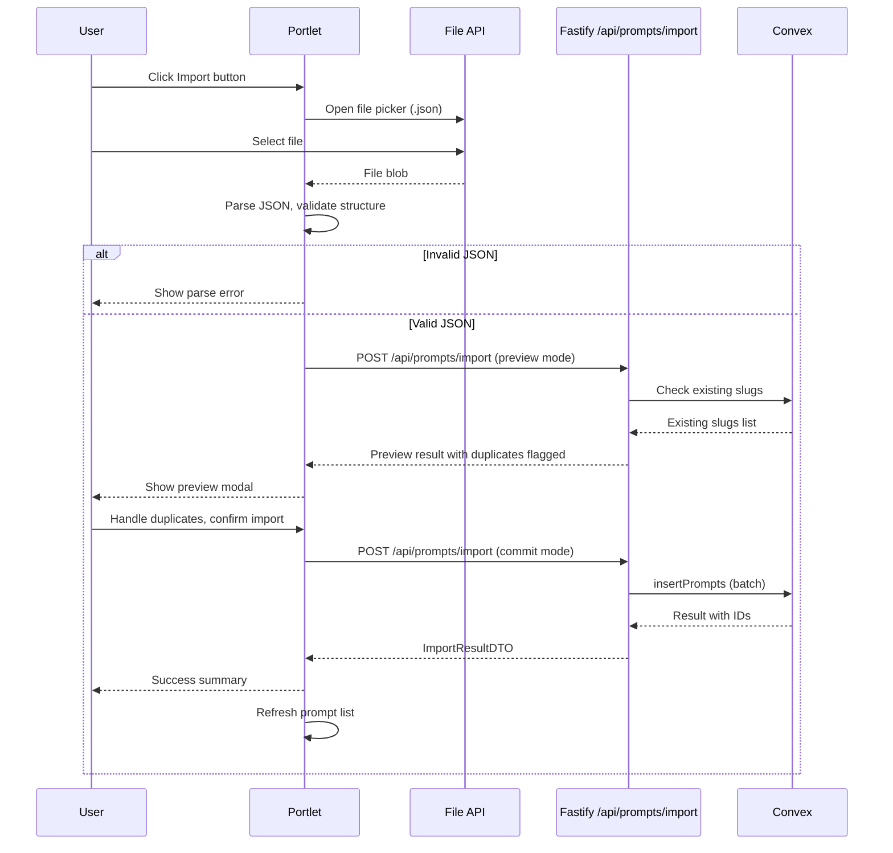
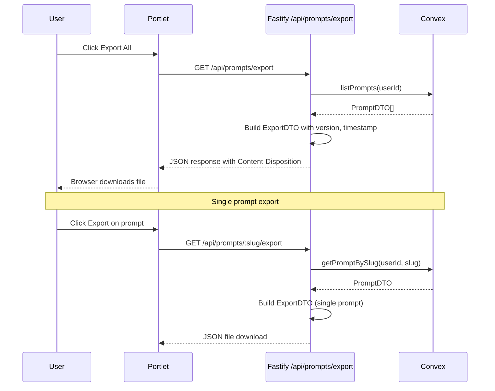
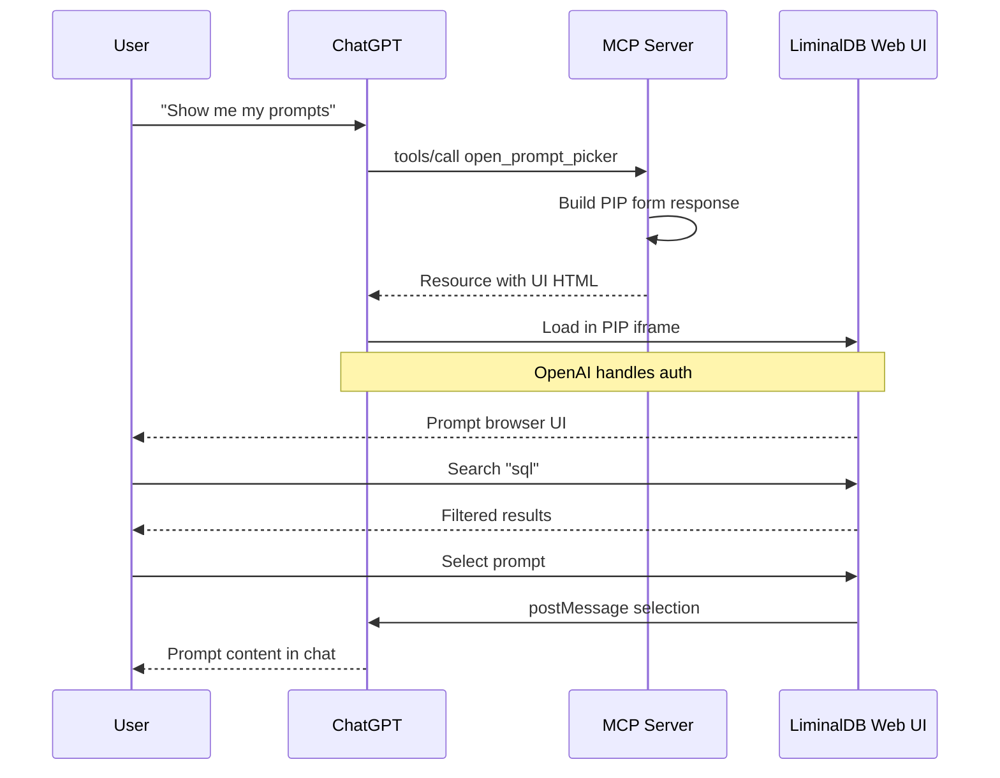

# Technical Design: UX Polish & Import/Export

## Purpose

This document translates UX Polish & Import/Export requirements into implementable architecture. It is written for:

| Audience | Value |
|----------|-------|
| Reviewers | Validate design before implementation |
| Developers | Blueprint for theming, import/export, and OpenAI PIP integration |
| Phase Prompts | Source of file paths, interfaces, and test mapping |

**Prerequisite:** Feature spec complete with ACs/TCs in `01.ux-polish-import-export.feature.md`.

---

## Context

Beta Prep prepares LiminalDB for closed beta release. The prompts functionality works, but needs polish before real users. This feature adds:

1. **Theme selection** - Multiple themes with persistence (4 themes for beta)
2. **Import/Export** - Batch JSON import/export for prompts (web UI + MCP)
3. **OpenAI PIP Integration** - Web app in ChatGPT PIP form via MCP tool

Key constraints:
- No breaking changes to existing API endpoints
- Theme state persisted in localStorage (no server-side storage needed)
- Import/export format must round-trip without data loss
- Import file size limit: 1MB
- OpenAI handles auth for PIP context; we render the same web app

---

## High Altitude: System View

### System Context Diagram



### External Contracts

#### REST API (new endpoints)

| Method | Path | Request | Response | Notes / ACs |
|--------|------|---------|----------|-------------|
| POST | `/api/prompts/import` | `ImportRequestBody` | `ImportResultDTO` | AC-7..27, batch import |
| GET | `/api/prompts/export` | — | `ExportDTO` (download) | AC-28..37, export all |
| GET | `/api/prompts/:slug/export` | — | `ExportDTO` (download) | AC-29, single export |

**No breaking changes:** existing endpoints remain unchanged; new endpoints are additive.

#### Import/Export Format

```json
{
  "version": "1.0",
  "exportedAt": "2025-01-10T12:34:56Z",
  "prompts": [
    {
      "slug": "my-prompt",
      "name": "My Prompt",
      "description": "A helpful prompt",
      "content": "The prompt content...",
      "tags": ["tag1", "tag2"]
    }
  ]
}
```

**Format notes:**
- `version` enables future format evolution
- `exportedAt` present in exports, optional in imports
- `tags` is always an array (empty `[]` if no tags)
- Only editable fields exported (no usage stats, created date, etc.)
- Same format for single and batch export

#### localStorage Key Pattern

| Key | Type | Value |
|-----|------|-------|
| `liminaldb:theme` | string | Theme ID (e.g., "tokyo-night", "teal", "light-1", "light-2") |

#### Error Response Shapes

| Source | Status | Shape | UI Handling |
|--------|--------|-------|-------------|
| Import validation | 400 | `{ error: string, details?: ValidationError[] }` | Show errors in preview |
| Import conflict | 409 | `{ error: string, duplicates: string[] }` | Trigger duplicate handling UI |
| Import too large | 413 | `{ error: "File too large", maxSize: "1MB" }` | Show size error |
| REST auth | 401 | `{ error: "Not authenticated" }` | Redirect to login |
| MCP tool error | 200 + `isError: true` | `content: [{ type:'text', text:'...' }]` | Display error text |

---

## Medium Altitude: Module Boundaries

### Module Architecture (new + modified)

```
src/
├── index.ts                                 # MOD: register import routes
├── routes/
│   ├── prompts.ts                           # MOD: export endpoints
│   └── import.ts                            # NEW: import endpoint
├── schemas/
│   ├── prompts.ts                           # (unchanged)
│   └── import-export.ts                     # NEW: import/export schemas
├── lib/
│   └── mcp.ts                               # MOD: import/export tools + PIP
├── ui/templates/
│   ├── shell.html                           # MOD: theme selector
│   └── prompts.html                         # MOD: import/export buttons
public/
├── shared/themes/
│   ├── base.css                             # (unchanged)
│   ├── tokyo-night.css                      # EXISTS: dark theme
│   ├── teal.css                             # EXISTS: dark theme
│   ├── light-warm.css                       # NEW: light theme 1
│   └── light-cool.css                       # NEW: light theme 2
├── js/
│   ├── theme-manager.js                     # NEW: theme switching logic
│   └── import-export.js                     # NEW: import/export UI logic
convex/
├── prompts.ts                               # MOD: batch import mutation

tests/
├── service/prompts/                         # MOD: export tests
├── service/import/                          # NEW: import tests
├── service/mcp/                             # MOD: import/export MCP tests
└── service/ui/                              # MOD: theme + import/export UI tests
```

### Module Responsibility Matrix

| Module | Type | Responsibility | Dependencies | Entry Points |
|--------|------|----------------|--------------|--------------|
| `src/routes/import.ts` | Route | Handle import POST with validation | schemas, convex | REST calls |
| `src/routes/prompts.ts` | Route | Handle export GET endpoints | schemas, convex | REST calls |
| `src/schemas/import-export.ts` | Schema | Zod schemas for import/export | — | Import route |
| `public/js/theme-manager.js` | UI | Theme switching, persistence | localStorage | User interaction |
| `public/js/import-export.js` | UI | Import preview, export triggers | REST API | User interaction |
| `convex/prompts.ts` | API | Batch import mutation | model | Fastify + MCP |
| `src/lib/mcp.ts` | MCP | Import/export tools + PIP | convex | MCP clients |

### Component Interaction Diagram



---

## Medium Altitude: Flow-by-Flow Design

### Flow 1: Theme Selection

**Covers:** AC-1..AC-6

Theme selection allows users to choose from 4 themes (2 dark, 2 light) with immediate UI update and persistence across sessions.

**Implementation approach:**
- Themes implemented via CSS custom properties (variables)
- Theme CSS files define color variables only (base.css has structure)
- Theme ID stored in localStorage
- On page load, theme applied before first render to prevent flash
- Theme selector in shell header as dropdown



**Skeleton Requirements:**

| What | Where | Stub Signature |
|------|-------|----------------|
| Theme manager | `public/js/theme-manager.js` | `initTheme()`, `setTheme(id)`, `getTheme()` |
| Light theme CSS | `public/shared/themes/light-warm.css` | CSS variables only |
| Light theme CSS | `public/shared/themes/light-cool.css` | CSS variables only |
| Theme selector UI | `src/ui/templates/shell.html` | Dropdown in header |

**TC Mapping (Flow 1):**

| TC | Tests | Entry Point | Assert |
|----|-------|-------------|--------|
| TC-1 | `tests/service/ui/theme.test.ts` | Click theme selector | Dropdown displayed |
| TC-2 | `tests/service/ui/theme.test.ts` | Dropdown open | 4 theme options visible |
| TC-3 | `tests/service/ui/theme.test.ts` | Select tokyo-night | UI updates |
| TC-4 | `tests/service/ui/theme.test.ts` | Select light theme | UI updates |
| TC-5 | `tests/service/ui/theme.test.ts` | Select teal | UI updates |
| TC-6 | `tests/service/ui/theme.test.ts` | Reload after selection | Theme persisted |
| TC-7..10 | `tests/service/ui/theme.test.ts` | Theme applied | Components use theme colors |

---

### Flow 2: Import Prompts

**Covers:** AC-7..AC-27, AC-44..AC-47

Import enables users to upload a JSON file and batch-import prompts with preview, validation, and duplicate handling.

**Implementation approach:**
- Import button in sidebar header opens file picker
- Client validates JSON structure before sending to server
- Server validates prompt fields and checks for duplicates
- Preview modal shows prompts with issues flagged
- Duplicate handling: skip, rename (auto-suffix), or overwrite
- Partial success supported (some succeed, some fail)



**Skeleton Requirements:**

| What | Where | Stub Signature |
|------|-------|----------------|
| Import route | `src/routes/import.ts` | `importPromptsHandler()` |
| Import schemas | `src/schemas/import-export.ts` | `ImportRequestSchema`, `ImportResultSchema` |
| Import UI | `public/js/import-export.js` | `openImportModal()`, `handleImport()` |
| Import modal | `src/ui/templates/prompts.html` | Modal markup |
| Convex batch import | `convex/prompts.ts` | `importPrompts()` mutation |

**TC Mapping (Flow 2):**

| TC | Tests | Entry Point | Assert |
|----|-------|-------------|--------|
| TC-11 | `tests/service/ui/import-export.test.ts` | List view | Import button visible |
| TC-12 | `tests/service/ui/import-export.test.ts` | Click Import | File picker opens |
| TC-13 | `tests/service/ui/import-export.test.ts` | Valid JSON selected | Preview displayed |
| TC-14 | `tests/service/ui/import-export.test.ts` | Malformed JSON | Parse error shown |
| TC-15 | `tests/service/ui/import-export.test.ts` | Missing fields | Validation error in preview |
| TC-16 | `tests/service/import/import.test.ts` | File >1MB | Rejection message |
| TC-17 | `tests/service/ui/import-export.test.ts` | Empty array | "No prompts" message |
| TC-18 | `tests/service/ui/import-export.test.ts` | 5 valid prompts | Preview shows 5 |
| TC-19 | `tests/service/ui/import-export.test.ts` | Deselect 2, confirm | 3 imported |
| TC-20 | `tests/service/ui/import-export.test.ts` | Click Cancel | No prompts imported |
| TC-21 | `tests/service/import/import.test.ts` | Valid prompts confirmed | Added to library |
| TC-22 | `tests/service/ui/import-export.test.ts` | 5 imported | Success message |
| TC-23 | `tests/service/import/import.test.ts` | Tags in JSON | Tags preserved |
| TC-24 | `tests/service/ui/import-export.test.ts` | After import | List refreshes |
| TC-25 | `tests/service/import/import.test.ts` | Duplicate slug | Flagged in preview |
| TC-26 | `tests/service/import/import.test.ts` | Skip duplicate | Existing unchanged |
| TC-27 | `tests/service/import/import.test.ts` | Rename duplicate | Auto-suffix added |
| TC-28 | `tests/service/import/import.test.ts` | Overwrite duplicate | Existing replaced |
| TC-29 | `tests/service/import/import.test.ts` | Apply to all | All handled same way |
| TC-30 | `tests/service/import/import.test.ts` | Partial failure | Success count + failures |
| TC-42 | `tests/service/mcp/import-export.test.ts` | MCP import valid | Prompts imported |
| TC-43 | `tests/service/mcp/import-export.test.ts` | MCP import invalid | Validation error |
| TC-44 | `tests/service/mcp/import-export.test.ts` | MCP skip duplicates | Duplicates skipped |
| TC-45 | `tests/service/mcp/import-export.test.ts` | MCP import complete | Summary returned |

---

### Flow 3: Export Prompts

**Covers:** AC-28..AC-37, AC-48..AC-50

Export enables users to download all prompts or a single prompt as JSON.

**Implementation approach:**
- Export All button in sidebar header triggers GET request
- Server generates JSON with all user's prompts
- Browser triggers download with date-stamped filename
- Single prompt export from viewer menu/action
- MCP tools return JSON content directly (no file download)



**Skeleton Requirements:**

| What | Where | Stub Signature |
|------|-------|----------------|
| Export route (all) | `src/routes/prompts.ts` | `exportAllPromptsHandler()` |
| Export route (single) | `src/routes/prompts.ts` | `exportPromptHandler()` |
| Export UI | `public/js/import-export.js` | `exportAllPrompts()`, `exportPrompt(slug)` |
| Export button | `src/ui/templates/prompts.html` | Button in sidebar header |

**TC Mapping (Flow 3):**

| TC | Tests | Entry Point | Assert |
|----|-------|-------------|--------|
| TC-31 | `tests/service/ui/import-export.test.ts` | List view | Export button visible |
| TC-32 | `tests/service/ui/import-export.test.ts` | Viewing prompt | Export action available |
| TC-33 | `tests/service/prompts/export.test.ts` | Export All | Valid JSON downloaded |
| TC-34 | `tests/service/prompts/export.test.ts` | Export single | JSON with 1 prompt |
| TC-35 | `tests/service/prompts/export.test.ts` | Export file | version field present |
| TC-36 | `tests/service/prompts/export.test.ts` | Export file | exportedAt timestamp |
| TC-37 | `tests/service/prompts/export.test.ts` | Export prompt | All fields present |
| TC-38 | `tests/service/prompts/export.test.ts` | No tags | Empty array exported |
| TC-39 | `tests/service/import/import.test.ts` | Round-trip | Import matches export |
| TC-40 | `tests/service/prompts/export.test.ts` | Filename | Contains date |
| TC-41 | `tests/service/ui/import-export.test.ts` | Zero prompts | Message shown |
| TC-46 | `tests/service/mcp/import-export.test.ts` | MCP export_prompts | All prompts returned |
| TC-47 | `tests/service/mcp/import-export.test.ts` | MCP export_prompt | Single prompt returned |
| TC-48 | `tests/service/mcp/import-export.test.ts` | MCP export format | version + timestamp |

---

### Flow 4: OpenAI PIP Integration

**Covers:** AC-38..AC-43

The web app loads as a PIP (picture-in-picture) form within ChatGPT via MCP tool call. This extends access to users who work primarily in ChatGPT.

**Implementation approach:**
- Not a native OpenAI SDK widget - same web app in PIP viewport
- MCP tool `open_prompt_picker` triggers PIP with web UI
- OpenAI handles authentication via their OAuth flow
- User browses/searches prompts in familiar UI
- Selection returns to chat via MCP tool response



**Skeleton Requirements:**

| What | Where | Stub Signature |
|------|-------|----------------|
| PIP MCP tool | `src/lib/mcp.ts` | `registerTool("open_prompt_picker"...)` |
| PIP widget HTML | `src/lib/mcp.ts` | Widget resource with CSP |
| PIP-optimized CSS | `public/shared/themes/base.css` | PIP viewport adjustments |

**TC Mapping (Flow 4):**

| TC | Tests | Entry Point | Assert |
|----|-------|-------------|--------|
| TC-49 | `tests/service/mcp/pip.test.ts` | MCP tool call | PIP form loads |
| TC-50 | `tests/service/mcp/pip.test.ts` | PIP loaded | User's prompts displayed |
| TC-51 | `tests/service/mcp/pip.test.ts` | Search in PIP | Results filter |
| TC-52 | `tests/service/mcp/pip.test.ts` | Select prompt | Content available |
| TC-53 | `tests/service/mcp/pip.test.ts` | PIP rendered | Controls visible/usable |

---

## Low Altitude: Interface Definitions

### Types (TypeScript)

```ts
// src/schemas/import-export.ts

import { z } from "zod";
import { PromptInputSchema } from "./prompts";

/**
 * Import/Export file format version
 */
export const EXPORT_VERSION = "1.0" as const;

/**
 * Maximum import file size (1MB)
 */
export const MAX_IMPORT_SIZE_BYTES = 1024 * 1024;

/**
 * Single prompt in import/export format
 * Note: Maps to PromptInput but with explicit tags array
 */
export const ExportPromptSchema = z.object({
  slug: z.string(),
  name: z.string(),
  description: z.string(),
  content: z.string(),
  tags: z.array(z.string()),
});

export type ExportPrompt = z.infer<typeof ExportPromptSchema>;

/**
 * Full export file format
 */
export const ExportFileSchema = z.object({
  version: z.string(),
  exportedAt: z.string().optional(), // ISO timestamp
  prompts: z.array(ExportPromptSchema),
});

export type ExportFile = z.infer<typeof ExportFileSchema>;

/**
 * Duplicate handling strategy
 */
export const DuplicateHandlingSchema = z.enum(["skip", "rename", "overwrite"]);
export type DuplicateHandling = z.infer<typeof DuplicateHandlingSchema>;

/**
 * Import request body
 */
export const ImportRequestSchema = z.object({
  prompts: z.array(ExportPromptSchema),
  duplicateHandling: DuplicateHandlingSchema.default("skip"),
  previewOnly: z.boolean().default(false),
});

export type ImportRequest = z.infer<typeof ImportRequestSchema>;

/**
 * Validation error for a single prompt
 */
export const ImportValidationErrorSchema = z.object({
  index: z.number(),
  slug: z.string().optional(),
  field: z.string(),
  message: z.string(),
});

export type ImportValidationError = z.infer<typeof ImportValidationErrorSchema>;

/**
 * Import result for preview or commit
 */
export const ImportResultSchema = z.object({
  success: z.boolean(),
  imported: z.number(),
  skipped: z.number(),
  errors: z.array(ImportValidationErrorSchema),
  duplicates: z.array(z.string()), // Slugs that exist
});

export type ImportResult = z.infer<typeof ImportResultSchema>;
```

### Theme Configuration

```ts
// public/js/theme-manager.js (inline in shell.html or separate file)

/**
 * Available themes
 */
export const THEMES = [
  { id: "tokyo-night", name: "Tokyo Night", type: "dark" },
  { id: "teal", name: "Teal", type: "dark" },
  { id: "light-warm", name: "Light Warm", type: "light" },
  { id: "light-cool", name: "Light Cool", type: "light" },
] as const;

export type ThemeId = typeof THEMES[number]["id"];

const STORAGE_KEY = "liminaldb:theme";
const DEFAULT_THEME: ThemeId = "tokyo-night";

/**
 * Initialize theme from localStorage or default
 * Call before DOM renders to prevent flash
 */
export function initTheme(): ThemeId {
  const stored = localStorage.getItem(STORAGE_KEY);
  const themeId = isValidTheme(stored) ? stored : DEFAULT_THEME;
  applyTheme(themeId);
  return themeId;
}

/**
 * Set theme and persist to localStorage
 */
export function setTheme(themeId: ThemeId): void {
  if (!isValidTheme(themeId)) return;
  localStorage.setItem(STORAGE_KEY, themeId);
  applyTheme(themeId);
}

/**
 * Get current theme
 */
export function getTheme(): ThemeId {
  const stored = localStorage.getItem(STORAGE_KEY);
  return isValidTheme(stored) ? stored : DEFAULT_THEME;
}

function isValidTheme(id: string | null): id is ThemeId {
  return THEMES.some((t) => t.id === id);
}

function applyTheme(themeId: ThemeId): void {
  const link = document.getElementById("theme-css") as HTMLLinkElement;
  if (link) {
    link.href = `/shared/themes/${themeId}.css`;
  }
  document.documentElement.setAttribute("data-theme", themeId);
}
```

### REST API Signatures

```http
# Import prompts
POST /api/prompts/import
Content-Type: application/json
Body: ImportRequest
200: ImportResult

# Export all prompts
GET /api/prompts/export
200: ExportFile (application/json with Content-Disposition: attachment)

# Export single prompt
GET /api/prompts/:slug/export
200: ExportFile (single prompt in array)
404: { error: "Prompt not found" }
```

### MCP Tool Signatures

```ts
// import_prompts
input: {
  prompts: ExportPrompt[],
  duplicate_handling?: "skip" | "rename" | "overwrite"
}
output: {
  imported: number,
  skipped: number,
  errors: ImportValidationError[]
}

// export_prompts
input: {}
output: {
  version: string,
  exportedAt: string,
  prompts: ExportPrompt[]
}

// export_prompt
input: { slug: string }
output: {
  version: string,
  exportedAt: string,
  prompts: ExportPrompt[] // Single item array
}

// open_prompt_picker (PIP integration)
input: {}
output: {
  structuredContent: { /* PIP data */ },
  content: [{ type: "text", text: "Prompt picker opened" }]
}
// Returns resource with text/html+skybridge for ChatGPT PIP
```

### Convex Mutation for Batch Import

```ts
// convex/prompts.ts (new mutation)

export const importPrompts = mutation({
  args: {
    apiKey: v.string(),
    userId: v.string(),
    prompts: v.array(
      v.object({
        slug: v.string(),
        name: v.string(),
        description: v.string(),
        content: v.string(),
        tags: v.array(v.string()),
      })
    ),
    duplicateHandling: v.union(
      v.literal("skip"),
      v.literal("rename"),
      v.literal("overwrite")
    ),
  },
  returns: v.object({
    imported: v.array(v.string()), // slugs
    skipped: v.array(v.string()),  // slugs
    errors: v.array(
      v.object({
        slug: v.string(),
        error: v.string(),
      })
    ),
  }),
  handler: async (ctx, args) => {
    // Validate API key
    // For each prompt:
    //   - Check if slug exists
    //   - Handle duplicate per strategy
    //   - Insert or update
    // Return results
  },
});
```

### Light Theme CSS Structure

```css
/* public/shared/themes/light-warm.css */

:root {
  /* Backgrounds */
  --bg-deep: #faf8f5;
  --bg-surface: #ffffff;
  --bg-elevated: #f5f3f0;
  --bg-hover: #ebe8e4;

  /* Borders */
  --border: #e0ddd8;
  --border-subtle: #ebe8e4;

  /* Typography */
  --text-primary: #1a1a1a;
  --text-secondary: #4a4a4a;
  --text-muted: #8a8a8a;

  /* Accent - Warm gold/amber */
  --accent: #b45309;
  --accent-bright: #d97706;
  --accent-dim: #92400e;
  --accent-glow: rgba(180, 83, 9, 0.15);

  /* Secondary accent */
  --accent-secondary: #0369a1;
  --accent-secondary-dim: rgba(3, 105, 161, 0.1);

  /* Status */
  --success: #15803d;
  --error: #dc2626;
  --error-dim: rgba(220, 38, 38, 0.1);
  --warning: #ca8a04;
  --info: #0284c7;
}
```

```css
/* public/shared/themes/light-cool.css */

:root {
  /* Backgrounds */
  --bg-deep: #f8fafc;
  --bg-surface: #ffffff;
  --bg-elevated: #f1f5f9;
  --bg-hover: #e2e8f0;

  /* Borders */
  --border: #cbd5e1;
  --border-subtle: #e2e8f0;

  /* Typography */
  --text-primary: #0f172a;
  --text-secondary: #334155;
  --text-muted: #64748b;

  /* Accent - Cool blue */
  --accent: #2563eb;
  --accent-bright: #3b82f6;
  --accent-dim: #1d4ed8;
  --accent-glow: rgba(37, 99, 235, 0.15);

  /* Secondary accent */
  --accent-secondary: #0891b2;
  --accent-secondary-dim: rgba(8, 145, 178, 0.1);

  /* Status */
  --success: #16a34a;
  --error: #dc2626;
  --error-dim: rgba(220, 38, 38, 0.1);
  --warning: #ca8a04;
  --info: #0284c7;
}
```

---

## Functional-to-Technical Traceability

### By Module

#### `tests/service/ui/theme.test.ts`

Theme UI tests - theme selector interaction and persistence.

| TC | Test Name | Setup | Action | Assert |
|----|-----------|-------|--------|--------|
| TC-1 | TC-1: theme selector opens on click | Render shell | Click selector | Dropdown visible |
| TC-2 | TC-2: shows 4 theme options | Open dropdown | — | 4 options listed |
| TC-3 | TC-3: tokyo-night applies correctly | Open dropdown | Select tokyo-night | CSS link updated |
| TC-4 | TC-4: light theme applies correctly | Open dropdown | Select light-warm | CSS link updated |
| TC-5 | TC-5: teal applies correctly | Open dropdown | Select teal | CSS link updated |
| TC-6 | TC-6: theme persists across reload | Select theme | Reload page | Same theme applied |
| TC-7..10 | TC-7..10: components use theme | Apply theme | Inspect elements | Theme vars used |

#### `tests/service/ui/import-export.test.ts`

Import/Export UI tests - buttons, modals, interactions.

| TC | Test Name | Setup | Action | Assert |
|----|-----------|-------|--------|--------|
| TC-11 | TC-11: import button visible | Render prompts | — | Import button in header |
| TC-12 | TC-12: file picker opens | Click Import | — | File input triggered |
| TC-13 | TC-13: preview shows on valid JSON | Select valid file | — | Preview modal opens |
| TC-14 | TC-14: parse error on invalid JSON | Select invalid | — | Error message shown |
| TC-17 | TC-17: empty array message | Select empty file | — | "No prompts" shown |
| TC-18 | TC-18: preview shows all prompts | Select 5 prompts | — | 5 items in preview |
| TC-19 | TC-19: deselect works | Deselect 2 | Confirm | 3 imported |
| TC-20 | TC-20: cancel aborts import | Click Cancel | — | No prompts added |
| TC-22 | TC-22: success message | Import 5 | — | "5 prompts imported" |
| TC-24 | TC-24: list refreshes | Complete import | — | New prompts in list |
| TC-31 | TC-31: export button visible | Render prompts | — | Export button in header |
| TC-32 | TC-32: export action in viewer | View prompt | — | Export action available |
| TC-41 | TC-41: zero prompts message | No prompts | Click Export | Message shown |

#### `tests/service/import/import.test.ts`

Import route tests - validation, duplicate handling, batch operations.

| TC | Test Name | Setup | Action | Assert |
|----|-----------|-------|--------|--------|
| TC-15 | TC-15: validation errors flagged | Missing content | POST import | Error in response |
| TC-16 | TC-16: file size limit | 2MB payload | POST import | 413 status |
| TC-21 | TC-21: valid prompts inserted | Valid prompts | POST import | Prompts in Convex |
| TC-23 | TC-23: tags preserved | Prompts with tags | Import | Tags on prompts |
| TC-25 | TC-25: duplicates detected | Existing slug | Preview | Duplicate flagged |
| TC-26 | TC-26: skip leaves existing | Skip mode | Import | Original unchanged |
| TC-27 | TC-27: rename adds suffix | Rename mode | Import | New slug "-1" |
| TC-28 | TC-28: overwrite replaces | Overwrite mode | Import | Content replaced |
| TC-29 | TC-29: apply to all works | 3 duplicates | Apply skip all | All skipped |
| TC-30 | TC-30: partial success | 3 valid, 2 invalid | Import | 3 succeed, 2 fail |
| TC-39 | TC-39: round-trip integrity | Export then import | Compare | Identical fields |

#### `tests/service/prompts/export.test.ts`

Export route tests - file generation, format, content.

| TC | Test Name | Setup | Action | Assert |
|----|-----------|-------|--------|--------|
| TC-33 | TC-33: export all generates JSON | User has prompts | GET export | Valid JSON response |
| TC-34 | TC-34: single export works | Prompt exists | GET :slug/export | Single prompt JSON |
| TC-35 | TC-35: version field present | Any export | — | version: "1.0" |
| TC-36 | TC-36: timestamp present | Any export | — | exportedAt is ISO |
| TC-37 | TC-37: all fields exported | Complete prompt | Export | All fields present |
| TC-38 | TC-38: empty tags as array | No tags | Export | tags: [] |
| TC-40 | TC-40: filename has date | Export | — | Contains YYYY-MM-DD |

#### `tests/service/mcp/import-export.test.ts`

MCP import/export tool tests.

| TC | Test Name | Setup | Action | Assert |
|----|-----------|-------|--------|--------|
| TC-42 | TC-42: MCP import works | Valid JSON | Call tool | Prompts imported |
| TC-43 | TC-43: MCP validation | Invalid prompt | Call tool | Error returned |
| TC-44 | TC-44: MCP skip duplicates | Duplicate | Call with skip | Duplicate skipped |
| TC-45 | TC-45: MCP returns summary | Import complete | — | Count in response |
| TC-46 | TC-46: MCP export_prompts | User has prompts | Call tool | All prompts returned |
| TC-47 | TC-47: MCP export_prompt | Prompt exists | Call with slug | Single prompt |
| TC-48 | TC-48: MCP export format | Any export | — | version + timestamp |

#### `tests/service/mcp/pip.test.ts`

OpenAI PIP integration tests.

| TC | Test Name | Setup | Action | Assert |
|----|-----------|-------|--------|--------|
| TC-49 | TC-49: PIP tool returns widget | Authenticated | Call open_prompt_picker | HTML returned |
| TC-50 | TC-50: widget shows prompts | Load widget | — | Prompts visible |
| TC-51 | TC-51: search works in PIP | Widget loaded | Search | Results filter |
| TC-52 | TC-52: selection returns content | Select prompt | — | Content in response |
| TC-53 | TC-53: viewport constraints | Render widget | — | Controls usable |

---

## Testing Strategy

### Test Pyramid for This Feature

```
         /\
        /  \  Manual (browser + ChatGPT)
       /----\  - Visual theme review
      /      \  - PIP viewport testing
     /--------\  UI (JSDOM) - theme/import/export
    /          \  - User interactions
   /------------\  Service (Fastify routes)
  /              \  - Import validation, export generation
 /----------------\  MCP (tool responses)
/                  \  - Import/export/PIP tools
```

### Mock Boundaries

| Layer | Mock? | Strategy | Why |
|-------|-------|----------|-----|
| Convex in service tests | Yes | mock `convex.query/mutation` | Isolate Fastify logic |
| localStorage in UI tests | Yes | mock Storage API | Deterministic theme state |
| File API in UI tests | Yes | mock FileReader | Test import without real files |
| MCP tools | Yes | mock Convex only | Validate tool wiring |
| OpenAI PIP | Manual | real ChatGPT testing | Can't fully automate iframe |

### Manual Verification Checklist

After TDD Green, verify manually:

**Theme Selection:**
1. [ ] Open app in browser
2. [ ] Click theme selector - dropdown appears
3. [ ] Select each theme - UI updates immediately
4. [ ] Refresh page - theme persists
5. [ ] Check modal, sidebar, content all use theme colors

**Import:**
1. [ ] Click Import button - file picker opens
2. [ ] Select invalid JSON - error message appears
3. [ ] Select valid JSON - preview modal shows
4. [ ] Deselect some prompts - count updates
5. [ ] Confirm import - prompts appear in list
6. [ ] Test with duplicates - handling options work

**Export:**
1. [ ] Click Export - file downloads
2. [ ] Check filename includes date
3. [ ] Verify JSON is valid and complete
4. [ ] Re-import exported file - round-trip success

**OpenAI PIP (requires ChatGPT):**
1. [ ] Configure MCP in ChatGPT
2. [ ] Trigger prompt picker tool
3. [ ] Verify UI loads in PIP
4. [ ] Search and select prompt
5. [ ] Confirm selection returns to chat

---

## Skeleton -> TDD Red -> TDD Green Workplan

### Story 1: Theme Selection

**Phase 1: Skeleton**

| Deliverable | Path | Notes |
|------------|------|-------|
| Theme manager stub | `public/js/theme-manager.js` | `initTheme()`, `setTheme()`, `getTheme()` stubs |
| Light theme CSS | `public/shared/themes/light-warm.css` | CSS variables |
| Light theme CSS | `public/shared/themes/light-cool.css` | CSS variables |
| Theme selector UI | `src/ui/templates/shell.html` | Dropdown markup in header |

**Exit Criteria:** Shell renders with theme selector visible. Clicking shows dropdown (no functionality).

**Phase 2: TDD Red**

| Test File | Covers |
|-----------|--------|
| `tests/service/ui/theme.test.ts` | TC-1..10 |

**Exit Criteria:** Tests ERROR due to stubs. Existing tests PASS.

**Phase 3: TDD Green**

Implement theme switching with localStorage persistence. All theme components update.

**Exit Criteria:** All tests PASS. Manual verification complete.

---

### Story 2: Import Prompts (Backend)

**Phase 1: Skeleton**

| Deliverable | Path | Notes |
|------------|------|-------|
| Import schemas | `src/schemas/import-export.ts` | Zod schemas |
| Import route | `src/routes/import.ts` | Handler stub |
| Route registration | `src/index.ts` | Register import route |
| Convex mutation | `convex/prompts.ts` | `importPrompts()` stub |

**Exit Criteria:** POST /api/prompts/import returns 501. Schema validates.

**Phase 2: TDD Red**

| Test File | Covers |
|-----------|--------|
| `tests/service/import/import.test.ts` | TC-15,16,21,23,25..30,39 |

**Exit Criteria:** Tests ERROR. Existing tests PASS.

**Phase 3: TDD Green**

Implement validation, duplicate handling, batch insert.

**Exit Criteria:** All tests PASS.

---

### Story 3: Import Prompts (UI)

**Phase 1: Skeleton**

| Deliverable | Path | Notes |
|------------|------|-------|
| Import UI module | `public/js/import-export.js` | Stubs |
| Import button | `src/ui/templates/prompts.html` | Button in header |
| Import modal | `src/ui/templates/prompts.html` | Modal markup |

**Exit Criteria:** Button visible. Clicking shows modal shell.

**Phase 2: TDD Red**

| Test File | Covers |
|-----------|--------|
| `tests/service/ui/import-export.test.ts` | TC-11..14,17..20,22,24 |

**Exit Criteria:** Tests ERROR. Existing tests PASS.

**Phase 3: TDD Green**

Implement file selection, preview, duplicate UI, import execution.

**Exit Criteria:** All tests PASS. Manual verification complete.

---

### Story 4: Export Prompts

**Phase 1: Skeleton**

| Deliverable | Path | Notes |
|------------|------|-------|
| Export routes | `src/routes/prompts.ts` | Handler stubs |
| Export UI | `public/js/import-export.js` | Export functions |
| Export button | `src/ui/templates/prompts.html` | Buttons in header + viewer |

**Exit Criteria:** Export buttons visible. Clicking returns 501.

**Phase 2: TDD Red**

| Test File | Covers |
|-----------|--------|
| `tests/service/prompts/export.test.ts` | TC-33..40 |
| `tests/service/ui/import-export.test.ts` | TC-31,32,41 |

**Exit Criteria:** Tests ERROR. Existing tests PASS.

**Phase 3: TDD Green**

Implement export generation, download, single prompt export.

**Exit Criteria:** All tests PASS. Manual verification complete.

---

### Story 5: MCP Import/Export Tools

**Phase 1: Skeleton**

| Deliverable | Path | Notes |
|------------|------|-------|
| MCP import tool | `src/lib/mcp.ts` | `registerTool("import_prompts"...)` stub |
| MCP export tools | `src/lib/mcp.ts` | `registerTool("export_prompts"...)` stubs |

**Exit Criteria:** MCP tools registered. Calling returns "Not implemented".

**Phase 2: TDD Red**

| Test File | Covers |
|-----------|--------|
| `tests/service/mcp/import-export.test.ts` | TC-42..48 |

**Exit Criteria:** Tests ERROR. Existing tests PASS.

**Phase 3: TDD Green**

Implement MCP tools using existing Convex mutations.

**Exit Criteria:** All tests PASS.

---

### Story 6: OpenAI PIP Integration

**Phase 1: Skeleton**

| Deliverable | Path | Notes |
|------------|------|-------|
| PIP MCP tool | `src/lib/mcp.ts` | `registerTool("open_prompt_picker"...)` |
| PIP widget HTML | `src/lib/mcp.ts` | HTML resource |
| PIP styles | `public/shared/themes/base.css` | PIP viewport CSS |

**Exit Criteria:** MCP tool registered. Returns placeholder HTML.

**Phase 2: TDD Red**

| Test File | Covers |
|-----------|--------|
| `tests/service/mcp/pip.test.ts` | TC-49..53 |

**Exit Criteria:** Tests ERROR. Existing tests PASS.

**Phase 3: TDD Green**

Implement PIP widget with prompt browser, search, selection.

**Exit Criteria:** All tests PASS. Manual ChatGPT verification complete.

---

### Iterative Refinement

After Stories 1-6, the following work happens outside formal TDD:

**Part A: Validation & Polish**
- Load realistic test data
- Test search with real queries
- Test edge cases (long prompts, special characters)
- Visual review of all 4 themes
- Cross-browser testing
- Accessibility review

**Part B: Refactoring & Integration**
- Review code against established patterns
- Ensure consistent error handling
- Add missing test coverage
- Documentation updates

---

## Open Questions

| # | Question | Owner | Blocking? | Resolution |
|---|----------|-------|-----------|------------|
| Q1 | Light theme names (warm/cool vs specific)? | Product | No | Using warm/cool for beta |
| Q2 | Import progress indicator threshold? | Product | No | Show for imports > 1 second |

---

## Deferred Items

| Item | Related AC | Reason | Future Work |
|------|-----------|--------|-------------|
| Custom user-defined themes | AC-6 | Out of scope | Post-beta feature |
| CSV import format | AC-7 | JSON sufficient for beta | User feedback |
| Import from other tools | AC-7 | No clear standards | Future integrations |
| Native OpenAI widget | AC-38 | Policy constraints | If policies change |

---

## Related Documentation

- Feature Spec: `01.ux-polish-import-export.feature.md`
- PRD: `../beta-prep.prd.md`
- Product Brief: `../../product-brief.md`
- SDD Methodology: `../../../reference/sdd/meta-spec-design.md`
- Search & Select Tech Design (pattern reference): `../../01-prompts/02-search-select/02.search.select.tech-design.md`
