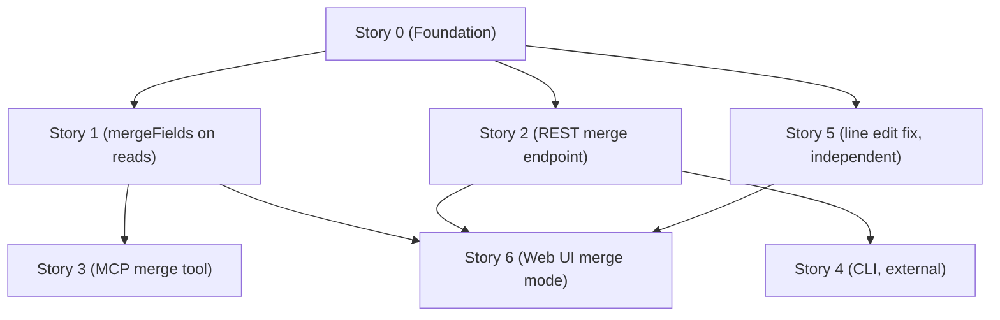

# Stories: Epic 03 - Template Merge

**Epic:** `docs/project/epic-03-template-merge/epic.md`
**Tech Design:** `docs/project/epic-03-template-merge/tech-design.md`

## Story List

- Story 0: [Merge Primitives (Foundation)](./story-00-merge-primitives-foundation.md)
- Story 1: [Expose `mergeFields` On Every Prompt Read (All Surfaces)](./story-01-expose-mergefields-on-every-prompt-read-all-surfaces.md)
- Story 2: [REST Merge Endpoint (`POST /api/prompts/:slug/merge`)](./story-02-rest-merge-endpoint-post-api-prompts-slug-merge.md)
- Story 3: [MCP `merge_prompt` Tool](./story-03-mcp-merge-prompt-tool.md)
- Story 4: [CLI Merge Command (External Repo: `liminaldb-cli`)](./story-04-cli-merge-command-external-repo-liminaldb-cli.md)
- Story 5: [Fix View-Mode Line Edit Persistence (Prerequisite: `promptdb-utq`)](./story-05-fix-view-mode-line-edit-persistence-prerequisite-promptdb-utq.md)
- Story 6: [Web UI Merge Mode](./story-06-web-ui-merge-mode.md)

## Coverage

High-level coverage (authoritative TC->test mapping lives inside each story file):

| Epic Area | ACs / TCs | Owning Story |
|---|---|---|
| Merge field extraction (all surfaces) | AC-1.1 to AC-1.4 (10 TCs) | Story 1 |
| Merge endpoint semantics + usage tracking | AC-2.1 to AC-2.8 (17 TCs) | Story 2 |
| Web UI merge mode | AC-3.1 to AC-3.12 (28 TCs) | Story 6 |
| CLI merge command (external repo) | AC-4.1 to AC-4.2 (4 TCs) | Story 4 |
| MCP merge tool | AC-5.1 to AC-5.2 (4 TCs) | Story 3 |
| Line edit prerequisite (promptdb-utq) | AC-LE.1 to AC-LE.2 (2 TCs) | Story 5 |

**Total: 63 epic TCs + 2 prerequisite TCs = 65 TCs. No orphans. No duplicates.**

### Non-TC Decided Tests

Tests decided in the tech design that aren't 1:1 with a TC:

| Test | Owning Story | Source |
|------|-------------|--------|
| Search variant of TC-1.3a (separate Convex query path) | Story 1 | Tech Design §4 — List/Search DTO |
| Integration tests (~7 tests in `tests/integration/merge.test.ts`) | Story 2 | Tech Design §4 — Integration |
| Literal placeholder collision test (`%%%MERGE_N%%%`) | Story 6 | Tech Design §0 — Q3 |

### Local Integration Verification

`bun run check:local` runs `tests/integration/merge.test.ts` against a local server. These are Layer 2 verification — not CI-scoped, but high-signal for catching issues mocked tests miss. Story 2 owns the integration test file.

## Integration Path Trace

| Path Segment | Description | Owning Story | Relevant TC |
|---|---|---|---|
| Read prompt -> `mergeFields` present | Discover merge fields | Story 1 | TC-1.1a |
| POST merge -> merged content | Server-side merge operation | Story 2 | TC-2.1c |
| POST merge -> unfilled fields | User/model gets warnings | Story 2 | TC-2.2b |
| UI enter merge mode | Viewer switches to rendered + inputs | Story 6 | TC-3.2b |
| UI copy merged result | Clipboard gets merged content | Story 6 | TC-3.3a |
| Merge increments usage | Analytics updated | Story 2 / Story 6 | TC-2.8a / TC-3.9a |

## Dependency Graph

After Story 0: Stories 1, 2, and 5 can run in parallel. After Story 1: Story 3 can start. Story 6 is the convergence point (requires Story 1 + Story 2 + Story 5). Story 4 (external) can start after Story 2.
