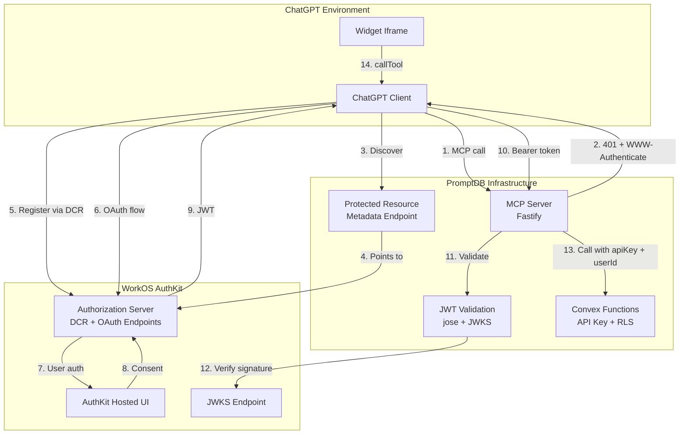
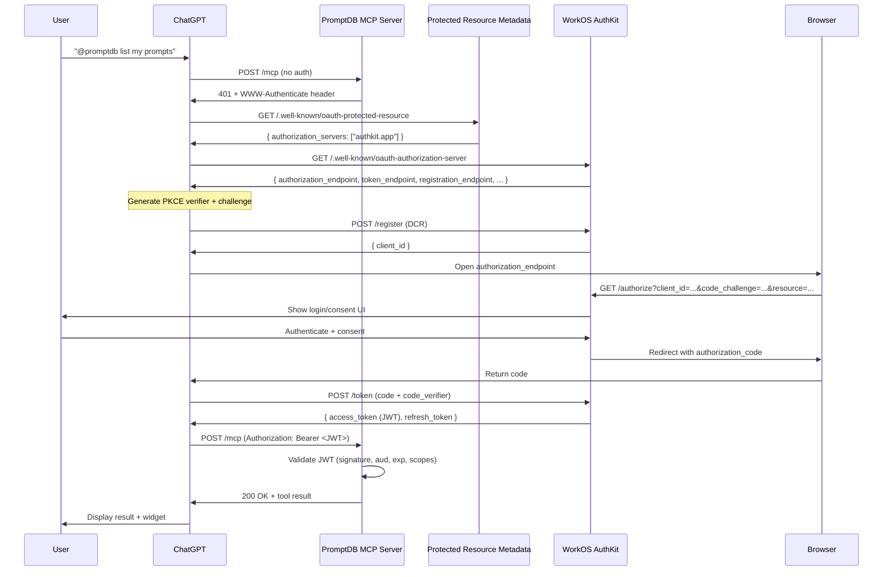
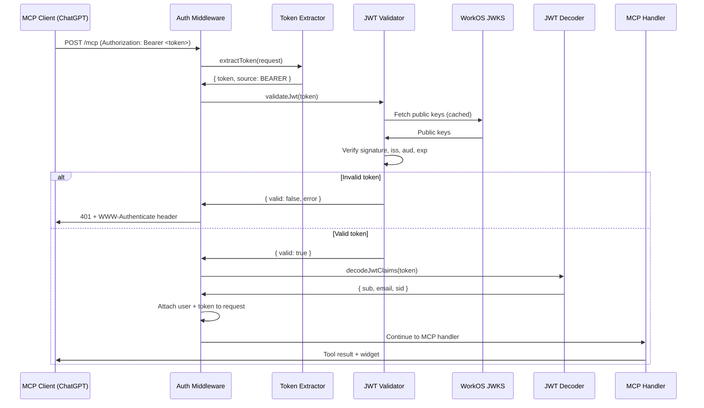
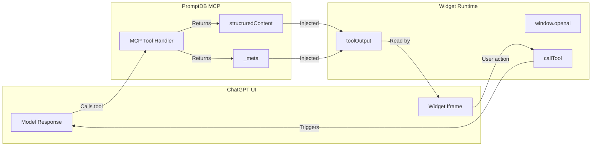
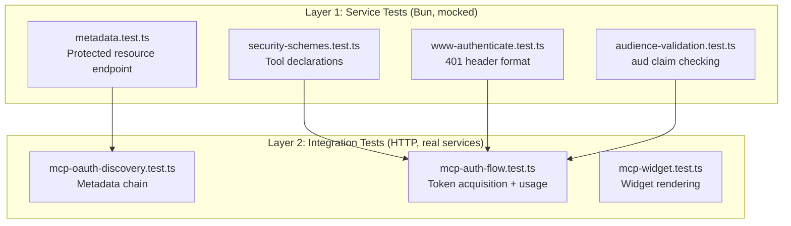
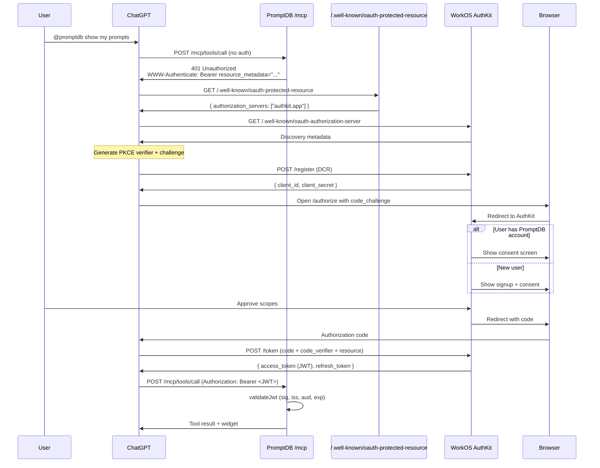
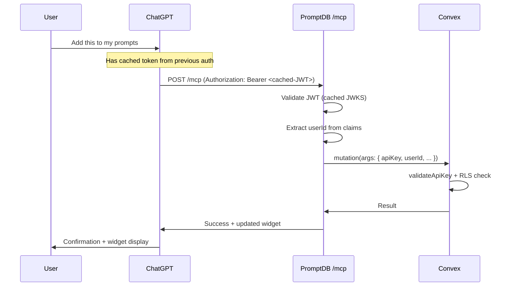
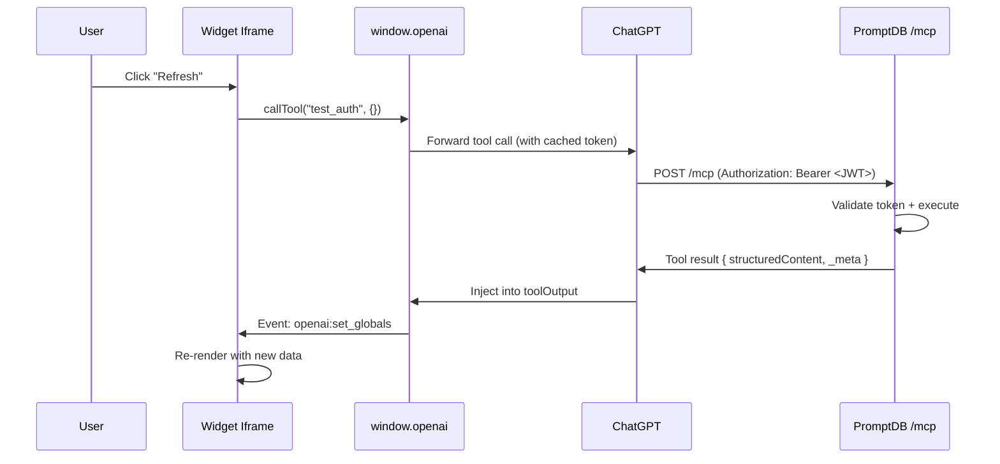

# MCP + OpenAI ChatGPT Integration: Authentication & Implementation Design

**Version:** 1.0
**Date:** 2025-12-22
**Status:** Design - Ready for Implementation

---

## Table of Contents

1. [Overview](#overview)
2. [Requirements](#requirements)
3. [Problem Space](#problem-space)
4. [Standards & Specifications](#standards--specifications)
5. [Architecture Overview](#architecture-overview)
6. [Component Design](#component-design)
7. [WorkOS Configuration](#workos-configuration)
8. [Implementation Inventory](#implementation-inventory)
9. [Test Strategy](#test-strategy)
10. [References](#references)

---

## Overview

### Purpose

This document specifies the complete authentication and integration design for exposing PromptDB as an MCP server with ChatGPT app support. It covers OAuth 2.1 authentication flows, widget implementation, WorkOS AuthKit configuration, and all components needed to support user authentication from ChatGPT clients through to Convex data access.

### Scope

**In scope:**
- MCP server OAuth 2.1 authentication via WorkOS AuthKit
- Protected resource metadata and discovery
- ChatGPT widget integration (hello world baseline)
- Token validation and user identity flows
- Integration with existing PromptDB auth (web browser, API, tests)
- Complete test coverage for MCP auth flows

**Out of scope (future phases):**
- Production widget features beyond hello world
- RBAC and fine-grained permissions
- Token refresh automation
- Session deny list implementation
- Multi-organization support

### Context

PromptDB already implements:
- Web browser auth via WorkOS AuthKit (HttpOnly cookies)
- Bearer token auth for API/tests
- JWT validation using `jose` library
- API key + userId pattern for Fastify → Convex calls
- RLS scaffolding in Convex

This document extends that foundation to support MCP clients (ChatGPT, Claude Desktop, etc.) authenticating users via OAuth 2.1.

---

## Requirements

### Functional Requirements

| ID | Requirement | Priority |
|----|-------------|----------|
| FR1 | ChatGPT users can authenticate via OAuth 2.1 with PKCE | P0 |
| FR2 | Authenticated MCP clients receive user-scoped access tokens | P0 |
| FR3 | MCP server returns 401 with discovery metadata for unauthenticated requests | P0 |
| FR4 | MCP clients can dynamically register via DCR | P0 |
| FR5 | MCP tools declare auth requirements via `securitySchemes` | P0 |
| FR6 | Tokens are validated on every MCP request | P0 |
| FR7 | Hello world widget renders in ChatGPT with auth context | P0 |
| FR8 | Same user can authenticate via web browser AND ChatGPT | P1 |
| FR9 | Tokens from ChatGPT OAuth have correct audience claim | P0 |

### Non-Functional Requirements

| ID | Requirement | Priority |
|----|-------------|----------|
| NFR1 | Token validation latency < 50ms | P1 |
| NFR2 | MCP auth flow completes in < 10 seconds | P1 |
| NFR3 | Zero configuration for ChatGPT clients (discovery-based) | P0 |
| NFR4 | Auth configuration isolated from functional code | P1 |
| NFR5 | All auth flows are testable without manual OAuth dance | P0 |

### Security Requirements

| ID | Requirement | Priority |
|----|-------------|----------|
| SR1 | PKCE required for all MCP OAuth flows | P0 |
| SR2 | Tokens validated for: signature, issuer, audience, expiry, scopes | P0 |
| SR3 | No tokens or secrets exposed in widget code or metadata | P0 |
| SR4 | ChatGPT redirect URIs validated against allowlist | P0 |
| SR5 | Tokens are short-lived and user-specific | P0 |

---

## Problem Space

### High-Level Challenges

1. **Dual OAuth Roles** - PromptDB is simultaneously:
   - OAuth CLIENT (to WorkOS for web users)
   - OAuth RESOURCE SERVER (for MCP clients with Bearer tokens)

2. **Multiple Entry Points** - Same backend must support:
   - Web browser (cookie-based auth)
   - MCP clients (Bearer token auth)
   - Direct API calls (Bearer token auth)
   - Integration tests (Bearer token auth)

3. **Discovery-Based Integration** - ChatGPT clients must discover:
   - That our MCP server requires auth
   - Where the authorization server is
   - What scopes are available
   - How to register dynamically

### Technical Constraints

**MCP Specification Constraints:**
- PKCE is mandatory (RFC 7636) with S256 method
- Protected Resource Metadata (RFC 9728) must be served
- Authorization Server Metadata (RFC 8414) must be discoverable
- Dynamic Client Registration (RFC 7591) strongly recommended
- Bearer tokens in Authorization header only (not query string)

**WorkOS AuthKit Constraints:**
- AuthKit can act as authorization server for MCP
- DCR is off by default, must be enabled
- Redirect URIs must be configured in dashboard
- Tokens have specific issuer format
- JWKS endpoint is subdomain-specific

**ChatGPT Client Constraints:**
- Registers via DCR for each user session (thousands of clients)
- Sends `resource` parameter in auth requests
- Expects `aud` claim to match resource
- Requires `code_challenge_methods_supported: ["S256"]` in metadata
- Widget sandbox has strict CSP

### Design Tensions

**Simplicity vs Spec Compliance:**
- MCP spec is comprehensive (OAuth 2.1, PKCE, DCR, metadata discovery)
- Risk of over-implementing or under-implementing
- Solution: Use WorkOS AuthKit which implements the spec fully

**Same Users, Different Flows:**
- Web users authenticate once, get long-lived session (7 days)
- MCP users authenticate per ChatGPT session
- Both need access to same data in Convex
- Solution: Same WorkOS user identity, different token acquisition flows

**Test Authenticity:**
- Easy to mock OAuth and skip real flows
- Tests pass but don't prove production integration works
- Solution: Service tests mock WorkOS SDK, integration tests use real WorkOS tokens, HTTP tests script full OAuth flows

---

## Standards & Specifications

### OAuth 2.1 (IETF Draft)

**Source:** [OAuth 2.1 Spec](https://datatracker.ietf.org/doc/html/draft-ietf-oauth-v2-1-12)

Authorization Code grant with PKCE. Key requirements:
- Code verifier (random string, client-side)
- Code challenge (SHA256 hash of verifier)
- Challenge sent in authorization request
- Verifier sent in token exchange
- Prevents authorization code interception attacks

**Relevant for:** All MCP client authentication

### RFC 9728 - Protected Resource Metadata

**Source:** [RFC 9728](https://datatracker.ietf.org/doc/rfc9728/)

Defines `/.well-known/oauth-protected-resource` endpoint that returns:
```json
{
  "resource": "https://promptdb.app/mcp",
  "authorization_servers": ["https://<subdomain>.authkit.app"],
  "scopes_supported": ["prompts:read", "prompts:write"],
  "bearer_methods_supported": ["header"]
}
```

**Relevant for:** MCP server discovery

### RFC 8414 - Authorization Server Metadata

**Source:** [RFC 8414](https://datatracker.ietf.org/doc/html/rfc8414)

Defines `/.well-known/oauth-authorization-server` endpoint. WorkOS AuthKit provides this automatically at their domain.

Returns:
```json
{
  "issuer": "https://<subdomain>.authkit.app",
  "authorization_endpoint": "...",
  "token_endpoint": "...",
  "registration_endpoint": "...",
  "code_challenge_methods_supported": ["S256"],
  "jwks_uri": "https://<subdomain>.authkit.app/oauth2/jwks"
}
```

**Relevant for:** ChatGPT discovers WorkOS capabilities

### RFC 7591 - Dynamic Client Registration

**Source:** [RFC 7591](https://datatracker.ietf.org/doc/html/rfc7591)

Allows clients to POST to `/register` with metadata, receive `client_id`. WorkOS AuthKit implements this when DCR is enabled.

**Relevant for:** ChatGPT self-registration

### MCP Authorization Spec (2025-03-26)

**Source:** [MCP Authorization Spec](https://modelcontextprotocol.io/specification/2025-03-26/basic/authorization)

Combines the above RFCs into MCP-specific requirements:
- Clients MUST implement PKCE
- Servers SHOULD support DCR
- Servers MUST return 401 with WWW-Authenticate header
- Third-party authorization servers are explicitly supported

**Relevant for:** Entire MCP auth implementation

---

## Architecture Overview

### System Boundary



### Authentication Flow Summary

| Flow | Entry Point | Auth Method | Token Source | Validation |
|------|-------------|-------------|--------------|------------|
| Web Browser | Fastify | Cookie (HttpOnly) | WorkOS OAuth callback | jose + JWKS |
| ChatGPT MCP | Fastify /mcp | Bearer header | WorkOS AuthKit via DCR | jose + JWKS |
| Direct API | Fastify /api | Bearer header | Tests: authenticateWithPassword | jose + JWKS |
| Widget → Backend | via callTool → MCP | Bearer (automatic) | Same as ChatGPT MCP | jose + JWKS |

All flows converge on the same JWT validation and Convex access pattern.

---

## Component Design

### 1. Protected Resource Metadata Endpoint

**Purpose:** Tell ChatGPT where to find our authorization server

**Implementation:**
- File: `src/routes/well-known.ts`
- Endpoint: `GET /.well-known/oauth-protected-resource`
- Content-Type: `application/json`
- Cache: `public, max-age=3600`

**Response Structure:**
```json
{
  "resource": "https://promptdb.app/mcp",
  "authorization_servers": [
    "https://<our-workos-subdomain>.authkit.app"
  ],
  "scopes_supported": [
    "prompts:read",
    "prompts:write"
  ],
  "bearer_methods_supported": ["header"],
  "resource_documentation": "https://promptdb.app/docs/api"
}
```

**Configuration:**
- `resource` value must match what ChatGPT sends in OAuth requests
- `authorization_servers` array points to our WorkOS AuthKit subdomain
- Scopes list all permissions our MCP server enforces

**Testing:**
- Service test: Verify JSON structure and headers
- HTTP test: `curl https://localhost:5001/.well-known/oauth-protected-resource`

---

### 2. WWW-Authenticate Header on 401

**Purpose:** Direct unauthenticated clients to discovery metadata

**Implementation:**
- File: `src/middleware/auth.ts` (enhance existing)
- Triggered when: No Bearer token OR invalid token on MCP endpoints

**Header Format:**
```
WWW-Authenticate: Bearer resource_metadata="https://promptdb.app/.well-known/oauth-protected-resource", error="insufficient_scope", error_description="Authentication required"
```

**Parameters:**
- `resource_metadata` - URL to our protected resource metadata
- `error` - OAuth error code (invalid_token, insufficient_scope, etc.)
- `error_description` - Human-readable message

**Testing:**
- Service test: Verify header format when auth fails
- HTTP test: Send unauthenticated MCP request, verify 401 + header

---

### 3. MCP Tool Security Schemes

**Purpose:** Declare which tools require OAuth vs anonymous access

**Implementation:**
- File: Each MCP tool registration in `src/lib/mcp.ts`
- Per-tool declaration

**Pattern:**
```typescript
server.registerTool(
  "list_prompts",
  {
    title: "List Prompts",
    description: "Retrieve user's saved prompts",
    inputSchema: { /* ... */ },
    securitySchemes: [
      { type: "oauth2", scopes: ["prompts:read"] }
    ],
    _meta: {
      "openai/outputTemplate": "ui://widget/prompts.html",
      "openai/widgetAccessible": true
    }
  },
  async (args, context) => {
    // Handler validates token via middleware
    // Returns structured content + widget data
  }
);
```

**Security Scheme Types:**
- `noauth` - Anonymous access allowed
- `oauth2` - OAuth token required with specific scopes

**Tool Metadata:**
- `openai/outputTemplate` - URI of widget to render
- `openai/widgetAccessible` - Whether widget can call this tool
- `openai/visibility` - `"public"` or `"private"` (hide from model)
- `openai/toolInvocation/invoking` - Loading message
- `openai/toolInvocation/invoked` - Success message

**Testing:**
- Service test: Verify tool descriptors include correct securitySchemes
- HTTP test: Call tool without auth → verify 401 with WWW-Authenticate
- HTTP test: Call tool with valid token → verify success

---

### 4. Hello World Widget

**Purpose:** Minimal working widget to verify OAuth integration

**Implementation:**
- File: `public/widgets/hello-mcp.html`
- Registered as MCP resource with URI: `ui://widget/hello-mcp.html`
- MIME type: `text/html+skybridge`

**Widget Structure:**
```html
<!DOCTYPE html>
<html lang="en">
<head>
  <meta charset="utf-8">
  <title>PromptDB MCP Test</title>
  <style>
    body {
      font-family: system-ui;
      padding: 20px;
      margin: 0;
    }
    .auth-info {
      background: #f0f0f0;
      padding: 15px;
      border-radius: 8px;
    }
  </style>
</head>
<body>
  <div class="auth-info">
    <h3>Auth Test Widget</h3>
    <p>User: <span id="user-email"></span></p>
    <p>Session: <span id="session-id"></span></p>
    <button id="test-call">Test Authenticated Call</button>
    <pre id="output"></pre>
  </div>

  <script type="module">
    const emailEl = document.getElementById('user-email');
    const sessionEl = document.getElementById('session-id');
    const outputEl = document.getElementById('output');
    const btnEl = document.getElementById('test-call');

    // Read auth context from tool output
    const toolOutput = window.openai?.toolOutput || {};
    emailEl.textContent = toolOutput.userEmail || 'Not authenticated';
    sessionEl.textContent = toolOutput.sessionId || 'N/A';

    // Test authenticated call
    btnEl.addEventListener('click', async () => {
      if (window.openai?.callTool) {
        const result = await window.openai.callTool('test_auth', {});
        outputEl.textContent = JSON.stringify(result, null, 2);
      } else {
        outputEl.textContent = 'window.openai.callTool not available (running outside ChatGPT)';
      }
    });
  </script>
</body>
</html>
```

**Associated Tool:**
```typescript
server.registerTool(
  "test_auth",
  {
    title: "Test Auth",
    description: "Returns current user auth context for testing",
    inputSchema: {},
    securitySchemes: [{ type: "oauth2", scopes: ["prompts:read"] }],
    _meta: {
      "openai/outputTemplate": "ui://widget/hello-mcp.html",
      "openai/widgetAccessible": true,
      "openai/visibility": "private"
    }
  },
  async (args, context) => {
    return {
      content: [{ type: "text", text: `Authenticated as ${context.user.email}` }],
      structuredContent: {
        userEmail: context.user.email,
        sessionId: context.user.sessionId,
        timestamp: new Date().toISOString()
      }
    };
  }
);
```

**Testing:**
- Service test: Verify widget HTML is valid and includes openai runtime usage
- HTTP test: Call test_auth tool, verify structured content includes user info
- Manual test: Load in ChatGPT, verify widget renders and button works

---

### 5. JWT Validation Enhancement

**Current State:**
- Validates signature, issuer, expiry
- Uses WorkOS JWKS

**Required Enhancement:**
Validate `aud` (audience) claim matches our MCP resource identifier.

**Implementation:**
- File: `src/lib/auth/jwtValidator.ts` (enhance existing)

**Changes:**
```typescript
const EXPECTED_AUDIENCE = process.env.MCP_RESOURCE_URL || "https://promptdb.app/mcp";

const result = await jwtVerify(token, JWKS, {
  issuer: WORKOS_ISSUERS,
  audience: EXPECTED_AUDIENCE,  // ADD THIS
});
```

**Environment Variable:**
- `MCP_RESOURCE_URL` - The canonical resource identifier (e.g., `https://promptdb.app/mcp`)

**Testing:**
- Service test: Mock token with wrong `aud` → verify rejection
- Service test: Mock token with correct `aud` → verify acceptance
- Integration test: Real WorkOS token → verify has correct `aud`

---

## Architecture Overview

### OAuth 2.1 Flow - ChatGPT to PromptDB



### Token Validation Flow



### Widget Runtime Integration



---

## Component Design

### MCP Server Enhancements

**File:** `src/lib/mcp.ts`

**Current State:**
- Basic MCP transport setup
- Health check tool
- No widget registration
- No security schemes

**Required Changes:**

**1. Widget Resource Registration:**
```typescript
import { readFileSync } from "node:fs";

const helloWidgetHtml = readFileSync("public/widgets/hello-mcp.html", "utf8");

server.registerResource(
  "hello-mcp-widget",
  "ui://widget/hello-mcp.html",
  {},
  async () => ({
    contents: [{
      uri: "ui://widget/hello-mcp.html",
      mimeType: "text/html+skybridge",
      text: helloWidgetHtml,
      _meta: {
        "openai/widgetPrefersBorder": true,
        "openai/widgetDomain": "https://chatgpt.com",
        "openai/widgetCSP": {
          connect_domains: ["https://promptdb.app"],
          resource_domains: ["https://*.oaistatic.com"]
        }
      }
    }]
  })
);
```

**2. Tool with Security Scheme:**
```typescript
server.registerTool(
  "test_auth",
  {
    title: "Test Authentication",
    description: "Returns current user auth context",
    inputSchema: { type: "object", properties: {}, additionalProperties: false },
    securitySchemes: [{ type: "oauth2", scopes: ["prompts:read"] }],
    _meta: {
      "openai/outputTemplate": "ui://widget/hello-mcp.html",
      "openai/widgetAccessible": true,
      "openai/visibility": "private",
      "openai/toolInvocation/invoking": "Checking auth...",
      "openai/toolInvocation/invoked": "Auth verified"
    }
  },
  async (args) => {
    // Middleware has already validated token and attached request.user
    const { user } = (global as any).currentRequest;

    return {
      content: [{
        type: "text",
        text: `Authenticated as ${user.email}`
      }],
      structuredContent: {
        userEmail: user.email,
        userId: user.id,
        sessionId: user.sessionId,
        timestamp: new Date().toISOString()
      },
      _meta: {}
    };
  }
);
```

**3. Error Response with WWW-Authenticate Metadata:**

For tools that detect missing/invalid auth, return error with MCP-specific metadata:

```typescript
return {
  content: [{
    type: "text",
    text: "Authentication required: no valid access token provided."
  }],
  _meta: {
    "mcp/www_authenticate": [
      'Bearer resource_metadata="https://promptdb.app/.well-known/oauth-protected-resource", error="insufficient_scope", error_description="You need to login to continue"'
    ]
  },
  isError: true
};
```

This triggers ChatGPT's OAuth linking UI.

---

### Auth Middleware Enhancement

**File:** `src/middleware/auth.ts`

**Current Behavior:**
- Extracts token from Bearer header or cookie
- Validates JWT
- Attaches user to request

**Required Enhancement:**
- Add WWW-Authenticate header on 401 for MCP endpoints
- Validate audience claim

**Changes:**
```typescript
export async function authMiddleware(
  request: FastifyRequest,
  reply: FastifyReply,
): Promise<void> {
  const extraction = extractToken(request);

  if (!extraction.token) {
    return sendAuthChallenge(reply, request.url);
  }

  const validation = await validateJwt(extraction.token);

  if (!validation.valid) {
    return sendAuthChallenge(reply, request.url, validation.error);
  }

  const claims = decodeJwtClaims(extraction.token);
  request.user = {
    id: claims.sub,
    email: claims.email,
    sessionId: claims.sid,
  };
  request.accessToken = extraction.token;
}

function sendAuthChallenge(
  reply: FastifyReply,
  url: string,
  error?: string
): void {
  const isMcpEndpoint = url.startsWith("/mcp");

  if (isMcpEndpoint) {
    const resourceMetadataUrl = `${process.env.BASE_URL}/.well-known/oauth-protected-resource`;
    reply.header(
      "WWW-Authenticate",
      `Bearer resource_metadata="${resourceMetadataUrl}", error="${error || 'insufficient_scope'}", error_description="Authentication required"`
    );
  }

  reply.code(401).send({ error: error || "Not authenticated" });
}
```

**Environment Variables:**
- `BASE_URL` - Our public base URL (e.g., `https://promptdb.app`)
- `MCP_RESOURCE_URL` - Canonical MCP resource identifier

**Testing:**
- Service test: MCP endpoint without auth → verify WWW-Authenticate header present
- Service test: Non-MCP endpoint without auth → verify no WWW-Authenticate
- HTTP test: GET /mcp without auth → verify header format

---

### JWT Validator Audience Check

**File:** `src/lib/auth/jwtValidator.ts`

**Current Implementation:**
```typescript
const result = await jwtVerify(token, JWKS, {
  issuer: WORKOS_ISSUERS,
});
```

**Enhanced Implementation:**
```typescript
const EXPECTED_AUDIENCE = process.env.MCP_RESOURCE_URL;

const result = await jwtVerify(token, JWKS, {
  issuer: WORKOS_ISSUERS,
  audience: EXPECTED_AUDIENCE,
});
```

**Handling Multiple Audiences:**

If web tokens have different `aud` than MCP tokens:
```typescript
const ACCEPTED_AUDIENCES = [
  process.env.MCP_RESOURCE_URL,        // For MCP clients
  process.env.WEB_APP_URL,             // For web clients (if different)
].filter(Boolean);

const result = await jwtVerify(token, JWKS, {
  issuer: WORKOS_ISSUERS,
  audience: ACCEPTED_AUDIENCES,
});
```

**Testing:**
- Unit test: Token with wrong `aud` → validation fails
- Unit test: Token with correct `aud` → validation succeeds
- Integration test: Real WorkOS MCP token → has correct `aud`

---

## WorkOS Configuration

### Dashboard Configuration Steps

**Location:** WorkOS Dashboard → Connect → Configuration

**1. Enable Dynamic Client Registration:**
- Toggle: "Dynamic Client Registration" → ON
- Default scopes: `prompts:read`, `prompts:write`
- Client lifetime: Default (per session)

**2. Configure Redirect URIs:**

Add ChatGPT redirect URIs to allowlist:
- Production: `https://chatgpt.com/connector_platform_oauth_redirect`
- App Review: `https://platform.openai.com/apps-manage/oauth`
- Local testing: `http://localhost:*/callback` (if testing locally)

**3. Configure Resource Parameter:**

Ensure AuthKit echoes the `resource` parameter into token `aud` claim.

**Note:** This may require WorkOS support to configure. Verify in WorkOS docs or contact support if not exposed in dashboard.

**4. Identify Authorization Server URL:**

Our AuthKit subdomain: `https://<subdomain>.authkit.app`

This URL goes in our protected resource metadata under `authorization_servers`.

**Find it in:** Dashboard → AuthKit → Settings → Domain

---

### Environment Variables

**New Variables Needed:**

```bash
# MCP Resource Identifier
MCP_RESOURCE_URL=https://promptdb.app/mcp

# Base URL for discovery
BASE_URL=https://promptdb.app

# WorkOS AuthKit Authorization Server
WORKOS_AUTH_SERVER_URL=https://<subdomain>.authkit.app
```

**Existing Variables (no changes):**
- `WORKOS_CLIENT_ID`
- `WORKOS_API_KEY`
- `WORKOS_REDIRECT_URI` (for web auth callback)
- `COOKIE_SECRET`
- `CONVEX_URL`
- `CONVEX_API_KEY`

---

## Implementation Inventory

### Files to Create

| File | Purpose |
|------|---------|
| `src/routes/well-known.ts` | Protected resource metadata endpoint |
| `public/widgets/hello-mcp.html` | Hello world widget |
| `tests/service/mcp/metadata.test.ts` | Metadata endpoint tests |
| `tests/service/mcp/security-schemes.test.ts` | Tool security scheme tests |
| `tests/integration/mcp-oauth.test.ts` | Full OAuth flow tests |

### Files to Modify

| File | Changes |
|------|---------|
| `src/lib/auth/jwtValidator.ts` | Add audience validation |
| `src/middleware/auth.ts` | Add WWW-Authenticate header for MCP endpoints |
| `src/lib/mcp.ts` | Add widget registration + test_auth tool |
| `src/index.ts` | Register well-known routes |

### Types to Add

```typescript
// src/lib/mcp/types.ts

export interface McpToolSecurityScheme {
  type: "noauth" | "oauth2";
  scopes?: string[];
}

export interface McpToolMeta {
  "openai/outputTemplate"?: string;
  "openai/widgetAccessible"?: boolean;
  "openai/visibility"?: "public" | "private";
  "openai/toolInvocation/invoking"?: string;
  "openai/toolInvocation/invoked"?: string;
  "openai/fileParams"?: string[];
}

export interface ProtectedResourceMetadata {
  resource: string;
  authorization_servers: string[];
  scopes_supported?: string[];
  bearer_methods_supported?: string[];
  resource_documentation?: string;
}

export interface McpAuthErrorMeta {
  "mcp/www_authenticate": string[];
}
```

---

## Test Strategy

### Test Layers for MCP Auth



### Service Tests (Bun Test, Mocked)

**File:** `tests/service/mcp/metadata.test.ts`

Tests:
- Protected resource metadata returns correct JSON structure
- Includes correct authorization_servers URL
- Includes scopes_supported list
- Has correct Content-Type and cache headers
- resource field matches MCP_RESOURCE_URL env var

**Mocked:** Nothing (static endpoint)

---

**File:** `tests/service/mcp/security-schemes.test.ts`

Tests:
- test_auth tool includes oauth2 security scheme
- Security scheme includes correct scopes
- Tool metadata includes outputTemplate
- widgetAccessible flag is set

**Mocked:** Nothing (tool descriptor validation)

---

**File:** `tests/service/mcp/www-authenticate.test.ts`

Tests:
- 401 on /mcp includes WWW-Authenticate header
- Header includes resource_metadata URL
- Header includes error code
- Header includes error_description
- 401 on non-MCP endpoint does NOT include header

**Mocked:** Token validation (return invalid)

---

**File:** `tests/service/mcp/audience-validation.test.ts`

Tests:
- Token with correct aud passes validation
- Token with wrong aud fails validation
- Token with missing aud fails validation
- Validation error message indicates audience mismatch

**Mocked:** WorkOS SDK, jose jwtVerify

---

### Integration Tests (HTTP, Real Services)

**File:** `tests/integration/mcp-oauth-discovery.test.ts`

**Purpose:** Verify the complete metadata discovery chain

**Prerequisites:** Dev server running

Tests:
1. GET /.well-known/oauth-protected-resource → 200 with valid JSON
2. authorization_servers URL is accessible (GET request doesn't 404)
3. Metadata includes all required fields per RFC 9728
4. CORS headers allow ChatGPT origin

**No mocks** - Tests real endpoints

**Scripted Flow:**
```typescript
describe("MCP OAuth Discovery", () => {
  const BASE_URL = "http://localhost:5001";

  test("serves protected resource metadata", async () => {
    const res = await fetch(`${BASE_URL}/.well-known/oauth-protected-resource`);
    expect(res.ok).toBe(true);

    const metadata = await res.json();
    expect(metadata.resource).toBe(process.env.MCP_RESOURCE_URL);
    expect(metadata.authorization_servers).toBeArray();
    expect(metadata.authorization_servers[0]).toStartWith("https://");
  });

  test("authorization server is reachable", async () => {
    const metaRes = await fetch(`${BASE_URL}/.well-known/oauth-protected-resource`);
    const metadata = await metaRes.json();
    const authServerUrl = metadata.authorization_servers[0];

    const discoveryRes = await fetch(`${authServerUrl}/.well-known/oauth-authorization-server`);
    expect(discoveryRes.ok).toBe(true);

    const discoveryData = await discoveryRes.json();
    expect(discoveryData.registration_endpoint).toBeDefined();
    expect(discoveryData.code_challenge_methods_supported).toContain("S256");
  });
});
```

---

**File:** `tests/integration/mcp-auth-flow.test.ts`

**Purpose:** Verify authenticated MCP calls work end-to-end

**Prerequisites:**
- Dev server running
- Test user with WorkOS credentials
- Real WorkOS token acquired via `authenticateWithPassword()`

Tests:
1. MCP call without auth → 401 with WWW-Authenticate
2. MCP call with valid Bearer token → 200 with result
3. Token has correct audience claim
4. test_auth tool returns user context

**Scripted Flow:**
```typescript
describe("MCP Authenticated Calls", () => {
  const BASE_URL = "http://localhost:5001";
  let authToken: string;

  beforeAll(async () => {
    const auth = await getTestAuth();
    if (!auth) throw new Error("Test auth required");
    authToken = auth.accessToken;

    // Verify token has correct audience
    const claims = decodeJwtClaims(authToken);
    expect(claims.aud).toBe(process.env.MCP_RESOURCE_URL);
  });

  test("unauthenticated MCP call returns 401 with discovery header", async () => {
    const res = await fetch(`${BASE_URL}/mcp`, {
      method: "POST",
      headers: { "Content-Type": "application/json" },
      body: JSON.stringify({ /* MCP request */ })
    });

    expect(res.status).toBe(401);
    expect(res.headers.get("www-authenticate")).toContain("resource_metadata");
  });

  test("authenticated MCP call succeeds", async () => {
    const res = await fetch(`${BASE_URL}/mcp`, {
      method: "POST",
      headers: {
        "Authorization": `Bearer ${authToken}`,
        "Content-Type": "application/json"
      },
      body: JSON.stringify({
        jsonrpc: "2.0",
        method: "tools/call",
        params: {
          name: "test_auth",
          arguments: {}
        },
        id: 1
      })
    });

    expect(res.ok).toBe(true);
    const data = await res.json();
    expect(data.result.structuredContent.userEmail).toBeDefined();
  });
});
```

---

**File:** `tests/integration/mcp-widget.test.ts`

**Purpose:** Verify widget resource serves correctly

Tests:
1. Widget resource returns text/html+skybridge MIME type
2. Widget HTML includes window.openai usage
3. Widget metadata includes CSP configuration
4. Widget metadata includes outputTemplate reference

**Scripted Flow:**
```typescript
describe("MCP Widget Integration", () => {
  test("widget resource serves with correct MIME type", async () => {
    const authToken = (await getTestAuth()).accessToken;

    const res = await fetch(`${BASE_URL}/mcp`, {
      method: "POST",
      headers: {
        "Authorization": `Bearer ${authToken}`,
        "Content-Type": "application/json"
      },
      body: JSON.stringify({
        jsonrpc: "2.0",
        method: "resources/read",
        params: { uri: "ui://widget/hello-mcp.html" },
        id: 1
      })
    });

    const data = await res.json();
    const content = data.result.contents[0];
    expect(content.mimeType).toBe("text/html+skybridge");
    expect(content.text).toContain("window.openai");
    expect(content._meta["openai/widgetCSP"]).toBeDefined();
  });
});
```

---

### Test Anti-Patterns to Avoid

**❌ Don't:**
- Skip OAuth validation in test mode via `NODE_ENV` checks
- Use synthetic JWTs for integration tests (must be real WorkOS tokens)
- Mock the full OAuth flow in integration tests
- Skip audience validation for "just testing"

**✅ Do:**
- Service tests: Mock at module boundaries (`mock.module`)
- Integration tests: Use real WorkOS tokens from `authenticateWithPassword()`
- HTTP tests: Script complete request flows against real server
- Verify tokens have all expected claims including `aud`

---

## Integration Flows

### Flow 1: First-Time ChatGPT User Authentication



### Flow 2: Subsequent Tool Calls (Token Cached)



### Flow 3: Widget-Initiated Tool Call



---

## Implementation Checklist

### Phase 1: Metadata & Discovery

- [ ] Create `src/routes/well-known.ts`
- [ ] Implement `GET /.well-known/oauth-protected-resource`
- [ ] Configure `MCP_RESOURCE_URL` and `WORKOS_AUTH_SERVER_URL` env vars
- [ ] Register well-known routes in `src/index.ts`
- [ ] Add service tests for metadata endpoint
- [ ] Add integration test for discovery chain
- [ ] Verify WorkOS authorization server metadata is accessible

### Phase 2: Auth Middleware Enhancement

- [ ] Add `BASE_URL` env var
- [ ] Implement `sendAuthChallenge()` helper
- [ ] Add WWW-Authenticate header for MCP endpoints
- [ ] Add audience validation to `jwtValidator.ts`
- [ ] Add service tests for WWW-Authenticate header
- [ ] Add service tests for audience validation
- [ ] Verify existing integration tests still pass

### Phase 3: MCP Tool Security

- [ ] Create `src/lib/mcp/types.ts` with security types
- [ ] Add `test_auth` tool with oauth2 security scheme
- [ ] Add WWW-Authenticate metadata to error responses
- [ ] Add service tests for security schemes
- [ ] Add integration test for unauthenticated tool call
- [ ] Add integration test for authenticated tool call

### Phase 4: Widget Integration

- [ ] Create `public/widgets/hello-mcp.html`
- [ ] Register widget as MCP resource
- [ ] Configure widget CSP metadata
- [ ] Wire test_auth tool to widget
- [ ] Add integration test for widget resource serving
- [ ] Manual test in ChatGPT developer mode

### Phase 5: WorkOS Configuration

- [ ] Enable DCR in WorkOS dashboard
- [ ] Add ChatGPT redirect URIs to WorkOS
- [ ] Verify authorization server metadata endpoint
- [ ] Configure resource parameter echoing (verify with WorkOS support if needed)
- [ ] Document configuration in `docs/deployment/workos-setup.md`

### Phase 6: Integration Verification

- [ ] Create ngrok tunnel for local testing
- [ ] Add MCP server to ChatGPT developer mode
- [ ] Trigger OAuth flow in ChatGPT
- [ ] Verify AuthKit login UI appears
- [ ] Complete authentication
- [ ] Verify tool call succeeds
- [ ] Verify widget renders with user context
- [ ] Test token expiry handling
- [ ] Test invalid token rejection

---

## Critical Verification Points

### Must Verify Before Implementation

1. **WorkOS resource parameter handling:**
   - Does AuthKit automatically echo `resource` into `aud` claim?
   - If not, how do we configure it?
   - Contact WorkOS support if documentation unclear

2. **Dual OAuth role compatibility:**
   - Can same AuthKit environment handle web OAuth client AND MCP authorization server?
   - Any conflicts between the two modes?

3. **Token claim differences:**
   - Do tokens issued via DCR have same claims structure as web tokens?
   - Specifically: `sub`, `email`, `sid`, `aud`

4. **Scope configuration:**
   - How are scopes defined in WorkOS for MCP?
   - Do they map to WorkOS RBAC roles?
   - Or are they arbitrary strings we define?

### Must Verify During Implementation

1. **Actual AuthKit authorization server URL format**
2. **DCR generates one client_id per ChatGPT session** - verify this doesn't cause issues
3. **Token refresh** - when ChatGPT token expires, what happens?
4. **Widget CSP** - verify our connect_domains and resource_domains are sufficient

---

## References

### Official Specifications

- [OAuth 2.1 Specification (IETF Draft)](https://datatracker.ietf.org/doc/html/draft-ietf-oauth-v2-1-12)
- [RFC 9728 - Protected Resource Metadata](https://datatracker.ietf.org/doc/rfc9728/)
- [RFC 8414 - Authorization Server Metadata](https://datatracker.ietf.org/doc/html/rfc8414)
- [RFC 7591 - Dynamic Client Registration](https://datatracker.ietf.org/doc/html/rfc7591)
- [RFC 7636 - PKCE](https://datatracker.ietf.org/doc/html/rfc7636)

### MCP Documentation

- [MCP Authorization Spec (2025-03-26)](https://modelcontextprotocol.io/specification/2025-03-26/basic/authorization)
- Local: `docs/reference/openai-apps-sdk-auth.md` - OpenAI auth requirements
- Local: `docs/reference/openai-apps-sdk-quickstart.md` - Basic app setup
- Local: `docs/reference/openai-apps-sdk-mcp-server-build.md` - MCP server implementation
- Local: `docs/reference/workos-mcp-auth-guide.md` - WorkOS MCP integration guide

### WorkOS Documentation

- [WorkOS AuthKit MCP Docs](https://workos.com/docs/authkit/mcp)
- [WorkOS Connect Standalone](https://workos.com/docs/authkit/connect/standalone)
- [WorkOS MCP Auth Developer Guide](https://workos.com/blog/mcp-auth-developer-guide)
- [WorkOS DCR Configuration](https://workos.com/blog/dynamic-client-registration-dcr-mcp-oauth)

### OpenAI Documentation

- [OpenAI Apps SDK Authentication](https://developers.openai.com/apps-sdk/build/auth/)
- [OpenAI MCP Server Build Guide](https://developers.openai.com/apps-sdk/build/mcp-server/)
- [OpenAI Connect from ChatGPT](https://developers.openai.com/apps-sdk/deploy/connect-chatgpt)

### Internal Documentation

- `docs/auth-architecture.md` - Core PromptDB auth decisions
- `docs/auth-design.md` - Detailed auth implementation design
- `docs/auth-tdd-tests.md` - Auth testing strategy

---

## Next Steps

After this design is validated:

1. **Pre-Implementation Research:**
   - Contact WorkOS support to verify resource parameter handling
   - Confirm dual OAuth role compatibility
   - Verify token claim structure for MCP vs web

2. **Implementation Phases:**
   - Phase 1-2: Metadata and middleware (no WorkOS config needed yet)
   - Phase 3-4: Tools and widget (can test with synthetic setup)
   - Phase 5: WorkOS configuration (enables real ChatGPT testing)
   - Phase 6: End-to-end verification in ChatGPT

3. **Documentation Updates:**
   - Update `auth-architecture.md` to reference this MCP doc
   - Create `docs/deployment/workos-mcp-setup.md` with dashboard steps
   - Add MCP testing to `auth-tdd-tests.md`
