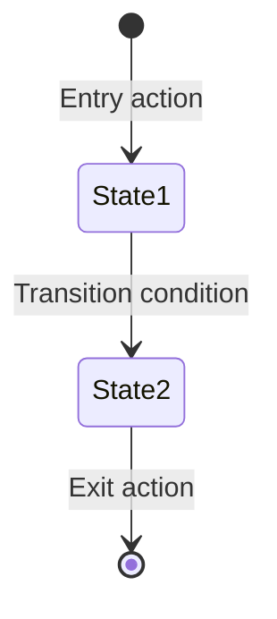

# Feature: [Feature Name]

## Profile

As a [user type],
I want to [action],
so that [benefit].

## Scope

### In Scope

Brief prose description of what this feature delivers, followed by capabilities:

- Capability 1
- Capability 2

### Out of Scope

Items visible as placeholders or explicitly excluded:

- Excluded capability (see SDD-XXX if applicable)

## Assumptions

Assumptions that affect implementation but require confirmation:

| ID | Assumption | Status | Notes |
|----|------------|--------|-------|
| A1 | Assumption text | Unvalidated | Confirm with [stakeholder/team] |

---

## Flow Overview (Optional)

*Use this section for multi-state features. Describe the user journey in prose before diving into details.*

Describe the end-to-end flow in narrative form. Explain the purpose, entry points, branching logic, and exit points. This helps readers understand the "story" before seeing the technical state machine.

---

## State Diagram (Optional)

*Use this section when the feature has >2 states with conditional transitions.*



### State Transition Summary

| From | Action | To | Condition |
|------|--------|-----|-----------|
| State1 | User action | State2 | If condition |

---

## State Descriptions (Optional)

*Use this section to detail each state's purpose and available actions.*

### State 1 — [Name]

Describe the state's purpose, what the user sees, and what actions are available.

| Action | Result |
|--------|--------|
| Action 1 | Outcome |

---

## Visual Reference

Reference mockup images. Include state identifiers for traceability.

| State | Screenshot | Notes |
|-------|------------|-------|
| 1 | `docs/mocks/state-1-name.png` | Description |

*Note: Wireframes may show features that are out of scope. See Out of Scope section for clarification.*

---

## Acceptance Criteria

Discrete, testable statements. Each AC must have at least one TC. Group ACs by functional area with prose introductions.

### [Functional Area 1]

Brief prose description of what this group covers and why it matters.

- **AC-1:** [Statement that can be verified as true/false]
- **AC-2:** [Statement that can be verified as true/false]

### [Functional Area 2]

Brief prose description.

- **AC-3:** [Statement]

---

## Data Contracts (Optional)

*Use this section when defining new or modified API shapes.*

### Incoming Parameters

| Parameter | Type | Required | Description |
|-----------|------|----------|-------------|
| param1 | string | Yes | Description |

### Types

```typescript
/**
 * Note: V2 types are NEW interfaces for this feature.
 * Do not modify existing types.
 */
interface EntityV2 {
  field1: string
  field2?: string  // Optional fields marked
}
```

### Return Data

Description of what gets returned and in what format.

---

## Test Conditions

Given/When/Then format. Reference which AC each TC validates. Vary representation by section type.

### Quick State Reference

| State | Name | Entry Condition |
|-------|------|-----------------|
| 1 | Name | How user gets here |

### [Functional Area 1]

Prose introduction explaining what these tests verify.

**Simple checks (use bullets):**
- **TC-01:** Description *(AC-1)*
- **TC-02:** Description *(AC-2)*

**Sequential flow (use numbered list):**
1. **TC-03:** First step *(AC-3)*
2. **TC-04:** Second step *(AC-3)*

**Conditional logic (use grouped scenarios):**

#### Scenario A
- **TC-05:** Given X, when Y, then Z *(AC-4)*

#### Scenario B
- **TC-06:** Given X, when Y, then Z *(AC-4)*

**Complex comparisons (use tables):**

| TC | Scenario | Expected | AC |
|----|----------|----------|-----|
| TC-07 | Input A | Output A | AC-5 |

---

## Dependencies

What must exist before this feature can be built:

- Existing API endpoint X
- SDD-XXX completed
- V1 route must remain untouched

## Related Features

Other SDD Features that interact with this one:

- SDD-XXX: [Brief description of relationship]
