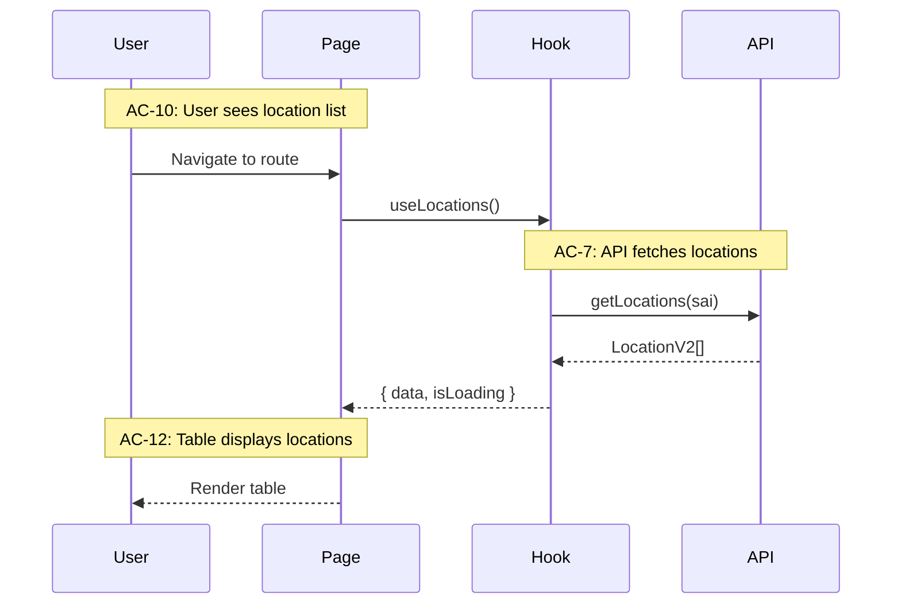

# Spec-Driven Development: Meta Design Document

## Purpose

This document establishes the methodology for building location domain features using **Spec-Driven Development (SDD)**. It provides guidelines for creating features with high traceability from business requirements to tested implementation, enabling confident delivery and clear handoff to downstream teams.

The intended audience includes developers, tech leads, and team members who may not have experience with AI-assisted development workflows. By following this methodology, teams can:

- Trace any line of code back to a business requirement
- Validate designs before implementation begins
- Execute work in focused, reviewable increments
- Hand off work with comprehensive documentation already in place

### When to Use This Methodology

**Use SDD for:**
- New features with multiple components or flows
- Complex integrations with external systems
- Clear requirements that can be broken into verifiable acceptance criteria

**Skip SDD for:**
- Bug fixes under 2 hours
- Single-file changes with obvious implementation
- Exploratory spikes or proof-of-concepts
- Emergency production fixes

---

## Definitions & Terminology

### Business Context

| Term | Full Name | Definition |
|------|-----------|------------|
| **PPM** | Product Platform Modernization | Enterprise initiative to consolidate RQI (Rate, Quote, Issue) capabilities and modernize the product platform infrastructure. |
| **Deluxe** | Deluxe Business Insurance Product | Business Insurance product project launching January 2026. Inherits deployable units from IMCE. |
| **IMCE** | Inland Marine Contractors Equipment | Business Insurance product nearing first release. Provides foundational DUs inherited by Deluxe. |
| **GL Property** | General Liability Property | Business Insurance product that started Q4 2025. |
| **DU** | Deployable Unit | A self-contained, independently deployable software component within the PPM architecture. |
| **Location Domain** | — | The full-stack capability for managing physical location data across policies. Previously API-only; now expanded to include UI, XAPI, API, and Postgres. |

### Technical Terms

| Term | Full Name | Definition |
|------|-----------|------------|
| **XAPI** | Experience API | Backend-for-frontend layer that orchestrates calls to domain APIs and transforms data for UI consumption. |
| **Guidewire** | Guidewire Policy Center | Third-party policy administration system. This application integrates via embedded iframe and URL-based communication. |
| **SAI** | Standard Account Identifier | Account number used to filter locations by account. Passed as query parameter from Guidewire. |
| **locRefId** | Location Reference ID | GUID identifying a specific location record. |
| **locRefVerNbr** | Location Reference Version Number | Version number for soft-update tracking. When a location is edited, a new version is created rather than updating in place. |
| **MSW** | Mock Service Worker | Browser-based API mocking library used for local development and testing. |
| **TDS** | Travelers Design System | Internal component library providing consistent UI components. |
| **Mermaid** | — | Text-based diagramming language that renders in GitHub/GitLab markdown. Used for sequence diagrams and flowcharts in tech designs. |

### Methodology Terms

| Term | Definition |
|------|------------|
| **SDD** | **Spec-Driven Development**. The methodology described in this document. |
| **SDD Feature** | A self-contained capability documented with feature spec, tech design, and phase prompts. Distinct from Jira epics/features/stories. |
| **Feature Spec** | Document defining WHAT is being built: user story, AC, TC, wireframes. Business-readable. |
| **Tech Design** | Document defining HOW it will be built: architecture, interfaces, data flow. Technically-readable. |
| **Phase** | A discrete slice of work (1-4 hours) that delivers incremental, working functionality. |
| **Phase Prompt** | Self-contained instructions for executing a phase. No external context required. |
| **Skeleton Phase** | Creates structural scaffolding: types, stub functions, folder structure. Enables design review before logic. |
| **TDD Red** | Tests written asserting real behavior; stubs throw `NotImplementedError`. Tests ERROR by design. See [TDD Red Phase](#tdd-red-phase-writing-tests-that-matter) for critical guidance. |
| **TDD Green** | Real implementation replaces stubs. Tests PASS. |
| **AC** | **Acceptance Criteria**. Discrete, testable statements defining "done". |
| **TC** | **Test Condition**. Given/When/Then statement expressing how an AC is verified. |
| **NotImplementedError** | Custom error class thrown by stubs. Define in project's error utilities (e.g., `src/errors.ts`). |

---

## Project Context

### Current Status

This repository (`travis-location-standalone`) contains an embeddable React micro-frontend for Travelers Insurance location management. It integrates with Guidewire Policy Center via iframe embedding and URL-based parameter passing.

**Existing capability (v1):**
- Route: `/location`
- Supports selecting and editing locations
- Receives query parameters from Guidewire, returns location data via redirect

### 2026 Roadmap: Location Domain Expansion

The Location team is taking ownership of the full stack:

| Layer | Technology | Status |
|-------|------------|--------|
| UI | React (this repo) | Expanding |
| XAPI | Node.js/Express | Existing |
| API | Java/Spring | Existing |
| Database | PostgreSQL | Existing |

This supports PPM goals and enables Deluxe (January 2026).

### Current Work: Add Location Flow

| Route | Purpose |
|-------|---------|
| `/locations/add` | Unified flow for adding locations to a policy — either by selecting existing account locations or creating new ones |

This is a single route serving both paths (select existing OR create new) within one user journey. Guidewire has one button ("Add Location") that navigates to this route.

**Constraint:** Existing `/location` (v1) must remain untouched.

### Assumptions to Validate

- [ ] Account locations are filtered server-side by `sai` parameter

---

## The Artifact Flow

```
FEATURE SPEC
│  "What does the user need?"
│  Contains: User Story, Acceptance Criteria (AC), Test Conditions (TC)
│
│  Transition: Ready when every AC has at least one TC
▼
TECH DESIGN
│  "How will we build it?"
│  Contains: Data flow, interfaces, TC-to-test mapping
│
│  Transition: Ready when all TCs mapped to test boundaries
▼
PHASE PROMPTS
│  "Execute this slice"
│  Sequence: Skeleton → TDD Red → TDD Green
│
│  Each phase produces working, reviewable code
▼
IMPLEMENTATION
   When tests pass → requirements verified
```

### The Confidence Chain

1. **AC** — Define testable requirements
2. **TC** — Express AC in Given/When/Then format
3. **Tech Design** — Map TCs to test boundaries
4. **TDD Red** — Tests ERROR (stubs throw)
5. **TDD Green** — Tests PASS (real implementation)
6. **Tests pass = requirements verified**

### What Can Go Wrong

| Failure Mode | Prevention |
|--------------|------------|
| AC too vague | Require TC for every AC before tech design |
| TC doesn't match AC | Review TC wording against AC |
| Test doesn't match TC | Include TC reference in test name |
| Mock is unrealistic | Use actual API response structures |

---

## Document Structure

### Folder Layout

```
docs/pre-26A-planning/
├── meta-spec-design.md              # This document
├── templates/                        # Reusable templates
│   ├── sdd-readme.template.md
│   ├── feature-spec.template.md
│   ├── tech-design.template.md
│   └── phase-prompt.template.md
└── sdd-features/
    └── 001-add-location-flow/
        ├── README.md
        ├── 01-add-location-flow.feature.md
        ├── 02-add-location-flow.tech-design.md
        └── phases/
            ├── 01-skeleton.prompt.md
            ├── 02-tdd-red.prompt.md
            └── ...
```

### Templates

Copy and customize from `templates/`:

| Template | Purpose |
|----------|---------|
| [sdd-readme.template.md](./templates/sdd-readme.template.md) | Status tracking for an SDD Feature |
| [feature-spec.template.md](./templates/feature-spec.template.md) | Feature specification (AC, TC, scope) |
| [tech-design.template.md](./templates/tech-design.template.md) | Technical design (architecture, mapping) |
| [phase-prompt.template.md](./templates/phase-prompt.template.md) | Phase execution instructions |

### Key Principles

**Feature Spec:** Every AC must have at least one TC. If you can't write a TC, the AC is too vague.

**Tech Design:** Progressively narrow from high altitude (system view) to low altitude (specific interfaces). Map every TC to a test file and entry point.

**Phase Prompts:** Self-contained. A developer should execute without prior context. Size to 1-4 hours.

---

## Documentation Style: Varying Representation

Long documents with uniform structure are hard to parse. A flat list of 50 items in identical format causes readers (human and AI) to glaze over. Effective documentation **varies representation** across sections to layer attention coherently.

### The Problem with Uniform Structure

```markdown
# Bad: 88 test conditions in identical table format
| TC | AC | Given | When | Then |
| TC-01 | AC-1 | ... | ... | ... |
| TC-02 | AC-2 | ... | ... | ... |
... (86 more identical rows)
```

This is technically complete but cognitively exhausting. Each row looks like the last. Important distinctions get lost.

### The Solution: Mix Representations

Different content benefits from different formats:

| Content Type | Good Representations |
|--------------|---------------------|
| Simple checks (3-5 items) | Bulleted list, inline prose |
| Sequential flows | Numbered steps, flowchart |
| Conditional logic | Decision tree, branching diagram |
| Repetitive patterns | Prose with inline references |
| Complex relationships | Tables, Mermaid diagrams |
| State transitions | State diagrams, transition tables |

### Applying to Test Conditions

Instead of 88 identical table rows, vary by section:

**Loading State (4 simple tests)** — Use a compact bulleted list:
```markdown
- **TC-06:** Loading indicator displays message *(AC-6)*
- **TC-07:** API with locations → transitions to 2a *(AC-7)*
- **TC-08:** API with 0 locations → transitions to 2b *(AC-8)*
- **TC-09:** API error → displays error message *(AC-9)*
```

**Validation (repetitive pattern)** — Use prose with inline references:
```markdown
Required field validation applies uniformly across Address (TC-64),
City (TC-65), State (TC-66), and Postal Code (TC-67). Each displays
an inline error when cleared, and the Next button disables (TC-68)
until all required fields have values (TC-69).
```

**Conditional Navigation (branching logic)** — Use a decision tree or grouped scenarios:
```markdown
#### From Location List (2a)
User came from a list, so locations exist. "Use Existing" is available.

1. **TC-44:** "Use Existing" link is enabled
2. **TC-45:** Clicking "Use Existing" → navigates to 2a
3. **TC-46:** Clicking "Cancel" → navigates to 2a

#### From Empty State (2b)
User came from empty state, so no list exists. "Use Existing" is unavailable.

1. **TC-47:** "Use Existing" link is greyed/disabled
2. **TC-48:** Clicking "Cancel" → redirects to Guidewire
```

**Return Data Format (complex structure)** — Keep a table, but make it focused:
```markdown
| TC | Scenario | Expected Data Format |
|----|----------|---------------------|
| TC-80 | 1 location selected | Array with 1 object |
| TC-81 | 2 locations selected | Array with 2 objects |
| TC-82 | Any location | Object has `locRefId`, `locRefVerNbr`, address fields |
```

### General Guidelines

1. **Start each section with prose** — Explain what this group tests and why it matters
2. **Match format to content** — Tables for comparisons, lists for sequences, prose for patterns
3. **Use sub-headings** — Break large sections into logical chunks
4. **Include context refreshers** — Quick reference tables prevent scrolling
5. **Vary visual density** — Alternate between dense tables and spacious prose
6. **Group related items** — Don't intermix unrelated TCs just because they're sequential

### Benefits

| Audience | Value |
|----------|-------|
| Human readers | Easier to scan, find, and understand |
| AI agents | Clearer semantic structure, better comprehension |
| Reviewers | Can quickly assess completeness by section |
| Maintainers | Can locate and update specific areas |

---

## Tech Design: From Functional to Technical

The tech design document bridges the gap between "what" (feature spec) and "how" (implementation). It uses **progressive altitude** to move from high-level system views down to specific interfaces, while **weaving functional requirements** into technical decisions at each level.

### The Altitude Model

Think of the tech design as descending from 30,000 feet to ground level:

```
HIGH ALTITUDE (30,000 ft)
│  System view: External systems, data flow boundaries
│  Questions: What systems interact? What's the contract?
│
MEDIUM ALTITUDE (10,000 ft)
│  Module view: Components, hooks, APIs, responsibilities
│  Questions: What modules exist? How do they interact?
│
│  Flow-by-flow view: Sequence diagrams per capability
│  Questions: What happens when user does X?
│
LOW ALTITUDE (Ground level)
   Interface view: Types, method signatures, props
   Questions: What exactly does this function accept/return?
```

### Weaving Functional to Technical

At each altitude level, connect back to Acceptance Criteria and Test Conditions:

| Altitude | Functional Connection | Technical Output |
|----------|----------------------|------------------|
| High | Which ACs involve external systems? | System context diagram, external contracts |
| Medium (Modules) | Which ACs does each module serve? | Module responsibility matrix |
| Medium (Flows) | Group ACs into user flows | Sequence diagrams with AC references |
| Low | Which TCs test this interface? | Type definitions with TC annotations |

**Example of weaving in a sequence diagram:**



### Diagrams Drive Skeletons

Each diagram in the tech design implies skeleton requirements:

**Sequence diagram participants** → Files/modules to create
**Method calls in diagram** → Function stubs to implement
**Data passed between participants** → Types to define

```
Sequence Diagram                    Skeleton Deliverable
─────────────────                   ────────────────────
Page participant          →        src/pages/feature/Feature.tsx
Hook participant          →        src/hooks/useFeature.ts
API participant           →        src/api/featureApi.ts
Page->>Hook: useFeature() →        export const useFeature = () => { throw... }
Hook->>API: getData()     →        export const getData = async () => { throw... }
```

### Flow-by-Flow Design

For features with multiple distinct flows (e.g., "select existing" vs "create new"), dedicate a subsection to each flow:

```markdown
### Flow 1: Select Existing Location

**Covers:** AC-10 through AC-26

[Prose: When this flow executes, what user problem it solves]

[Sequence diagram showing the flow]

**Skeleton Requirements:** [Table of stubs needed]

**TC Mapping:** [Table linking TCs to entry points]

---

### Flow 2: Create New Location

**Covers:** AC-33 through AC-65

[Repeat structure]
```

This keeps each flow self-contained while maintaining traceability to the feature spec.

### From Tech Design to Phase Prompts

The tech design's structure directly generates phase prompts:

| Tech Design Section | Generates |
|---------------------|-----------|
| Low Altitude: Types | Skeleton phase: type definitions |
| Module Architecture | Skeleton phase: file structure |
| Skeleton Requirements (per flow) | Skeleton phase: stub signatures |
| TC Mapping (per flow) | TDD Red phase: test cases |
| Interface Definitions | TDD Green phase: implementation contracts |

A well-written tech design makes phase prompts almost mechanical to produce — the hard thinking is done in the design.

---

## The Skeleton Phase

Before TDD Red, create structural scaffolding:

1. **Types and Interfaces** — All new data structures
2. **Stub Functions** — Throw `NotImplementedError`
3. **Folder Structure** — All directories and files
4. **Route Registration** — Wired to stubs (returns 501)

### Why Skeleton First?

| Benefit | Value |
|---------|-------|
| Design Review | Catch abstraction problems before writing logic |
| No TypeScript Errors | Everything compiles; tests can import |
| Parallel Work | Multiple devs can work once interfaces defined |
| UML Validation | Compare skeleton against tech design diagrams |

### Review Gate

After Skeleton, tech lead reviews:
- [ ] Structure matches tech design
- [ ] Types match interface definitions
- [ ] Abstractions are appropriate
- [ ] Naming is consistent

Proceed to TDD Red only after approval.

---

## TDD Red Phase: Writing Tests That Matter

The TDD Red phase is where you write tests that **assert real expected behavior**. This is the critical link in the confidence chain — if tests don't assert what the feature should actually do, the entire methodology breaks down.

> **For React UI features:** See [UI TDD Test Approach](sdd-features/ui-tdd-test-approach.md) for specific patterns on layered testing, mock boundaries, and fixtures.

### The Purpose of TDD Red

TDD Red creates tests that:
1. **Document expected behavior** — Each test is a specification of what should happen
2. **Fail meaningfully** — When run against stubs, they ERROR because the stub throws before assertions execute
3. **Verify requirements** — When TDD Green passes, you have evidence that ACs are met

### What Tests Should Assert: Real Behavior

Tests must assert the **actual expected outcomes** from Test Conditions:

```typescript
// ✅ CORRECT: Asserts real expected behavior
it('TC-12: displays location address in table row', () => {
  render(<LocationList locations={mockLocations} />);

  expect(screen.getByText('125 York Street')).toBeInTheDocument();
  expect(screen.getByText('Hartford')).toBeInTheDocument();
  expect(screen.getByText('CT')).toBeInTheDocument();
});

// ✅ CORRECT: Asserts real hook behavior
it('TC-20: toggleSelection adds location to selected set', () => {
  const { result } = renderHook(() => useSelectableLocations(mockLocations));

  act(() => result.current.toggleSelection('loc-123'));

  expect(result.current.selectedIds).toContain('loc-123');
});
```

### Why Tests ERROR (Not FAIL) in TDD Red

When skeleton stubs throw `NotImplementedError`, the test execution crashes before reaching assertions:

```
Test Execution Flow (TDD Red):
1. Test calls component/hook
2. Component/hook calls stub
3. Stub throws NotImplementedError  ← Execution stops here
4. Assertion never runs
5. Jest reports: ERROR (not FAIL)
```

This is **correct and expected**. The test is properly written — it just can't complete because implementation doesn't exist yet.

### The Anti-Pattern: Testing That NotImplementedError Throws

**This is wrong and defeats the entire purpose of TDD:**

```typescript
// ❌ WRONG: Asserts the error, not the behavior
it('TC-12: displays location address in table row', () => {
  expect(() => render(<LocationList locations={mockLocations} />))
    .toThrow(NotImplementedError);
});

// ❌ WRONG: Tests pass but verify nothing useful
it('TC-20: toggleSelection is not implemented', () => {
  const { result } = renderHook(() => useSelectableLocations(mockLocations));

  expect(() => result.current.toggleSelection('loc-123'))
    .toThrow('Not implemented');
});
```

**Why this is dangerous:**
- Tests "pass" in TDD Red (they find the expected error)
- When TDD Green is implemented, these tests **still pass** even if implementation is wrong
- You've verified nothing about actual behavior
- Manual testing becomes the only safety net
- Bugs ship because "all tests pass"

### TDD Red Checklist

Before completing TDD Red phase, verify:

- [ ] **Every test asserts real outcomes** — Not error throwing
- [ ] **Tests reference TC numbers** — `it('TC-XX: ...')`
- [ ] **Tests use realistic mock data** — Match actual API shapes
- [ ] **Tests cover the happy path** — What should happen when things work
- [ ] **Tests cover error scenarios** — What should happen when API fails
- [ ] **Running tests produces ERRORs** — Not PASSes (that would indicate anti-pattern)
- [ ] **Existing tests still PASS** — New tests don't break old functionality

### What "TDD Red Complete" Looks Like

```
npm test

PASS  src/existing/Feature.test.tsx
FAIL  src/pages/add-location/AddLocation.test.tsx    ← New tests
  ● TC-06: displays loading indicator
    NotImplementedError: AddLocation not implemented
  ● TC-12: displays location address in table row
    NotImplementedError: LocationTable not implemented
  ● TC-20: toggleSelection adds location to selected set
    NotImplementedError: useSelectableLocations not implemented

Test Suites: 1 failed, 1 passed, 2 total
Tests:       15 failed, 23 passed, 38 total
```

**Key indicators:**
- New tests show as FAIL/ERROR with `NotImplementedError`
- Existing tests show as PASS
- Failure messages reference the stub, not assertion mismatches

---

## TDD Service Tests

Tests at **architectural boundaries**, not individual methods:

- REST endpoint handlers
- Service public methods
- Module exports

### Why Boundary Tests?

| Aspect | Unit Tests | Boundary Tests |
|--------|-----------|----------------|
| Scope | One method | Entry to exit |
| Refactor Resilience | Break easily | Stable if behavior unchanged |
| Confidence | Pieces work | System works |

**Note:** Unit tests still valuable for complex algorithms. This methodology emphasizes boundary tests for TDD because they link directly to Test Conditions.

### Good Tests

1. Call real entry points
2. Use realistic mocks (actual API structures)
3. Assert on outcomes, not implementation
4. Reference TC in test name: `"TC-05: should return updated location"`

### Project Testing Tools

| Tool | Purpose |
|------|---------|
| Jest | Test runner |
| MSW | API mocking |
| React Testing Library | Component testing |

---

## Handling Changes

Requirements change. When they do:

1. **Update the Feature Spec** — Modify AC/TC as needed
2. **Update the Tech Design** — Revise mapping if boundaries change
3. **Update affected Phase Prompts** — Or create new phases
4. **Note the change** in the SDD README

Don't let specs become stale. A spec that doesn't match implementation is worse than no spec.

---

## Phase Prompt Guidance

Phase prompts are instructions for executing a single slice of work. They must be **self-contained** — executable by a developer or AI agent with no prior context.

### General Principles

| Principle | Description |
|-----------|-------------|
| **Self-contained** | Include all context needed; assume no prior conversation |
| **Specific paths** | Use exact file paths, not "the types file" |
| **Action-oriented** | Say "implement" not "consider implementing" |
| **Sized correctly** | 1-4 hours of focused work; split if larger |
| **Clear exit criteria** | Explicit about test expectations (ERROR vs PASS) |

### Prompt Structure

Each phase prompt should include:

1. **Objective** — One sentence goal
2. **Current State** — What exists before this phase
3. **Constraints** — Hard rules and boundaries
4. **Reference Files** — Exact paths to read before implementing
5. **Deliverables** — Exact files to create/modify
6. **Verification** — Commands and expected outcomes
7. **Done When** — Checklist with test result expectations

### Claude Opus 4.5 Prompting Guidelines

Opus 4.5 has specific characteristics that affect how prompts should be written:

#### Precise Instruction Following

Opus 4.5 does exactly what you say — no more, no less. Be explicit about desired behavior.

```markdown
# Less effective
Review the code and consider improvements

# More effective
Read src/components/LocationTable.tsx, then implement the filter function
```

#### Calm, Direct Language

Opus 4.5 responds well to normal instructions. Aggressive language like "CRITICAL" or "YOU MUST" can cause overtriggering. Use calm, direct statements.

```markdown
# Less effective
CRITICAL: You MUST NOT modify the v1 route under ANY circumstances!!!

# More effective
Do not modify the /location route or any files in src/pages/home-page/
```

#### Anti-Overengineering

Opus 4.5 tends to create extra files, add unnecessary abstractions, and build in flexibility that wasn't requested. Include explicit constraints:

```markdown
## Constraints
- Only implement what's specified in Deliverables
- Do not add features, abstractions, or "improvements" beyond requirements
- Do not create helper utilities for one-time operations
- Do not add error handling for scenarios that can't happen
```

#### Anti-Hardcoding

Opus 4.5 can focus too heavily on making tests pass, leading to test-specific solutions rather than general implementations:

```markdown
## Constraints
- Implement actual logic that works for all valid inputs
- Do not hardcode values that only work for test cases
- Tests verify correctness; they don't define the solution
```

#### Explicit Code Exploration

Opus 4.5 can be conservative about exploring code. Explicitly require reading before implementing:

```markdown
## Reference Files

Read these files BEFORE implementing. Do not propose changes to code you haven't inspected:

| File | Why |
|------|-----|
| `src/types/LocationData.ts` | Existing types to extend |
| `src/pages/home-page/home.page.tsx` | Pattern to follow |
```

#### Provide Motivation

Explaining WHY helps Opus 4.5 generalize correctly:

```markdown
## Constraints
- State dropdown uses US states only (international addresses are out of scope
  per AC-22, so Canadian provinces are not needed)
```

#### Summary Requests

Opus 4.5 is concise by default. If you want progress summaries, ask explicitly:

```markdown
## Verification
After completing each deliverable, briefly summarize what was created and
any decisions made.
```

### GPT-5 Prompting Guidelines

GPT-5 is highly capable at agentic tasks and coding. It follows instructions with surgical precision, which means contradictory or vague instructions are particularly damaging — the model wastes reasoning tokens trying to reconcile conflicts.

#### Instruction Consistency

GPT-5 tries to follow all instructions. Contradictory instructions cause it to struggle rather than pick one. Review prompts carefully for conflicts.

```markdown
# Problematic - contradictory
- Always gather full context before acting
- Limit to 2 tool calls maximum

# Better - clear priority
- Gather context efficiently with a maximum of 3 tool calls
- If more investigation is needed, proceed with best available information
```

#### Controlling Agentic Eagerness

GPT-5 is thorough by default, which can mean excessive tool calls. Control with explicit criteria:

```markdown
## Context Gathering
- Gather enough context to act, then stop
- Avoid over-searching; if top results converge on one area, proceed
- Prefer acting over more searching
- Maximum 3-4 tool calls for initial exploration
```

For more autonomy on longer tasks:

```markdown
## Persistence
- Keep going until the task is completely resolved before ending
- Never stop at uncertainty — deduce the most reasonable approach and continue
- Do not ask to confirm assumptions — document them, act on them, adjust if proven wrong
```

#### Exploration Before Coding

GPT-5 benefits from explicit exploration structure:

```markdown
## Before Implementing

1. Decompose the request into explicit requirements
2. Map the scope: identify files, functions, modules involved
3. Check dependencies: frameworks, APIs, existing patterns
4. Resolve ambiguity proactively based on codebase conventions
5. Define deliverables: exact files to create/modify
6. Formulate execution plan, then follow it
```

#### Code Quality

GPT-5 can produce terse code (single-letter variables) when being efficient. Explicitly request readable code:

```markdown
## Code Standards
- Write code for clarity first
- Use readable, maintainable solutions with clear names
- Add comments only where logic isn't self-evident
- Match existing codebase style and conventions
```

#### Proactive Action

GPT-5 may defer to users unnecessarily. Encourage action:

```markdown
## Approach
- Implement changes rather than only suggesting them
- If proposing next steps that involve code changes, make those changes proactively
- Do not ask whether to proceed with a plan; attempt the plan
```

#### Verification

GPT-5 should verify work before completing:

```markdown
## Verification
- Routinely verify code works as you implement
- Run tests after changes
- Do not mark phase complete until verification passes
```

#### Tool Preambles

GPT-5 can provide progress updates. Request them explicitly:

```markdown
## Progress Updates
- Begin by restating the goal briefly
- Outline your plan before starting
- As you work, narrate each step succinctly
- Finish by summarizing completed work
```

#### Minimal Reasoning Mode

For simpler phases, GPT-5 can use minimal reasoning. In this mode:
- Prompt for brief explanation of thought process
- Agentic persistence reminders are more critical
- Explicit planning prompts help compensate for fewer reasoning tokens

---

## Integration with Jira

SDD Features complement Jira, not replace it.

| Jira | SDD | Relationship |
|------|-----|--------------|
| Epic | SDD Feature | Epic links to SDD folder |
| Story | Phase | Story references phase prompt |

Typical story description:
> Implement Phase 2 per [SDD-001 Phase 02](./phases/02-select-tdd-red.prompt.md)

### PR Reviews

Each phase produces a PR. Include:
- Link to phase prompt
- "Done When" checklist
- Any deviations (and why)

Reviewers verify:
- Code matches deliverables
- Tests match TC mapping
- No scope creep

---

## Summary

SDD creates a self-reinforcing system:

1. **Feature Spec** — Requirements in testable language (AC → TC)
2. **Tech Design** — Map requirements to architecture (TC → tests)
3. **Skeleton** — Reviewable structure before logic
4. **TDD Red** — Tests ERROR
5. **TDD Green** — Tests PASS
6. **Tests pass = requirements verified**

| Audience | Value |
|----------|-------|
| Developers | Clear guidance, less ambiguity |
| Reviewers | Design validation before code |
| Handoff | Documentation already exists |
| Maintenance | Trace code to requirements |

---

## Next Steps

1. Create `sdd-features/001-location-flows/` folder
2. Draft feature spec with AC and TC
3. Draft tech design with architecture and TC mapping
4. Create phase prompts

---

*Document Version: 1.9*
*Created: December 2025*
*Last Updated: December 2025 — Added UI TDD Test Approach reference; updated tech-design template with critical mocking rule*
