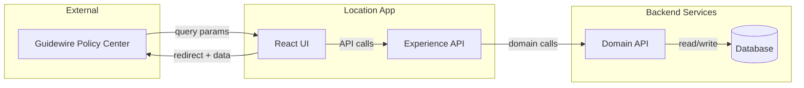
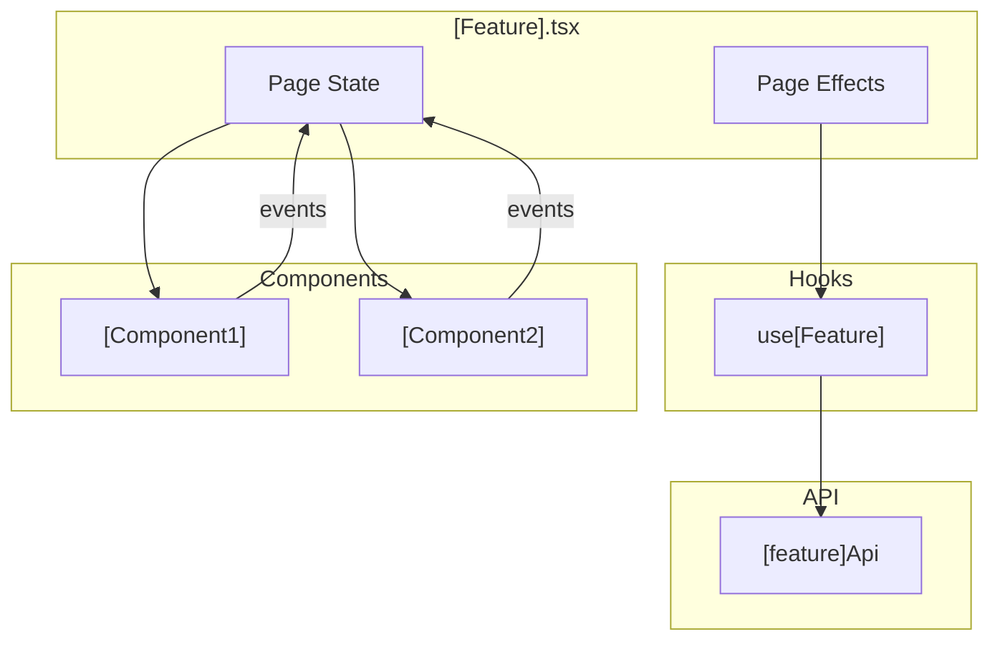
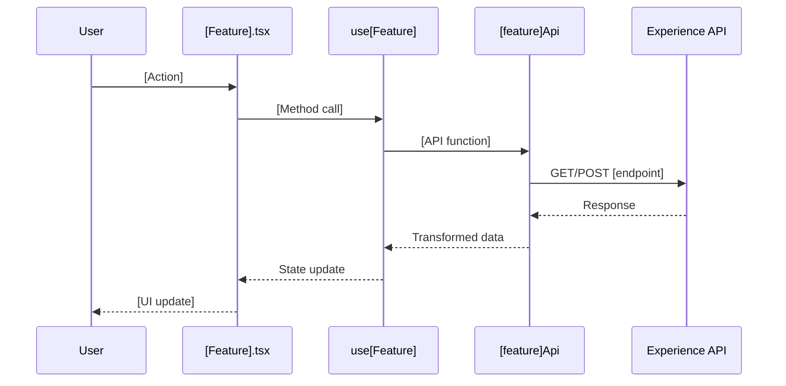

# Technical Design: [Feature Name]

## Purpose

This document translates feature requirements into implementable architecture. It serves three audiences:

| Audience | Value |
|----------|-------|
| Reviewers | Validate design before code is written |
| Developers | Clear blueprint for implementation |
| Phase Prompts | Source of specific file paths, interfaces, and test mappings |

**Prerequisite:** The feature spec must be complete (all ACs have TCs) before starting this document.

---

## Context

Brief background establishing constraints and major design decisions. This section should be prose that helps readers understand the "why" behind architectural choices.

*Example: This feature integrates with Guidewire via iframe embedding. Data flows through query parameters (in) and redirect URLs (out). The existing v1 flow must remain untouched, so all new code lives under `/locations` namespace.*

---

## High Altitude: System View

Start at the highest level. How does this feature fit into the broader system? What external systems does it interact with?

### System Context Diagram



### External Contracts

What comes in, what goes out. This connects to the feature spec's Data Contracts.

**Incoming (from Guidewire):**
| Parameter | Required | Source | Purpose |
|-----------|----------|--------|---------|
| param1 | Yes | Query string | Description |

**Outgoing (to Guidewire):**
| Data | Format | Destination | Purpose |
|------|--------|-------------|---------|
| Location data | Base64 JSON | Redirect URL | Return selected/created locations |

**Error Responses:**

Define what errors look like so tests can mock realistic failure scenarios.

| Source | Status | Shape | UI Handling |
|--------|--------|-------|-------------|
| XAPI | 400 | `{ status: 'ERROR', messages: [{ code: string, message: string }] }` | Show validation message |
| XAPI | 500 | `{ status: 'ERROR', messages: [{ message: string }] }` | Show generic error |
| Network | — | `TypeError: Failed to fetch` | Show connection error |

*Adjust shapes to match actual API contracts. Include representative error scenarios in MSW handlers.*

---

## Medium Altitude: Module Boundaries

Zoom in to the application. What modules exist? How do they interact? This level defines the boundaries that skeleton phase will create.

### Module Architecture

```
src/
├── errors.ts                           # EXISTS or NEW: NotImplementedError
├── types/
│   └── [Feature].ts                    # NEW: Type definitions
├── pages/
│   └── [feature]/
│       ├── [Feature].tsx               # NEW: Main page component
│       └── [feature].module.scss       # NEW: Page styles
├── components/
│   └── [ComponentName]/
│       ├── [ComponentName].tsx         # NEW: Reusable component
│       └── [ComponentName].module.scss # NEW: Component styles
├── hooks/
│   └── use[Feature].ts                 # NEW: Custom hook
└── api/
    └── [feature]Api.ts                 # NEW: API functions
```

### Module Responsibility Matrix

Define what each module does. This drives the skeleton creation.

| Module | Type | Responsibility | Dependencies | Entry Points |
|--------|------|----------------|--------------|--------------|
| `[Feature].tsx` | Page | Orchestrates flow, manages state | hooks, components | Route render |
| `use[Feature].ts` | Hook | Encapsulates business logic | api | Hook call |
| `[ComponentName].tsx` | Component | Renders specific UI section | types | Props |
| `[feature]Api.ts` | API | HTTP calls to XAPI | fetch/axios | Function calls |

### Component Interaction Diagram

Show how modules communicate at runtime.



---

## Medium Altitude: Flow-by-Flow Design

For each major flow or capability, provide a sequence diagram and connect to functional requirements. This section weaves functional (ACs/TCs) with technical (modules/methods).

### Flow 1: [Flow Name]

**Covers:** AC-X through AC-Y

Brief prose description of this flow's purpose and when it executes.



**Skeleton Requirements:**

This flow requires the following to be stubbed in skeleton phase:

| What | Where | Stub Signature |
|------|-------|----------------|
| Page component | `src/pages/[feature]/[Feature].tsx` | `export const [Feature] = () => { throw new NotImplementedError() }` |
| Hook | `src/hooks/use[Feature].ts` | `export const use[Feature] = () => { throw new NotImplementedError() }` |
| API function | `src/api/[feature]Api.ts` | `export const [apiFunction] = async () => { throw new NotImplementedError() }` |

**TC Mapping for this Flow:**

| TC | Tests | Entry Point | Assert |
|----|-------|-------------|--------|
| TC-XX | [Description] | `use[Feature]()` | Returns expected data |
| TC-YY | [Description] | `[Feature].tsx` render | Shows expected UI |

---

### Flow 2: [Flow Name]

**Covers:** AC-X through AC-Y

*Repeat the same structure: prose → sequence diagram → skeleton requirements → TC mapping*

---

## Low Altitude: Interface Definitions

Now at the lowest altitude. Specific types, method signatures, and implementation details. These become copy-paste ready for skeleton phase.

### Types

```typescript
/**
 * [Description of the type's purpose]
 *
 * Note: V2 types are NEW interfaces for this feature.
 * Do not modify existing types in other files.
 */
export interface [TypeName]V2 {
  /** Unique identifier */
  id: string;

  /** [Field description] */
  fieldName: string;

  /** [Optional field description] */
  optionalField?: string;
}
```

### Hook Interface

```typescript
/**
 * [Description of hook's purpose]
 * Covers: TC-XX, TC-YY
 */
export interface Use[Feature]Return {
  /** Current data state */
  data: [TypeName]V2[] | null;

  /** Loading indicator */
  isLoading: boolean;

  /** Error state */
  error: Error | null;

  /** [Action method description] */
  performAction: (param: string) => void;
}

export const use[Feature] = (): Use[Feature]Return => {
  // Implementation
};
```

### API Functions

```typescript
/**
 * [Description]
 * Endpoint: GET /api/[endpoint]
 * Covers: TC-XX
 */
export const fetch[Data] = async (param: string): Promise<[ResponseType]> => {
  // Implementation
};

/**
 * [Description]
 * Endpoint: POST /api/[endpoint]
 * Covers: TC-YY
 */
export const submit[Data] = async (data: [RequestType]): Promise<[ResponseType]> => {
  // Implementation
};
```

### Component Props

```typescript
/**
 * Props for [ComponentName]
 */
export interface [ComponentName]Props {
  /** [Prop description] */
  propName: string;

  /** [Callback description] */
  onAction: (value: string) => void;
}
```

---

## Functional-to-Technical Traceability

Complete mapping from Test Conditions to implementation. This table drives TDD Red phase.

### By Module

Group by test file to show what each module is responsible for testing.

#### `[Feature].test.tsx`

Page-level integration tests. Tests the assembled component with mocked hooks/APIs.

| TC | Test Name | Setup | Action | Assert |
|----|-----------|-------|--------|--------|
| TC-XX | TC-XX: [description] | Render with props | [user action] | [expected outcome] |

#### `use[Feature].test.ts`

Hook unit tests. Tests business logic in isolation.

| TC | Test Name | Setup | Action | Assert |
|----|-----------|-------|--------|--------|
| TC-YY | TC-YY: [description] | Initialize hook | Call method | Returns expected |

#### `[ComponentName].test.tsx`

Component tests. Tests rendering and interaction.

| TC | Test Name | Setup | Action | Assert |
|----|-----------|-------|--------|--------|
| TC-ZZ | TC-ZZ: [description] | Render with props | [interaction] | [expected render] |

---

## Testing Strategy

> **Reference:** See [UI TDD Test Approach](../ui-tdd-test-approach.md) for full methodology, patterns, and rationale.

### Test Pyramid for This Feature

```
         /\
        /  \  Manual (Launcher)
       /----\  - Full flow via launcher.html
      /      \
     /--------\  Page ([Feature].test.tsx)
    /          \  - Entry/exit points, routing, redirects
   /------------\  Component (individual components)
  /              \  - Props → render, user interactions
 /----------------\  Hook + API (logic, contracts)
/                  \  - Pure logic, request/response
```

### The Critical Mocking Rule

**Mock at the API function level, never at the hook level.**

```typescript
// ✅ CORRECT: Mock the API function
jest.mock('@/api/[feature]Api', () => ({
  getData: jest.fn(() => Promise.resolve(mockData)),
}))

// ✅ OK: Mock utility hooks for config injection
jest.mock('@/hooks/useQueryParams', () => ({
  useQueryParams: jest.fn(),
}))

// ❌ WRONG: Never mock data-fetching hooks
jest.mock('@/hooks/use[Feature]')  // Hides integration bugs
```

### What Gets Mocked

| Layer | Mock? | Strategy | Why |
|-------|-------|----------|-----|
| API functions | Yes | `jest.mock('@/api/...')` | Data boundary |
| useQueryParams | Yes | `jest.mock('@/hooks/useQueryParams')` | Config injection |
| Data-fetching hooks | **No** | Let them run | Preserve integration |
| React Query | **No** | Let it run | Preserve cache/state behavior |
| window.location | Yes | Mock `assign()` | Test redirects |

### MSW Handlers (Dev Server Only)

MSW is used for the dev server and launcher.html. Jest tests use `jest.mock()` instead.

```typescript
// src/services/location-client/handlers.ts (for dev server)
http.get('*/api/[endpoint]', () => { /* mock response */ }),
http.post('*/api/[endpoint]', () => { /* mock response */ }),
```

### Manual Verification Checklist

After TDD Green, verify manually:

1. [ ] Start dev server: `npm run dev:start`
2. [ ] Open launcher: `http://localhost:3000/location/launcher.html`
3. [ ] Select "[Feature]" preset
4. [ ] [Specific action to test]
5. [ ] Verify [expected outcome]
6. [ ] Check redirect contains expected data

---

## Skeleton → TDD Red → TDD Green Workplan

This section summarizes what each phase produces, derived from the design above.

### Phase 1: Skeleton

**Creates structural scaffolding. All code compiles but throws `NotImplementedError` when executed.**

| Deliverable | Path | What It Contains |
|-------------|------|------------------|
| Types | `src/types/[Feature].ts` | All interfaces from Low Altitude section |
| Page stub | `src/pages/[feature]/[Feature].tsx` | Component that throws |
| Hook stub | `src/hooks/use[Feature].ts` | Hook that throws |
| API stubs | `src/api/[feature]Api.ts` | Functions that throw |
| Component stubs | `src/components/[Name]/[Name].tsx` | Components that throw |
| Styles | `*.module.scss` | Empty or minimal styles |
| Route | `src/index.tsx` | Route registered |
| MSW handlers | `src/services/.../handlers.ts` | Basic mock responses |

**Exit Criteria:** `npm run typecheck` passes. Navigating to route shows error (stub throws).

### Phase 2: TDD Red

**Creates tests that assert real behavior. Tests ERROR because stubs throw.**

| Test File | # Tests | Covers |
|-----------|---------|--------|
| `[Feature].test.tsx` | X | TC-XX through TC-YY |
| `use[Feature].test.ts` | Y | TC-AA through TC-BB |
| `[ComponentName].test.tsx` | Z | TC-CC through TC-DD |

**Exit Criteria:** `npm test` runs. New tests ERROR (NotImplementedError). Existing tests PASS.

### Phase 3: TDD Green

**Implements real logic. Tests PASS.**

| Module | Implementation Notes |
|--------|---------------------|
| `use[Feature].ts` | [Key logic points] |
| `[Feature].tsx` | [Key UI points] |
| `[feature]Api.ts` | [Key API points] |

**Exit Criteria:** `npm test` all PASS. Manual verification checklist complete.

---

## Open Questions

Unresolved questions that may affect implementation. Block phases if critical.

| # | Question | Owner | Blocking? | Resolution |
|---|----------|-------|-----------|------------|
| Q1 | [Question] | [Name] | Phase N | Pending |

---

## Deferred Items

Items identified during design that are out of scope but should be documented.

| Item | Related AC | Reason | Future Work |
|------|-----------|--------|-------------|
| [Item] | AC-XX | [Why deferred] | [Where to track] |

---

## Related Documentation

- Feature Spec: `01-[feature].feature.md`
- Phase Prompts: `phases/`
- Methodology: `meta-spec-design.md`
