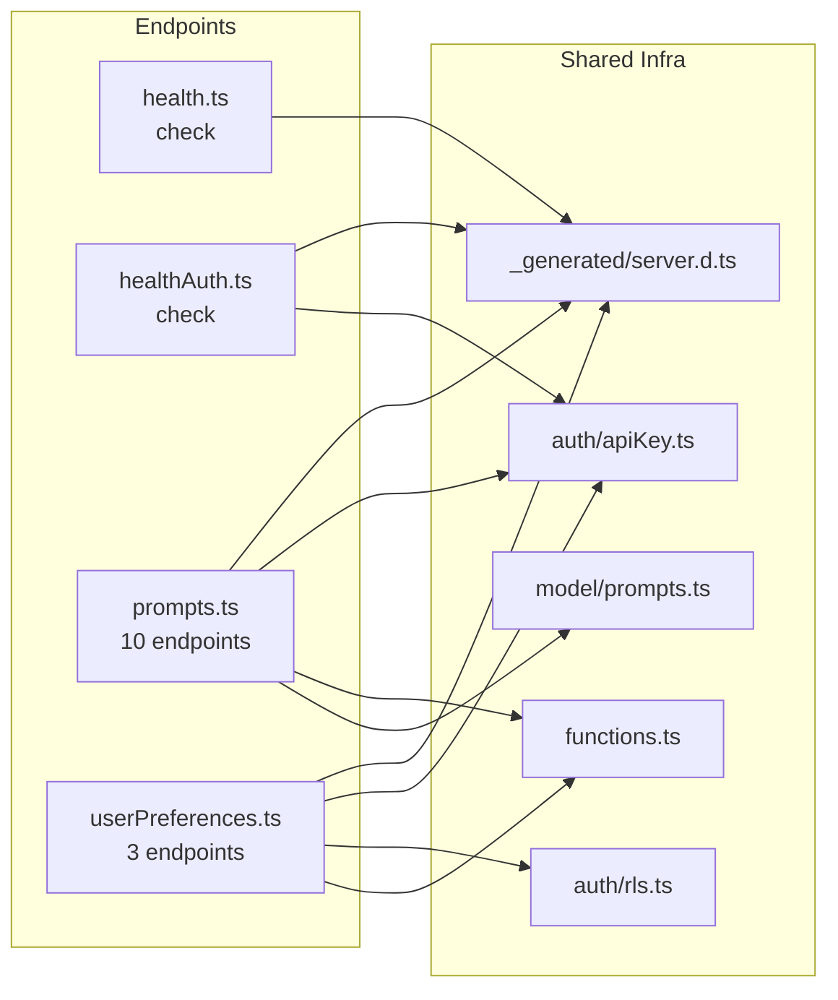
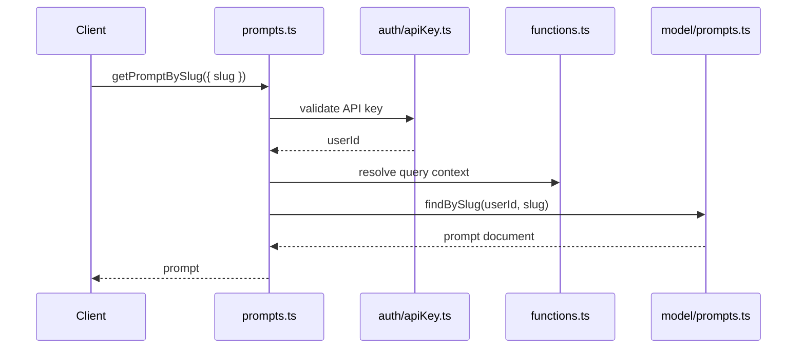

# Convex API Endpoints

## Overview

This module defines the public Convex query and mutation endpoints that clients invoke for prompt management, health checks, and user preference storage. Each endpoint file delegates authentication to shared auth helpers and business logic to model/function layers, keeping the API surface thin.

## Responsibilities

- Expose CRUD and search endpoints for prompts (insert, get, list, update, delete, search, rank, tag listing)
- Track prompt usage via trackPromptUse mutation
- Provide unauthenticated and authenticated health-check queries
- Manage per-user theme and general preferences with row-level security

## Structure Diagram

## Entity Table

| Name | Kind | Role | Public Entrypoints | Depends On | Used By |
| --- | --- | --- | --- | --- | --- |
| check (health) | query | Unauthenticated health-check endpoint | convex/health.ts:check | _generated/server.d.ts | none |
| check (healthAuth) | query | Authenticated health-check endpoint verifying API key | convex/healthAuth.ts:check | _generated/server.d.ts, auth/apiKey.ts | none |
| insertPrompts | mutation | Bulk-insert prompts | convex/prompts.ts:insertPrompts | auth/apiKey.ts, functions.ts, model/prompts.ts | none |
| getPromptBySlug | query | Retrieve a single prompt by its slug | convex/prompts.ts:getPromptBySlug | auth/apiKey.ts, functions.ts, model/prompts.ts | none |
| listPrompts | query | List all prompts for the authenticated user | convex/prompts.ts:listPrompts | auth/apiKey.ts, functions.ts, model/prompts.ts | none |
| updatePromptBySlug | mutation | Update a prompt identified by slug | convex/prompts.ts:updatePromptBySlug | auth/apiKey.ts, functions.ts, model/prompts.ts | none |
| deletePromptBySlug | mutation | Delete a prompt by slug | convex/prompts.ts:deletePromptBySlug | auth/apiKey.ts, functions.ts, model/prompts.ts | none |
| listPromptsRanked | query | List prompts ordered by usage/ranking | convex/prompts.ts:listPromptsRanked | auth/apiKey.ts, functions.ts, model/prompts.ts | none |
| searchPrompts | query | Full-text search over prompts | convex/prompts.ts:searchPrompts | auth/apiKey.ts, functions.ts, model/prompts.ts | none |
| updatePromptFlags | mutation | Toggle boolean flags (e.g., pinned, archived) on a prompt | convex/prompts.ts:updatePromptFlags | auth/apiKey.ts, functions.ts, model/prompts.ts | none |
| trackPromptUse | mutation | Record a usage event for a prompt | convex/prompts.ts:trackPromptUse | auth/apiKey.ts, functions.ts, model/prompts.ts | none |
| listTags | query | Return distinct tags across prompts | convex/prompts.ts:listTags | auth/apiKey.ts, functions.ts, model/prompts.ts | none |
| getThemePreference | query | Fetch the current user's theme preference | convex/userPreferences.ts:getThemePreference | auth/apiKey.ts, auth/rls.ts, functions.ts | none |
| updateThemePreference | mutation | Set or update the user's theme preference | convex/userPreferences.ts:updateThemePreference | auth/apiKey.ts, auth/rls.ts, functions.ts | none |
| getAllPreferences | query | Fetch all preference keys for the current user | convex/userPreferences.ts:getAllPreferences | auth/apiKey.ts, auth/rls.ts, functions.ts | none |

## Key Flow

## Flow Notes

| Step | Actor/Component | Action | Output / Side Effect |
| --- | --- | --- | --- |
| 1 | Client | Calls a Convex endpoint (e.g., getPromptBySlug) with an API key and arguments | Request reaches the endpoint handler |
| 2 | auth/apiKey.ts | Validates the API key from the request context and resolves the owning userId | Authenticated userId or thrown auth error |
| 3 | functions.ts | Provides typed query/mutation wrappers used by the endpoint | Convex execution context ready |
| 4 | model/prompts.ts | Executes the database operation scoped to the authenticated user | Prompt document(s) returned to the endpoint |
| 5 | prompts.ts | Returns the result to the caller | JSON response delivered to the client |

## Source Coverage

- convex/health.ts
- convex/healthAuth.ts
- convex/prompts.ts
- convex/userPreferences.ts

## Cross-Module Context

- convex/health.ts -> convex/_generated/server.d.ts (import)
- convex/healthAuth.ts -> convex/_generated/server.d.ts (import)
- convex/healthAuth.ts -> convex/auth/apiKey.ts (import)
- convex/prompts.ts -> convex/_generated/server.d.ts (import)
- convex/prompts.ts -> convex/auth/apiKey.ts (import)
- convex/prompts.ts -> convex/functions.ts (import)
- convex/prompts.ts -> convex/model/prompts.ts (import)
- convex/userPreferences.ts -> convex/_generated/server.d.ts (import)
- convex/userPreferences.ts -> convex/auth/apiKey.ts (import)
- convex/userPreferences.ts -> convex/auth/rls.ts (import)
- convex/userPreferences.ts -> convex/functions.ts (import)
