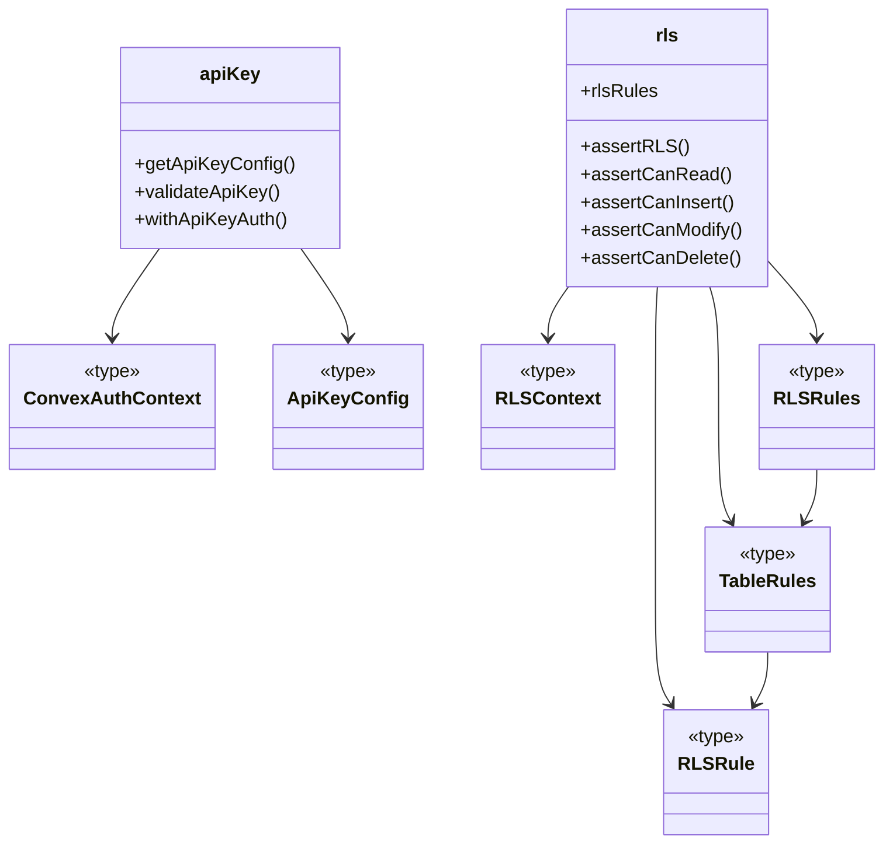
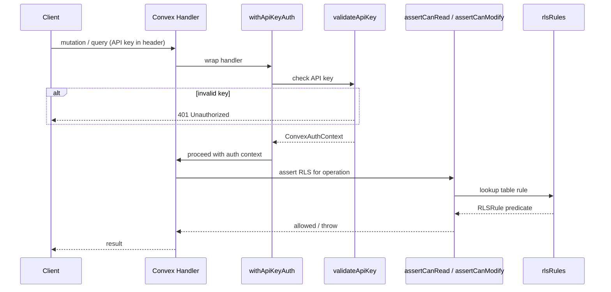

# Convex Auth & RLS

## Overview

Server-side authentication and authorization layer for LiminalDB's Convex backend. The module provides API key validation (`apiKey.ts`), row-level security policy enforcement (`rls.ts`), and shared type definitions (`types.ts`). Every mutation and query handler that touches user data flows through this module to verify the caller's identity and ensure they can only access rows they own.

## Responsibilities

- Validate incoming API keys against stored configuration via `validateApiKey`
- Wrap Convex function handlers with authentication guard via `withApiKeyAuth`
- Define per-table row-level security rules (read, insert, modify, delete) via `rlsRules`
- Enforce RLS policies at the assertion layer (`assertCanRead`, `assertCanInsert`, `assertCanModify`, `assertCanDelete`)
- Export shared auth context types (`ConvexAuthContext`, `ApiKeyConfig`, `RLSContext`) consumed across the backend

## Structure Diagram

## Entity Table

| Name | Kind | Role | Public Entrypoints | Depends On | Used By |
| --- | --- | --- | --- | --- | --- |
| getApiKeyConfig | function | Retrieves API key configuration from environment / Convex context | convex/auth/apiKey.ts:getApiKeyConfig | ConvexAuthContext, ApiKeyConfig | convex/prompts.ts, convex/healthAuth.ts, convex/userPreferences.ts |
| validateApiKey | function | Validates a supplied API key against stored configuration | convex/auth/apiKey.ts:validateApiKey | ConvexAuthContext, ApiKeyConfig | convex/prompts.ts, convex/healthAuth.ts, convex/userPreferences.ts |
| withApiKeyAuth | function | Higher-order wrapper that guards a Convex handler with API key authentication | convex/auth/apiKey.ts:withApiKeyAuth | validateApiKey, ConvexAuthContext | convex/prompts.ts, convex/healthAuth.ts, convex/userPreferences.ts |
| rlsRules | variable | Central registry of per-table row-level security rules | convex/auth/rls.ts:rlsRules | RLSRules, TableRules, RLSRule | convex/model/prompts.ts, convex/userPreferences.ts |
| assertRLS | function | Generic RLS assertion — checks a given operation against the rule set | convex/auth/rls.ts:assertRLS | RLSContext, rlsRules | convex/model/prompts.ts, convex/userPreferences.ts |
| assertCanRead | function | Asserts the caller may read a row | convex/auth/rls.ts:assertCanRead | assertRLS | convex/model/prompts.ts, convex/userPreferences.ts |
| assertCanInsert | function | Asserts the caller may insert a row | convex/auth/rls.ts:assertCanInsert | assertRLS | convex/model/prompts.ts, convex/userPreferences.ts |
| assertCanModify | function | Asserts the caller may modify an existing row | convex/auth/rls.ts:assertCanModify | assertRLS | convex/model/prompts.ts, convex/userPreferences.ts |
| assertCanDelete | function | Asserts the caller may delete a row | convex/auth/rls.ts:assertCanDelete | assertRLS | convex/model/prompts.ts, convex/userPreferences.ts |
| ConvexAuthContext | type | Shared type representing the authenticated Convex request context | convex/auth/types.ts:ConvexAuthContext | none | apiKey, rls |
| ApiKeyConfig | type | Shape of the API key configuration object | convex/auth/types.ts:ApiKeyConfig | none | apiKey |
| RLSContext | type | Context passed into RLS rule evaluation (caller identity + table info) | convex/auth/types.ts:RLSContext | none | rls |
| RLSRule | type | Type for a single row-level security predicate function | convex/auth/rls.ts:RLSRule | RLSContext | TableRules |
| TableRules | type | Set of RLS rules (read/insert/modify/delete) for one table | convex/auth/rls.ts:TableRules | RLSRule | RLSRules |
| RLSRules | type | Map of table names to their TableRules | convex/auth/rls.ts:RLSRules | TableRules | rlsRules |

## Key Flow

## Flow Notes

| Step | Actor/Component | Action | Output / Side Effect |
| --- | --- | --- | --- |
| 1 | Client | Sends a query or mutation request with an API key | Raw request reaches Convex handler |
| 2 | withApiKeyAuth | Intercepts the handler and delegates to validateApiKey | ConvexAuthContext on success; 401 on failure |
| 3 | Convex Handler | Calls the appropriate RLS assertion (e.g. assertCanRead) before data access | RLS check passes or throws an authorization error |
| 4 | rlsRules | Provides the predicate function for the requested table and operation | Boolean allow/deny evaluated against the row and caller context |
| 5 | Convex Handler | Executes the business logic and returns data to the client | Query result or mutation acknowledgement |

## Source Coverage

- convex/auth.config.ts
- convex/auth/apiKey.ts
- convex/auth/rls.ts
- convex/auth/types.ts

## Cross-Module Context

- convex/auth/apiKey.ts -> convex/_generated/server.d.ts (import)
- convex/healthAuth.ts -> convex/auth/apiKey.ts (import)
- convex/model/prompts.ts -> convex/auth/rls.ts (import)
- convex/prompts.ts -> convex/auth/apiKey.ts (import)
- convex/userPreferences.ts -> convex/auth/apiKey.ts (import)
- convex/userPreferences.ts -> convex/auth/rls.ts (import)
- tests/convex/auth/apiKey.test.ts -> convex/auth/apiKey.ts (usage)
- tests/convex/auth/rls.test.ts -> convex/auth/rls.ts (usage)
- tests/convex/healthAuth.test.ts -> convex/auth/apiKey.ts (usage)
- tests/convex/healthAuth.test.ts -> convex/auth/types.ts (usage)
