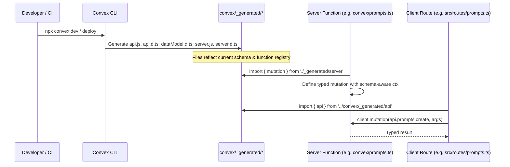

# Convex Generated

## Overview

Auto-generated Convex framework files that provide type-safe API bindings, data model types, and server function builders. These files are produced by the Convex CLI during `npx convex dev` or `npx convex deploy` and should never be edited manually. They form the foundational type layer that virtually every server-side and client-side module in LiminalDB depends on.

## Responsibilities

- Expose typed references to all Convex functions via `api` and `internal` objects (api.js / api.d.ts)
- Define the project's data model types derived from the schema (dataModel.d.ts)
- Provide typed server function builders — `query`, `mutation`, `action`, `internalQuery`, `internalMutation`, `internalAction`, `httpAction` — that enforce schema-aware argument and return types (server.js / server.d.ts)
- Supply a `components` export for Convex component wiring

## Structure Diagram

```mermaid
flowchart TD
  subgraph generated["convex/_generated"]
    API_D["api.d.ts\n(type declarations)"]
    API_JS["api.js\n(api, internal, components)"]
    DM["dataModel.d.ts\n(Doc, Id, TableNames)"]
    SRV_D["server.d.ts\n(typed builders)"]
    SRV_JS["server.js\n(query, mutation, action …)"]
  end

  subgraph consumers_server["Server Functions"]
    FN["convex/functions.ts"]
    PROMPTS["convex/prompts.ts"]
    HEALTH["convex/health.ts"]
    AUTH["convex/auth/apiKey.ts"]
    MIGRATIONS["convex/migrations/*"]
    MODELS["convex/model/*"]
    TRIGGERS["convex/triggers.ts"]
    PREFS["convex/userPreferences.ts"]
  end

  subgraph consumers_client["Client / Routes"]
    ROUTES["src/routes/*"]
    MCP["src/lib/mcp.ts"]
    HEALTH_API["src/api/health.ts"]
  end

  subgraph consumers_test["Tests"]
    TESTS["tests/**"]
  end

  FN --> SRV_D
  PROMPTS --> SRV_D
  HEALTH --> SRV_D
  AUTH --> SRV_D
  MIGRATIONS --> SRV_D
  MIGRATIONS --> API_D
  MODELS --> SRV_D
  MODELS --> DM
  TRIGGERS --> DM
  PREFS --> SRV_D

  ROUTES --> API_D
  MCP --> API_D
  HEALTH_API --> API_D

  TESTS --> API_D
  TESTS --> DM
  TESTS --> SRV_D
```

## Entity Table

| Name | Kind | Role | Public Entrypoints | Depends On | Used By |
| --- | --- | --- | --- | --- | --- |
| api.d.ts | file | Type declarations mapping every Convex function path to its argument/return types; used by client-side callers and integration tests. | convex/_generated/api.d.ts | none | src/routes/prompts.ts, src/routes/preferences.ts, src/routes/import-export.ts, src/lib/mcp.ts, src/api/health.ts, convex/migrations/backfillSearchText.ts, tests/integration/convex.test.ts, tests/integration/convex/convexCalls.test.ts, tests/integration/convex/prompts.test.ts |
| api.js | file | Runtime API reference objects (`api`, `internal`, `components`) generated from the project's function registry. | api, internal, components | none | none |
| dataModel.d.ts | file | Schema-derived type definitions for documents, table names, and IDs used by model and trigger layers. | convex/_generated/dataModel.d.ts | none | convex/model/prompts.ts, convex/model/tags.ts, convex/triggers.ts, tests/fixtures/mockConvexCtx.ts, tests/convex/prompts/insertPrompts.test.ts |
| server.d.ts | file | Type declarations for all server function builders, ensuring argument validators and return types match the schema. | convex/_generated/server.d.ts | none | convex/functions.ts, convex/prompts.ts, convex/health.ts, convex/healthAuth.ts, convex/auth/apiKey.ts, convex/model/prompts.ts, convex/model/ranking.ts, convex/model/tags.ts, convex/userPreferences.ts, convex/migrations/backfillSearchText.ts, convex/migrations/migrationStatus.ts, convex/migrations/seedGlobalTags.ts, convex/migrations/seedRankingConfig.ts, tests/convex/tags/tags.test.ts |
| server.js | file | Runtime exports of typed function builders: `query`, `internalQuery`, `mutation`, `internalMutation`, `action`, `internalAction`, `httpAction`. | query, internalQuery, mutation, internalMutation, action, internalAction, httpAction | none | none |

## Key Flow

## Flow Notes

| Step | Actor/Component | Action | Output / Side Effect |
| --- | --- | --- | --- |
| 1 | Developer / CI | Runs `npx convex dev` or `npx convex deploy`, triggering code generation. | Updated files in convex/_generated/ |
| 2 | Convex CLI | Reads the schema and function registry, then writes type-safe generated files. | api.js, api.d.ts, dataModel.d.ts, server.js, server.d.ts |
| 3 | Server Function | Imports a typed builder (e.g. `mutation`) from server.js/server.d.ts and defines a function with schema-validated arguments. | A registered Convex function with full type safety |
| 4 | Client Route | Imports the `api` object from api.d.ts and invokes a server function through the Convex client. | Type-safe function call with validated arguments and typed return value |

## Source Coverage

- convex/_generated/api.d.ts
- convex/_generated/api.js
- convex/_generated/dataModel.d.ts
- convex/_generated/server.d.ts
- convex/_generated/server.js

## Cross-Module Context

- convex/auth/apiKey.ts -> convex/_generated/server.d.ts (import)
- convex/functions.ts -> convex/_generated/server.d.ts (import)
- convex/health.ts -> convex/_generated/server.d.ts (import)
- convex/healthAuth.ts -> convex/_generated/server.d.ts (import)
- convex/migrations/backfillSearchText.ts -> convex/_generated/api.d.ts (import)
- convex/migrations/backfillSearchText.ts -> convex/_generated/server.d.ts (import)
- convex/migrations/migrationStatus.ts -> convex/_generated/server.d.ts (import)
- convex/migrations/seedGlobalTags.ts -> convex/_generated/server.d.ts (import)
- convex/migrations/seedRankingConfig.ts -> convex/_generated/server.d.ts (import)
- convex/model/prompts.ts -> convex/_generated/dataModel.d.ts (import)
- convex/model/prompts.ts -> convex/_generated/server.d.ts (import)
- convex/model/ranking.ts -> convex/_generated/server.d.ts (import)
- convex/model/tags.ts -> convex/_generated/dataModel.d.ts (import)
- convex/model/tags.ts -> convex/_generated/server.d.ts (import)
- convex/prompts.ts -> convex/_generated/server.d.ts (import)
- convex/triggers.ts -> convex/_generated/dataModel.d.ts (import)
- convex/userPreferences.ts -> convex/_generated/server.d.ts (import)
- src/api/health.ts -> convex/_generated/api.d.ts (import)
- src/lib/mcp.ts -> convex/_generated/api.d.ts (import)
- src/routes/import-export.ts -> convex/_generated/api.d.ts (import)
- src/routes/preferences.ts -> convex/_generated/api.d.ts (import)
- src/routes/prompts.ts -> convex/_generated/api.d.ts (import)
- tests/convex/prompts/insertPrompts.test.ts -> convex/_generated/dataModel.d.ts (usage)
- tests/convex/tags/tags.test.ts -> convex/_generated/server.d.ts (usage)
- tests/fixtures/mockConvexCtx.ts -> convex/_generated/dataModel.d.ts (import)
- tests/integration/convex.test.ts -> convex/_generated/api.d.ts (usage)
- tests/integration/convex/convexCalls.test.ts -> convex/_generated/api.d.ts (usage)
- tests/integration/convex/prompts.test.ts -> convex/_generated/api.d.ts (usage)
