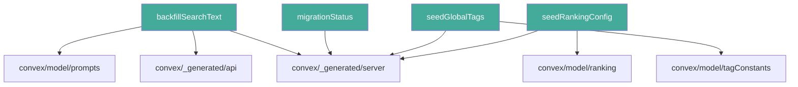
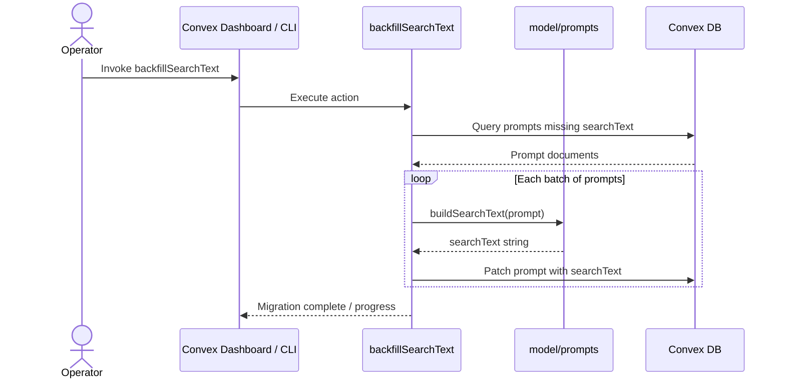

# Convex Migrations

## Overview

A set of Convex server-side migration scripts used to backfill data, seed reference tables, and check migration progress. Each migration is exposed as a Convex function (action or mutation) that can be invoked from the Convex dashboard or CLI to evolve the database schema and data in place.

## Responsibilities

- Backfill the `searchText` field on existing prompt documents for full-text search support
- Seed the global tags table with a canonical set of tag constants
- Seed the ranking configuration table with default ranking parameters
- Report the current status of applied migrations

## Structure Diagram

## Entity Table

| Name | Kind | Role | Public Entrypoints | Depends On | Used By |
| --- | --- | --- | --- | --- | --- |
| backfillSearchText | variable (Convex action/mutation) | Iterates over prompt documents and populates missing searchText fields using the prompts model helper | backfillSearchText | convex/_generated/api, convex/_generated/server, convex/model/prompts | none |
| migrationStatus | variable (Convex query/action) | Returns the current status of all known migrations so operators can verify completeness | migrationStatus | convex/_generated/server | none |
| seedGlobalTags | variable (Convex mutation) | Inserts canonical global tags from tagConstants into the database if they do not already exist | seedGlobalTags | convex/_generated/server, convex/model/tagConstants | none |
| seedRankingConfig | variable (Convex mutation) | Seeds default ranking configuration from the ranking model into the database | seedRankingConfig | convex/_generated/server, convex/model/ranking | none |

## Key Flow

## Flow Notes

| Step | Actor/Component | Action | Output / Side Effect |
| --- | --- | --- | --- |
| 1 | Operator | Triggers a migration function via the Convex dashboard or CLI | Migration function begins execution |
| 2 | backfillSearchText | Queries the database for prompt documents that lack a searchText field | Batch of prompt documents to process |
| 3 | backfillSearchText | Calls model/prompts helper to compute searchText for each prompt and patches the document | Updated prompt documents with searchText populated |
| 4 | migrationStatus | Operator queries migration status to confirm all migrations are applied | Status report of completed and pending migrations |

## Source Coverage

- convex/migrations/backfillSearchText.ts
- convex/migrations/migrationStatus.ts
- convex/migrations/seedGlobalTags.ts
- convex/migrations/seedRankingConfig.ts

## Cross-Module Context

- convex/migrations/backfillSearchText.ts -> convex/_generated/api.d.ts (import)
- convex/migrations/backfillSearchText.ts -> convex/_generated/server.d.ts (import)
- convex/migrations/backfillSearchText.ts -> convex/model/prompts.ts (import)
- convex/migrations/migrationStatus.ts -> convex/_generated/server.d.ts (import)
- convex/migrations/seedGlobalTags.ts -> convex/_generated/server.d.ts (import)
- convex/migrations/seedGlobalTags.ts -> convex/model/tagConstants.ts (import)
- convex/migrations/seedRankingConfig.ts -> convex/_generated/server.d.ts (import)
- convex/migrations/seedRankingConfig.ts -> convex/model/ranking.ts (import)
