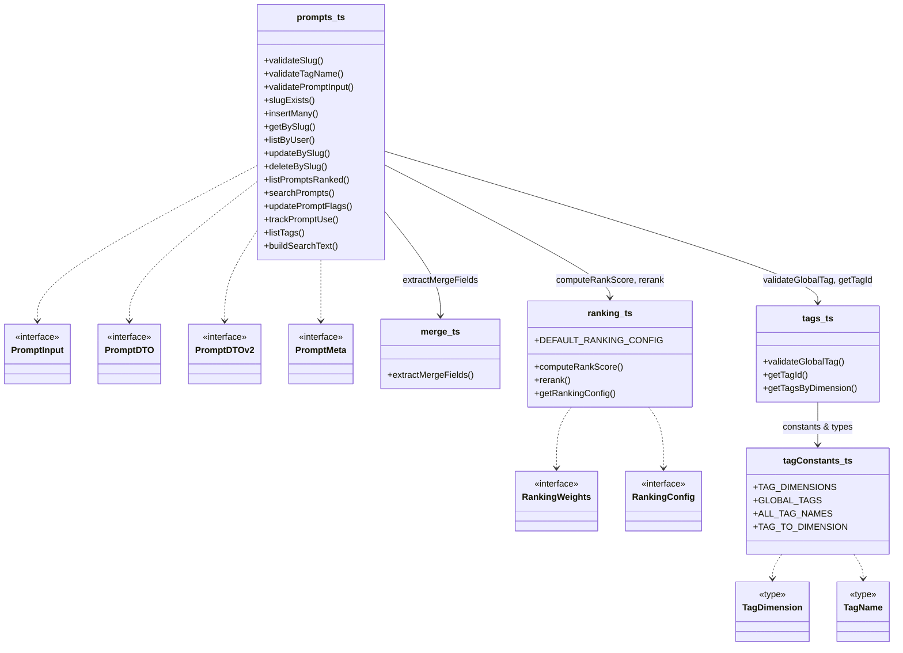
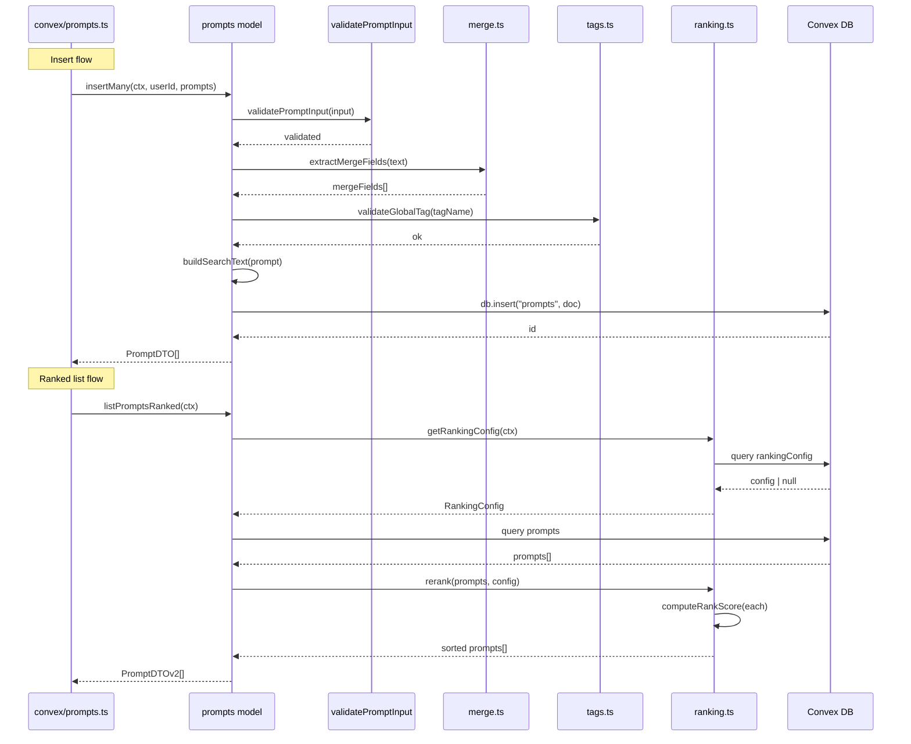

# Convex Prompt Model

## Overview

Core domain model for LiminalDB prompts, implemented as a set of Convex model files under `convex/model/`. The module encapsulates all prompt CRUD operations, input validation, slug uniqueness, merge-field extraction, ranking/scoring, tag taxonomy, and full-text search. It is consumed by the Convex API layer (`convex/prompts.ts`) and by migration scripts, and is backed by RLS-based authorization from `convex/auth/rls.ts`.

## Responsibilities

- Define prompt data-transfer interfaces (PromptInput, PromptDTO, PromptDTOv2, PromptMeta)
- Validate prompt input fields, slugs, and tag names before persistence
- CRUD operations: insertMany, getBySlug, listByUser, updateBySlug, deleteBySlug
- Check slug uniqueness via slugExists
- Extract {{mergeField}} placeholders from prompt text via extractMergeFields
- Build composite search text for full-text search indexing (buildSearchText)
- Full-text search across prompts (searchPrompts)
- Compute rank scores using configurable weights and recency decay (computeRankScore, rerank)
- Manage ranking configuration with defaults (getRankingConfig, DEFAULT_RANKING_CONFIG)
- Define and validate a global tag taxonomy organized by dimensions (TAG_DIMENSIONS, GLOBAL_TAGS, validateGlobalTag)
- Resolve tag names to database IDs and query tags by dimension (getTagId, getTagsByDimension)
- Track prompt usage events (trackPromptUse) and update prompt flags (updatePromptFlags)
- List available tags for the current user (listTags)

## Structure Diagram

## Entity Table

| Name | Kind | Role | Public Entrypoints | Depends On | Used By |
| --- | --- | --- | --- | --- | --- |
| PromptInput | interface | Input shape for creating/updating prompts | convex/model/prompts.ts:PromptInput | none | convex/prompts.ts |
| PromptDTO | interface | Data-transfer object returned from prompt queries (v1) | convex/model/prompts.ts:PromptDTO | none | convex/prompts.ts |
| PromptDTOv2 | interface | Extended data-transfer object with additional metadata (v2) | convex/model/prompts.ts:PromptDTOv2 | none | convex/prompts.ts |
| PromptMeta | interface | Lightweight prompt metadata shape | convex/model/prompts.ts:PromptMeta | none | convex/prompts.ts |
| insertMany | function | Batch-insert validated prompts for a user | convex/model/prompts.ts:insertMany | validatePromptInput, extractMergeFields, buildSearchText | convex/prompts.ts |
| getBySlug | function | Retrieve a single prompt by its unique slug | convex/model/prompts.ts:getBySlug | convex/auth/rls.ts | convex/prompts.ts |
| updateBySlug | function | Update prompt fields identified by slug | convex/model/prompts.ts:updateBySlug | validatePromptInput, extractMergeFields, buildSearchText | convex/prompts.ts |
| deleteBySlug | function | Soft- or hard-delete a prompt by slug | convex/model/prompts.ts:deleteBySlug | convex/auth/rls.ts | convex/prompts.ts |
| listPromptsRanked | function | List prompts ordered by computed rank score | convex/model/prompts.ts:listPromptsRanked | getRankingConfig, computeRankScore, rerank | convex/prompts.ts |
| searchPrompts | function | Full-text search across prompt content and metadata | convex/model/prompts.ts:searchPrompts | buildSearchText | convex/prompts.ts |
| trackPromptUse | function | Record a usage event against a prompt for ranking signals | convex/model/prompts.ts:trackPromptUse | none | convex/prompts.ts |
| extractMergeFields | function | Parse {{field}} placeholders from prompt text | convex/model/merge.ts:extractMergeFields | none | convex/model/prompts.ts |
| computeRankScore | function | Calculate a rank score from usage, recency, and configurable weights | convex/model/ranking.ts:computeRankScore | RankingWeights | convex/model/prompts.ts |
| rerank | function | Sort a prompt list by computed rank scores | convex/model/ranking.ts:rerank | computeRankScore | convex/model/prompts.ts |
| getRankingConfig | function | Fetch ranking configuration from database or fall back to defaults | convex/model/ranking.ts:getRankingConfig | DEFAULT_RANKING_CONFIG | convex/model/prompts.ts |
| DEFAULT_RANKING_CONFIG | constant | Fallback ranking weights and decay parameters | convex/model/ranking.ts:DEFAULT_RANKING_CONFIG | none | getRankingConfig, convex/migrations/seedRankingConfig.ts |
| validateGlobalTag | function | Ensure a tag name exists in the global tag taxonomy | convex/model/tags.ts:validateGlobalTag | ALL_TAG_NAMES | convex/model/prompts.ts |
| getTagId | function | Resolve a tag name to its Convex document ID | convex/model/tags.ts:getTagId | tagConstants_ts | convex/model/prompts.ts |
| getTagsByDimension | function | Query tags filtered by their taxonomy dimension | convex/model/tags.ts:getTagsByDimension | tagConstants_ts | convex/model/prompts.ts |
| TAG_DIMENSIONS | constant | Enumeration of tag dimension categories | convex/model/tagConstants.ts:TAG_DIMENSIONS | none | convex/model/tags.ts, convex/migrations/seedGlobalTags.ts |
| GLOBAL_TAGS | constant | Complete mapping of global tags to their dimensions | convex/model/tagConstants.ts:GLOBAL_TAGS | none | convex/model/tags.ts, convex/migrations/seedGlobalTags.ts |
| ALL_TAG_NAMES | constant | Flat list of all valid tag names | convex/model/tagConstants.ts:ALL_TAG_NAMES | none | convex/model/tags.ts |

## Key Flow

## Flow Notes

| Step | Actor/Component | Action | Output / Side Effect |
| --- | --- | --- | --- |
| 1 | convex/prompts.ts (API layer) | Calls insertMany with user ID and array of prompt inputs | Delegates to prompts model |
| 2 | prompts model | Validates each input via validatePromptInput, extracts merge fields, validates tags | Validated prompt document ready for insert |
| 3 | prompts model | Builds composite search text from prompt fields and inserts into Convex DB | Array of PromptDTO results |
| 4 | convex/prompts.ts (API layer) | Calls listPromptsRanked to retrieve scored prompt listing | Delegates to prompts model |
| 5 | prompts model | Fetches ranking config from DB (falls back to DEFAULT_RANKING_CONFIG), queries prompts, calls rerank | Sorted PromptDTOv2 array ordered by rank score |

## Source Coverage

- convex/model/merge.ts
- convex/model/prompts.ts
- convex/model/ranking.ts
- convex/model/tagConstants.ts
- convex/model/tags.ts

## Cross-Module Context

- convex/migrations/backfillSearchText.ts -> convex/model/prompts.ts (import)
- convex/migrations/seedGlobalTags.ts -> convex/model/tagConstants.ts (import)
- convex/migrations/seedRankingConfig.ts -> convex/model/ranking.ts (import)
- convex/model/prompts.ts -> convex/_generated/dataModel.d.ts (import)
- convex/model/prompts.ts -> convex/_generated/server.d.ts (import)
- convex/model/prompts.ts -> convex/auth/rls.ts (import)
- convex/model/ranking.ts -> convex/_generated/server.d.ts (import)
- convex/model/tags.ts -> convex/_generated/dataModel.d.ts (import)
- convex/model/tags.ts -> convex/_generated/server.d.ts (import)
- convex/prompts.ts -> convex/model/prompts.ts (import)
- tests/convex/prompts/deleteBySlug.test.ts -> convex/model/prompts.ts (usage)
- tests/convex/prompts/getPromptBySlug.test.ts -> convex/model/prompts.ts (usage)
- tests/convex/prompts/insertPrompts.test.ts -> convex/model/prompts.ts (usage)
- tests/convex/prompts/mergeFields.test.ts -> convex/model/merge.ts (usage)
- tests/convex/prompts/ranking.test.ts -> convex/model/ranking.ts (usage)
- tests/convex/prompts/searchPrompts.test.ts -> convex/model/prompts.ts (usage)
- tests/convex/prompts/slugExists.test.ts -> convex/model/prompts.ts (usage)
- tests/convex/prompts/usageTracking.test.ts -> convex/model/prompts.ts (usage)
- tests/convex/prompts/validation.test.ts -> convex/model/prompts.ts (usage)
- tests/convex/tags/tagConstants.test.ts -> convex/model/tagConstants.ts (usage)
- tests/convex/tags/tags.test.ts -> convex/model/tagConstants.ts (usage)
- tests/convex/tags/tags.test.ts -> convex/model/tags.ts (usage)
