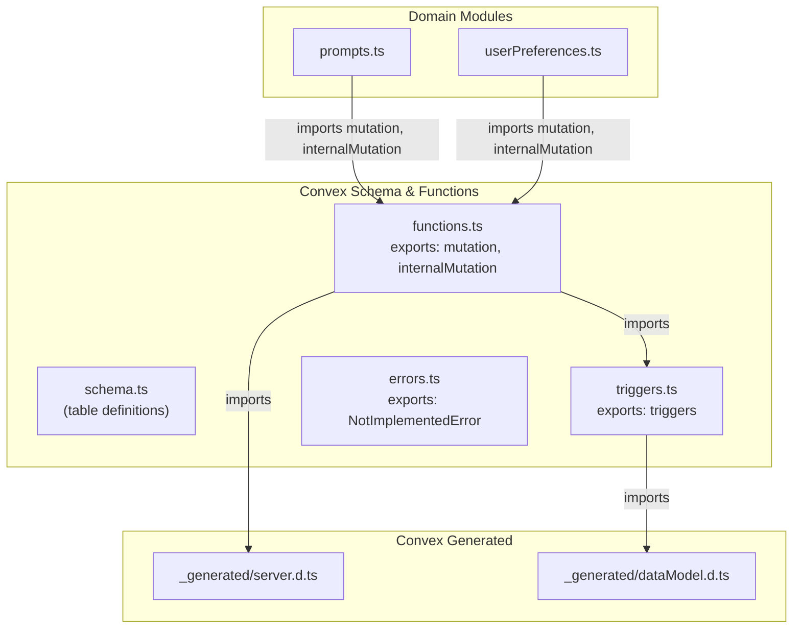
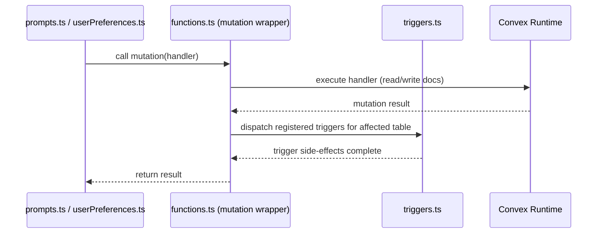

# Convex Schema & Functions

## Overview

Core database infrastructure module for LiminalDB's Convex backend. Defines the database schema, provides custom `mutation` and `internalMutation` function wrappers that integrate an automatic trigger system, and exposes shared error types. All domain modules (prompts, userPreferences) build on the custom function wrappers exported here rather than using Convex's raw generated helpers directly.

## Responsibilities

- Define the authoritative Convex database schema (tables, indexes, validators) in `schema.ts`
- Wrap Convex's generated `mutation` and `internalMutation` with trigger-aware versions in `functions.ts`
- Register and dispatch document-level triggers (insert/update/delete side-effects) via `triggers.ts`
- Provide the `NotImplementedError` class for feature-gating across the codebase

## Structure Diagram

## Entity Table

| Name | Kind | Role | Public Entrypoints | Depends On | Used By |
| --- | --- | --- | --- | --- | --- |
| schema.ts | file | Defines all Convex tables, their validators, and indexes | convex/schema.ts | none | none |
| mutation | variable | Trigger-aware wrapper around Convex's generated mutation builder | convex/functions.ts:mutation | convex/_generated/server.d.ts, convex/triggers.ts | convex/prompts.ts, convex/userPreferences.ts |
| internalMutation | variable | Trigger-aware wrapper around Convex's generated internalMutation builder | convex/functions.ts:internalMutation | convex/_generated/server.d.ts, convex/triggers.ts | convex/prompts.ts, convex/userPreferences.ts |
| triggers | variable | Registry of document-level trigger callbacks keyed by table name | convex/triggers.ts:triggers | convex/_generated/dataModel.d.ts | convex/functions.ts |
| NotImplementedError | class | Custom error thrown for unimplemented features or code paths | convex/errors.ts:NotImplementedError | none | none |

## Key Flow

## Flow Notes

| Step | Actor/Component | Action | Output / Side Effect |
| --- | --- | --- | --- |
| 1 | Domain module (e.g. prompts.ts) | Imports and invokes the custom `mutation` or `internalMutation` wrapper from functions.ts | Mutation handler is registered with Convex runtime |
| 2 | functions.ts wrapper | Delegates to the Convex-generated mutation builder to execute the handler logic | Document writes are applied to the database |
| 3 | functions.ts wrapper | After the handler completes, dispatches any registered triggers from triggers.ts for the affected tables | Trigger callbacks run (e.g. cascading updates, side-effects) |
| 4 | Convex Runtime | Commits the transaction including both the original mutation and trigger side-effects | Final result returned to the caller |

## Source Coverage

- convex/errors.ts
- convex/functions.ts
- convex/schema.ts
- convex/triggers.ts

## Cross-Module Context

- convex/functions.ts -> convex/_generated/server.d.ts (import)
- convex/prompts.ts -> convex/functions.ts (import)
- convex/triggers.ts -> convex/_generated/dataModel.d.ts (import)
- convex/userPreferences.ts -> convex/functions.ts (import)
