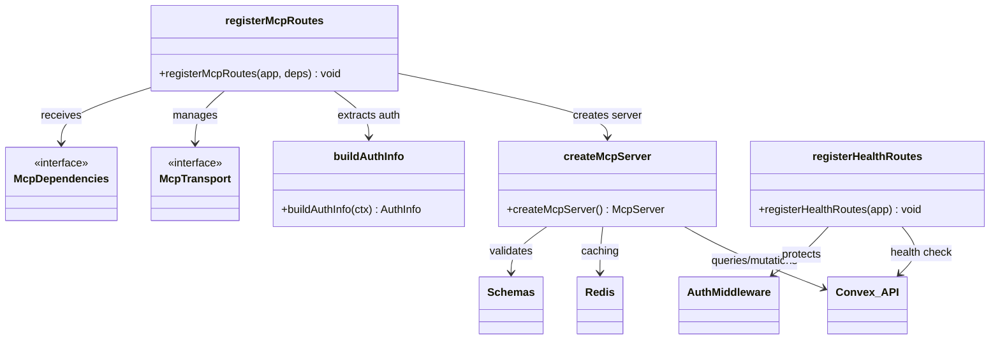
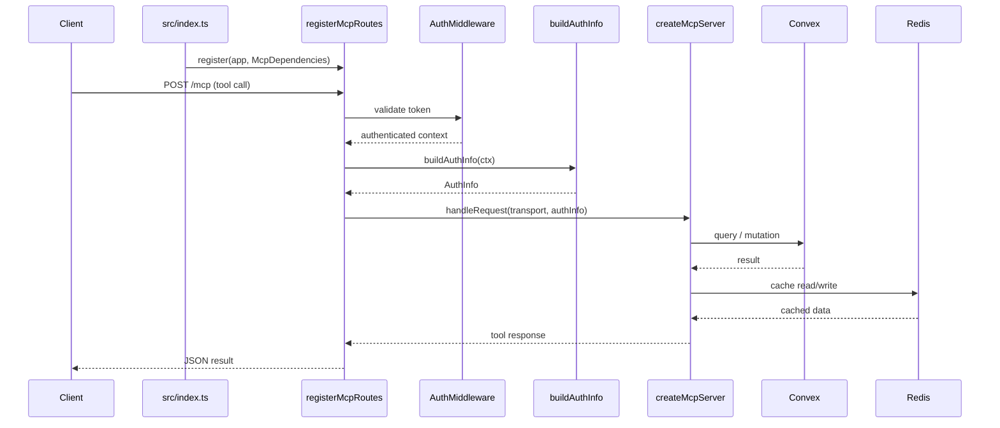

# MCP Server

## Overview

The MCP Server module implements the Model Context Protocol server for LiminalDB. It is composed of three layers: `createMcpServer` (src/lib/mcp.ts) defines the full MCP server with tool definitions, resource handlers, and prompt schemas; `registerMcpRoutes` (src/api/mcp.ts) wires the MCP server into HTTP routes with auth and transport management; and `registerHealthRoutes` (src/api/health.ts) exposes a health-check API. The application entrypoint (`src/index.ts`) registers both route sets at startup.

## Responsibilities

- Define MCP tool handlers for database operations (CRUD, queries, preferences, prompts)
- Expose MCP resources backed by Convex and Redis
- Register HTTP routes for MCP transport (SSE/streamable) with authentication
- Build per-request auth info from middleware context
- Provide a health-check endpoint reporting Convex connectivity and server status

## Structure Diagram

## Entity Table

| Name | Kind | Role | Public Entrypoints | Depends On | Used By |
| --- | --- | --- | --- | --- | --- |
| createMcpServer | function | Factory that instantiates an MCP server with all tool definitions, resource handlers, and prompt schemas wired to Convex and Redis backends. | src/lib/mcp.ts:createMcpServer | convex/_generated/api.d.ts, src/lib/config.ts, src/lib/convex.ts, src/lib/merge.ts, src/lib/redis.ts, src/schemas/preferences.ts, src/schemas/prompts.ts | src/api/mcp.ts, tests/service/mcp/toolHandlers.test.ts |
| registerMcpRoutes | function | Registers HTTP routes for MCP transport (SSE / streamable), handling session lifecycle and injecting auth context. | src/api/mcp.ts:registerMcpRoutes | src/lib/auth/index.ts, src/lib/config.ts, src/lib/mcp.ts, src/middleware/auth.ts | src/index.ts, tests/service/auth/mcp.test.ts, tests/service/mcp/auth-challenge.test.ts, tests/service/mcp/resources.test.ts, tests/service/mcp/tools.test.ts, tests/service/prompts/mcpTools.test.ts |
| buildAuthInfo | function | Extracts and constructs auth info from request context for MCP sessions. | src/api/mcp.ts:buildAuthInfo | src/lib/auth/index.ts, src/middleware/auth.ts | src/index.ts, tests/service/auth/mcp.test.ts |
| McpTransport | interface | Defines the shape of an MCP transport (SSE or streamable HTTP). | src/api/mcp.ts:McpTransport | none | src/api/mcp.ts |
| McpDependencies | interface | Dependency-injection interface for route registration, carrying config, auth, and server factory references. | src/api/mcp.ts:McpDependencies | none | src/index.ts, tests/service/mcp/tools.test.ts |
| registerHealthRoutes | function | Registers a health-check endpoint that reports Convex connectivity and server metadata. | src/api/health.ts:registerHealthRoutes | convex/_generated/api.d.ts, src/lib/config.ts, src/lib/convex.ts, src/middleware/auth.ts | src/index.ts |

## Key Flow

## Flow Notes

| Step | Actor/Component | Action | Output / Side Effect |
| --- | --- | --- | --- |
| 1 | src/index.ts | Calls registerMcpRoutes and registerHealthRoutes to mount all MCP and health endpoints on the HTTP server. | Routes registered on app |
| 2 | Client | Sends an MCP request (tool call, resource read, or prompt) to the server. | HTTP request received by route handler |
| 3 | registerMcpRoutes | Runs auth middleware and calls buildAuthInfo to resolve the caller's identity. | AuthInfo object for the session |
| 4 | createMcpServer | Dispatches the request to the appropriate tool/resource/prompt handler, querying Convex and Redis as needed. | Structured MCP response |
| 5 | registerMcpRoutes | Serializes the MCP response back over the transport (SSE or streamable HTTP). | JSON response to client |

## Source Coverage

- src/api/health.ts
- src/api/mcp.ts
- src/lib/mcp.ts

## Cross-Module Context

- src/api/health.ts -> convex/_generated/api.d.ts (import)
- src/api/health.ts -> src/lib/config.ts (import)
- src/api/health.ts -> src/lib/convex.ts (import)
- src/api/health.ts -> src/middleware/auth.ts (import)
- src/api/mcp.ts -> src/lib/auth/index.ts (import)
- src/api/mcp.ts -> src/lib/config.ts (import)
- src/api/mcp.ts -> src/middleware/auth.ts (import)
- src/index.ts -> src/api/health.ts (usage)
- src/index.ts -> src/api/mcp.ts (usage)
- src/lib/mcp.ts -> convex/_generated/api.d.ts (import)
- src/lib/mcp.ts -> src/lib/config.ts (import)
- src/lib/mcp.ts -> src/lib/convex.ts (import)
- src/lib/mcp.ts -> src/lib/merge.ts (import)
- src/lib/mcp.ts -> src/lib/redis.ts (import)
- src/lib/mcp.ts -> src/schemas/preferences.ts (import)
- src/lib/mcp.ts -> src/schemas/prompts.ts (import)
- tests/service/auth/mcp.test.ts -> src/api/mcp.ts (usage)
- tests/service/mcp/auth-challenge.test.ts -> src/api/mcp.ts (usage)
- tests/service/mcp/resources.test.ts -> src/api/mcp.ts (usage)
- tests/service/mcp/toolHandlers.test.ts -> src/lib/mcp.ts (usage)
- tests/service/mcp/tools.test.ts -> src/api/mcp.ts (usage)
- tests/service/prompts/mcpTools.test.ts -> src/api/mcp.ts (usage)
