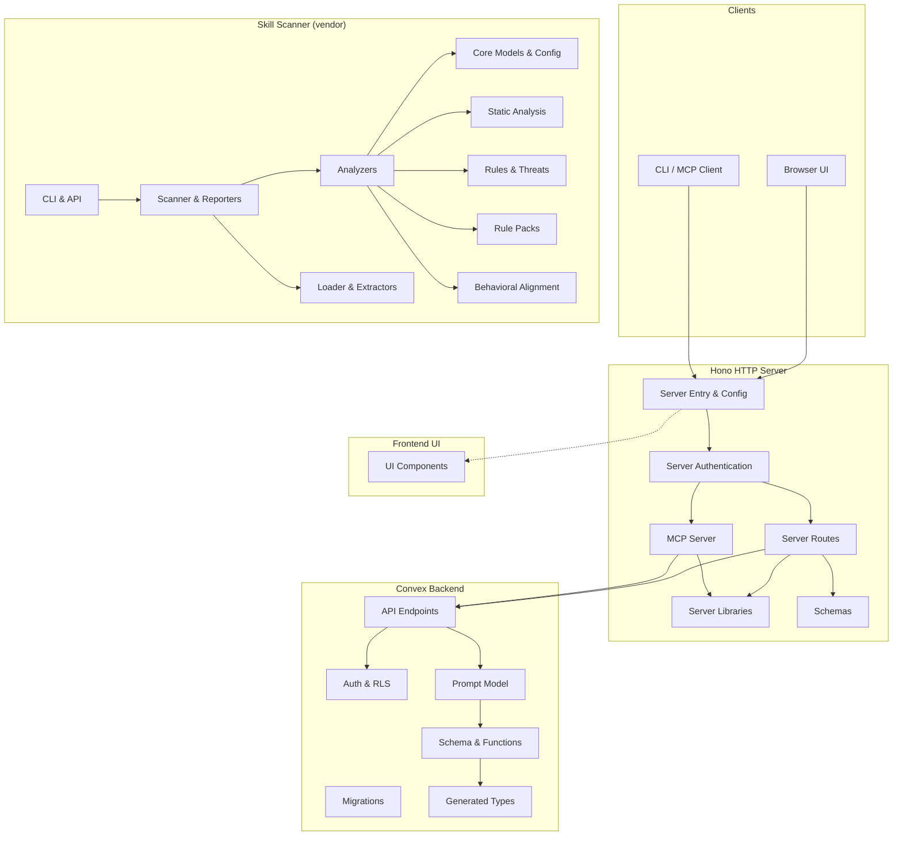

# LiminalDB — Repository Overview

LiminalDB is a prompt management platform that provides a web UI, REST API, and [Model Context Protocol (MCP)](https://modelcontextprotocol.io/) server for storing, versioning, and retrieving AI prompts. The codebase also includes **Skill Scanner**, a vendored Python security analysis tool for evaluating skill packages.

---

## Architecture at a Glance

The system is organized into four major layers plus a vendored tool:

| Layer | Tech | Purpose |
|---|---|---|
| **Convex Backend** | Convex (TypeScript) | Database, schema, auth, domain model, migrations |
| **Hono Server** | Hono on Node/Bun | HTTP routes, JWT auth, MCP transport, Redis caching |
| **Frontend** | Vanilla JS | Browser UI components served as static assets |
| **Skill Scanner** | Python | Security analysis tool for skill packages (vendored) |

---

## Module Index

### Convex Backend

| Module | Responsibility |
|---|---|
| [Convex API Endpoints](convex-api-endpoints.md) | Public query/mutation endpoints for prompts, health, and preferences |
| [Convex Auth & RLS](convex-auth--rls.md) | API key validation and row-level security enforcement |
| [Convex Prompt Model](convex-prompt-model.md) | Core domain model — CRUD, validation, slugs, merge fields, ranking, tags, search |
| [Convex Schema & Functions](convex-schema--functions.md) | Database schema definition, custom function wrappers with trigger support, error types |
| [Convex Migrations](convex-migrations.md) | Data migration scripts for backfills and seed data |
| [Convex Generated](convex-generated.md) | Auto-generated Convex type bindings (do not edit) |

### Hono Server

| Module | Responsibility |
|---|---|
| [Server Entry & Config](server-entry--config.md) | HTTP server bootstrap, configuration, Convex client, error codes |
| [Server Authentication](server-authentication.md) | JWT decoding/validation, WorkOS integration, auth middleware |
| [Server Routes](server-routes.md) | HTTP route handlers for auth, prompts, drafts, preferences, import/export, modules, well-known |
| [MCP Server](mcp-server.md) | Model Context Protocol server with tool definitions, resource handlers, and health API |
| [Schemas](schemas.md) | Zod validation schemas and TypeScript types shared across all layers |
| [Server Libraries](server-libraries.md) | Shared utilities — three-way merge logic and Redis caching |

### Frontend

| Module | Responsibility |
|---|---|
| [Frontend UI Components](frontend-ui-components.md) | Browser-side JS modules — prompt editor/viewer, merge mode, modals, toasts, tag selector |

### Shared / Tooling

| Module | Responsibility |
|---|---|
| [Liminal Spec](liminal-spec.md) | Build and validation scripts for the liminal-spec format |
| [Dev Scripts](dev-scripts.md) | Utility scripts for seeding data, creating test users, debugging |

### Skill Scanner (Vendored Python Package)

| Module | Responsibility |
|---|---|
| [Core Models & Config](skill-scanner-core-models--config.md) | Data models, severity enums, policy system, constants, exceptions |
| [Analyzers](skill-scanner-analyzers.md) | Security analyzer implementations (static, behavioral, LLM, bytecode, VirusTotal, etc.) |
| [Static Analysis](skill-scanner-static-analysis.md) | Python parser, CFG, dataflow, taint tracking, interprocedural analysis |
| [Rules & Threats](skill-scanner-rules--threats.md) | Security rule definitions, YARA scanning, threat taxonomy |
| [Rule Packs](skill-scanner-rule-packs.md) | Built-in check modules for manifest, hidden files, triggers, consistency, etc. |
| [Behavioral Alignment](skill-scanner-behavioral-alignment.md) | LLM-based behavioral alignment analysis subsystem |
| [Loader & Extractors](skill-scanner-loader--extractors.md) | Skill ingestion pipeline — loading, extraction, validation, scoring |
| [Scanner & Reporters](skill-scanner-scanner--reporters.md) | Top-level scan orchestration and output formatters (JSON, MD, HTML, SARIF) |
| [CLI & API](skill-scanner-cli--api.md) | CLI, interactive wizard, TUI policy editor, REST API server, pre-commit hook |
| [Utilities](skill-scanner-utilities.md) | File handling and logging utilities |
| [Examples](skill-scanner-examples.md) | Example scripts demonstrating scanner usage |
| [Scripts](skill-scanner-scripts.md) | Maintenance scripts for taxonomy, docs, Homebrew formula |

### Test Suites

| Module | Responsibility |
|---|---|
| [Test Fixtures & Setup](test-fixtures--setup.md) | Shared mock factories, fixture data, DOM helpers, Vitest config |
| [Tests: Convex Unit](tests-convex-unit.md) | Unit tests for Convex auth, RLS, prompt model, tags, ranking |
| [Tests: Service Unit](tests-service-unit.md) | Unit tests for server routes, auth middleware, MCP tools, merge, Redis |
| [Tests: UI Unit](tests-ui-unit.md) | Unit tests for frontend components |
| [Tests: Integration](tests-integration.md) | End-to-end tests across auth flows, APIs, Convex, and UI |
| [Skill Scanner: Evals](skill-scanner-evals.md) | Benchmark runners and skill fixture corpus |
| [Skill Scanner: Tests](skill-scanner-tests.md) | Comprehensive test suite for all scanner subsystems |

---

## Key Data Flow

1. **Browser / MCP Client** sends an HTTP request to the Hono server
2. **Auth Middleware** extracts and validates the JWT (via WorkOS JWKS)
3. **Route Handler** validates input with Zod schemas, calls the Convex backend
4. **Convex API Endpoint** authenticates via API key, delegates to the Prompt Model
5. **Prompt Model** applies RLS, executes business logic, returns results
6. **Response** flows back through the route handler to the client

For MCP clients, the MCP Server module handles tool invocation and resource resolution using the same Convex backend and merge/cache libraries.

---

## Next Steps

Dive into any module page linked above for detailed component documentation, dependency graphs, and API surface descriptions. Start with [Server Entry & Config](server-entry--config.md) for the application bootstrap flow, or [Convex Prompt Model](convex-prompt-model.md) for the core domain logic.
