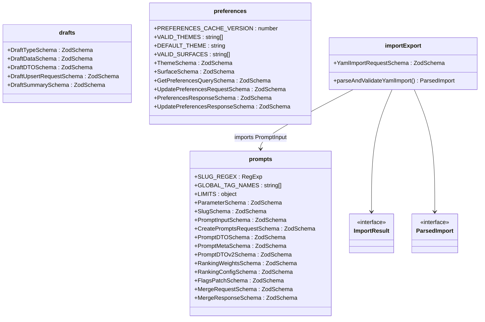
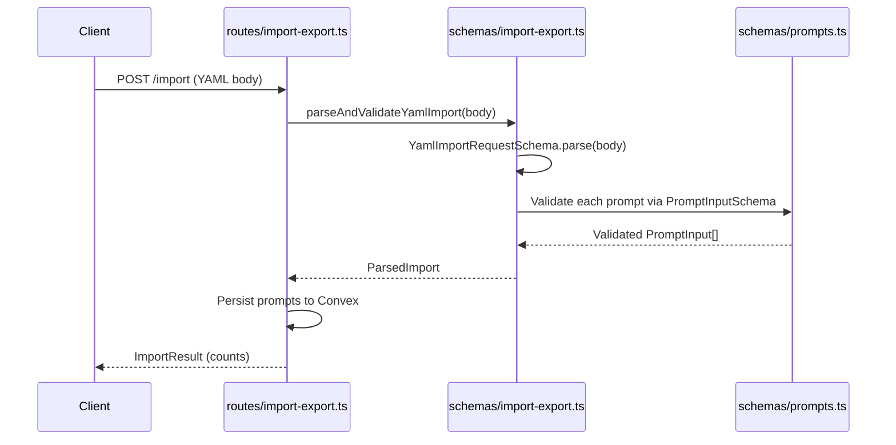

# Schemas

## Overview

The Schemas module is the single source of truth for data validation and TypeScript types across LiminalDB. It defines Zod schemas paired with inferred types for four domains: **prompts** (the core content model including parameters, slugs, DTOs, ranking, flags, and merge operations), **drafts** (draft lifecycle types and upsert payloads), **preferences** (theme/surface selection and cache versioning), and **import-export** (YAML import parsing and validation). Every route handler, MCP tool, and caching layer imports from these schemas to validate incoming requests and shape outgoing responses.

## Responsibilities

- Define Zod validation schemas for prompt creation, update, ranking, flags, and merge operations
- Provide PromptDTO / PromptDTOv2 response shapes consumed by routes and MCP tools
- Define draft type, DTO, upsert request, and summary schemas
- Define user preference schemas for themes and surfaces with cache versioning
- Parse and validate YAML import payloads via `parseAndValidateYamlImport`
- Export TypeScript types inferred from every Zod schema for compile-time safety
- Enforce domain constraints (SLUG_REGEX, LIMITS, GLOBAL_TAG_NAMES, VALID_THEMES, VALID_SURFACES)

## Structure Diagram

## Entity Table

| Name | Kind | Role | Public Entrypoints | Depends On | Used By |
| --- | --- | --- | --- | --- | --- |
| prompts.ts | file | Core prompt domain schemas and types – slugs, parameters, DTOs (v1/v2), ranking, flags, merge | SLUG_REGEX, GLOBAL_TAG_NAMES, LIMITS, ParameterSchema, SlugSchema, PromptInputSchema, CreatePromptsRequestSchema, PromptDTOSchema, PromptMetaSchema, PromptDTOv2Schema, RankingWeightsSchema, RankingConfigSchema, FlagsPatchSchema, MergeRequestSchema, MergeResponseSchema | none | src/routes/prompts.ts, src/routes/import-export.ts, src/lib/mcp.ts, src/schemas/import-export.ts, tests/service/prompts/edgeCases.test.ts |
| drafts.ts | file | Draft lifecycle schemas – type enum, DTO, upsert request, summary | DraftTypeSchema, DraftDataSchema, DraftDTOSchema, DraftUpsertRequestSchema, DraftSummarySchema | none | src/routes/drafts.ts, tests/service/drafts/drafts.test.ts |
| preferences.ts | file | User preference schemas – themes, surfaces, cache versioning, get/update payloads | PREFERENCES_CACHE_VERSION, VALID_THEMES, DEFAULT_THEME, VALID_SURFACES, ThemeSchema, SurfaceSchema, GetPreferencesQuerySchema, UpdatePreferencesRequestSchema, PreferencesResponseSchema, UpdatePreferencesResponseSchema | none | src/routes/preferences.ts, src/routes/app.ts, src/routes/modules.ts, src/lib/mcp.ts, src/lib/redis.ts |
| import-export.ts | file | YAML import validation – parses raw YAML body, validates against PromptInput schemas | YamlImportRequestSchema, parseAndValidateYamlImport, ImportResult, ParsedImport | src/schemas/prompts.ts | src/routes/import-export.ts |
| ImportResult | interface | Result shape returned after an import operation (created/updated counts) | ImportResult | src/schemas/prompts.ts | src/routes/import-export.ts |
| ParsedImport | interface | Intermediate parsed representation of a validated YAML import payload | ParsedImport | src/schemas/prompts.ts | src/routes/import-export.ts |

## Key Flow

## Flow Notes

| Step | Actor/Component | Action | Output / Side Effect |
| --- | --- | --- | --- |
| 1 | Client | Sends POST /import with a YAML body containing prompt definitions | Raw request body |
| 2 | routes/import-export.ts | Delegates to parseAndValidateYamlImport for parsing and validation | Function call with raw body |
| 3 | schemas/import-export.ts | Parses top-level envelope via YamlImportRequestSchema, then validates each prompt entry against PromptInputSchema from prompts.ts | ParsedImport with validated prompt inputs |
| 4 | routes/import-export.ts | Persists validated prompts and returns counts of created/updated records | ImportResult response to client |

## Source Coverage

- src/schemas/drafts.ts
- src/schemas/import-export.ts
- src/schemas/preferences.ts
- src/schemas/prompts.ts

## Cross-Module Context

- src/lib/mcp.ts -> src/schemas/preferences.ts (import)
- src/lib/mcp.ts -> src/schemas/prompts.ts (import)
- src/lib/redis.ts -> src/schemas/preferences.ts (import)
- src/routes/app.ts -> src/schemas/preferences.ts (import)
- src/routes/drafts.ts -> src/schemas/drafts.ts (import)
- src/routes/import-export.ts -> src/schemas/import-export.ts (import)
- src/routes/import-export.ts -> src/schemas/prompts.ts (import)
- src/routes/modules.ts -> src/schemas/preferences.ts (import)
- src/routes/preferences.ts -> src/schemas/preferences.ts (import)
- src/routes/prompts.ts -> src/schemas/prompts.ts (import)
- tests/service/drafts/drafts.test.ts -> src/schemas/drafts.ts (usage)
- tests/service/prompts/edgeCases.test.ts -> src/schemas/prompts.ts (usage)
