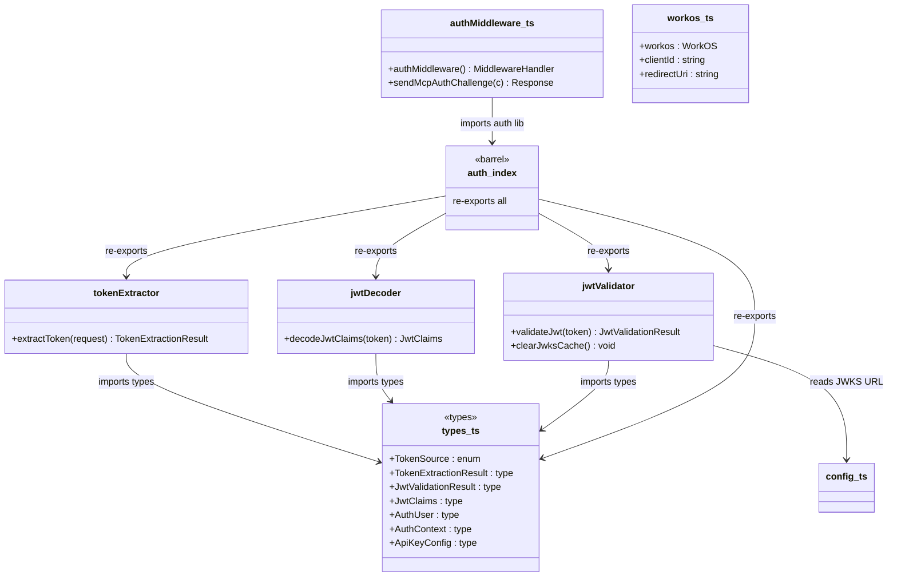
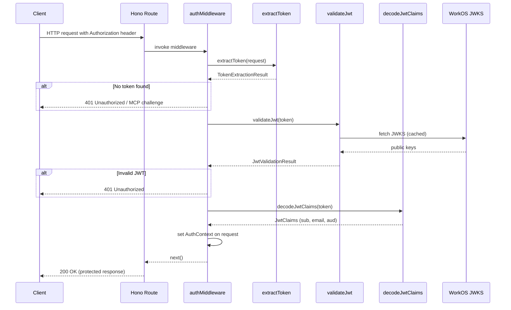

# Server Authentication

## Overview

The Server Authentication module provides JWT-based authentication for the LiminalDB Hono server. It is structured as a layered pipeline: token extraction from HTTP requests, JWT decoding and cryptographic validation against WorkOS JWKS, and a Hono middleware that gates all protected routes. The module also supports MCP (Model Context Protocol) auth challenges for machine clients.

## Responsibilities

- Extract bearer tokens from Authorization headers and other sources
- Decode JWT claims without cryptographic verification (for inspection)
- Validate JWTs against WorkOS JWKS endpoints with caching
- Expose Hono middleware (`authMiddleware`) that authenticates every protected route
- Send MCP-compliant auth challenge responses for unauthenticated MCP clients
- Initialize and export the WorkOS SDK client, client ID, and redirect URI
- Define shared auth types: TokenSource, JwtClaims, AuthUser, AuthContext, etc.

## Structure Diagram

## Entity Table

| Name | Kind | Role | Public Entrypoints | Depends On | Used By |
| --- | --- | --- | --- | --- | --- |
| types.ts | types | Defines all shared auth types and enums (TokenSource, JwtClaims, AuthUser, AuthContext, etc.) | src/lib/auth/types.ts | none | tokenExtractor, jwtDecoder, jwtValidator, auth/index.ts |
| extractToken | function | Extracts a bearer token from an HTTP request's Authorization header or other sources, returning a TokenExtractionResult | src/lib/auth/tokenExtractor.ts:extractToken | types.ts | auth/index.ts, src/index.ts, tests |
| decodeJwtClaims | function | Decodes JWT payload claims without cryptographic verification | src/lib/auth/jwtDecoder.ts:decodeJwtClaims | types.ts | auth/index.ts |
| validateJwt | function | Validates a JWT cryptographically against WorkOS JWKS, with key caching | src/lib/auth/jwtValidator.ts:validateJwt | types.ts, src/lib/config.ts | auth/index.ts |
| clearJwksCache | function | Clears the cached JWKS keys, forcing a fresh fetch on next validation | src/lib/auth/jwtValidator.ts:clearJwksCache | src/lib/config.ts | auth/index.ts |
| auth/index.ts | barrel | Barrel re-export for the auth library; aggregates all auth utilities and types | src/lib/auth/index.ts | jwtDecoder, jwtValidator, tokenExtractor, types.ts | authMiddleware, src/api/mcp.ts |
| authMiddleware | function | Hono middleware that authenticates requests by extracting and validating JWTs, setting AuthContext on the request | src/middleware/auth.ts:authMiddleware | auth/index.ts | src/routes/prompts.ts, src/routes/drafts.ts, src/routes/preferences.ts, src/routes/app.ts, src/routes/auth.ts, src/routes/import-export.ts, src/api/health.ts, src/api/mcp.ts, src/index.ts |
| sendMcpAuthChallenge | function | Returns an MCP-compliant 401 auth challenge response for unauthenticated MCP clients | src/middleware/auth.ts:sendMcpAuthChallenge | auth/index.ts | src/api/mcp.ts, src/api/health.ts |
| workos | variable | Initialized WorkOS SDK client instance for server-side auth operations | src/lib/workos.ts:workos | none | src/routes/auth.ts |
| clientId | variable | WorkOS client ID from environment configuration | src/lib/workos.ts:clientId | none | src/routes/auth.ts |
| redirectUri | variable | OAuth redirect URI for WorkOS AuthKit callback | src/lib/workos.ts:redirectUri | none | src/routes/auth.ts |

## Key Flow

## Flow Notes

| Step | Actor/Component | Action | Output / Side Effect |
| --- | --- | --- | --- |
| 1 | Client | Sends HTTP request with Bearer token in Authorization header | Raw HTTP request reaches Hono route |
| 2 | authMiddleware | Invokes extractToken to parse the Authorization header | TokenExtractionResult with token string and source |
| 3 | authMiddleware | Invokes validateJwt to cryptographically verify the token against WorkOS JWKS | JwtValidationResult indicating valid/invalid |
| 4 | authMiddleware | Invokes decodeJwtClaims to extract user identity claims (sub, email, aud) | JwtClaims object |
| 5 | authMiddleware | Sets AuthContext (AuthUser with userId and email) on the Hono request context | Authenticated request proceeds to route handler |
| 6 | authMiddleware | If token is missing or invalid, returns 401 or calls sendMcpAuthChallenge for MCP endpoints | 401 Unauthorized response with optional MCP challenge headers |

## Source Coverage

- src/lib/auth/index.ts
- src/lib/auth/jwtDecoder.ts
- src/lib/auth/jwtValidator.ts
- src/lib/auth/tokenExtractor.ts
- src/lib/auth/types.ts
- src/lib/workos.ts
- src/middleware/auth.ts

## Cross-Module Context

- src/api/health.ts -> src/middleware/auth.ts (import)
- src/api/mcp.ts -> src/lib/auth/index.ts (import)
- src/api/mcp.ts -> src/middleware/auth.ts (import)
- src/index.ts -> src/lib/auth/tokenExtractor.ts (usage)
- src/index.ts -> src/middleware/auth.ts (usage)
- src/lib/auth/jwtValidator.ts -> src/lib/config.ts (import)
- src/routes/app.ts -> src/middleware/auth.ts (import)
- src/routes/auth.ts -> src/lib/workos.ts (import)
- src/routes/auth.ts -> src/middleware/auth.ts (import)
- src/routes/drafts.ts -> src/middleware/auth.ts (import)
- src/routes/import-export.ts -> src/middleware/auth.ts (import)
- src/routes/preferences.ts -> src/middleware/auth.ts (import)
- src/routes/prompts.ts -> src/middleware/auth.ts (import)
- tests/service/auth/mcp.test.ts -> src/lib/auth/tokenExtractor.ts (usage)
- tests/service/auth/mcp.test.ts -> src/middleware/auth.ts (usage)
- tests/service/auth/middleware.test.ts -> src/lib/auth/index.ts (usage)
- tests/service/auth/middleware.test.ts -> src/lib/auth/tokenExtractor.ts (usage)
- tests/service/auth/middleware.test.ts -> src/middleware/auth.ts (usage)
- tests/service/auth/routes.test.ts -> src/lib/auth/tokenExtractor.ts (usage)
- tests/service/auth/routes.test.ts -> src/middleware/auth.ts (usage)
- tests/service/drafts/drafts.test.ts -> src/lib/auth/tokenExtractor.ts (usage)
- tests/service/drafts/drafts.test.ts -> src/middleware/auth.ts (usage)
- tests/service/mcp/auth-challenge.test.ts -> src/lib/auth/tokenExtractor.ts (usage)
- tests/service/mcp/auth-challenge.test.ts -> src/middleware/auth.ts (usage)
- tests/service/mcp/resources.test.ts -> src/lib/auth/tokenExtractor.ts (usage)
- tests/service/mcp/resources.test.ts -> src/middleware/auth.ts (usage)
- tests/service/mcp/tools.test.ts -> src/lib/auth/tokenExtractor.ts (usage)
- tests/service/mcp/tools.test.ts -> src/middleware/auth.ts (usage)
- tests/service/mcp/well-known.test.ts -> src/lib/auth/tokenExtractor.ts (usage)
- tests/service/mcp/well-known.test.ts -> src/middleware/auth.ts (usage)
- tests/service/preferences.test.ts -> src/lib/auth/tokenExtractor.ts (usage)
- tests/service/preferences.test.ts -> src/middleware/auth.ts (usage)
- tests/service/prompts/createPrompts.test.ts -> src/lib/auth/tokenExtractor.ts (usage)
- tests/service/prompts/createPrompts.test.ts -> src/middleware/auth.ts (usage)
- tests/service/prompts/deletePrompt.test.ts -> src/lib/auth/tokenExtractor.ts (usage)
- tests/service/prompts/deletePrompt.test.ts -> src/middleware/auth.ts (usage)
- tests/service/prompts/edgeCases.test.ts -> src/lib/auth/tokenExtractor.ts (usage)
- tests/service/prompts/edgeCases.test.ts -> src/middleware/auth.ts (usage)
- tests/service/prompts/flagsUsage.test.ts -> src/lib/auth/tokenExtractor.ts (usage)
- tests/service/prompts/flagsUsage.test.ts -> src/middleware/auth.ts (usage)
- tests/service/prompts/getPrompt.test.ts -> src/lib/auth/tokenExtractor.ts (usage)
- tests/service/prompts/getPrompt.test.ts -> src/middleware/auth.ts (usage)
- tests/service/prompts/importExport.test.ts -> src/lib/auth/tokenExtractor.ts (usage)
- tests/service/prompts/importExport.test.ts -> src/middleware/auth.ts (usage)
- tests/service/prompts/listPrompts.test.ts -> src/lib/auth/tokenExtractor.ts (usage)
- tests/service/prompts/listPrompts.test.ts -> src/middleware/auth.ts (usage)
- tests/service/prompts/mcpTools.test.ts -> src/lib/auth/tokenExtractor.ts (usage)
- tests/service/prompts/mcpTools.test.ts -> src/middleware/auth.ts (usage)
- tests/service/prompts/mergePrompt.test.ts -> src/lib/auth/tokenExtractor.ts (usage)
- tests/service/prompts/mergePrompt.test.ts -> src/middleware/auth.ts (usage)
- tests/service/prompts/updatePrompt.test.ts -> src/lib/auth/tokenExtractor.ts (usage)
- tests/service/prompts/updatePrompt.test.ts -> src/middleware/auth.ts (usage)
