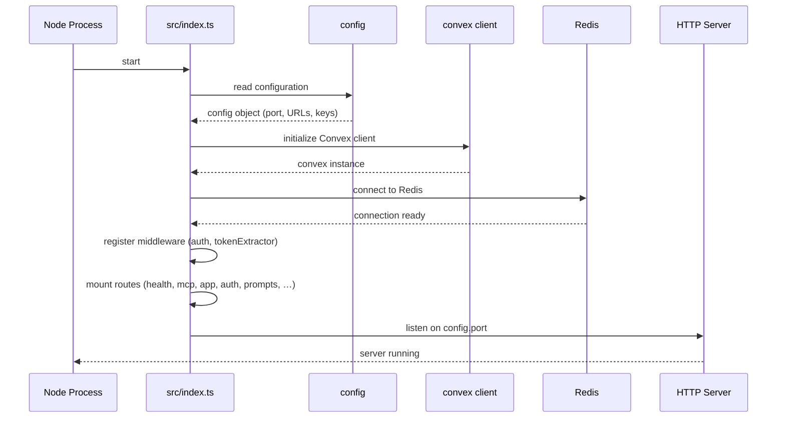

# Server Entry & Config

## Overview

This module forms the foundation of the LiminalDB HTTP server. It contains the application entry point (`src/index.ts`), centralized configuration (`config`), the shared Convex backend client (`convex`), and standardized error codes (`ERROR_CODES`). Nearly every other module in the codebase depends on `config` or `convex` for runtime settings and data access.

## Responsibilities

- Bootstrap the HTTP server, initialize Redis, and register all route handlers and middleware
- Centralize environment-driven configuration (ports, Convex URL, WorkOS keys, feature flags) in a single `config` object
- Provide a shared, pre-configured Convex client instance for backend data operations
- Define a canonical set of error codes and the `ErrorCode` type for consistent error handling across the API

## Structure Diagram

```mermaid
flowchart TD
  index["src/index.ts\n(entry point)"] --> config["src/lib/config.ts\n(config)"]
  index --> convex["src/lib/convex.ts\n(convex client)"]
  index --> redis["src/lib/redis.ts"]
  index --> authMw["src/middleware/auth.ts"]
  index --> tokenEx["src/lib/auth/tokenExtractor.ts"]
  index --> healthApi["src/api/health.ts"]
  index --> mcpApi["src/api/mcp.ts"]
  index --> routeApp["src/routes/app.ts"]
  index --> routeAuth["src/routes/auth.ts"]
  index --> routeDrafts["src/routes/drafts.ts"]
  index --> routeImpExp["src/routes/import-export.ts"]
  index --> routeMod["src/routes/modules.ts"]
  index --> routePref["src/routes/preferences.ts"]
  index --> routePrompts["src/routes/prompts.ts"]
  index --> routeWK["src/routes/well-known.ts"]

  healthApi -.-> config
  healthApi -.-> convex
  mcpApi -.-> config
  routePrompts -.-> config
  routePrompts -.-> convex
  routePref -.-> config
  routePref -.-> convex
  routeImpExp -.-> config
  routeImpExp -.-> convex
  redis -.-> config

  style index fill:#4a90d9,color:#fff
  style config fill:#f5a623,color:#fff
  style convex fill:#f5a623,color:#fff
```

## Entity Table

| Name | Kind | Role | Public Entrypoints | Depends On | Used By |
| --- | --- | --- | --- | --- | --- |
| src/index.ts | file | HTTP server entry point — initializes Redis, applies auth middleware, mounts all route handlers, and starts listening | none | config, convex, src/lib/redis.ts, src/middleware/auth.ts, src/lib/auth/tokenExtractor.ts, src/api/health.ts, src/api/mcp.ts, src/routes/app.ts, src/routes/auth.ts, src/routes/drafts.ts, src/routes/import-export.ts, src/routes/modules.ts, src/routes/preferences.ts, src/routes/prompts.ts, src/routes/well-known.ts | none |
| config | variable | Centralized configuration object sourcing values from environment variables (port, Convex URL, WorkOS credentials, feature flags) | src/lib/config.ts:config | none | src/index.ts, src/api/health.ts, src/api/mcp.ts, src/lib/auth/jwtValidator.ts, src/lib/mcp.ts, src/lib/redis.ts, src/routes/import-export.ts, src/routes/preferences.ts, src/routes/prompts.ts |
| convex | variable | Shared Convex client instance used by routes and services to query/mutate the backend database | src/lib/convex.ts:convex | none | src/api/health.ts, src/lib/mcp.ts, src/routes/import-export.ts, src/routes/preferences.ts, src/routes/prompts.ts |
| ERROR_CODES | constant | Canonical map of error code strings for consistent API error responses | src/lib/errors.ts:ERROR_CODES | none | none |
| ErrorCode | type | TypeScript type derived from ERROR_CODES keys, ensuring type-safe error handling | src/lib/errors.ts:ErrorCode | none | none |

## Key Flow

## Flow Notes

| Step | Actor/Component | Action | Output / Side Effect |
| --- | --- | --- | --- |
| 1 | src/index.ts | Imports and reads the centralized `config` object to obtain port, Convex URL, and other environment settings | Validated configuration available |
| 2 | src/index.ts | Initializes the shared Convex client using the URL from config | Convex client ready for queries and mutations |
| 3 | src/index.ts | Connects to Redis for session/cache support | Redis connection established |
| 4 | src/index.ts | Registers authentication middleware and token extractor on the HTTP app | Incoming requests will be authenticated |
| 5 | src/index.ts | Mounts all route handlers (health, MCP, app, auth, prompts, drafts, modules, preferences, import-export, well-known) | All API endpoints registered |
| 6 | src/index.ts | Starts the HTTP server listening on the configured port | Server accepting connections |

## Source Coverage

- src/index.ts
- src/lib/config.ts
- src/lib/convex.ts
- src/lib/errors.ts

## Cross-Module Context

- src/api/health.ts -> src/lib/config.ts (import)
- src/api/health.ts -> src/lib/convex.ts (import)
- src/api/mcp.ts -> src/lib/config.ts (import)
- src/index.ts -> src/api/health.ts (usage)
- src/index.ts -> src/api/mcp.ts (usage)
- src/index.ts -> src/lib/auth/tokenExtractor.ts (usage)
- src/index.ts -> src/lib/redis.ts (usage)
- src/index.ts -> src/middleware/auth.ts (usage)
- src/index.ts -> src/routes/app.ts (usage)
- src/index.ts -> src/routes/auth.ts (usage)
- src/index.ts -> src/routes/drafts.ts (usage)
- src/index.ts -> src/routes/import-export.ts (usage)
- src/index.ts -> src/routes/modules.ts (usage)
- src/index.ts -> src/routes/preferences.ts (usage)
- src/index.ts -> src/routes/prompts.ts (usage)
- src/index.ts -> src/routes/well-known.ts (usage)
- src/lib/auth/jwtValidator.ts -> src/lib/config.ts (import)
- src/lib/mcp.ts -> src/lib/config.ts (import)
- src/lib/mcp.ts -> src/lib/convex.ts (import)
- src/lib/redis.ts -> src/lib/config.ts (import)
- src/routes/import-export.ts -> src/lib/config.ts (import)
- src/routes/import-export.ts -> src/lib/convex.ts (import)
- src/routes/preferences.ts -> src/lib/config.ts (import)
- src/routes/preferences.ts -> src/lib/convex.ts (import)
- src/routes/prompts.ts -> src/lib/config.ts (import)
- src/routes/prompts.ts -> src/lib/convex.ts (import)
