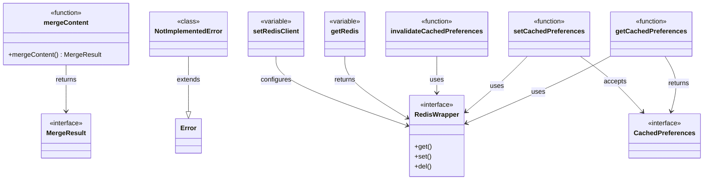
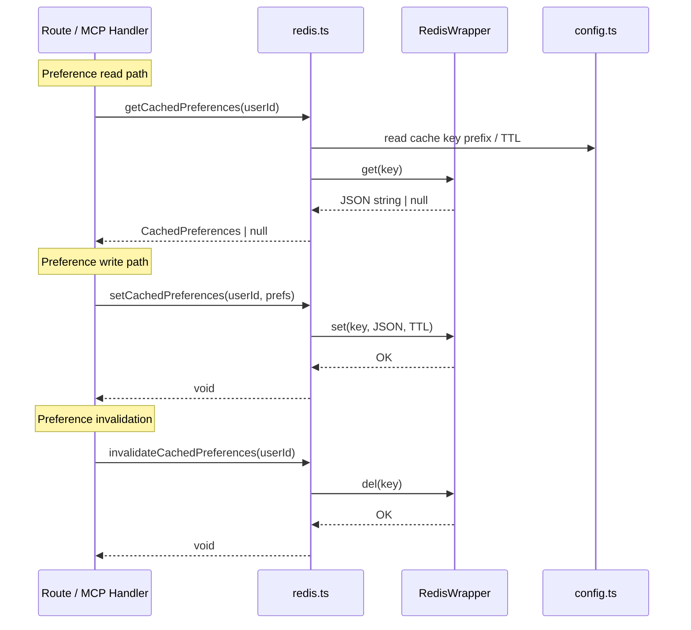

# Server Libraries

## Overview

Shared server-side utilities providing two core capabilities: three-way content merge logic (`merge.ts`) and Redis-backed preference caching (`redis.ts`). These libraries are consumed broadly across routes, the MCP layer, and the application entry point to support conflict resolution during prompt updates and low-latency preference lookups.

## Responsibilities

- Perform three-way content merges and return structured MergeResult outcomes
- Abstract Redis connectivity behind a RedisWrapper interface with injectable client support
- Cache, retrieve, and invalidate user preferences via Redis with typed CachedPreferences
- Provide a NotImplementedError for stub/fallback Redis implementations

## Structure Diagram

## Entity Table

| Name | Kind | Role | Public Entrypoints | Depends On | Used By |
| --- | --- | --- | --- | --- | --- |
| mergeContent | function | Performs three-way content merge, returning a MergeResult with conflict information | src/lib/merge.ts:mergeContent | none | src/lib/mcp.ts, src/routes/prompts.ts |
| MergeResult | interface | Typed return shape for merge operations, indicating success/conflict and merged content | src/lib/merge.ts:MergeResult | none | src/lib/mcp.ts, src/routes/prompts.ts |
| RedisWrapper | interface | Abstraction over Redis client for get/set/del operations, enabling test mocking | src/lib/redis.ts:RedisWrapper | none | src/index.ts, src/lib/mcp.ts, src/routes/drafts.ts, src/routes/preferences.ts, tests/__mocks__/redis.ts |
| CachedPreferences | interface | Shape of user preferences stored in Redis cache | src/lib/redis.ts:CachedPreferences | src/schemas/preferences.ts | src/routes/preferences.ts, src/lib/mcp.ts |
| getRedis | variable | Returns the current Redis client instance (singleton accessor) | src/lib/redis.ts:getRedis | src/lib/config.ts | src/index.ts, src/lib/mcp.ts, src/routes/drafts.ts, src/routes/preferences.ts |
| setRedisClient | variable | Injects a Redis client instance, used at startup and in tests | src/lib/redis.ts:setRedisClient | none | src/index.ts, tests/__mocks__/redis.ts |
| getCachedPreferences | function | Retrieves cached user preferences from Redis by key | src/lib/redis.ts:getCachedPreferences | src/lib/config.ts, src/schemas/preferences.ts | src/lib/mcp.ts, src/routes/drafts.ts, src/routes/preferences.ts |
| setCachedPreferences | function | Writes user preferences to Redis cache with TTL | src/lib/redis.ts:setCachedPreferences | src/lib/config.ts, src/schemas/preferences.ts | src/routes/preferences.ts, src/lib/mcp.ts |
| invalidateCachedPreferences | function | Removes cached preferences from Redis on update/delete | src/lib/redis.ts:invalidateCachedPreferences | src/lib/config.ts | src/routes/preferences.ts, src/lib/mcp.ts |
| NotImplementedError | class | Error subclass thrown by stub Redis implementations when methods are not available | src/lib/redis.ts:NotImplementedError | none | tests/__mocks__/redis.ts |

## Key Flow

## Flow Notes

| Step | Actor/Component | Action | Output / Side Effect |
| --- | --- | --- | --- |
| 1 | src/index.ts | Calls setRedisClient to inject the Redis connection at server startup | RedisWrapper instance registered as singleton |
| 2 | Route / MCP handler | Calls getCachedPreferences(userId) to check for cached user preferences | CachedPreferences object or null |
| 3 | Route / MCP handler | On preference update, calls setCachedPreferences to refresh the cache | Preferences persisted in Redis with TTL |
| 4 | Route / MCP handler | On preference deletion or significant change, calls invalidateCachedPreferences | Cache entry removed from Redis |
| 5 | src/routes/prompts.ts | Calls mergeContent with base, current, and incoming versions for conflict resolution | MergeResult indicating success or conflict with merged content |

## Source Coverage

- src/lib/merge.ts
- src/lib/redis.ts

## Cross-Module Context

- src/index.ts -> src/lib/redis.ts (usage)
- src/lib/mcp.ts -> src/lib/merge.ts (import)
- src/lib/mcp.ts -> src/lib/redis.ts (import)
- src/lib/redis.ts -> src/lib/config.ts (import)
- src/lib/redis.ts -> src/schemas/preferences.ts (import)
- src/routes/drafts.ts -> src/lib/redis.ts (import)
- src/routes/preferences.ts -> src/lib/redis.ts (import)
- src/routes/prompts.ts -> src/lib/merge.ts (import)
- tests/__mocks__/redis.ts -> src/lib/redis.ts (import)
- tests/service/drafts/drafts.test.ts -> src/lib/redis.ts (usage)
- tests/service/lib/merge.test.ts -> src/lib/merge.ts (usage)
