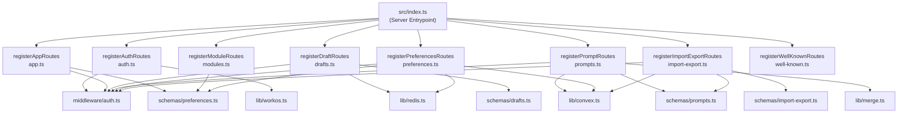
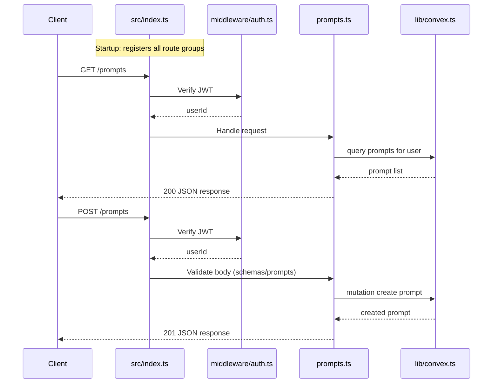

# Server Routes

## Overview

The Server Routes module contains all HTTP route handler registrations for the LiminalDB web application. Each file exports a single `register*Routes` function that mounts a group of related endpoints onto the server. Routes span authentication (WorkOS-backed), CRUD for prompts and drafts, user preferences, bulk import/export, module metadata, and `.well-known` discovery endpoints. The main server entrypoint (`src/index.ts`) calls each registration function at startup to compose the full API surface.

## Responsibilities

- Register authentication routes (login, callback, logout) using WorkOS
- Provide full CRUD endpoints for prompts backed by Convex
- Manage draft lifecycle with Redis-based storage
- Handle user preferences read/write via Convex with Redis caching
- Support bulk import and export of prompt data
- Serve module metadata endpoints
- Expose .well-known discovery endpoints for MCP/OAuth
- Enforce authentication middleware on protected routes

## Structure Diagram

## Entity Table

| Name | Kind | Role | Public Entrypoints | Depends On | Used By |
| --- | --- | --- | --- | --- | --- |
| registerAppRoutes | function | Mounts app-level routes (e.g. dashboard page) with auth guard | registerAppRoutes | middleware/auth.ts, schemas/preferences.ts | src/index.ts |
| registerAuthRoutes | function | Handles login, OAuth callback, and logout flows via WorkOS | registerAuthRoutes | lib/workos.ts, middleware/auth.ts | src/index.ts |
| registerDraftRoutes | function | CRUD for ephemeral prompt drafts stored in Redis | registerDraftRoutes | lib/redis.ts, middleware/auth.ts, schemas/drafts.ts | src/index.ts |
| registerImportExportRoutes | function | Bulk import and export of prompt data via Convex | registerImportExportRoutes | lib/convex.ts, lib/config.ts, middleware/auth.ts, schemas/import-export.ts, schemas/prompts.ts | src/index.ts |
| registerModuleRoutes | function | Serves module metadata endpoints | registerModuleRoutes | schemas/preferences.ts | src/index.ts |
| registerPreferencesRoutes | function | Read/write user preferences via Convex with Redis cache | registerPreferencesRoutes | lib/convex.ts, lib/config.ts, lib/redis.ts, middleware/auth.ts, schemas/preferences.ts | src/index.ts |
| registerPromptRoutes | function | Full CRUD for prompts with merge support, backed by Convex | registerPromptRoutes | lib/convex.ts, lib/config.ts, lib/merge.ts, middleware/auth.ts, schemas/prompts.ts | src/index.ts |
| registerWellKnownRoutes | function | Exposes .well-known discovery endpoints (MCP/OAuth metadata) | registerWellKnownRoutes | none | src/index.ts |

## Key Flow

## Flow Notes

| Step | Actor/Component | Action | Output / Side Effect |
| --- | --- | --- | --- |
| 1 | src/index.ts | Calls each register*Routes function to mount all route groups onto the server | All HTTP endpoints registered |
| 2 | Client | Sends HTTP request to a protected endpoint (e.g. GET /prompts) | Request enters route handler pipeline |
| 3 | middleware/auth.ts | Validates JWT from request, extracts userId | Authenticated context or 401 rejection |
| 4 | Route handler (e.g. prompts.ts) | Validates request body/params against schema, calls Convex/Redis as needed | Data fetched or mutated |
| 5 | Route handler | Returns JSON response to client | HTTP response with status code and payload |

## Source Coverage

- src/routes/app.ts
- src/routes/auth.ts
- src/routes/drafts.ts
- src/routes/import-export.ts
- src/routes/modules.ts
- src/routes/preferences.ts
- src/routes/prompts.ts
- src/routes/well-known.ts

## Cross-Module Context

- src/index.ts -> src/routes/app.ts (usage)
- src/index.ts -> src/routes/auth.ts (usage)
- src/index.ts -> src/routes/drafts.ts (usage)
- src/index.ts -> src/routes/import-export.ts (usage)
- src/index.ts -> src/routes/modules.ts (usage)
- src/index.ts -> src/routes/preferences.ts (usage)
- src/index.ts -> src/routes/prompts.ts (usage)
- src/index.ts -> src/routes/well-known.ts (usage)
- src/routes/app.ts -> src/middleware/auth.ts (import)
- src/routes/app.ts -> src/schemas/preferences.ts (import)
- src/routes/auth.ts -> src/lib/workos.ts (import)
- src/routes/auth.ts -> src/middleware/auth.ts (import)
- src/routes/drafts.ts -> src/lib/redis.ts (import)
- src/routes/drafts.ts -> src/middleware/auth.ts (import)
- src/routes/drafts.ts -> src/schemas/drafts.ts (import)
- src/routes/import-export.ts -> convex/_generated/api.d.ts (import)
- src/routes/import-export.ts -> src/lib/config.ts (import)
- src/routes/import-export.ts -> src/lib/convex.ts (import)
- src/routes/import-export.ts -> src/middleware/auth.ts (import)
- src/routes/import-export.ts -> src/schemas/import-export.ts (import)
- src/routes/import-export.ts -> src/schemas/prompts.ts (import)
- src/routes/modules.ts -> src/schemas/preferences.ts (import)
- src/routes/preferences.ts -> convex/_generated/api.d.ts (import)
- src/routes/preferences.ts -> src/lib/config.ts (import)
- src/routes/preferences.ts -> src/lib/convex.ts (import)
- src/routes/preferences.ts -> src/lib/redis.ts (import)
- src/routes/preferences.ts -> src/middleware/auth.ts (import)
- src/routes/preferences.ts -> src/schemas/preferences.ts (import)
- src/routes/prompts.ts -> convex/_generated/api.d.ts (import)
- src/routes/prompts.ts -> src/lib/config.ts (import)
- src/routes/prompts.ts -> src/lib/convex.ts (import)
- src/routes/prompts.ts -> src/lib/merge.ts (import)
- src/routes/prompts.ts -> src/middleware/auth.ts (import)
- src/routes/prompts.ts -> src/schemas/prompts.ts (import)
- tests/service/auth/routes.test.ts -> src/routes/auth.ts (usage)
- tests/service/drafts/drafts.test.ts -> src/routes/drafts.ts (usage)
- tests/service/mcp/well-known.test.ts -> src/routes/well-known.ts (usage)
- tests/service/prompts/createPrompts.test.ts -> src/routes/prompts.ts (usage)
- tests/service/prompts/deletePrompt.test.ts -> src/routes/prompts.ts (usage)
- tests/service/prompts/edgeCases.test.ts -> src/routes/prompts.ts (usage)
- tests/service/prompts/getPrompt.test.ts -> src/routes/prompts.ts (usage)
- tests/service/prompts/importExport.test.ts -> src/routes/import-export.ts (usage)
- tests/service/prompts/updatePrompt.test.ts -> src/routes/prompts.ts (usage)
