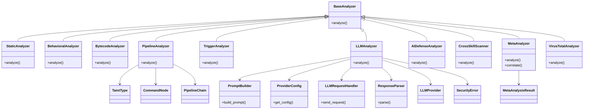

# Skill Scanner: Analyzers

## Overview

A suite of security analyzer implementations for the Skill Scanner subsystem. Each analyzer extends `BaseAnalyzer` and targets a specific security analysis dimension—from static pattern matching and bytecode inspection to LLM-powered semantic analysis, behavioral sandboxing, and VirusTotal integration. The `analyzer_factory` module provides factory functions (`build_analyzers`, `build_core_analyzers`) to instantiate and compose the appropriate set of analyzers. A `MetaAnalyzer` aggregates and correlates findings across all individual analyzers, while `CrossSkillScanner` examines inter-skill attack surfaces.

## Responsibilities

- Define a common `BaseAnalyzer` interface for all security analyzers
- Perform static pattern-based security analysis of skill source code (StaticAnalyzer)
- Analyze Python bytecode for suspicious operations (BytecodeAnalyzer)
- Execute behavioral analysis by running skills in a sandboxed environment (BehavioralAnalyzer)
- Detect dangerous command pipelines and taint propagation (PipelineAnalyzer)
- Identify time-bomb and conditional trigger patterns (TriggerAnalyzer)
- Leverage LLM providers for semantic security review (LLMAnalyzer with PromptBuilder, ProviderConfig, LLMRequestHandler, ResponseParser)
- Integrate with AI-specific defense heuristics (AIDefenseAnalyzer)
- Scan for cross-skill interaction vulnerabilities (CrossSkillScanner)
- Correlate and synthesize findings from multiple analyzers (MetaAnalyzer)
- Check files against VirusTotal threat intelligence (VirusTotalAnalyzer)
- Provide factory functions to build analyzer pipelines from configuration (build_analyzers, build_core_analyzers)

## Structure Diagram

## Entity Table

| Name | Kind | Role | Public Entrypoints | Depends On | Used By |
| --- | --- | --- | --- | --- | --- |
| BaseAnalyzer | class | Abstract base class defining the analyzer interface | analyze() | none | StaticAnalyzer, BehavioralAnalyzer, BytecodeAnalyzer, PipelineAnalyzer, TriggerAnalyzer, LLMAnalyzer, AIDefenseAnalyzer, CrossSkillScanner, MetaAnalyzer, VirusTotalAnalyzer |
| StaticAnalyzer | class | Pattern-based static analysis of skill source code (2234 LOC, largest analyzer) | analyze() | BaseAnalyzer | build_core_analyzers |
| BehavioralAnalyzer | class | Sandbox-based behavioral analysis of skill execution | analyze() | BaseAnalyzer | build_analyzers |
| BytecodeAnalyzer | class | Inspects Python bytecode for suspicious operations | analyze() | BaseAnalyzer | build_core_analyzers |
| PipelineAnalyzer | class | Detects dangerous command pipelines with taint tracking | analyze() | BaseAnalyzer, TaintType, CommandNode, PipelineChain | build_core_analyzers |
| TriggerAnalyzer | class | Identifies time-bomb and conditional trigger patterns | analyze() | BaseAnalyzer | build_core_analyzers |
| LLMAnalyzer | class | Sends skill code to an LLM for semantic security review | analyze() | BaseAnalyzer, PromptBuilder, ProviderConfig, LLMRequestHandler, ResponseParser, LLMProvider | build_analyzers |
| PromptBuilder | class | Constructs security-focused prompts for LLM analysis | build_prompt() | none | LLMAnalyzer |
| ProviderConfig | class | Configuration for LLM provider endpoints and credentials | get_config() | none | LLMAnalyzer |
| LLMRequestHandler | class | Handles HTTP requests to LLM provider APIs | send_request() | none | LLMAnalyzer |
| ResponseParser | class | Parses structured security findings from LLM responses | parse() | none | LLMAnalyzer |
| AIDefenseAnalyzer | class | AI-specific defense heuristics (prompt injection, model extraction, etc.) | analyze() | BaseAnalyzer | build_analyzers |
| CrossSkillScanner | class | Scans for inter-skill interaction vulnerabilities | analyze() | BaseAnalyzer | build_analyzers |
| MetaAnalyzer | class | Correlates and synthesizes findings from all other analyzers | analyze() | BaseAnalyzer, MetaAnalysisResult | build_analyzers |
| VirusTotalAnalyzer | class | Checks skill files against VirusTotal threat intelligence | analyze() | BaseAnalyzer | build_analyzers |
| TaintType | class | Enum or type representing taint categories in pipeline analysis | none | none | PipelineAnalyzer |
| CommandNode | class | Represents a single command in a pipeline chain | none | none | PipelineAnalyzer |
| PipelineChain | class | Represents a chain of piped commands for analysis | none | none | PipelineAnalyzer |
| MetaAnalysisResult | class | Data class holding correlated findings from meta-analysis | none | none | MetaAnalyzer, apply_meta_analysis_to_results |
| build_analyzers | function | Factory function that builds the full set of analyzers from config | build_analyzers() | StaticAnalyzer, BehavioralAnalyzer, BytecodeAnalyzer, PipelineAnalyzer, TriggerAnalyzer, LLMAnalyzer, AIDefenseAnalyzer, CrossSkillScanner, MetaAnalyzer, VirusTotalAnalyzer | none |
| build_core_analyzers | function | Factory function that builds the core (non-external) analyzer subset | build_core_analyzers() | StaticAnalyzer, BytecodeAnalyzer, PipelineAnalyzer, TriggerAnalyzer | none |
| apply_meta_analysis_to_results | function | Applies meta-analysis correlation to a set of analyzer results | apply_meta_analysis_to_results() | MetaAnalysisResult | none |

## Source Coverage

- vendor/skill-scanner/skill_scanner/core/analyzer_factory.py
- vendor/skill-scanner/skill_scanner/core/analyzers/__init__.py
- vendor/skill-scanner/skill_scanner/core/analyzers/aidefense_analyzer.py
- vendor/skill-scanner/skill_scanner/core/analyzers/base.py
- vendor/skill-scanner/skill_scanner/core/analyzers/behavioral_analyzer.py
- vendor/skill-scanner/skill_scanner/core/analyzers/bytecode_analyzer.py
- vendor/skill-scanner/skill_scanner/core/analyzers/cross_skill_scanner.py
- vendor/skill-scanner/skill_scanner/core/analyzers/llm_analyzer.py
- vendor/skill-scanner/skill_scanner/core/analyzers/llm_prompt_builder.py
- vendor/skill-scanner/skill_scanner/core/analyzers/llm_provider_config.py
- vendor/skill-scanner/skill_scanner/core/analyzers/llm_request_handler.py
- vendor/skill-scanner/skill_scanner/core/analyzers/llm_response_parser.py
- vendor/skill-scanner/skill_scanner/core/analyzers/meta_analyzer.py
- vendor/skill-scanner/skill_scanner/core/analyzers/pipeline_analyzer.py
- vendor/skill-scanner/skill_scanner/core/analyzers/static.py
- vendor/skill-scanner/skill_scanner/core/analyzers/trigger_analyzer.py
- vendor/skill-scanner/skill_scanner/core/analyzers/virustotal_analyzer.py
