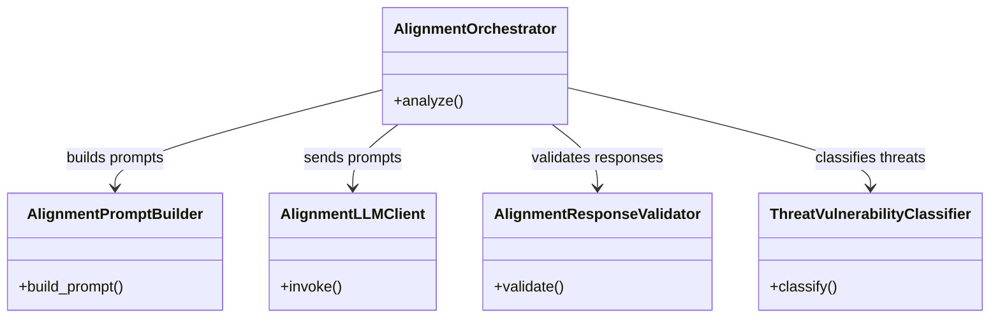
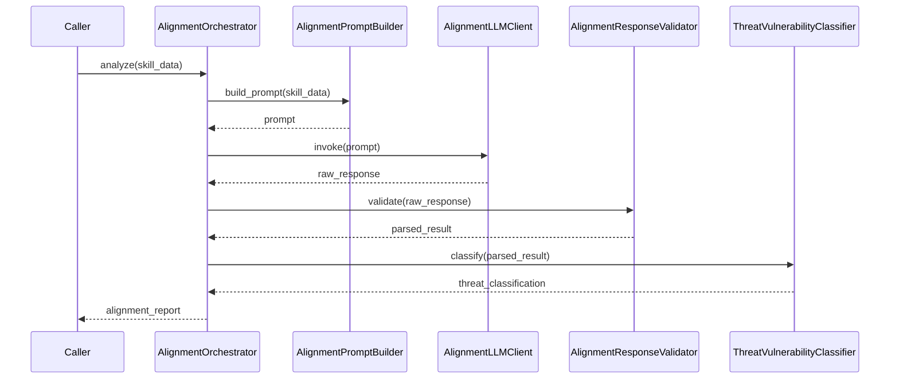

# Skill Scanner: Behavioral Alignment

## Overview

Behavioral alignment analysis subsystem within the Skill Scanner vendor package. This module evaluates skills for alignment with expected behavioral norms by orchestrating LLM-based analysis, constructing specialized prompts, validating responses, and classifying threat/vulnerability levels. The subsystem follows a pipeline pattern: the orchestrator coordinates prompt construction, LLM invocation, response validation, and threat classification.

## Responsibilities

- Orchestrate end-to-end behavioral alignment analysis of scanned skills
- Build structured prompts for LLM-based alignment evaluation
- Communicate with an LLM backend to obtain alignment assessments
- Validate and parse LLM responses for correctness and completeness
- Classify detected threats and vulnerabilities from alignment results

## Structure Diagram

## Entity Table

| Name | Kind | Role | Public Entrypoints | Depends On | Used By |
| --- | --- | --- | --- | --- | --- |
| AlignmentOrchestrator | class | Central coordinator that drives the alignment analysis pipeline, delegating to prompt builder, LLM client, response validator, and threat classifier. | AlignmentOrchestrator | AlignmentPromptBuilder, AlignmentLLMClient, AlignmentResponseValidator, ThreatVulnerabilityClassifier | none |
| AlignmentPromptBuilder | class | Constructs structured prompts for the alignment LLM, encoding skill metadata and evaluation criteria. | AlignmentPromptBuilder | none | AlignmentOrchestrator |
| AlignmentLLMClient | class | Handles communication with an LLM backend to obtain behavioral alignment assessments. | AlignmentLLMClient | none | AlignmentOrchestrator |
| AlignmentResponseValidator | class | Validates and parses raw LLM responses, ensuring structural correctness before downstream processing. | AlignmentResponseValidator | none | AlignmentOrchestrator |
| ThreatVulnerabilityClassifier | class | Classifies alignment findings into threat and vulnerability categories with severity levels. | ThreatVulnerabilityClassifier | none | AlignmentOrchestrator |
| behavioral/__init__.py | file | Package init for the behavioral analyzers namespace. | none | none | none |
| alignment/__init__.py | file | Package init for the alignment sub-package; may re-export key classes. | none | none | none |

## Key Flow

## Flow Notes

| Step | Actor/Component | Action | Output / Side Effect |
| --- | --- | --- | --- |
| 1 | AlignmentOrchestrator | Receives skill data and initiates the alignment analysis pipeline. | Pipeline execution begins |
| 2 | AlignmentPromptBuilder | Constructs a structured prompt encoding skill metadata and alignment evaluation criteria. | LLM-ready prompt |
| 3 | AlignmentLLMClient | Sends the prompt to the LLM backend and retrieves the raw assessment response. | Raw LLM response |
| 4 | AlignmentResponseValidator | Validates the raw response for structural correctness and parses it into a typed result. | Parsed alignment result |
| 5 | ThreatVulnerabilityClassifier | Classifies the parsed result into threat and vulnerability categories with severity levels. | Threat/vulnerability classification |

## Source Coverage

- vendor/skill-scanner/skill_scanner/core/analyzers/behavioral/__init__.py
- vendor/skill-scanner/skill_scanner/core/analyzers/behavioral/alignment/__init__.py
- vendor/skill-scanner/skill_scanner/core/analyzers/behavioral/alignment/alignment_llm_client.py
- vendor/skill-scanner/skill_scanner/core/analyzers/behavioral/alignment/alignment_orchestrator.py
- vendor/skill-scanner/skill_scanner/core/analyzers/behavioral/alignment/alignment_prompt_builder.py
- vendor/skill-scanner/skill_scanner/core/analyzers/behavioral/alignment/alignment_response_validator.py
- vendor/skill-scanner/skill_scanner/core/analyzers/behavioral/alignment/threat_vulnerability_classifier.py
