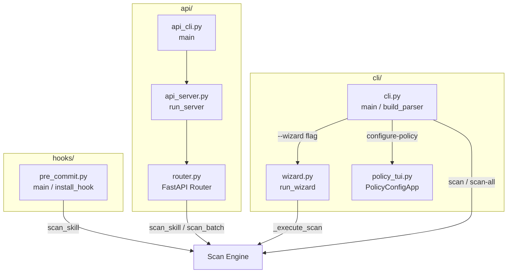
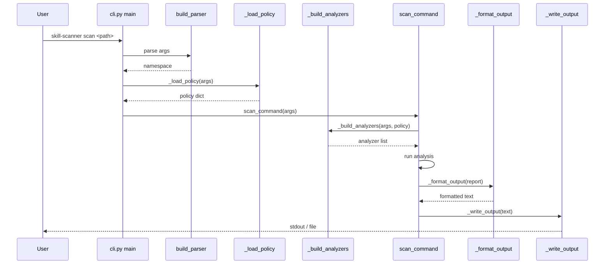

# Skill Scanner: CLI & API

## Overview

This module provides all user-facing entry points for the Skill Scanner tool: a full-featured CLI with subcommands (scan, scan-all, list-analyzers, validate-rules, generate-policy, configure-policy), an interactive wizard for guided scanning, a Textual-based TUI for policy editing, a FastAPI REST server for programmatic access, and a Git pre-commit hook that gates commits on scan findings.

## Responsibilities

- Parse CLI arguments and dispatch to scan, scan-all, list-analyzers, validate-rules, generate-policy, and configure-policy subcommands
- Run an interactive wizard that guides users through skill selection, analyzer choice, output format, and severity thresholds
- Provide a Textual TUI (PolicyConfigApp) for visually editing scan policy files
- Expose a REST API (FastAPI router) with endpoints for single-skill scan, file-upload scan, batch scan, health check, and analyzer listing
- Implement a Git pre-commit hook that detects staged skill files, scans them, and blocks commits exceeding a severity threshold
- Load and resolve scan policies across CLI, API, and hook entry points
- Format and write scan output in multiple formats (JSON, SARIF, text, etc.)

## Structure Diagram

## Entity Table

| Name | Kind | Role | Public Entrypoints | Depends On | Used By |
| --- | --- | --- | --- | --- | --- |
| cli.py | module | Main CLI entry point — argument parsing, subcommand dispatch (scan, scan-all, list-analyzers, validate-rules, generate-policy, configure-policy), output formatting, and summary generation | main, build_parser, scan_command, scan_all_command, list_analyzers_command, validate_rules_command, generate_policy_command, configure_policy_command | wizard.py, policy_tui.py | none |
| wizard.py | module | Interactive wizard that walks users through scan configuration — skill discovery, analyzer selection, policy, format, severity, and execution | run_wizard | none | cli.py |
| PolicyConfigApp | class | Textual TUI application for visually editing policy YAML files with set-editor screens | run_policy_tui | SetEditorScreen | cli.py |
| SetEditorScreen | class | Textual screen for editing set-valued policy fields (e.g., allowed analyzers, rule tags) | none | none | PolicyConfigApp |
| router.py | module | FastAPI router defining REST endpoints — single scan, upload scan, batch scan, health check, and analyzer listing, with bounded result caching | root, health_check, scan_skill, scan_uploaded_skill, scan_batch, get_batch_scan_result, list_analyzers | none | api_server.py |
| ScanRequest / ScanResponse / BatchScanRequest / HealthResponse | class | Pydantic request/response models for the REST API | none | none | router.py |
| _BoundedCache | class | LRU-bounded in-memory cache for batch scan results | none | none | router.py |
| api_server.py | module | Uvicorn launcher that mounts the FastAPI app with the scanner router | run_server | router.py | api_cli.py |
| api_cli.py | module | Argument parser for the `skill-scanner-api` CLI entry point | main | api_server.py | none |
| pre_commit.py | module | Git pre-commit hook — loads config, identifies staged skill files, scans them, and exits non-zero when findings exceed the configured severity threshold | main, install_hook | none | none |

## Key Flow

## Flow Notes

| Step | Actor/Component | Action | Output / Side Effect |
| --- | --- | --- | --- |
| 1 | User | Invokes `skill-scanner scan <path>` (or scan-all, wizard, etc.) | Parsed argument namespace |
| 2 | cli.py | Loads policy from file or defaults via _load_policy, resolves fail-severity | Policy configuration |
| 3 | cli.py | Builds analyzer pipeline via _build_analyzers (and optionally meta-analyzer) | List of configured analyzers |
| 4 | Scan Engine | Runs all analyzers against the target skill(s) and collects findings | Scan report with findings |
| 5 | cli.py | Formats output (_format_output) and writes to stdout or file (_write_output); exits non-zero if findings exceed --fail-severity | Formatted scan results |

## Source Coverage

- vendor/skill-scanner/skill_scanner/api/__init__.py
- vendor/skill-scanner/skill_scanner/api/api.py
- vendor/skill-scanner/skill_scanner/api/api_cli.py
- vendor/skill-scanner/skill_scanner/api/api_server.py
- vendor/skill-scanner/skill_scanner/api/router.py
- vendor/skill-scanner/skill_scanner/cli/__init__.py
- vendor/skill-scanner/skill_scanner/cli/cli.py
- vendor/skill-scanner/skill_scanner/cli/policy_tui.py
- vendor/skill-scanner/skill_scanner/cli/wizard.py
- vendor/skill-scanner/skill_scanner/hooks/__init__.py
- vendor/skill-scanner/skill_scanner/hooks/pre_commit.py
