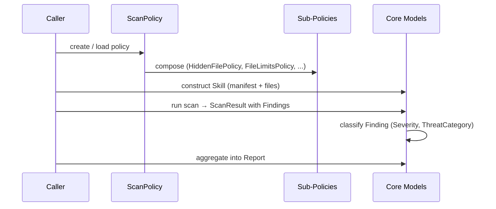

# Skill Scanner: Core Models & Config

## Overview

Foundation layer of the `skill-scanner` vendor package, defining the core domain model for skill security scanning. This module provides data classes for representing skills, scan findings, and reports; enumerations for severity and threat classification; a rich policy system for configuring scan behavior; YARA mode configurations; global constants; and a typed exception hierarchy. All other scanner modules depend on these definitions.

## Responsibilities

- Define the domain model: Skill, SkillFile, SkillManifest, Finding, ScanResult, Report
- Classify findings by Severity (enum) and ThreatCategory (enum)
- Provide a composable ScanPolicy built from granular sub-policies (hidden files, credentials, file limits, analyzers, LLM analysis, etc.)
- Supply YARA mode configuration for unicode steganography, credential harvesting, and tool-chaining detection
- Centralize scanner-wide constants via SkillScannerConstants
- Expose a typed exception hierarchy rooted at SkillScannerError
- Offer lazy top-level imports via __getattr__ in the package init

## Structure Diagram

```mermaid
classDiagram
    class Severity {
        <<enum>>
    }
    class ThreatCategory {
        <<enum>>
    }
    class SkillManifest
    class SkillFile
    class Skill {
        +manifest: SkillManifest
        +files: list~SkillFile~
    }
    class Finding {
        +severity: Severity
        +category: ThreatCategory
    }
    class ScanResult {
        +findings: list~Finding~
    }
    class Report {
        +results: list~ScanResult~
    }

    Skill --> SkillManifest
    Skill --> SkillFile
    Finding --> Severity
    Finding --> ThreatCategory
    ScanResult --> Finding
    Report --> ScanResult

    class SkillScannerError
    class SkillLoadError
    class SkillAnalysisError
    class SkillValidationError
    SkillScannerError <|-- SkillLoadError
    SkillScannerError <|-- SkillAnalysisError
    SkillScannerError <|-- SkillValidationError

    class Config
    class SkillScannerConstants

    class YaraMode {
        <<enum>>
    }
    class UnicodeStegConfig
    class CredentialHarvestingConfig
    class ToolChainingConfig
    class YaraModeConfig {
        +unicode_steg: UnicodeStegConfig
        +credential_harvesting: CredentialHarvestingConfig
        +tool_chaining: ToolChainingConfig
    }
    YaraModeConfig --> UnicodeStegConfig
    YaraModeConfig --> CredentialHarvestingConfig
    YaraModeConfig --> ToolChainingConfig
    YaraModeConfig --> YaraMode

    class ScanPolicy {
        +hidden_files: HiddenFilePolicy
        +pipeline: PipelinePolicy
        +credentials: CredentialPolicy
        +file_limits: FileLimitsPolicy
        +analyzers: AnalyzersPolicy
        +llm: LLMAnalysisPolicy
    }
    class HiddenFilePolicy
    class PipelinePolicy
    class RuleScopingPolicy
    class CredentialPolicy
    class SystemCleanupPolicy
    class FileClassificationPolicy
    class FileLimitsPolicy
    class AnalysisThresholdsPolicy
    class SensitiveFilesPolicy
    class CommandSafetyPolicy
    class AnalyzersPolicy
    class LLMAnalysisPolicy
    class FindingOutputPolicy
    class SeverityOverride

    ScanPolicy --> HiddenFilePolicy
    ScanPolicy --> PipelinePolicy
    ScanPolicy --> RuleScopingPolicy
    ScanPolicy --> CredentialPolicy
    ScanPolicy --> SystemCleanupPolicy
    ScanPolicy --> FileClassificationPolicy
    ScanPolicy --> FileLimitsPolicy
    ScanPolicy --> AnalysisThresholdsPolicy
    ScanPolicy --> SensitiveFilesPolicy
    ScanPolicy --> CommandSafetyPolicy
    ScanPolicy --> AnalyzersPolicy
    ScanPolicy --> LLMAnalysisPolicy
    ScanPolicy --> FindingOutputPolicy
    ScanPolicy --> SeverityOverride
```

## Entity Table

| Name | Kind | Role | Public Entrypoints | Depends On | Used By |
| --- | --- | --- | --- | --- | --- |
| Severity | class (enum) | Enumerates finding severity levels | core/models.py | none | Finding, SeverityOverride |
| ThreatCategory | class (enum) | Enumerates threat categories for findings | core/models.py | none | Finding |
| SkillManifest | class | Represents skill metadata/manifest | core/models.py | none | Skill |
| SkillFile | class | Represents a single file within a skill | core/models.py | none | Skill |
| Skill | class | Top-level skill entity containing manifest and files | core/models.py | SkillManifest, SkillFile | none |
| Finding | class | A single security finding with severity and category | core/models.py | Severity, ThreatCategory | ScanResult |
| ScanResult | class | Aggregated result of a scan containing findings | core/models.py | Finding | Report |
| Report | class | Final scan report aggregating scan results | core/models.py | ScanResult | none |
| SkillScannerError | class | Base exception for all skill scanner errors | core/exceptions.py | none | SkillLoadError, SkillAnalysisError, SkillValidationError |
| SkillLoadError | class | Raised when a skill fails to load | core/exceptions.py | SkillScannerError | none |
| SkillAnalysisError | class | Raised on analysis failures | core/exceptions.py | SkillScannerError | none |
| SkillValidationError | class | Raised on validation failures | core/exceptions.py | SkillScannerError | none |
| Config | class | Top-level scanner configuration | config/config.py | none | none |
| SkillScannerConstants | class | Centralized scanner-wide constants | config/constants.py | none | none |
| YaraMode | class (enum) | Enumerates YARA scanning modes | config/yara_modes.py | none | YaraModeConfig |
| YaraModeConfig | class | Composite config for all YARA detection modes | config/yara_modes.py | YaraMode, UnicodeStegConfig, CredentialHarvestingConfig, ToolChainingConfig | none |
| UnicodeStegConfig | class | Config for unicode steganography detection | config/yara_modes.py | none | YaraModeConfig |
| CredentialHarvestingConfig | class | Config for credential harvesting detection | config/yara_modes.py | none | YaraModeConfig |
| ToolChainingConfig | class | Config for tool-chaining attack detection | config/yara_modes.py | none | YaraModeConfig |
| ScanPolicy | class | Top-level policy composing all granular sub-policies | core/scan_policy.py | HiddenFilePolicy, PipelinePolicy, RuleScopingPolicy, CredentialPolicy, SystemCleanupPolicy, FileClassificationPolicy, FileLimitsPolicy, AnalysisThresholdsPolicy, SensitiveFilesPolicy, CommandSafetyPolicy, AnalyzersPolicy, LLMAnalysisPolicy, FindingOutputPolicy, SeverityOverride | none |
| HiddenFilePolicy | class | Policy for handling hidden files during scans | core/scan_policy.py | none | ScanPolicy |
| PipelinePolicy | class | Policy for scan pipeline configuration | core/scan_policy.py | none | ScanPolicy |
| RuleScopingPolicy | class | Policy for scoping which rules apply | core/scan_policy.py | none | ScanPolicy |
| CredentialPolicy | class | Policy for credential-related scan rules | core/scan_policy.py | none | ScanPolicy |
| FileLimitsPolicy | class | Policy for file size and count limits | core/scan_policy.py | none | ScanPolicy |
| AnalyzersPolicy | class | Policy controlling which analyzers are enabled | core/scan_policy.py | none | ScanPolicy |
| LLMAnalysisPolicy | class | Policy for LLM-based analysis configuration | core/scan_policy.py | none | ScanPolicy |
| SeverityOverride | class | Policy for overriding finding severity levels | core/scan_policy.py | none | ScanPolicy |

## Key Flow

## Flow Notes

| Step | Actor/Component | Action | Output / Side Effect |
| --- | --- | --- | --- |
| 1 | Caller | Creates or loads a ScanPolicy composed of granular sub-policies | Configured ScanPolicy instance |
| 2 | Caller | Constructs a Skill with SkillManifest and SkillFiles | Skill ready for scanning |
| 3 | Scanner (external) | Produces Findings classified by Severity and ThreatCategory | ScanResult containing findings |
| 4 | Scanner (external) | Aggregates ScanResults into a Report | Final Report |

## Source Coverage

- vendor/skill-scanner/skill_scanner/__init__.py
- vendor/skill-scanner/skill_scanner/config/__init__.py
- vendor/skill-scanner/skill_scanner/config/config.py
- vendor/skill-scanner/skill_scanner/config/constants.py
- vendor/skill-scanner/skill_scanner/config/yara_modes.py
- vendor/skill-scanner/skill_scanner/core/__init__.py
- vendor/skill-scanner/skill_scanner/core/exceptions.py
- vendor/skill-scanner/skill_scanner/core/models.py
- vendor/skill-scanner/skill_scanner/core/scan_policy.py
