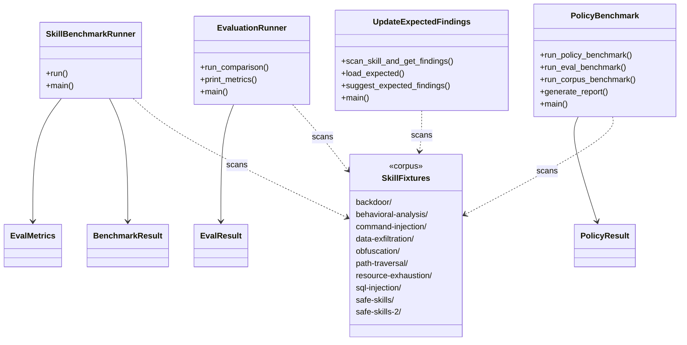
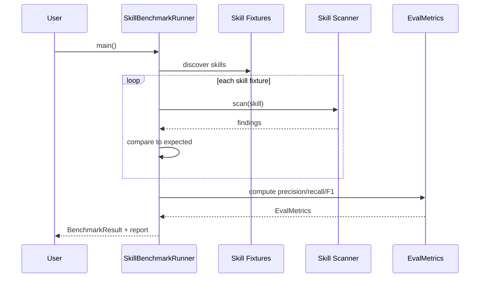

# Skill Scanner: Evals

## Overview

Evaluation framework for the Skill Scanner, providing benchmark runners that measure scanner accuracy against a curated corpus of sample skill fixtures. The module contains four runner tools (benchmark, eval, policy benchmark, and expected-findings updater) plus a library of categorized skill fixtures spanning malicious patterns (backdoor, exfiltration, injection, obfuscation, resource exhaustion) and safe baselines.

## Responsibilities

- Run skill-level benchmarks and compute precision/recall metrics via SkillBenchmarkRunner
- Execute comparative evaluations between scanner configurations via EvaluationRunner
- Benchmark scanner behavior against security policies with severity bucketing via policy_benchmark
- Auto-update expected findings for skill fixtures via update_expected_findings
- Provide a diverse corpus of malicious and safe skill fixtures for scanner testing

## Structure Diagram

## Entity Table

| Name | Kind | Role | Public Entrypoints | Depends On | Used By |
| --- | --- | --- | --- | --- | --- |
| SkillBenchmarkRunner | class | Runs scanner against skill corpus and computes EvalMetrics (precision, recall, etc.) | main() | EvalMetrics, BenchmarkResult | none |
| EvalMetrics | class | Data class holding evaluation metrics (precision, recall, F1, etc.) | none | none | SkillBenchmarkRunner |
| BenchmarkResult | class | Data class capturing per-skill benchmark outcome | none | none | SkillBenchmarkRunner |
| EvaluationRunner | class | Runs comparative evaluations between scanner configurations | run_comparison(), print_metrics(), main() | EvalResult | none |
| EvalResult | class | Data class for individual evaluation outcomes | none | none | EvaluationRunner |
| policy_benchmark | module | Benchmarks scanner against security policies; supports eval, corpus, and policy modes with report generation | run_policy_benchmark(), run_eval_benchmark(), run_corpus_benchmark(), generate_report(), main() | PolicyResult | none |
| PolicyResult | class | Data class for policy benchmark outcomes | none | none | policy_benchmark |
| update_expected_findings | module | Scans skills and suggests/updates expected findings for the fixture corpus | scan_skill_and_get_findings(), suggest_expected_findings(), load_expected(), main() | none | none |
| skills (fixture corpus) | directory | Curated sample skills spanning 8+ vulnerability categories and 2 safe baselines used as ground-truth for evaluations | none | none | SkillBenchmarkRunner, EvaluationRunner, policy_benchmark, update_expected_findings |
| test_skills | directory | Additional test fixtures (malicious exfiltrator, safe formatter) for quick smoke tests | none | none | SkillBenchmarkRunner, EvaluationRunner |

## Key Flow

## Flow Notes

| Step | Actor/Component | Action | Output / Side Effect |
| --- | --- | --- | --- |
| 1 | User | Invokes a runner CLI (benchmark_runner, eval_runner, or policy_benchmark) | Runner initializes and discovers skill fixtures |
| 2 | Runner | Iterates over the skill corpus, invoking the scanner on each fixture | Raw findings per skill |
| 3 | Runner | Compares actual findings against expected findings for each skill | True/false positive/negative classification |
| 4 | Runner | Aggregates classifications into metrics (precision, recall, F1) or policy compliance results | EvalMetrics / PolicyResult / EvalResult |
| 5 | Runner | Prints or generates a report summarizing benchmark outcomes | Console output or report file |

## Source Coverage

- vendor/skill-scanner/evals/__init__.py
- vendor/skill-scanner/evals/runners/__init__.py
- vendor/skill-scanner/evals/runners/benchmark_runner.py
- vendor/skill-scanner/evals/runners/eval_runner.py
- vendor/skill-scanner/evals/runners/policy_benchmark.py
- vendor/skill-scanner/evals/runners/update_expected_findings.py
- vendor/skill-scanner/evals/skills/backdoor/magic-string-trigger/process.py
- vendor/skill-scanner/evals/skills/behavioral-analysis/multi-file-exfiltration/analyze.py
- vendor/skill-scanner/evals/skills/behavioral-analysis/multi-file-exfiltration/collector.py
- vendor/skill-scanner/evals/skills/behavioral-analysis/multi-file-exfiltration/encoder.py
- vendor/skill-scanner/evals/skills/behavioral-analysis/multi-file-exfiltration/reporter.py
- vendor/skill-scanner/evals/skills/command-injection/eval-execution/calculate.py
- vendor/skill-scanner/evals/skills/data-exfiltration/environment-secrets/get_info.py
- vendor/skill-scanner/evals/skills/obfuscation/base64-payload/process.py
- vendor/skill-scanner/evals/skills/path-traversal/file-reader/read.py
- vendor/skill-scanner/evals/skills/resource-exhaustion/infinite-loop/analyze.py
- vendor/skill-scanner/evals/skills/safe-skills-2/file-validator/validate.py
- vendor/skill-scanner/evals/skills/safe-skills/simple-math/math_ops.py
- vendor/skill-scanner/evals/skills/sql-injection/database-query/query.py
- vendor/skill-scanner/evals/test_skills/malicious/exfiltrator/analyze.py
- vendor/skill-scanner/evals/test_skills/safe/simple-formatter/formatter.py
