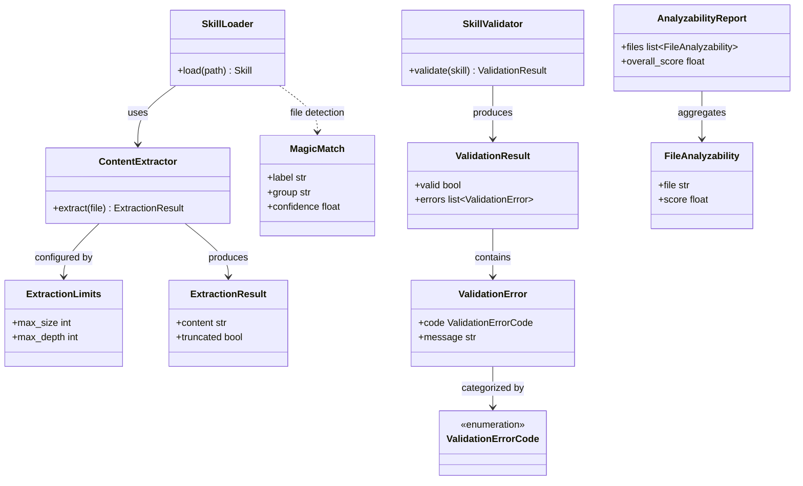
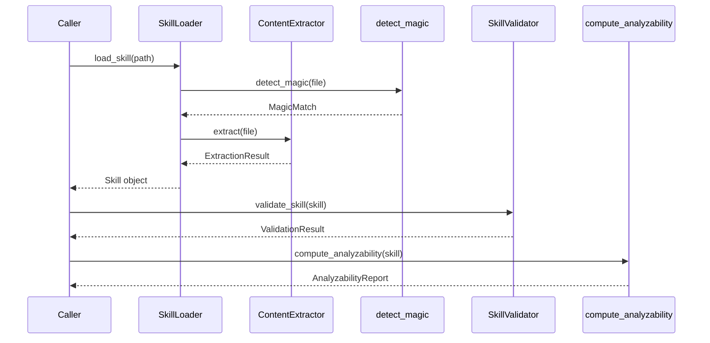

# Skill Scanner: Loader & Extractors

## Overview

This module provides the core pipeline for ingesting skill packages in the skill-scanner subsystem. It handles loading skills from directories or archives, extracting file content with configurable limits, detecting file types via magic bytes and Magika, enforcing strict structural validation rules, and scoring how analyzable a skill's files are. Together these components form a layered ingestion and quality-gate pipeline for skill packages.

## Responsibilities

- Load skill packages from local directories or compressed archives
- Extract textual content from skill files with configurable size and depth limits
- Detect file types using magic-byte signatures and the Magika library, flagging extension mismatches
- Validate skill package structure against strict rules, producing typed error codes
- Compute per-file and aggregate analyzability scores for a loaded skill

## Structure Diagram

## Entity Table

| Name | Kind | Role | Public Entrypoints | Depends On | Used By |
| --- | --- | --- | --- | --- | --- |
| SkillLoader | class | Loads skill packages from directories or archives into an in-memory representation | load_skill | ContentExtractor, MagicMatch | none |
| load_skill | function | Module-level convenience function to load a skill from a given path | load_skill | SkillLoader | none |
| ContentExtractor | class | Extracts textual content from skill files respecting configurable limits | ContentExtractor | ExtractionLimits | SkillLoader |
| ExtractionLimits | class | Configuration object defining max size, depth, and other extraction constraints | ExtractionLimits | none | ContentExtractor |
| ExtractionResult | class | Data object holding extracted content and metadata (e.g., truncation flag) | ExtractionResult | none | ContentExtractor |
| MagicMatch | class | Result of file-type detection containing label, group, and confidence | MagicMatch | none | detect_magic, detect_magic_from_bytes |
| detect_magic | function | Detects file type from a file path using Magika or legacy magic-byte matching | detect_magic | _get_magika, _detect_magic_legacy, _magika_result_to_match | none |
| detect_magic_from_bytes | function | Detects file type from raw bytes using Magika or legacy magic-byte matching | detect_magic_from_bytes | _get_magika, _detect_magic_from_bytes_legacy, _magika_result_to_match | none |
| check_extension_mismatch | function | Compares detected file type against file extension to flag mismatches | check_extension_mismatch | get_extension_family, _severity_for_group_mismatch, _check_text_label_mismatch | none |
| get_extension_family | function | Maps a file extension to its expected type family/group | get_extension_family | none | check_extension_mismatch |
| SkillValidator | class | Validates skill package structure against strict rules, collecting typed errors | validate_skill, validate_skill_or_raise | ValidationResult, ValidationError, ValidationErrorCode | none |
| ValidationResult | class | Holds the outcome of skill validation: validity flag and error list | ValidationResult | ValidationError | SkillValidator |
| ValidationError | class | Describes a single validation failure with a code and message | ValidationError | ValidationErrorCode | ValidationResult |
| ValidationErrorCode | class | Enumeration of possible structural validation error codes | ValidationErrorCode | none | ValidationError |
| compute_analyzability | function | Computes per-file and aggregate analyzability scores for a skill | compute_analyzability | FileAnalyzability, AnalyzabilityReport, _get_analysis_methods | none |
| FileAnalyzability | class | Per-file analyzability score and metadata | FileAnalyzability | none | AnalyzabilityReport |
| AnalyzabilityReport | class | Aggregate report of analyzability across all files in a skill | AnalyzabilityReport | FileAnalyzability | compute_analyzability |

## Key Flow

## Flow Notes

| Step | Actor/Component | Action | Output / Side Effect |
| --- | --- | --- | --- |
| 1 | Caller | Invokes load_skill with a directory or archive path | SkillLoader begins loading |
| 2 | SkillLoader | For each file, calls detect_magic to determine file type via magic bytes or Magika | MagicMatch per file |
| 3 | SkillLoader | Passes files to ContentExtractor to read content within configured limits | ExtractionResult per file |
| 4 | Caller | Runs validate_skill to enforce structural rules on the loaded skill | ValidationResult with any errors |
| 5 | Caller | Calls compute_analyzability to score how well the skill can be analyzed | AnalyzabilityReport with per-file and overall scores |

## Source Coverage

- vendor/skill-scanner/skill_scanner/core/analyzability.py
- vendor/skill-scanner/skill_scanner/core/extractors/__init__.py
- vendor/skill-scanner/skill_scanner/core/extractors/content_extractor.py
- vendor/skill-scanner/skill_scanner/core/file_magic.py
- vendor/skill-scanner/skill_scanner/core/loader.py
- vendor/skill-scanner/skill_scanner/core/strict_structure.py
