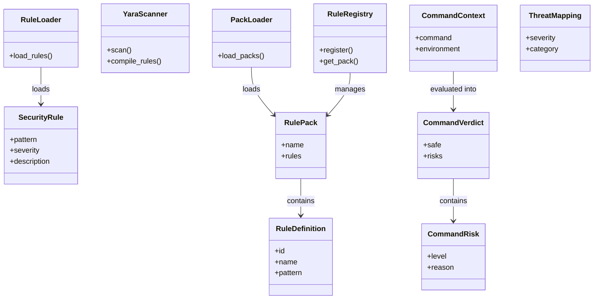
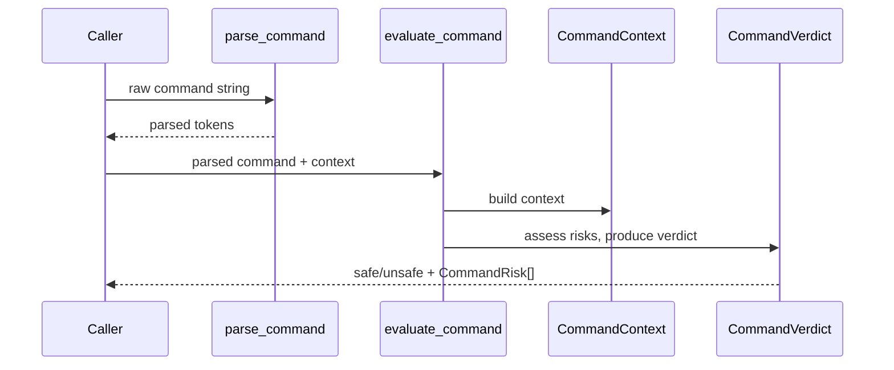

# Skill Scanner: Rules & Threats

## Overview

This module provides the security analysis backbone of the Skill Scanner vendor package. It encompasses three major subsystems: (1) **Security Rules** — pattern-based and YARA-based rule definitions for detecting dangerous code patterns; (2) **Rule Registry** — a packaging and loading system that organizes rules into named packs; and (3) **Threat Taxonomy** — mappings from detected threats to severity levels, categories, and the Cisco AI Security taxonomy framework. A companion **Command Safety** subsystem evaluates shell commands for risk using regex patterns and contextual analysis.

## Responsibilities

- Define security rules as pattern matchers (SecurityRule) and load them via RuleLoader
- Perform YARA-based binary/content scanning through YaraScanner
- Organize rules into named packs (RulePack) and manage them through a central RuleRegistry
- Parse and evaluate shell commands for safety risk, producing CommandVerdict results
- Map detected threats to severity levels and categories via ThreatMapping
- Integrate with the Cisco AI Security taxonomy for framework-aligned threat classification
- Support custom threat mapping payloads and taxonomy reloading at runtime

## Structure Diagram

## Entity Table

| Name | Kind | Role | Public Entrypoints | Depends On | Used By |
| --- | --- | --- | --- | --- | --- |
| SecurityRule | class | Defines a single pattern-based security rule with severity and description | patterns.py:SecurityRule | none | RuleLoader |
| RuleLoader | class | Loads and instantiates SecurityRule objects from rule definitions | patterns.py:RuleLoader | SecurityRule | none |
| YaraScanner | class | Compiles and executes YARA rules for content scanning | yara_scanner.py:YaraScanner | none | none |
| RuleDefinition | class | Data class representing a single rule's metadata and pattern | rule_registry.py:RuleDefinition | none | RulePack |
| RulePack | class | Named collection of RuleDefinition objects | rule_registry.py:RulePack | RuleDefinition | RuleRegistry |
| RuleRegistry | class | Central registry that manages and retrieves rule packs | rule_registry.py:RuleRegistry | RulePack | none |
| PackLoader | class | Loads rule packs from external sources into the registry | rule_registry.py:PackLoader | RulePack | none |
| CommandRisk | class | Represents a specific risk identified in a command | command_safety.py:CommandRisk | none | CommandVerdict |
| CommandVerdict | class | Final safety verdict for a parsed command, containing risks | command_safety.py:CommandVerdict | CommandRisk | none |
| CommandContext | class | Contextual information about a command being evaluated | command_safety.py:CommandContext | none | none |
| parse_command | function | Parses a raw command string for safety evaluation | command_safety.py:parse_command | none | evaluate_command |
| evaluate_command | function | Evaluates a parsed command and produces a CommandVerdict | command_safety.py:evaluate_command | CommandContext, CommandVerdict, CommandRisk | none |
| ThreatMapping | class | Maps threat identifiers to severity levels and categories | threats.py:ThreatMapping | none | none |
| configure_threat_mappings | function | Configures threat mappings from defaults or custom payloads | threats.py:configure_threat_mappings | ThreatMapping | none |
| reload_taxonomy | function | Reloads the Cisco AI taxonomy from file at runtime | cisco_ai_taxonomy.py:reload_taxonomy | none | none |
| get_framework_mappings | function | Retrieves framework-level mappings from the Cisco AI taxonomy | cisco_ai_taxonomy.py:get_framework_mappings | none | none |

## Key Flow

## Flow Notes

| Step | Actor/Component | Action | Output / Side Effect |
| --- | --- | --- | --- |
| 1 | Caller | Passes a raw shell command string to parse_command | Parsed command tokens |
| 2 | evaluate_command | Builds CommandContext and evaluates against safety rules | CommandVerdict with risk assessments |
| 3 | RuleLoader / PackLoader | Loads SecurityRule or RulePack definitions for pattern scanning | Populated RuleRegistry or SecurityRule instances |
| 4 | ThreatMapping / Taxonomy | Maps detected threats to severity, category, and framework alignment | Threat metadata for scan results |

## Source Coverage

- vendor/skill-scanner/skill_scanner/core/command_safety.py
- vendor/skill-scanner/skill_scanner/core/rule_registry.py
- vendor/skill-scanner/skill_scanner/core/rules/__init__.py
- vendor/skill-scanner/skill_scanner/core/rules/patterns.py
- vendor/skill-scanner/skill_scanner/core/rules/yara_scanner.py
- vendor/skill-scanner/skill_scanner/threats/__init__.py
- vendor/skill-scanner/skill_scanner/threats/cisco_ai_taxonomy.py
- vendor/skill-scanner/skill_scanner/threats/threats.py
