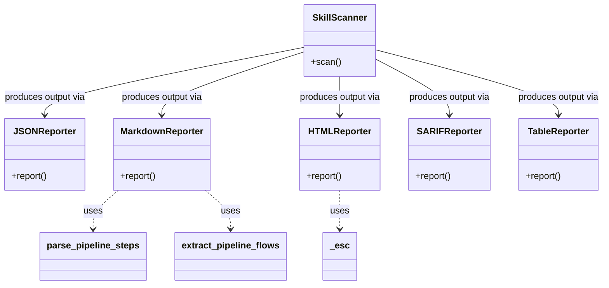
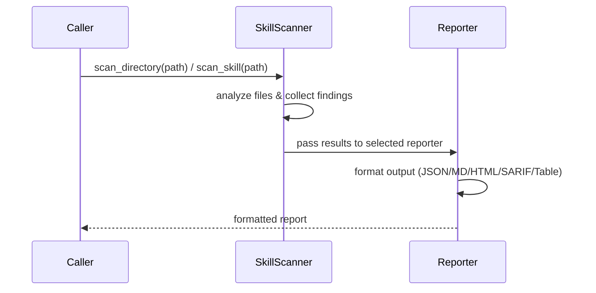

# Skill Scanner: Scanner & Reporters

## Overview

This module provides the core scanning orchestration (`SkillScanner`) and a family of output reporter classes that format scan results into JSON, Markdown, HTML, SARIF, and table formats. The scanner analyzes skill directories and individual skill files, while each reporter implements a distinct serialization strategy for the resulting findings.

## Responsibilities

- Orchestrate skill scanning across directories and individual skill files via `SkillScanner`, `scan_skill`, and `scan_directory`
- Format scan results as structured JSON output (`JSONReporter`)
- Render human-readable Markdown reports with pipeline flow extraction (`MarkdownReporter`)
- Generate standalone HTML reports with escaped content (`HTMLReporter`)
- Produce SARIF-compliant output for integration with static-analysis tooling (`SARIFReporter`)
- Output tabular summaries for terminal/console display (`TableReporter`)
- Re-export reporter classes from the `reporters` package init

## Structure Diagram

## Entity Table

| Name | Kind | Role | Public Entrypoints | Depends On | Used By |
| --- | --- | --- | --- | --- | --- |
| SkillScanner | class | Top-level scanner that orchestrates analysis of skill files and directories | SkillScanner | none | none |
| scan_skill | function | Convenience function to scan a single skill | scan_skill | SkillScanner | none |
| scan_directory | function | Convenience function to scan all skills in a directory | scan_directory | SkillScanner | none |
| JSONReporter | class | Formats scan results as JSON | JSONReporter | none | SkillScanner |
| MarkdownReporter | class | Renders scan results as Markdown with pipeline flow support | MarkdownReporter | parse_pipeline_steps, extract_pipeline_flows | SkillScanner |
| HTMLReporter | class | Generates standalone HTML report pages | HTMLReporter | _esc | SkillScanner |
| SARIFReporter | class | Produces SARIF-format output for static-analysis tool integration | SARIFReporter | none | SkillScanner |
| TableReporter | class | Outputs tabular summaries for terminal display | TableReporter | none | SkillScanner |
| _esc | function | HTML-escapes strings for safe embedding in HTML output | _esc | none | HTMLReporter |
| parse_pipeline_steps | function | Parses pipeline step definitions from scan data | parse_pipeline_steps | none | MarkdownReporter |
| extract_pipeline_flows | function | Extracts pipeline flow structures from scan data | extract_pipeline_flows | none | MarkdownReporter |
| reporters/__init__.py | file | Package init that re-exports reporter classes | none | JSONReporter, MarkdownReporter, HTMLReporter, SARIFReporter, TableReporter | none |

## Key Flow

## Flow Notes

| Step | Actor/Component | Action | Output / Side Effect |
| --- | --- | --- | --- |
| 1 | Caller | Invokes scan_directory or scan_skill convenience function, or uses SkillScanner directly | Scan request initiated |
| 2 | SkillScanner | Analyzes skill files, collects findings and metadata | Internal scan results data structure |
| 3 | Reporter | Selected reporter formats the scan results into the target output format | Formatted report (JSON, Markdown, HTML, SARIF, or table) |

## Source Coverage

- vendor/skill-scanner/skill_scanner/core/reporters/__init__.py
- vendor/skill-scanner/skill_scanner/core/reporters/html_reporter.py
- vendor/skill-scanner/skill_scanner/core/reporters/json_reporter.py
- vendor/skill-scanner/skill_scanner/core/reporters/markdown_reporter.py
- vendor/skill-scanner/skill_scanner/core/reporters/sarif_reporter.py
- vendor/skill-scanner/skill_scanner/core/reporters/table_reporter.py
- vendor/skill-scanner/skill_scanner/core/scanner.py
