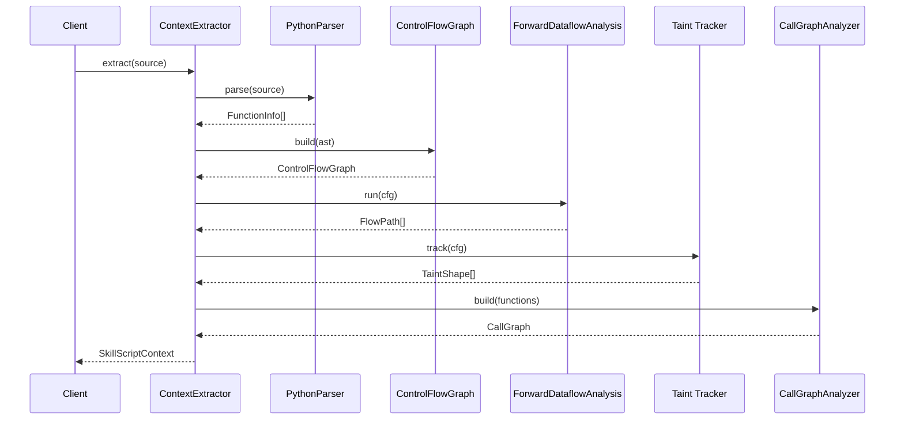

# Skill Scanner: Static Analysis

## Overview

The static analysis infrastructure for the Skill Scanner, providing a layered Python-based analysis pipeline. It encompasses parsing, control-flow graph construction, forward dataflow analysis, taint tracking (for both Python and Bash), interprocedural call-graph and cross-file analysis, name resolution, and type inference. Shared types (`Position`, `Range`) anchor source-location metadata across all layers.

## Responsibilities

- Parse Python source into AST representations and extract function-level metadata via PythonParser
- Build control-flow graphs (CFGNode / ControlFlowGraph) and perform basic data-flow analysis (DataFlowAnalyzer)
- Run forward dataflow analysis with FlowPath and ForwardFlowFact propagation
- Track taint status and shape through Python code (TaintStatus, Taint, TaintShape, ShapeEnvironment)
- Analyze Bash scripts for taint flows from sources to sinks (analyze_bash_script, BashTaintFlow)
- Construct and query interprocedural call graphs (CallGraph, CallGraphAnalyzer)
- Correlate analysis results across multiple files (CrossFileAnalyzer, CrossFileCorrelation)
- Resolve names within nested scopes (NameResolver, Scope)
- Infer and represent types for analyzed expressions (TypeAnalyzer, TypeKind, Type)
- Extract high-level skill script and function context for downstream consumers (ContextExtractor)

## Structure Diagram

```mermaid
classDiagram
    direction TB

    class Position {
        +line
        +column
    }
    class Range {
        +start: Position
        +end: Position
    }

    class PythonParser {
        +parse()
    }
    class FunctionInfo {
        +name
        +args
    }
    PythonParser --> FunctionInfo

    class CFGNode {
        +id
        +successors
    }
    class ControlFlowGraph {
        +entry
        +nodes
    }
    class DataFlowAnalyzer {
        +analyze()
    }
    ControlFlowGraph --> CFGNode
    DataFlowAnalyzer --> ControlFlowGraph

    class ForwardFlowFact
    class FlowPath
    class ForwardDataflowAnalysis {
        +run()
    }
    ForwardDataflowAnalysis --> ForwardFlowFact
    ForwardDataflowAnalysis --> FlowPath
    ForwardDataflowAnalysis --> ControlFlowGraph

    class TaintStatus
    class Taint
    class TaintShape
    class ShapeEnvironment
    Taint --> TaintStatus
    TaintShape --> ShapeEnvironment

    class BashTaintType
    class TaintedVariable
    class BashTaintFlow
    BashTaintFlow --> TaintedVariable
    BashTaintFlow --> BashTaintType

    class CallGraph
    class CallGraphAnalyzer {
        +build()
    }
    CallGraphAnalyzer --> CallGraph
    CallGraphAnalyzer --> FunctionInfo

    class CrossFileCorrelation
    class CrossFileAnalyzer {
        +analyze()
    }
    CrossFileAnalyzer --> CrossFileCorrelation
    CrossFileAnalyzer --> CallGraphAnalyzer

    class Scope
    class NameResolver {
        +resolve()
    }
    NameResolver --> Scope

    class TypeKind
    class Type
    class TypeAnalyzer {
        +infer()
    }
    TypeAnalyzer --> Type
    Type --> TypeKind

    class SkillScriptContext
    class SkillFunctionContext
    class ContextExtractor {
        +extract()
    }
    ContextExtractor --> SkillScriptContext
    ContextExtractor --> SkillFunctionContext
```

## Entity Table

| Name | Kind | Role | Public Entrypoints | Depends On | Used By |
| --- | --- | --- | --- | --- | --- |
| PythonParser | class | Parses Python source code into AST and extracts FunctionInfo metadata | parse() | none | ContextExtractor, CallGraphAnalyzer |
| FunctionInfo | class | Data class representing a parsed function's name, arguments, and location | none | none | PythonParser, CallGraphAnalyzer |
| CFGNode | class | Single node in a control-flow graph with successor/predecessor edges | none | none | ControlFlowGraph |
| ControlFlowGraph | class | Directed graph of CFGNodes representing control flow within a function | none | CFGNode | DataFlowAnalyzer, ForwardDataflowAnalysis |
| DataFlowAnalyzer | class | Basic data-flow analysis over a ControlFlowGraph (def-use, reaching definitions) | analyze() | ControlFlowGraph | none |
| ForwardDataflowAnalysis | class | Forward dataflow framework propagating ForwardFlowFacts along FlowPaths | run() | ControlFlowGraph, ForwardFlowFact, FlowPath | none |
| ForwardFlowFact | class | Abstract flow fact carried through forward dataflow iterations | none | none | ForwardDataflowAnalysis |
| FlowPath | class | Recorded path through the CFG for a particular dataflow finding | none | none | ForwardDataflowAnalysis |
| TaintStatus | class | Enum-like status (tainted, clean, unknown) for a value in taint analysis | none | none | Taint |
| Taint | class | Associates a TaintStatus with a variable or expression | none | TaintStatus | TaintShape |
| TaintShape | class | Structural shape of taint through compound data (dicts, lists) | none | ShapeEnvironment | none |
| ShapeEnvironment | class | Maps variables to their current TaintShape during analysis | none | none | TaintShape |
| BashTaintType | class | Classification of taint sources in Bash scripts (env, stdin, network, etc.) | none | none | BashTaintFlow |
| TaintedVariable | class | A Bash variable with associated taint type and originating command | none | none | BashTaintFlow |
| BashTaintFlow | class | Represents a complete taint flow from source to sink in Bash | none | TaintedVariable, BashTaintType | analyze_bash_script |
| analyze_bash_script | function | Entry point for Bash taint analysis; returns list of BashTaintFlow findings | analyze_bash_script() | BashTaintFlow, _classify_command_taint, _track_variable_assignment, _check_sinks | none |
| CallGraph | class | Graph of call relationships between functions across a codebase | none | none | CallGraphAnalyzer |
| CallGraphAnalyzer | class | Builds and queries a CallGraph from parsed function information | build() | CallGraph, FunctionInfo | CrossFileAnalyzer |
| CrossFileCorrelation | class | Data class describing a correlation (e.g., shared taint) across files | none | none | CrossFileAnalyzer |
| CrossFileAnalyzer | class | Correlates analysis results across multiple source files | analyze() | CrossFileCorrelation, CallGraphAnalyzer | none |
| Scope | class | Represents a lexical scope with parent chain for name resolution | none | none | NameResolver |
| NameResolver | class | Resolves variable and function names within nested Scope chains | resolve() | Scope | none |
| TypeKind | class | Enum of type categories (int, str, list, dict, callable, etc.) | none | none | Type |
| Type | class | Represents an inferred type with a TypeKind and optional parameters | none | TypeKind | TypeAnalyzer |
| TypeAnalyzer | class | Infers types for expressions and variables in parsed code | infer() | Type | none |
| ContextExtractor | class | High-level extractor producing SkillScriptContext and SkillFunctionContext for downstream consumers | extract() | SkillScriptContext, SkillFunctionContext | none |
| SkillScriptContext | class | Aggregated analysis context for an entire skill script | none | none | ContextExtractor |
| SkillFunctionContext | class | Analysis context scoped to a single function within a skill script | none | none | ContextExtractor |
| Position | class | Source location (line, column) used across all analysis layers | none | none | none |
| Range | class | Source range (start Position to end Position) used across all analysis layers | none | Position | none |

## Key Flow

## Flow Notes

| Step | Actor/Component | Action | Output / Side Effect |
| --- | --- | --- | --- |
| 1 | ContextExtractor | Invokes PythonParser to parse source code into AST and FunctionInfo list | FunctionInfo[] |
| 2 | ControlFlowGraph | Builds CFG from AST nodes, connecting CFGNode instances via successor edges | ControlFlowGraph |
| 3 | ForwardDataflowAnalysis | Propagates ForwardFlowFacts over the CFG to convergence, recording FlowPaths | FlowPath[] |
| 4 | Taint Tracker | Tracks TaintStatus through ShapeEnvironment, detecting tainted data reaching sinks | TaintShape[] |
| 5 | CallGraphAnalyzer | Builds interprocedural CallGraph from FunctionInfo; CrossFileAnalyzer may extend across files | CallGraph |
| 6 | ContextExtractor | Aggregates analysis results into SkillScriptContext and SkillFunctionContext | SkillScriptContext |

## Source Coverage

- vendor/skill-scanner/skill_scanner/core/static_analysis/__init__.py
- vendor/skill-scanner/skill_scanner/core/static_analysis/bash_taint_tracker.py
- vendor/skill-scanner/skill_scanner/core/static_analysis/cfg/__init__.py
- vendor/skill-scanner/skill_scanner/core/static_analysis/cfg/builder.py
- vendor/skill-scanner/skill_scanner/core/static_analysis/context_extractor.py
- vendor/skill-scanner/skill_scanner/core/static_analysis/dataflow/__init__.py
- vendor/skill-scanner/skill_scanner/core/static_analysis/dataflow/forward_analysis.py
- vendor/skill-scanner/skill_scanner/core/static_analysis/interprocedural/__init__.py
- vendor/skill-scanner/skill_scanner/core/static_analysis/interprocedural/call_graph_analyzer.py
- vendor/skill-scanner/skill_scanner/core/static_analysis/interprocedural/cross_file_analyzer.py
- vendor/skill-scanner/skill_scanner/core/static_analysis/parser/__init__.py
- vendor/skill-scanner/skill_scanner/core/static_analysis/parser/python_parser.py
- vendor/skill-scanner/skill_scanner/core/static_analysis/semantic/__init__.py
- vendor/skill-scanner/skill_scanner/core/static_analysis/semantic/name_resolver.py
- vendor/skill-scanner/skill_scanner/core/static_analysis/semantic/type_analyzer.py
- vendor/skill-scanner/skill_scanner/core/static_analysis/taint/__init__.py
- vendor/skill-scanner/skill_scanner/core/static_analysis/taint/tracker.py
- vendor/skill-scanner/skill_scanner/core/static_analysis/types/__init__.py
