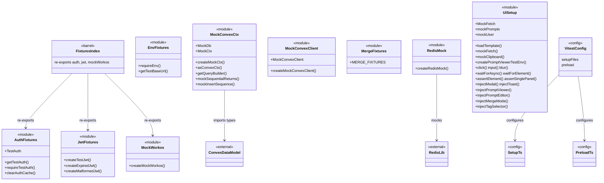
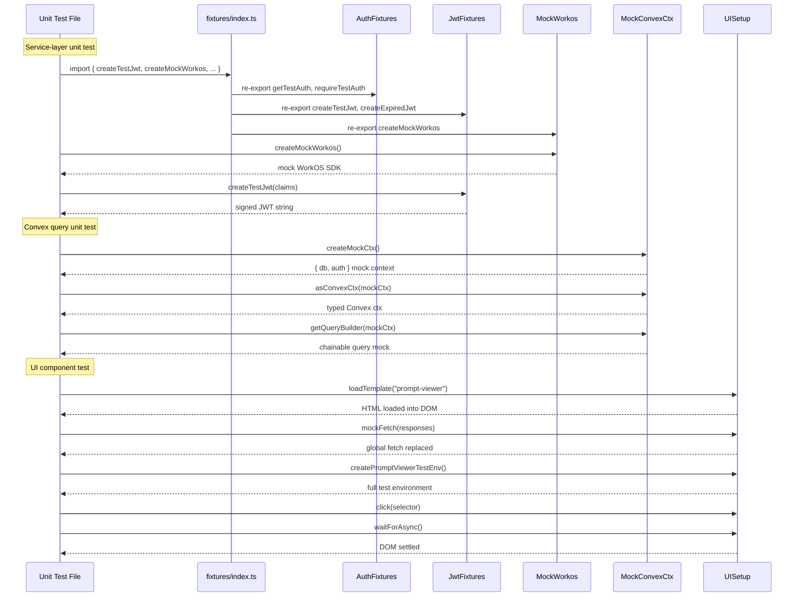

# Test Fixtures & Setup

## Overview

Centralized test infrastructure for LiminalDB providing mock factories, fixture data, DOM helpers, and Vitest configuration. The module is organized into four layers: (1) a **barrel index** re-exporting auth/JWT/WorkOS mocks for unit tests, (2) **environment & auth helpers** for integration tests against live staging, (3) **Convex context mocks** for testing database queries/mutations in isolation, and (4) a rich **UI test harness** with DOM injection, event simulation, and async utilities for front-end component tests.

## Responsibilities

- Provide reusable mock factories for Redis, WorkOS, Convex client, and Convex query/mutation contexts
- Generate valid, expired, and malformed JWTs for auth testing scenarios
- Supply auth credential helpers (getTestAuth, requireTestAuth) with caching for integration tests
- Expose environment utilities (requireEnv, getTestBaseUrl) for integration test targeting
- Deliver merge-conflict fixture data consumed by Convex, service, and UI merge tests
- Provide a comprehensive UI test harness with template loading, DOM injection, event simulation, and async wait helpers
- Configure Vitest (vitest.config.ts, setup.ts, preload.ts) for both unit and integration test runs

## Structure Diagram

## Entity Table

| Name | Kind | Role | Public Entrypoints | Depends On | Used By |
| --- | --- | --- | --- | --- | --- |
| fixtures/index.ts | barrel | Re-exports auth, JWT, and WorkOS mocks as a single import for service-level unit tests | tests/fixtures/index.ts | AuthFixtures, JwtFixtures, MockWorkos | tests/service/**/*.test.ts |
| AuthFixtures | module | Provides TestAuth interface and helpers to obtain/cache real auth credentials for integration tests | getTestAuth, requireTestAuth, clearAuthCache | none | fixtures/index.ts, tests/integration/**/*.test.ts |
| JwtFixtures | module | Generates test JWTs: valid, expired, and malformed variants for auth boundary testing | createTestJwt, createExpiredJwt, createMalformedJwt | none | fixtures/index.ts, tests/integration/auth-api.test.ts |
| MockWorkos | module | Creates a mock WorkOS SDK instance for unit-testing auth middleware without network calls | createMockWorkos | none | fixtures/index.ts |
| EnvFixtures | module | Reads required env vars and derives the test base URL for integration test HTTP requests | requireEnv, getTestBaseUrl | none | tests/integration/**/*.test.ts |
| MockConvexCtx | module | Builds mock Convex query/mutation contexts with in-memory DB, query builder, and sequence helpers | createMockCtx, asConvexCtx, getQueryBuilder, mockSequentialReturns, mockInsertSequence | convex/_generated/dataModel.d.ts | tests/convex/prompts/**/*.test.ts |
| MockConvexClient | module | Creates a mock Convex HTTP client for service-layer tests that call Convex actions | createMockConvexClient | none | tests/service/prompts/flagsUsage.test.ts, tests/service/prompts/listPrompts.test.ts, tests/service/prompts/mergePrompt.test.ts |
| MergeFixtures | constant | Predefined merge-conflict fixture data shared across Convex, service, and UI merge tests | MERGE_FIXTURES | none | tests/convex/prompts/mergeFields.test.ts, tests/service/lib/merge.test.ts, tests/service/ui/merge-mode.test.ts |
| RedisMock | module | Provides an in-memory Redis mock replacing the real Redis client for drafts unit tests | createRedisMock | src/lib/redis.ts | tests/service/drafts/drafts.test.ts |
| UISetup | module | Comprehensive UI test harness: template loading, DOM injection, event simulation, fetch/clipboard mocking, and async utilities | loadTemplate, mockFetch, createPromptViewerTestEnv, click, input, blur, waitForAsync, waitForElement, assertElement, assertSinglePanel | none | tests/service/ui/**/*.test.ts |
| vitest.config.ts | config | Vitest configuration defining test environments, setup files, and preload scripts | vitest.config.ts | none | none |

## Key Flow

## Flow Notes

| Step | Actor/Component | Action | Output / Side Effect |
| --- | --- | --- | --- |
| 1 | Vitest | Loads vitest.config.ts, runs preload.ts and setup.ts before any tests execute | Global test environment initialized with env stubs and module mocks |
| 2 | Service Unit Test | Imports from fixtures/index.ts barrel to get auth, JWT, and WorkOS mocks in one import | Mock WorkOS SDK, test JWTs, and auth helpers available |
| 3 | Convex Unit Test | Calls createMockCtx() and asConvexCtx() to build an in-memory Convex context with typed db mock | Isolated Convex query/mutation context ready for assertion |
| 4 | Integration Test | Uses getTestBaseUrl() + requireTestAuth() to make authenticated HTTP requests against staging | Real HTTP responses from staging server with cached auth tokens |
| 5 | UI Component Test | Calls loadTemplate(), mockFetch(), and inject* helpers to set up DOM + mocked network layer | Fully rendered UI component in jsdom with simulated user interactions |

## Source Coverage

- tests/__mocks__/redis.ts
- tests/fixtures/auth.ts
- tests/fixtures/env.ts
- tests/fixtures/index.ts
- tests/fixtures/jwt.ts
- tests/fixtures/merge.ts
- tests/fixtures/mockConvexClient.ts
- tests/fixtures/mockConvexCtx.ts
- tests/fixtures/mockWorkos.ts
- tests/preload.ts
- tests/service/ui/setup.ts
- tests/setup.ts
- vitest.config.ts

## Cross-Module Context

- tests/__mocks__/redis.ts -> src/lib/redis.ts (import)
- tests/convex/prompts/deleteBySlug.test.ts -> tests/fixtures/mockConvexCtx.ts (usage)
- tests/convex/prompts/getPromptBySlug.test.ts -> tests/fixtures/mockConvexCtx.ts (usage)
- tests/convex/prompts/insertPrompts.test.ts -> tests/fixtures/mockConvexCtx.ts (usage)
- tests/convex/prompts/mergeFields.test.ts -> tests/fixtures/merge.ts (usage)
- tests/convex/prompts/searchPrompts.test.ts -> tests/fixtures/mockConvexCtx.ts (usage)
- tests/convex/prompts/slugExists.test.ts -> tests/fixtures/mockConvexCtx.ts (usage)
- tests/convex/prompts/usageTracking.test.ts -> tests/fixtures/mockConvexCtx.ts (usage)
- tests/fixtures/mockConvexCtx.ts -> convex/_generated/dataModel.d.ts (import)
- tests/integration/auth-api.test.ts -> tests/fixtures/auth.ts (usage)
- tests/integration/auth-api.test.ts -> tests/fixtures/env.ts (usage)
- tests/integration/auth-api.test.ts -> tests/fixtures/jwt.ts (usage)
- tests/integration/auth-cookie.test.ts -> tests/fixtures/env.ts (usage)
- tests/integration/auth-mcp.test.ts -> tests/fixtures/auth.ts (usage)
- tests/integration/auth-mcp.test.ts -> tests/fixtures/env.ts (usage)
- tests/integration/health.test.ts -> tests/fixtures/env.ts (usage)
- tests/integration/healthAuth.test.ts -> tests/fixtures/auth.ts (usage)
- tests/integration/healthAuth.test.ts -> tests/fixtures/env.ts (usage)
- tests/integration/import-export.test.ts -> tests/fixtures/auth.ts (usage)
- tests/integration/import-export.test.ts -> tests/fixtures/env.ts (usage)
- tests/integration/mcp-oauth.test.ts -> tests/fixtures/auth.ts (usage)
- tests/integration/mcp-oauth.test.ts -> tests/fixtures/env.ts (usage)
- tests/integration/mcp.test.ts -> tests/fixtures/auth.ts (usage)
- tests/integration/mcp.test.ts -> tests/fixtures/env.ts (usage)
- tests/integration/merge.test.ts -> tests/fixtures/auth.ts (usage)
- tests/integration/merge.test.ts -> tests/fixtures/env.ts (usage)
- tests/integration/preferences.test.ts -> tests/fixtures/auth.ts (usage)
- tests/integration/preferences.test.ts -> tests/fixtures/env.ts (usage)
- tests/integration/prompts-api.test.ts -> tests/fixtures/auth.ts (usage)
- tests/integration/prompts-api.test.ts -> tests/fixtures/env.ts (usage)
- tests/integration/ui/ui-auth.test.ts -> tests/fixtures/auth.ts (usage)
- tests/integration/ui/ui-auth.test.ts -> tests/fixtures/env.ts (usage)
- tests/integration/ui/ui-prompts.test.ts -> tests/fixtures/auth.ts (usage)
- tests/integration/ui/ui-prompts.test.ts -> tests/fixtures/env.ts (usage)
- tests/service/auth/mcp.test.ts -> tests/fixtures/index.ts (usage)
- tests/service/auth/middleware.test.ts -> tests/fixtures/index.ts (usage)
- tests/service/auth/routes.test.ts -> tests/fixtures/index.ts (usage)
- tests/service/drafts/drafts.test.ts -> tests/__mocks__/redis.ts (usage)
- tests/service/drafts/drafts.test.ts -> tests/fixtures/index.ts (usage)
- tests/service/lib/merge.test.ts -> tests/fixtures/merge.ts (usage)
- tests/service/mcp/resources.test.ts -> tests/fixtures/index.ts (usage)
- tests/service/mcp/tools.test.ts -> tests/fixtures/index.ts (usage)
- tests/service/preferences.test.ts -> tests/fixtures/index.ts (usage)
- tests/service/prompts/createPrompts.test.ts -> tests/fixtures/index.ts (usage)
- tests/service/prompts/deletePrompt.test.ts -> tests/fixtures/index.ts (usage)
- tests/service/prompts/edgeCases.test.ts -> tests/fixtures/index.ts (usage)
- tests/service/prompts/flagsUsage.test.ts -> tests/fixtures/index.ts (usage)
- tests/service/prompts/flagsUsage.test.ts -> tests/fixtures/mockConvexClient.ts (usage)
- tests/service/prompts/getPrompt.test.ts -> tests/fixtures/index.ts (usage)
- tests/service/prompts/importExport.test.ts -> tests/fixtures/index.ts (usage)
- tests/service/prompts/listPrompts.test.ts -> tests/fixtures/index.ts (usage)
- tests/service/prompts/listPrompts.test.ts -> tests/fixtures/mockConvexClient.ts (usage)
- tests/service/prompts/mcpTools.test.ts -> tests/fixtures/index.ts (usage)
- tests/service/prompts/mergePrompt.test.ts -> tests/fixtures/index.ts (usage)
- tests/service/prompts/mergePrompt.test.ts -> tests/fixtures/mockConvexClient.ts (usage)
- tests/service/prompts/updatePrompt.test.ts -> tests/fixtures/index.ts (usage)
- tests/service/ui/merge-mode.test.ts -> tests/fixtures/merge.ts (usage)
- tests/service/ui/merge-mode.test.ts -> tests/service/ui/setup.ts (usage)
- tests/service/ui/modal-toast.test.ts -> tests/service/ui/setup.ts (usage)
- tests/service/ui/prompt-editor.test.ts -> tests/service/ui/setup.ts (usage)
- tests/service/ui/prompt-viewer.test.ts -> tests/service/ui/setup.ts (usage)
- tests/service/ui/prompts-module.test.ts -> tests/service/ui/setup.ts (usage)
- tests/service/ui/shell-history.test.ts -> tests/service/ui/setup.ts (usage)
- tests/service/ui/tag-selector.test.ts -> tests/service/ui/setup.ts (usage)
- tests/service/ui/theme-picker.test.ts -> tests/service/ui/setup.ts (usage)
