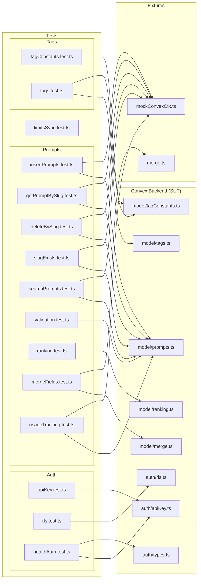
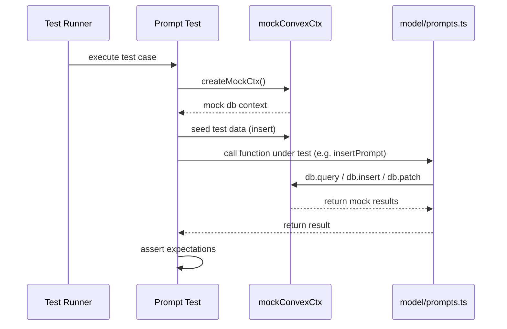

# Tests: Convex Unit

## Overview

Unit test suite for the Convex backend layer of LiminalDB. The tests are organized into three domains — **auth** (API key validation, row-level security, health endpoint auth), **prompts** (CRUD operations, validation, ranking, search, usage tracking, merge logic), and **tags** (tag model and constants). Tests use a shared `mockConvexCtx` fixture to simulate the Convex database context without a live backend.

## Responsibilities

- Verify API key authentication and validation logic
- Test row-level security (RLS) enforcement for multi-tenant data isolation
- Validate health endpoint authentication flows
- Test prompt CRUD operations (insert, get-by-slug, delete-by-slug, slug-exists)
- Verify prompt search and ranking algorithms
- Ensure prompt field merge logic correctness
- Validate prompt input constraints and error handling
- Test usage tracking for prompt access
- Verify tag CRUD operations and tag constant definitions
- Test plan-based limits synchronization

## Structure Diagram

## Entity Table

| Name | Kind | Role | Public Entrypoints | Depends On | Used By |
| --- | --- | --- | --- | --- | --- |
| apiKey.test.ts | file | Tests API key validation and lookup logic | none | convex/auth/apiKey.ts | none |
| rls.test.ts | file | Tests row-level security rules for tenant isolation | none | convex/auth/rls.ts | none |
| healthAuth.test.ts | file | Tests authentication for health/status endpoints | none | convex/auth/apiKey.ts, convex/auth/types.ts | none |
| limitsSync.test.ts | file | Tests plan-based limits synchronization | none | none | none |
| insertPrompts.test.ts | file | Tests prompt creation including upsert, deduplication, and tag handling (largest test file at 459 LOC) | none | convex/model/prompts.ts, tests/fixtures/mockConvexCtx.ts, convex/_generated/dataModel.d.ts | none |
| getPromptBySlug.test.ts | file | Tests prompt retrieval by slug identifier | none | convex/model/prompts.ts, tests/fixtures/mockConvexCtx.ts | none |
| deleteBySlug.test.ts | file | Tests prompt deletion by slug | none | convex/model/prompts.ts, tests/fixtures/mockConvexCtx.ts | none |
| slugExists.test.ts | file | Tests slug existence checks | none | convex/model/prompts.ts, tests/fixtures/mockConvexCtx.ts | none |
| searchPrompts.test.ts | file | Tests prompt search/filtering | none | convex/model/prompts.ts, tests/fixtures/mockConvexCtx.ts | none |
| validation.test.ts | file | Tests prompt input validation and error paths | none | convex/model/prompts.ts | none |
| ranking.test.ts | file | Tests prompt ranking/scoring algorithm | none | convex/model/ranking.ts | none |
| mergeFields.test.ts | file | Tests field-level merge logic for prompt updates | none | convex/model/merge.ts, tests/fixtures/merge.ts | none |
| usageTracking.test.ts | file | Tests prompt access/usage counter logic | none | convex/model/prompts.ts, tests/fixtures/mockConvexCtx.ts | none |
| tagConstants.test.ts | file | Tests tag constant definitions and constraints | none | convex/model/tagConstants.ts | none |
| tags.test.ts | file | Tests tag CRUD operations and associations | none | convex/model/tags.ts, convex/model/tagConstants.ts | none |

## Key Flow

## Flow Notes

| Step | Actor/Component | Action | Output / Side Effect |
| --- | --- | --- | --- |
| 1 | Test Runner | Discovers and executes test files across auth, prompts, and tags suites | Individual test cases invoked |
| 2 | Test File | Creates a mock Convex database context via mockConvexCtx fixture (for tests that need DB interaction) | Simulated Convex mutation/query context |
| 3 | Test File | Seeds any required test data into the mock context | Pre-populated mock database state |
| 4 | Test File | Calls the system-under-test function from the Convex backend module | Function executes against mock context |
| 5 | Test File | Asserts return values, side effects, and error conditions | Test pass/fail result |

## Source Coverage

- tests/convex/auth/apiKey.test.ts
- tests/convex/auth/rls.test.ts
- tests/convex/healthAuth.test.ts
- tests/convex/limitsSync.test.ts
- tests/convex/prompts/deleteBySlug.test.ts
- tests/convex/prompts/getPromptBySlug.test.ts
- tests/convex/prompts/insertPrompts.test.ts
- tests/convex/prompts/mergeFields.test.ts
- tests/convex/prompts/ranking.test.ts
- tests/convex/prompts/searchPrompts.test.ts
- tests/convex/prompts/slugExists.test.ts
- tests/convex/prompts/usageTracking.test.ts
- tests/convex/prompts/validation.test.ts
- tests/convex/tags/tagConstants.test.ts
- tests/convex/tags/tags.test.ts

## Cross-Module Context

- tests/convex/auth/apiKey.test.ts -> convex/auth/apiKey.ts (usage)
- tests/convex/auth/rls.test.ts -> convex/auth/rls.ts (usage)
- tests/convex/healthAuth.test.ts -> convex/auth/apiKey.ts (usage)
- tests/convex/healthAuth.test.ts -> convex/auth/types.ts (usage)
- tests/convex/prompts/deleteBySlug.test.ts -> convex/model/prompts.ts (usage)
- tests/convex/prompts/deleteBySlug.test.ts -> tests/fixtures/mockConvexCtx.ts (usage)
- tests/convex/prompts/getPromptBySlug.test.ts -> convex/model/prompts.ts (usage)
- tests/convex/prompts/getPromptBySlug.test.ts -> tests/fixtures/mockConvexCtx.ts (usage)
- tests/convex/prompts/insertPrompts.test.ts -> convex/_generated/dataModel.d.ts (usage)
- tests/convex/prompts/insertPrompts.test.ts -> convex/model/prompts.ts (usage)
- tests/convex/prompts/insertPrompts.test.ts -> tests/fixtures/mockConvexCtx.ts (usage)
- tests/convex/prompts/mergeFields.test.ts -> convex/model/merge.ts (usage)
- tests/convex/prompts/mergeFields.test.ts -> tests/fixtures/merge.ts (usage)
- tests/convex/prompts/ranking.test.ts -> convex/model/ranking.ts (usage)
- tests/convex/prompts/searchPrompts.test.ts -> convex/model/prompts.ts (usage)
- tests/convex/prompts/searchPrompts.test.ts -> tests/fixtures/mockConvexCtx.ts (usage)
- tests/convex/prompts/slugExists.test.ts -> convex/model/prompts.ts (usage)
- tests/convex/prompts/slugExists.test.ts -> tests/fixtures/mockConvexCtx.ts (usage)
- tests/convex/prompts/usageTracking.test.ts -> convex/model/prompts.ts (usage)
- tests/convex/prompts/usageTracking.test.ts -> tests/fixtures/mockConvexCtx.ts (usage)
- tests/convex/prompts/validation.test.ts -> convex/model/prompts.ts (usage)
- tests/convex/tags/tagConstants.test.ts -> convex/model/tagConstants.ts (usage)
- tests/convex/tags/tags.test.ts -> convex/_generated/server.d.ts (usage)
- tests/convex/tags/tags.test.ts -> convex/model/tagConstants.ts (usage)
- tests/convex/tags/tags.test.ts -> convex/model/tags.ts (usage)
