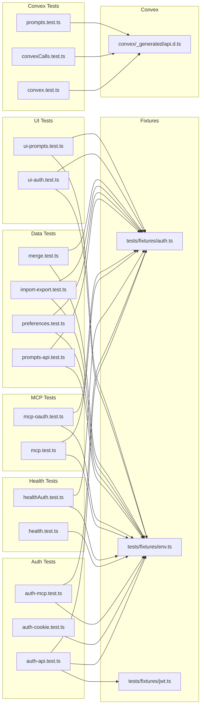
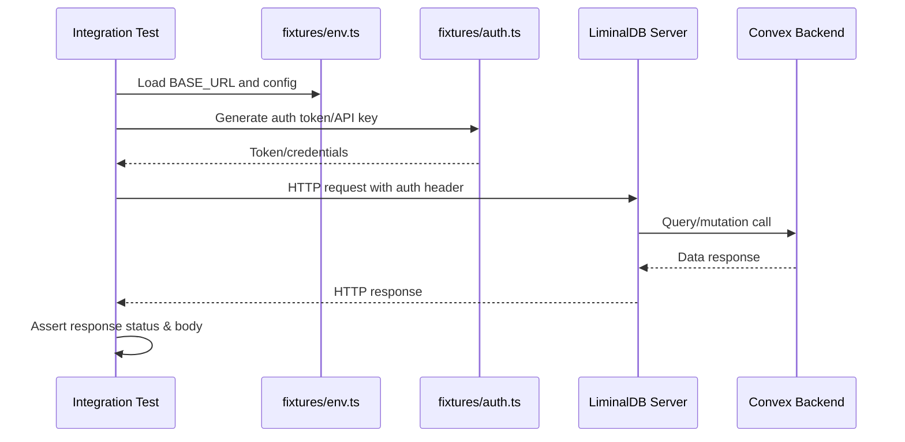

# Tests: Integration

## Overview

Integration test suite for LiminalDB covering end-to-end verification of authentication flows (API keys, cookies, MCP tokens, OAuth), Convex backend calls, health endpoints, prompts CRUD, user preferences, import/export, merge operations, and UI interactions. Tests are organized by domain area and share common fixtures for environment configuration and auth token generation.

## Responsibilities

- Validate API-key and cookie-based authentication flows against the running server
- Test MCP protocol endpoints including OAuth authorization flows
- Verify Convex backend queries and mutations via the generated API client
- Assert health and authenticated-health endpoint responses
- End-to-end test prompts API CRUD operations and Convex-level prompt logic
- Test import/export and merge functionality for data portability
- Verify user preferences API behavior
- UI-level integration tests for auth and prompts workflows

## Structure Diagram

## Entity Table

| Name | Kind | Role | Public Entrypoints | Depends On | Used By |
| --- | --- | --- | --- | --- | --- |
| auth-api.test.ts | file | Tests API-key based authentication endpoints | none | tests/fixtures/auth.ts, tests/fixtures/env.ts, tests/fixtures/jwt.ts | none |
| auth-cookie.test.ts | file | Tests cookie-based authentication and session handling | none | tests/fixtures/env.ts | none |
| auth-mcp.test.ts | file | Tests MCP-specific auth token validation | none | tests/fixtures/auth.ts, tests/fixtures/env.ts | none |
| convex.test.ts | file | Basic Convex connectivity and query tests | none | convex/_generated/api.d.ts | none |
| convexCalls.test.ts | file | Tests Convex function calls (queries/mutations) | none | convex/_generated/api.d.ts | none |
| prompts.test.ts (convex) | file | Comprehensive Convex-level prompts CRUD and logic tests | none | convex/_generated/api.d.ts | none |
| health.test.ts | file | Tests unauthenticated health endpoint | none | tests/fixtures/env.ts | none |
| healthAuth.test.ts | file | Tests authenticated health endpoint with auth context | none | tests/fixtures/auth.ts, tests/fixtures/env.ts | none |
| import-export.test.ts | file | Tests data import/export round-trip functionality | none | tests/fixtures/auth.ts, tests/fixtures/env.ts | none |
| mcp-oauth.test.ts | file | Tests MCP OAuth authorization flow end-to-end | none | tests/fixtures/auth.ts, tests/fixtures/env.ts | none |
| mcp.test.ts | file | Tests core MCP protocol endpoint behavior | none | tests/fixtures/auth.ts, tests/fixtures/env.ts | none |
| merge.test.ts | file | Tests data merge/conflict resolution operations | none | tests/fixtures/auth.ts, tests/fixtures/env.ts | none |
| preferences.test.ts | file | Tests user preferences API read/write | none | tests/fixtures/auth.ts, tests/fixtures/env.ts | none |
| prompts-api.test.ts | file | Tests REST API prompts CRUD operations | none | tests/fixtures/auth.ts, tests/fixtures/env.ts | none |
| ui-auth.test.ts | file | UI-level auth flow integration tests | none | tests/fixtures/auth.ts, tests/fixtures/env.ts | none |
| ui-prompts.test.ts | file | UI-level prompts interaction tests | none | tests/fixtures/auth.ts, tests/fixtures/env.ts | none |

## Key Flow

## Flow Notes

| Step | Actor/Component | Action | Output / Side Effect |
| --- | --- | --- | --- |
| 1 | Integration Test | Load environment configuration (base URL, API endpoints) from env fixture | Server URL and test config available |
| 2 | Integration Test | Generate authentication credentials via auth fixture (JWT tokens, API keys, cookies) | Valid auth token for requests |
| 3 | Integration Test | Send HTTP request to LiminalDB server endpoint with auth headers | Request dispatched to server |
| 4 | LiminalDB Server | Process request, validate auth, execute Convex queries/mutations as needed | Server response with data or error |
| 5 | Integration Test | Assert response status codes, headers, and body content match expectations | Test pass/fail result |

## Source Coverage

- tests/integration/auth-api.test.ts
- tests/integration/auth-cookie.test.ts
- tests/integration/auth-mcp.test.ts
- tests/integration/convex.test.ts
- tests/integration/convex/convexCalls.test.ts
- tests/integration/convex/prompts.test.ts
- tests/integration/health.test.ts
- tests/integration/healthAuth.test.ts
- tests/integration/import-export.test.ts
- tests/integration/mcp-oauth.test.ts
- tests/integration/mcp.test.ts
- tests/integration/merge.test.ts
- tests/integration/preferences.test.ts
- tests/integration/prompts-api.test.ts
- tests/integration/ui/ui-auth.test.ts
- tests/integration/ui/ui-prompts.test.ts

## Cross-Module Context

- tests/integration/auth-api.test.ts -> tests/fixtures/auth.ts (usage)
- tests/integration/auth-api.test.ts -> tests/fixtures/env.ts (usage)
- tests/integration/auth-api.test.ts -> tests/fixtures/jwt.ts (usage)
- tests/integration/auth-cookie.test.ts -> tests/fixtures/env.ts (usage)
- tests/integration/auth-mcp.test.ts -> tests/fixtures/auth.ts (usage)
- tests/integration/auth-mcp.test.ts -> tests/fixtures/env.ts (usage)
- tests/integration/convex.test.ts -> convex/_generated/api.d.ts (usage)
- tests/integration/convex/convexCalls.test.ts -> convex/_generated/api.d.ts (usage)
- tests/integration/convex/prompts.test.ts -> convex/_generated/api.d.ts (usage)
- tests/integration/health.test.ts -> tests/fixtures/env.ts (usage)
- tests/integration/healthAuth.test.ts -> tests/fixtures/auth.ts (usage)
- tests/integration/healthAuth.test.ts -> tests/fixtures/env.ts (usage)
- tests/integration/import-export.test.ts -> tests/fixtures/auth.ts (usage)
- tests/integration/import-export.test.ts -> tests/fixtures/env.ts (usage)
- tests/integration/mcp-oauth.test.ts -> tests/fixtures/auth.ts (usage)
- tests/integration/mcp-oauth.test.ts -> tests/fixtures/env.ts (usage)
- tests/integration/mcp.test.ts -> tests/fixtures/auth.ts (usage)
- tests/integration/mcp.test.ts -> tests/fixtures/env.ts (usage)
- tests/integration/merge.test.ts -> tests/fixtures/auth.ts (usage)
- tests/integration/merge.test.ts -> tests/fixtures/env.ts (usage)
- tests/integration/preferences.test.ts -> tests/fixtures/auth.ts (usage)
- tests/integration/preferences.test.ts -> tests/fixtures/env.ts (usage)
- tests/integration/prompts-api.test.ts -> tests/fixtures/auth.ts (usage)
- tests/integration/prompts-api.test.ts -> tests/fixtures/env.ts (usage)
- tests/integration/ui/ui-auth.test.ts -> tests/fixtures/auth.ts (usage)
- tests/integration/ui/ui-auth.test.ts -> tests/fixtures/env.ts (usage)
- tests/integration/ui/ui-prompts.test.ts -> tests/fixtures/auth.ts (usage)
- tests/integration/ui/ui-prompts.test.ts -> tests/fixtures/env.ts (usage)
