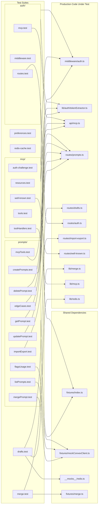
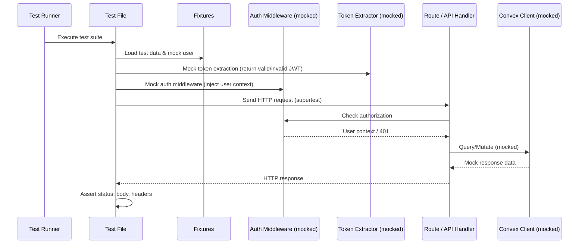

# Tests: Service Unit

## Overview

Comprehensive unit test suite covering server-side functionality across auth, MCP, prompts, drafts, preferences, merge logic, and Redis caching. All 22 test files share a common pattern: they mock the auth middleware and token extractor, use shared test fixtures, and exercise production route/API handlers in isolation. The suite is organized into four subdirectories (auth, mcp, prompts, lib) plus standalone files for drafts, preferences, and Redis cache.

## Responsibilities

- Validate auth middleware behavior including token extraction, JWT verification, and route protection
- Test MCP protocol endpoints: auth challenges, resource listing, tool invocation, and well-known discovery
- Cover all prompts CRUD operations: create, read, update, delete, list, merge, import/export
- Verify edge cases and schema validation for prompts API
- Test draft persistence via Redis-backed routes
- Validate user preferences API
- Unit-test the merge algorithm independently of HTTP layer
- Verify Redis caching behavior in isolation
- Ensure feature flags are correctly gated in prompt operations

## Structure Diagram

## Entity Table

| Name | Kind | Role | Public Entrypoints | Depends On | Used By |
| --- | --- | --- | --- | --- | --- |
| auth/mcp.test.ts | test-file | Tests MCP endpoint auth enforcement | none | src/api/mcp.ts, src/middleware/auth.ts, src/lib/auth/tokenExtractor.ts, tests/fixtures/index.ts | none |
| auth/middleware.test.ts | test-file | Tests auth middleware token validation and user context injection | none | src/lib/auth/index.ts, src/middleware/auth.ts, src/lib/auth/tokenExtractor.ts, tests/fixtures/index.ts | none |
| auth/routes.test.ts | test-file | Tests auth route handlers (login, callback, session) | none | src/routes/auth.ts, src/middleware/auth.ts, src/lib/auth/tokenExtractor.ts, tests/fixtures/index.ts | none |
| drafts/drafts.test.ts | test-file | Tests draft CRUD operations with Redis-backed storage | none | src/routes/drafts.ts, src/lib/redis.ts, src/schemas/drafts.ts, src/middleware/auth.ts, tests/__mocks__/redis.ts, tests/fixtures/index.ts | none |
| lib/merge.test.ts | test-file | Unit tests for three-way merge algorithm | none | src/lib/merge.ts, tests/fixtures/merge.ts | none |
| mcp/auth-challenge.test.ts | test-file | Tests MCP auth challenge flow for unauthenticated requests | none | src/api/mcp.ts, src/middleware/auth.ts, src/lib/auth/tokenExtractor.ts | none |
| mcp/resources.test.ts | test-file | Tests MCP resource listing and reading | none | src/api/mcp.ts, src/middleware/auth.ts, src/lib/auth/tokenExtractor.ts, tests/fixtures/index.ts | none |
| mcp/toolHandlers.test.ts | test-file | Unit tests for MCP tool handler implementations | none | src/lib/mcp.ts | none |
| mcp/tools.test.ts | test-file | Tests MCP tool registration and invocation via API | none | src/api/mcp.ts, src/middleware/auth.ts, src/lib/auth/tokenExtractor.ts, tests/fixtures/index.ts | none |
| mcp/well-known.test.ts | test-file | Tests .well-known MCP discovery endpoint | none | src/routes/well-known.ts, src/middleware/auth.ts, src/lib/auth/tokenExtractor.ts | none |
| preferences.test.ts | test-file | Tests user preferences get/set API | none | src/middleware/auth.ts, src/lib/auth/tokenExtractor.ts, tests/fixtures/index.ts | none |
| prompts/createPrompts.test.ts | test-file | Tests prompt creation with validation | none | src/routes/prompts.ts, src/middleware/auth.ts, src/lib/auth/tokenExtractor.ts, tests/fixtures/index.ts | none |
| prompts/edgeCases.test.ts | test-file | Tests boundary conditions and schema validation for prompts | none | src/routes/prompts.ts, src/schemas/prompts.ts, src/middleware/auth.ts, src/lib/auth/tokenExtractor.ts, tests/fixtures/index.ts | none |
| prompts/importExport.test.ts | test-file | Tests bulk import/export of prompts (largest test file at 724 LOC) | none | src/routes/import-export.ts, src/middleware/auth.ts, src/lib/auth/tokenExtractor.ts, tests/fixtures/index.ts | none |
| prompts/mergePrompt.test.ts | test-file | Tests prompt merge conflict detection and resolution via API | none | src/middleware/auth.ts, src/lib/auth/tokenExtractor.ts, tests/fixtures/index.ts, tests/fixtures/mockConvexClient.ts | none |
| prompts/mcpTools.test.ts | test-file | Tests prompt operations via MCP tool interface | none | src/api/mcp.ts, src/middleware/auth.ts, src/lib/auth/tokenExtractor.ts, tests/fixtures/index.ts | none |
| redis-cache.test.ts | test-file | Tests Redis caching layer in isolation | none | none | none |

## Key Flow

## Flow Notes

| Step | Actor/Component | Action | Output / Side Effect |
| --- | --- | --- | --- |
| 1 | Test Runner | Executes a test file which loads fixtures and sets up mocks for auth middleware and token extractor | Isolated test environment with mocked dependencies |
| 2 | Test File | Sends an HTTP request via supertest to the route or API handler under test | Request reaches the production handler with mocked auth context |
| 3 | Route Handler | Processes request, interacts with mocked Convex client or Redis for data operations | Returns HTTP response with status code and JSON body |
| 4 | Test File | Asserts on response status, body content, headers, and any side effects | Pass/fail test result |

## Source Coverage

- tests/service/auth/mcp.test.ts
- tests/service/auth/middleware.test.ts
- tests/service/auth/routes.test.ts
- tests/service/drafts/drafts.test.ts
- tests/service/lib/merge.test.ts
- tests/service/mcp/auth-challenge.test.ts
- tests/service/mcp/resources.test.ts
- tests/service/mcp/toolHandlers.test.ts
- tests/service/mcp/tools.test.ts
- tests/service/mcp/well-known.test.ts
- tests/service/preferences.test.ts
- tests/service/prompts/createPrompts.test.ts
- tests/service/prompts/deletePrompt.test.ts
- tests/service/prompts/edgeCases.test.ts
- tests/service/prompts/flagsUsage.test.ts
- tests/service/prompts/getPrompt.test.ts
- tests/service/prompts/importExport.test.ts
- tests/service/prompts/listPrompts.test.ts
- tests/service/prompts/mcpTools.test.ts
- tests/service/prompts/mergePrompt.test.ts
- tests/service/prompts/updatePrompt.test.ts
- tests/service/redis-cache.test.ts

## Cross-Module Context

- tests/service/auth/mcp.test.ts -> src/api/mcp.ts (usage)
- tests/service/auth/mcp.test.ts -> src/lib/auth/tokenExtractor.ts (usage)
- tests/service/auth/mcp.test.ts -> src/middleware/auth.ts (usage)
- tests/service/auth/mcp.test.ts -> tests/fixtures/index.ts (usage)
- tests/service/auth/middleware.test.ts -> src/lib/auth/index.ts (usage)
- tests/service/auth/middleware.test.ts -> src/lib/auth/tokenExtractor.ts (usage)
- tests/service/auth/middleware.test.ts -> src/middleware/auth.ts (usage)
- tests/service/auth/middleware.test.ts -> tests/fixtures/index.ts (usage)
- tests/service/auth/routes.test.ts -> src/lib/auth/tokenExtractor.ts (usage)
- tests/service/auth/routes.test.ts -> src/middleware/auth.ts (usage)
- tests/service/auth/routes.test.ts -> src/routes/auth.ts (usage)
- tests/service/auth/routes.test.ts -> tests/fixtures/index.ts (usage)
- tests/service/drafts/drafts.test.ts -> src/lib/auth/tokenExtractor.ts (usage)
- tests/service/drafts/drafts.test.ts -> src/lib/redis.ts (usage)
- tests/service/drafts/drafts.test.ts -> src/middleware/auth.ts (usage)
- tests/service/drafts/drafts.test.ts -> src/routes/drafts.ts (usage)
- tests/service/drafts/drafts.test.ts -> src/schemas/drafts.ts (usage)
- tests/service/drafts/drafts.test.ts -> tests/__mocks__/redis.ts (usage)
- tests/service/drafts/drafts.test.ts -> tests/fixtures/index.ts (usage)
- tests/service/lib/merge.test.ts -> src/lib/merge.ts (usage)
- tests/service/lib/merge.test.ts -> tests/fixtures/merge.ts (usage)
- tests/service/mcp/auth-challenge.test.ts -> src/api/mcp.ts (usage)
- tests/service/mcp/auth-challenge.test.ts -> src/lib/auth/tokenExtractor.ts (usage)
- tests/service/mcp/auth-challenge.test.ts -> src/middleware/auth.ts (usage)
- tests/service/mcp/resources.test.ts -> src/api/mcp.ts (usage)
- tests/service/mcp/resources.test.ts -> src/lib/auth/tokenExtractor.ts (usage)
- tests/service/mcp/resources.test.ts -> src/middleware/auth.ts (usage)
- tests/service/mcp/resources.test.ts -> tests/fixtures/index.ts (usage)
- tests/service/mcp/toolHandlers.test.ts -> src/lib/mcp.ts (usage)
- tests/service/mcp/tools.test.ts -> src/api/mcp.ts (usage)
- tests/service/mcp/tools.test.ts -> src/lib/auth/tokenExtractor.ts (usage)
- tests/service/mcp/tools.test.ts -> src/middleware/auth.ts (usage)
- tests/service/mcp/tools.test.ts -> tests/fixtures/index.ts (usage)
- tests/service/mcp/well-known.test.ts -> src/lib/auth/tokenExtractor.ts (usage)
- tests/service/mcp/well-known.test.ts -> src/middleware/auth.ts (usage)
- tests/service/mcp/well-known.test.ts -> src/routes/well-known.ts (usage)
- tests/service/preferences.test.ts -> src/lib/auth/tokenExtractor.ts (usage)
- tests/service/preferences.test.ts -> src/middleware/auth.ts (usage)
- tests/service/preferences.test.ts -> tests/fixtures/index.ts (usage)
- tests/service/prompts/createPrompts.test.ts -> src/lib/auth/tokenExtractor.ts (usage)
- tests/service/prompts/createPrompts.test.ts -> src/middleware/auth.ts (usage)
- tests/service/prompts/createPrompts.test.ts -> src/routes/prompts.ts (usage)
- tests/service/prompts/createPrompts.test.ts -> tests/fixtures/index.ts (usage)
- tests/service/prompts/deletePrompt.test.ts -> src/lib/auth/tokenExtractor.ts (usage)
- tests/service/prompts/deletePrompt.test.ts -> src/middleware/auth.ts (usage)
- tests/service/prompts/deletePrompt.test.ts -> src/routes/prompts.ts (usage)
- tests/service/prompts/deletePrompt.test.ts -> tests/fixtures/index.ts (usage)
- tests/service/prompts/edgeCases.test.ts -> src/lib/auth/tokenExtractor.ts (usage)
- tests/service/prompts/edgeCases.test.ts -> src/middleware/auth.ts (usage)
- tests/service/prompts/edgeCases.test.ts -> src/routes/prompts.ts (usage)
- tests/service/prompts/edgeCases.test.ts -> src/schemas/prompts.ts (usage)
- tests/service/prompts/edgeCases.test.ts -> tests/fixtures/index.ts (usage)
- tests/service/prompts/flagsUsage.test.ts -> src/lib/auth/tokenExtractor.ts (usage)
- tests/service/prompts/flagsUsage.test.ts -> src/middleware/auth.ts (usage)
- tests/service/prompts/flagsUsage.test.ts -> tests/fixtures/index.ts (usage)
- tests/service/prompts/flagsUsage.test.ts -> tests/fixtures/mockConvexClient.ts (usage)
- tests/service/prompts/getPrompt.test.ts -> src/lib/auth/tokenExtractor.ts (usage)
- tests/service/prompts/getPrompt.test.ts -> src/middleware/auth.ts (usage)
- tests/service/prompts/getPrompt.test.ts -> src/routes/prompts.ts (usage)
- tests/service/prompts/getPrompt.test.ts -> tests/fixtures/index.ts (usage)
- tests/service/prompts/importExport.test.ts -> src/lib/auth/tokenExtractor.ts (usage)
- tests/service/prompts/importExport.test.ts -> src/middleware/auth.ts (usage)
- tests/service/prompts/importExport.test.ts -> src/routes/import-export.ts (usage)
- tests/service/prompts/importExport.test.ts -> tests/fixtures/index.ts (usage)
- tests/service/prompts/listPrompts.test.ts -> src/lib/auth/tokenExtractor.ts (usage)
- tests/service/prompts/listPrompts.test.ts -> src/middleware/auth.ts (usage)
- tests/service/prompts/listPrompts.test.ts -> tests/fixtures/index.ts (usage)
- tests/service/prompts/listPrompts.test.ts -> tests/fixtures/mockConvexClient.ts (usage)
- tests/service/prompts/mcpTools.test.ts -> src/api/mcp.ts (usage)
- tests/service/prompts/mcpTools.test.ts -> src/lib/auth/tokenExtractor.ts (usage)
- tests/service/prompts/mcpTools.test.ts -> src/middleware/auth.ts (usage)
- tests/service/prompts/mcpTools.test.ts -> tests/fixtures/index.ts (usage)
- tests/service/prompts/mergePrompt.test.ts -> src/lib/auth/tokenExtractor.ts (usage)
- tests/service/prompts/mergePrompt.test.ts -> src/middleware/auth.ts (usage)
- tests/service/prompts/mergePrompt.test.ts -> tests/fixtures/index.ts (usage)
- tests/service/prompts/mergePrompt.test.ts -> tests/fixtures/mockConvexClient.ts (usage)
- tests/service/prompts/updatePrompt.test.ts -> src/lib/auth/tokenExtractor.ts (usage)
- tests/service/prompts/updatePrompt.test.ts -> src/middleware/auth.ts (usage)
- tests/service/prompts/updatePrompt.test.ts -> src/routes/prompts.ts (usage)
- tests/service/prompts/updatePrompt.test.ts -> tests/fixtures/index.ts (usage)
