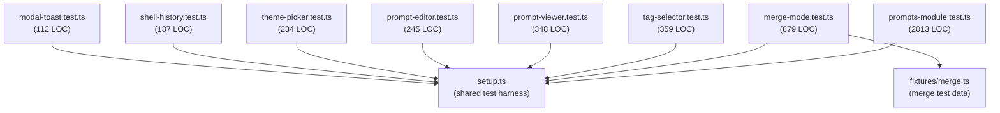
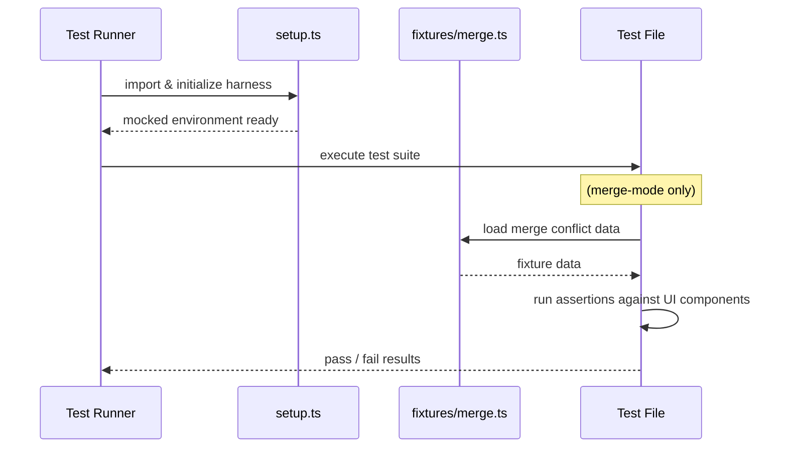

# Tests: UI Unit

## Overview

A suite of unit tests covering the frontend UI layer of LiminalDB. Eight test files validate prompt editing/viewing, merge-mode workflows, modals and toasts, tag selection, theme picking, and shell history. All tests share a common setup harness (`setup.ts`) that bootstraps the test environment, while the merge-mode tests additionally consume shared merge fixtures.

## Responsibilities

- Validate prompt editor creation, editing, and save behavior
- Verify prompt viewer rendering and interaction logic
- Exercise the full prompts module lifecycle (largest suite at ~2k LOC)
- Test merge-mode conflict resolution UI using shared fixtures
- Cover modal display/dismiss and toast notification behavior
- Ensure tag selector filtering, selection, and creation flows
- Confirm theme picker renders and applies themes correctly
- Test shell history navigation and recall

## Structure Diagram

## Entity Table

| Name | Kind | Role | Public Entrypoints | Depends On | Used By |
| --- | --- | --- | --- | --- | --- |
| prompts-module.test.ts | file | Comprehensive test suite for the prompts module UI (largest at 2013 LOC) | none | setup.ts | none |
| merge-mode.test.ts | file | Tests merge-mode conflict resolution UI using shared merge fixtures | none | setup.ts, fixtures/merge.ts | none |
| tag-selector.test.ts | file | Tests tag selector filtering, selection, and creation | none | setup.ts | none |
| prompt-viewer.test.ts | file | Tests prompt viewer rendering and interactions | none | setup.ts | none |
| prompt-editor.test.ts | file | Tests prompt editor creation and editing flows | none | setup.ts | none |
| theme-picker.test.ts | file | Tests theme picker rendering and theme application | none | setup.ts | none |
| shell-history.test.ts | file | Tests shell history navigation and recall | none | setup.ts | none |
| modal-toast.test.ts | file | Tests modal display/dismiss and toast notifications | none | setup.ts | none |

## Key Flow

## Flow Notes

| Step | Actor/Component | Action | Output / Side Effect |
| --- | --- | --- | --- |
| 1 | Test Runner | Imports shared setup harness to bootstrap mocked UI environment | DOM mocks, stubs, and helpers initialized |
| 2 | Test File | Optionally loads fixture data (e.g., merge-mode loads merge fixtures) | Test-specific data available |
| 3 | Test File | Renders UI component under test and exercises interactions | DOM assertions evaluated |
| 4 | Test Runner | Collects pass/fail results from all suites | Test report |

## Source Coverage

- tests/service/ui/merge-mode.test.ts
- tests/service/ui/modal-toast.test.ts
- tests/service/ui/prompt-editor.test.ts
- tests/service/ui/prompt-viewer.test.ts
- tests/service/ui/prompts-module.test.ts
- tests/service/ui/shell-history.test.ts
- tests/service/ui/tag-selector.test.ts
- tests/service/ui/theme-picker.test.ts

## Cross-Module Context

- tests/service/ui/merge-mode.test.ts -> tests/fixtures/merge.ts (usage)
- tests/service/ui/merge-mode.test.ts -> tests/service/ui/setup.ts (usage)
- tests/service/ui/modal-toast.test.ts -> tests/service/ui/setup.ts (usage)
- tests/service/ui/prompt-editor.test.ts -> tests/service/ui/setup.ts (usage)
- tests/service/ui/prompt-viewer.test.ts -> tests/service/ui/setup.ts (usage)
- tests/service/ui/prompts-module.test.ts -> tests/service/ui/setup.ts (usage)
- tests/service/ui/shell-history.test.ts -> tests/service/ui/setup.ts (usage)
- tests/service/ui/tag-selector.test.ts -> tests/service/ui/setup.ts (usage)
- tests/service/ui/theme-picker.test.ts -> tests/service/ui/setup.ts (usage)
