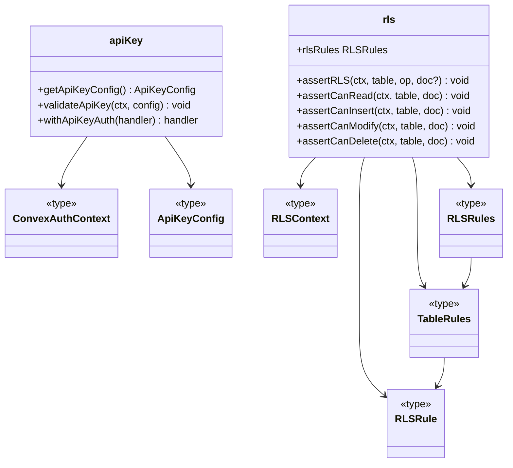
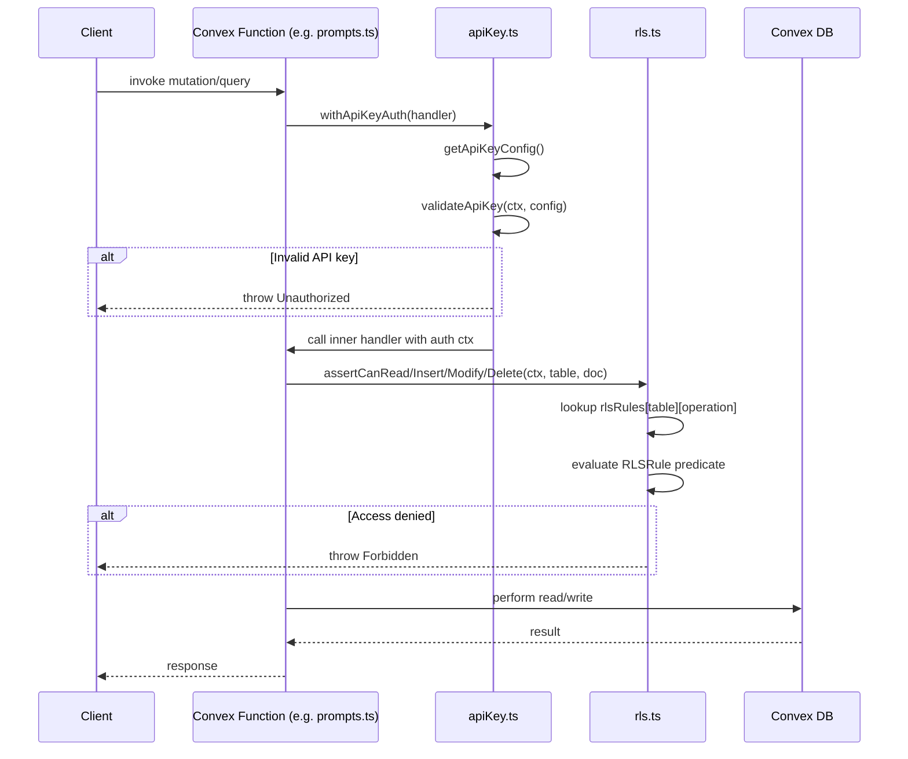

# Convex Auth & RLS

## Overview

This module provides the backend authentication and authorization layer for LiminalDB's Convex functions. It consists of two complementary subsystems: **API key validation** (`apiKey.ts`) which authenticates inbound requests by verifying a shared API key from environment config, and **row-level security** (`rls.ts`) which enforces per-table access rules (read, insert, modify, delete) based on the authenticated user context. Shared type definitions in `types.ts` tie the two subsystems together.

## Responsibilities

- Validate API keys on inbound Convex function calls via `validateApiKey` and the `withApiKeyAuth` wrapper
- Provide `getApiKeyConfig` to retrieve API key configuration from Convex environment variables
- Define per-table RLS rules (`rlsRules`) that gate read, insert, modify, and delete operations
- Enforce RLS checks via assertion helpers (`assertRLS`, `assertCanRead`, `assertCanInsert`, `assertCanModify`, `assertCanDelete`)
- Export shared auth context types (`ConvexAuthContext`, `ApiKeyConfig`, `RLSContext`) consumed by both subsystems and callers

## Structure Diagram

## Entity Table

| Name | Kind | Role | Public Entrypoints | Depends On | Used By |
| --- | --- | --- | --- | --- | --- |
| getApiKeyConfig | function | Retrieves API key configuration from Convex environment variables | convex/auth/apiKey.ts:getApiKeyConfig | convex/_generated/server.d.ts, ApiKeyConfig | convex/healthAuth.ts, convex/prompts.ts, convex/userPreferences.ts |
| validateApiKey | function | Validates an API key from request context against stored config | convex/auth/apiKey.ts:validateApiKey | convex/_generated/server.d.ts, ConvexAuthContext, ApiKeyConfig | convex/healthAuth.ts, convex/prompts.ts, convex/userPreferences.ts |
| withApiKeyAuth | function | Higher-order wrapper that injects API key authentication into a Convex function handler | convex/auth/apiKey.ts:withApiKeyAuth | convex/_generated/server.d.ts, ConvexAuthContext, ApiKeyConfig | convex/healthAuth.ts, convex/prompts.ts, convex/userPreferences.ts |
| rlsRules | variable | Central registry of per-table row-level security rules | convex/auth/rls.ts:rlsRules | RLSRules, RLSContext | convex/model/prompts.ts, convex/userPreferences.ts |
| assertRLS | function | Generic RLS assertion — checks the rule for a given table and operation | convex/auth/rls.ts:assertRLS | RLSContext, rlsRules | convex/model/prompts.ts, convex/userPreferences.ts |
| assertCanRead | function | Asserts the caller can read a specific document | convex/auth/rls.ts:assertCanRead | RLSContext | convex/model/prompts.ts, convex/userPreferences.ts |
| assertCanInsert | function | Asserts the caller can insert a document into a table | convex/auth/rls.ts:assertCanInsert | RLSContext | convex/model/prompts.ts, convex/userPreferences.ts |
| assertCanModify | function | Asserts the caller can modify an existing document | convex/auth/rls.ts:assertCanModify | RLSContext | convex/model/prompts.ts, convex/userPreferences.ts |
| assertCanDelete | function | Asserts the caller can delete a document | convex/auth/rls.ts:assertCanDelete | RLSContext | convex/model/prompts.ts, convex/userPreferences.ts |
| ConvexAuthContext | type | Shared type representing the authenticated Convex request context | convex/auth/types.ts:ConvexAuthContext | none | convex/auth/apiKey.ts, convex/auth/rls.ts |
| ApiKeyConfig | type | Type describing API key environment configuration shape | convex/auth/types.ts:ApiKeyConfig | none | convex/auth/apiKey.ts |
| RLSContext | type | Type representing the context passed into RLS rule evaluation | convex/auth/types.ts:RLSContext | none | convex/auth/rls.ts |
| RLSRule | type | Type for a single RLS predicate function | convex/auth/rls.ts:RLSRule | RLSContext | convex/auth/rls.ts |
| TableRules | type | Type grouping read/insert/modify/delete rules for one table | convex/auth/rls.ts:TableRules | RLSRule | convex/auth/rls.ts |
| RLSRules | type | Type mapping table names to their TableRules | convex/auth/rls.ts:RLSRules | TableRules | convex/auth/rls.ts |

## Key Flow

## Flow Notes

| Step | Actor/Component | Action | Output / Side Effect |
| --- | --- | --- | --- |
| 1 | Client | Invokes a Convex function (query or mutation) with an API key in the request | Raw request reaches Convex function handler |
| 2 | withApiKeyAuth | Wraps the handler; calls getApiKeyConfig() then validateApiKey() to authenticate the caller | Authenticated context or Unauthorized error |
| 3 | Convex Function | Calls an RLS assertion (e.g. assertCanRead) before accessing data | RLS check passes or throws Forbidden |
| 4 | rls.ts | Looks up the table's rules in rlsRules and evaluates the matching RLSRule predicate against the RLSContext and document | Allow or deny the operation |
| 5 | Convex Function | Performs the authorized database operation and returns the result to the client | Query/mutation response |

## Source Coverage

- convex/auth.config.ts
- convex/auth/apiKey.ts
- convex/auth/rls.ts
- convex/auth/types.ts

## Cross-Module Context

- convex/auth/apiKey.ts -> convex/_generated/server.d.ts (import)
- convex/healthAuth.ts -> convex/auth/apiKey.ts (import)
- convex/model/prompts.ts -> convex/auth/rls.ts (import)
- convex/prompts.ts -> convex/auth/apiKey.ts (import)
- convex/userPreferences.ts -> convex/auth/apiKey.ts (import)
- convex/userPreferences.ts -> convex/auth/rls.ts (import)
- tests/convex/auth/apiKey.test.ts -> convex/auth/apiKey.ts (usage)
- tests/convex/auth/rls.test.ts -> convex/auth/rls.ts (usage)
- tests/convex/healthAuth.test.ts -> convex/auth/apiKey.ts (usage)
- tests/convex/healthAuth.test.ts -> convex/auth/types.ts (usage)
