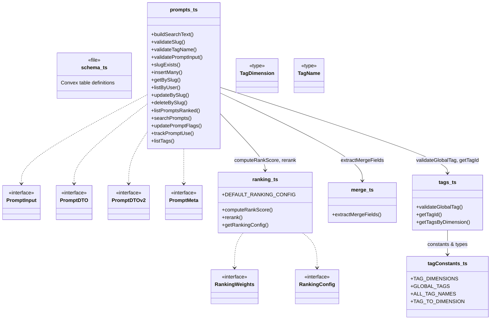
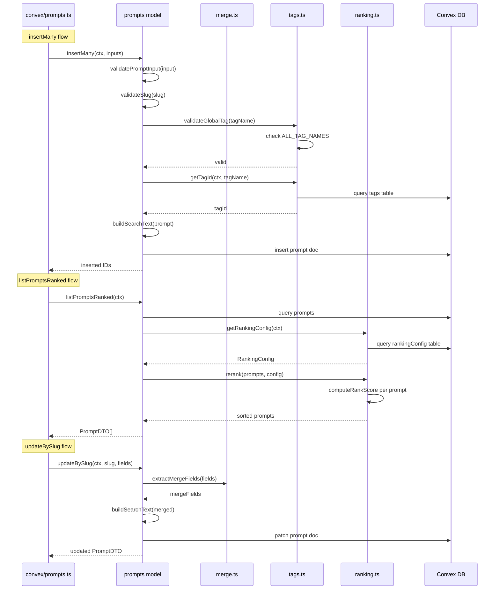

# Convex Data Model

## Overview

Core domain model layer for LiminalDB's Convex backend. This module defines the schema, data-transfer interfaces, and business logic for prompts, tags, ranking, and merge operations. It is consumed by the Convex API layer (`convex/prompts.ts`), migration scripts, and the RLS auth guard. The module is organized into four focused files — `prompts.ts` (CRUD + search + validation), `ranking.ts` (score computation and config), `tags.ts` (tag lookup and validation), and `merge.ts` (field extraction for partial updates) — plus `tagConstants.ts` for the canonical tag taxonomy and `schema.ts` for the Convex table definitions.

## Responsibilities

- Define the Convex database schema for prompts, tags, ranking config, and related tables
- Provide typed interfaces (PromptInput, PromptDTO, PromptDTOv2, PromptMeta) for prompt data transfer
- Implement prompt CRUD operations (insertMany, getBySlug, updateBySlug, deleteBySlug, listByUser)
- Validate slugs, tag names, and prompt input before persistence
- Build full-text search indexes and execute search queries (buildSearchText, searchPrompts)
- Compute and apply ranking scores to prompt lists using configurable weights (computeRankScore, rerank)
- Manage a global tag taxonomy organized by dimensions (TagDimension, GLOBAL_TAGS, TAG_DIMENSIONS)
- Extract merge-safe fields for partial prompt updates (extractMergeFields)
- Track prompt usage statistics (trackPromptUse, updatePromptFlags)

## Structure Diagram

## Entity Table

| Name | Kind | Role | Public Entrypoints | Depends On | Used By |
| --- | --- | --- | --- | --- | --- |
| schema.ts | file | Convex table definitions for prompts, tags, ranking config, and related tables | convex/schema.ts | none | none |
| PromptInput | interface | Input shape for creating/updating prompts | convex/model/prompts.ts:PromptInput | none | convex/prompts.ts |
| PromptDTO | interface | Data transfer object for prompt responses (v1) | convex/model/prompts.ts:PromptDTO | none | convex/prompts.ts |
| PromptDTOv2 | interface | Data transfer object for prompt responses (v2, extended) | convex/model/prompts.ts:PromptDTOv2 | none | convex/prompts.ts |
| PromptMeta | interface | Lightweight prompt metadata shape | convex/model/prompts.ts:PromptMeta | none | convex/prompts.ts |
| insertMany | function | Batch insert prompts with validation | convex/model/prompts.ts:insertMany | validatePromptInput, buildSearchText, extractMergeFields | convex/prompts.ts |
| getBySlug | function | Retrieve a single prompt by its slug | convex/model/prompts.ts:getBySlug | convex/auth/rls.ts | convex/prompts.ts |
| updateBySlug | function | Update an existing prompt identified by slug | convex/model/prompts.ts:updateBySlug | extractMergeFields, buildSearchText, convex/auth/rls.ts | convex/prompts.ts |
| deleteBySlug | function | Soft or hard delete a prompt by slug | convex/model/prompts.ts:deleteBySlug | convex/auth/rls.ts | convex/prompts.ts |
| listPromptsRanked | function | List prompts sorted by computed rank score | convex/model/prompts.ts:listPromptsRanked | getRankingConfig, rerank | convex/prompts.ts |
| searchPrompts | function | Full-text search over prompts using searchText index | convex/model/prompts.ts:searchPrompts | buildSearchText | convex/prompts.ts |
| trackPromptUse | function | Increment usage counters on a prompt | convex/model/prompts.ts:trackPromptUse | none | convex/prompts.ts |
| computeRankScore | function | Calculate a weighted rank score for a prompt | convex/model/ranking.ts:computeRankScore | RankingWeights | rerank, convex/model/prompts.ts |
| rerank | function | Sort an array of prompts by computed rank scores | convex/model/ranking.ts:rerank | computeRankScore, RankingConfig | convex/model/prompts.ts |
| getRankingConfig | function | Load ranking weights and config from the database | convex/model/ranking.ts:getRankingConfig | DEFAULT_RANKING_CONFIG | convex/model/prompts.ts |
| DEFAULT_RANKING_CONFIG | constant | Fallback ranking weights when no DB config exists | convex/model/ranking.ts:DEFAULT_RANKING_CONFIG | none | getRankingConfig, convex/migrations/seedRankingConfig.ts |
| extractMergeFields | function | Extract only the updatable fields from a prompt input for safe partial merge | convex/model/merge.ts:extractMergeFields | none | convex/model/prompts.ts |
| tagConstants | file | Canonical tag taxonomy: dimensions, global tag names, and mapping constants | convex/model/tagConstants.ts:TAG_DIMENSIONS, convex/model/tagConstants.ts:GLOBAL_TAGS, convex/model/tagConstants.ts:ALL_TAG_NAMES, convex/model/tagConstants.ts:TAG_TO_DIMENSION | none | convex/model/tags.ts, convex/migrations/seedGlobalTags.ts |
| validateGlobalTag | function | Validate that a tag name belongs to the global taxonomy | convex/model/tags.ts:validateGlobalTag | tagConstants | convex/model/prompts.ts |
| getTagId | function | Resolve a tag name to its Convex document ID | convex/model/tags.ts:getTagId | tagConstants | convex/model/prompts.ts |
| getTagsByDimension | function | Retrieve all tags within a given dimension | convex/model/tags.ts:getTagsByDimension | tagConstants | convex/model/prompts.ts |

## Key Flow

## Flow Notes

| Step | Actor/Component | Action | Output / Side Effect |
| --- | --- | --- | --- |
| 1 | API layer (convex/prompts.ts) | Calls model function (e.g. insertMany, listPromptsRanked, updateBySlug) | Delegates to prompts model with Convex context |
| 2 | prompts model | Validates input (slug format, tag names, prompt fields) and resolves tag IDs via tags.ts | Validated and enriched prompt data |
| 3 | prompts model | For updates, calls extractMergeFields to isolate safe-to-patch fields; rebuilds searchText | Merge-safe field set with updated search index text |
| 4 | ranking module | Loads ranking config from DB (or falls back to DEFAULT_RANKING_CONFIG), computes scores, and sorts | Ranked prompt list sorted by weighted score |
| 5 | prompts model | Returns typed DTO (PromptDTO / PromptDTOv2 / PromptMeta) to API layer | Serializable response sent to client |

## Source Coverage

- convex/model/merge.ts
- convex/model/prompts.ts
- convex/model/ranking.ts
- convex/model/tagConstants.ts
- convex/model/tags.ts
- convex/schema.ts

## Cross-Module Context

- convex/migrations/backfillSearchText.ts -> convex/model/prompts.ts (import)
- convex/migrations/seedGlobalTags.ts -> convex/model/tagConstants.ts (import)
- convex/migrations/seedRankingConfig.ts -> convex/model/ranking.ts (import)
- convex/model/prompts.ts -> convex/_generated/dataModel.d.ts (import)
- convex/model/prompts.ts -> convex/_generated/server.d.ts (import)
- convex/model/prompts.ts -> convex/auth/rls.ts (import)
- convex/model/ranking.ts -> convex/_generated/server.d.ts (import)
- convex/model/tags.ts -> convex/_generated/dataModel.d.ts (import)
- convex/model/tags.ts -> convex/_generated/server.d.ts (import)
- convex/prompts.ts -> convex/model/prompts.ts (import)
- tests/convex/prompts/deleteBySlug.test.ts -> convex/model/prompts.ts (usage)
- tests/convex/prompts/getPromptBySlug.test.ts -> convex/model/prompts.ts (usage)
- tests/convex/prompts/insertPrompts.test.ts -> convex/model/prompts.ts (usage)
- tests/convex/prompts/mergeFields.test.ts -> convex/model/merge.ts (usage)
- tests/convex/prompts/ranking.test.ts -> convex/model/ranking.ts (usage)
- tests/convex/prompts/searchPrompts.test.ts -> convex/model/prompts.ts (usage)
- tests/convex/prompts/slugExists.test.ts -> convex/model/prompts.ts (usage)
- tests/convex/prompts/usageTracking.test.ts -> convex/model/prompts.ts (usage)
- tests/convex/prompts/validation.test.ts -> convex/model/prompts.ts (usage)
- tests/convex/tags/tagConstants.test.ts -> convex/model/tagConstants.ts (usage)
- tests/convex/tags/tags.test.ts -> convex/model/tagConstants.ts (usage)
- tests/convex/tags/tags.test.ts -> convex/model/tags.ts (usage)
