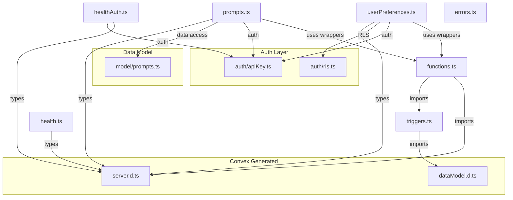
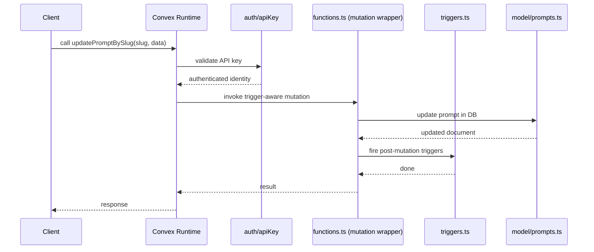

# Convex Functions

## Overview

The Convex Functions module defines the server-side query, mutation, and internal mutation endpoints for LiminalDB. It is organized around a central `functions.ts` file that wraps Convex's generated primitives with trigger support, then exposes domain-specific endpoints for prompts CRUD, user preferences, and health checks. All authenticated endpoints delegate to shared auth helpers (`apiKey`, `rls`) and data-access logic in `model/prompts`.

## Responsibilities

- Provide trigger-aware `mutation` and `internalMutation` wrappers used by all domain endpoint files
- Expose full CRUD and search endpoints for prompts (insert, get, list, update, delete, search, rank, tag listing, usage tracking)
- Expose user preference endpoints (theme get/update, get all preferences) with row-level security
- Provide unauthenticated and authenticated health-check queries
- Define table-level triggers via the triggers registry
- Export a `NotImplementedError` utility class for incomplete features

## Structure Diagram

## Entity Table

| Name | Kind | Role | Public Entrypoints | Depends On | Used By |
| --- | --- | --- | --- | --- | --- |
| mutation | variable | Trigger-aware mutation wrapper used by all domain endpoint files | convex/functions.ts:mutation | convex/_generated/server.d.ts, convex/triggers.ts | convex/prompts.ts, convex/userPreferences.ts |
| internalMutation | variable | Trigger-aware internal mutation wrapper for server-only operations | convex/functions.ts:internalMutation | convex/_generated/server.d.ts, convex/triggers.ts | convex/prompts.ts, convex/userPreferences.ts |
| triggers | variable | Registry of table-level triggers wired into mutation wrappers | convex/triggers.ts:triggers | convex/_generated/dataModel.d.ts | convex/functions.ts |
| insertPrompts | variable | Mutation to insert one or more prompts | convex/prompts.ts:insertPrompts | convex/functions.ts, convex/auth/apiKey.ts, convex/model/prompts.ts | none |
| getPromptBySlug | variable | Query to retrieve a single prompt by its slug | convex/prompts.ts:getPromptBySlug | convex/functions.ts, convex/auth/apiKey.ts, convex/model/prompts.ts | none |
| listPrompts | variable | Query to list prompts with pagination | convex/prompts.ts:listPrompts | convex/functions.ts, convex/auth/apiKey.ts, convex/model/prompts.ts | none |
| updatePromptBySlug | variable | Mutation to update a prompt identified by slug | convex/prompts.ts:updatePromptBySlug | convex/functions.ts, convex/auth/apiKey.ts, convex/model/prompts.ts | none |
| deletePromptBySlug | variable | Mutation to delete a prompt identified by slug | convex/prompts.ts:deletePromptBySlug | convex/functions.ts, convex/auth/apiKey.ts, convex/model/prompts.ts | none |
| listPromptsRanked | variable | Query to list prompts ordered by ranking/usage | convex/prompts.ts:listPromptsRanked | convex/functions.ts, convex/auth/apiKey.ts, convex/model/prompts.ts | none |
| searchPrompts | variable | Query to full-text search prompts | convex/prompts.ts:searchPrompts | convex/functions.ts, convex/auth/apiKey.ts, convex/model/prompts.ts | none |
| updatePromptFlags | variable | Mutation to update prompt feature flags | convex/prompts.ts:updatePromptFlags | convex/functions.ts, convex/auth/apiKey.ts, convex/model/prompts.ts | none |
| trackPromptUse | variable | Mutation to record a prompt usage event | convex/prompts.ts:trackPromptUse | convex/functions.ts, convex/auth/apiKey.ts, convex/model/prompts.ts | none |
| listTags | variable | Query to list all distinct prompt tags | convex/prompts.ts:listTags | convex/functions.ts, convex/auth/apiKey.ts, convex/model/prompts.ts | none |
| getThemePreference | variable | Query to fetch the current user's theme preference | convex/userPreferences.ts:getThemePreference | convex/functions.ts, convex/auth/apiKey.ts, convex/auth/rls.ts | none |
| updateThemePreference | variable | Mutation to update the current user's theme preference | convex/userPreferences.ts:updateThemePreference | convex/functions.ts, convex/auth/apiKey.ts, convex/auth/rls.ts | none |
| getAllPreferences | variable | Query to fetch all preferences for the current user | convex/userPreferences.ts:getAllPreferences | convex/functions.ts, convex/auth/apiKey.ts, convex/auth/rls.ts | none |
| check (health) | variable | Unauthenticated health-check query | convex/health.ts:check | convex/_generated/server.d.ts | none |
| check (healthAuth) | variable | Authenticated health-check query verifying API key validity | convex/healthAuth.ts:check | convex/_generated/server.d.ts, convex/auth/apiKey.ts | none |
| NotImplementedError | class | Custom error class thrown for unimplemented features | convex/errors.ts:NotImplementedError | none | none |

## Key Flow

## Flow Notes

| Step | Actor/Component | Action | Output / Side Effect |
| --- | --- | --- | --- |
| 1 | Client | Calls a Convex endpoint (e.g., updatePromptBySlug) with arguments including an API key | RPC request reaches Convex runtime |
| 2 | auth/apiKey | Validates the API key and resolves the caller's identity/org | Authenticated context or error thrown |
| 3 | functions.ts | The trigger-aware mutation wrapper executes the handler body | Delegates to model layer for data operations |
| 4 | model/prompts.ts | Performs the database read/write against the prompts table | Returns document or confirmation |
| 5 | triggers.ts | Post-mutation triggers fire (if registered for the affected table) | Side-effects complete; result returned to client |

## Source Coverage

- convex/errors.ts
- convex/functions.ts
- convex/health.ts
- convex/healthAuth.ts
- convex/prompts.ts
- convex/triggers.ts
- convex/userPreferences.ts

## Cross-Module Context

- convex/functions.ts -> convex/_generated/server.d.ts (import)
- convex/health.ts -> convex/_generated/server.d.ts (import)
- convex/healthAuth.ts -> convex/_generated/server.d.ts (import)
- convex/healthAuth.ts -> convex/auth/apiKey.ts (import)
- convex/prompts.ts -> convex/_generated/server.d.ts (import)
- convex/prompts.ts -> convex/auth/apiKey.ts (import)
- convex/prompts.ts -> convex/model/prompts.ts (import)
- convex/triggers.ts -> convex/_generated/dataModel.d.ts (import)
- convex/userPreferences.ts -> convex/_generated/server.d.ts (import)
- convex/userPreferences.ts -> convex/auth/apiKey.ts (import)
- convex/userPreferences.ts -> convex/auth/rls.ts (import)
