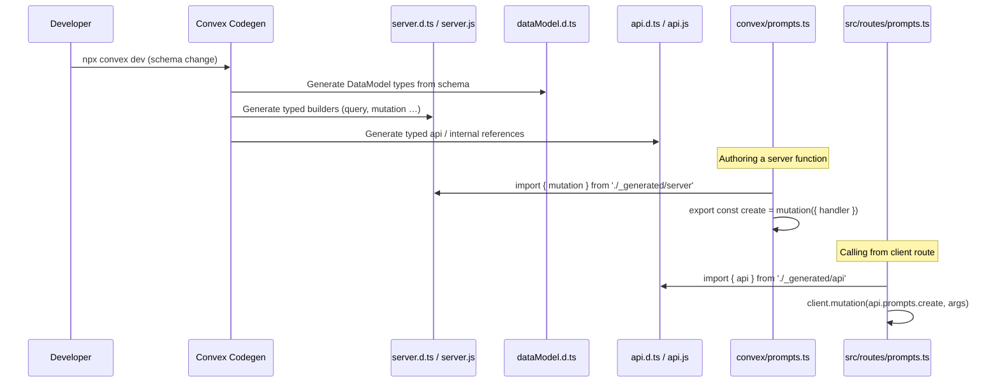

# Convex Generated

## Overview

Auto-generated Convex framework files that provide the typed API surface, data model definitions, and server function builders (`query`, `mutation`, `action`, etc.) for LiminalDB. These files are produced by the Convex code-generation toolchain and serve as the foundational type bridge between the Convex runtime and all hand-written server functions, models, migrations, routes, and tests.

## Responsibilities

- Expose typed `api` and `internal` references so client-side and server-side code can call Convex functions with full type safety
- Define the `DataModel` type derived from the project schema, used by model layers and test fixtures for document typing
- Provide typed function builders (`query`, `internalQuery`, `mutation`, `internalMutation`, `action`, `internalAction`, `httpAction`) that bind argument/return validators to the project data model
- Re-export `components` for Convex component wiring

## Structure Diagram

```mermaid
flowchart TD
  subgraph generated["convex/_generated"]
    API_D["api.d.ts\n(typed API surface)"]
    API_JS["api.js\n(api, internal, components)"]
    DM["dataModel.d.ts\n(DataModel type)"]
    SRV_D["server.d.ts\n(typed function builders)"]
    SRV_JS["server.js\n(query, mutation, action …)"]
  end

  subgraph consumers_server["Server Functions"]
    FN["convex/functions.ts"]
    PROMPTS["convex/prompts.ts"]
    HEALTH["convex/health.ts"]
    HEALTH_AUTH["convex/healthAuth.ts"]
    USER_PREFS["convex/userPreferences.ts"]
    API_KEY["convex/auth/apiKey.ts"]
  end

  subgraph consumers_model["Model Layer"]
    M_PROMPTS["convex/model/prompts.ts"]
    M_TAGS["convex/model/tags.ts"]
    M_RANKING["convex/model/ranking.ts"]
    TRIGGERS["convex/triggers.ts"]
  end

  subgraph consumers_migrations["Migrations"]
    BACKFILL["backfillSearchText.ts"]
    MIG_STATUS["migrationStatus.ts"]
    SEED_TAGS["seedGlobalTags.ts"]
    SEED_RANK["seedRankingConfig.ts"]
  end

  subgraph consumers_client["Client / Routes"]
    MCP["src/lib/mcp.ts"]
    R_PROMPTS["src/routes/prompts.ts"]
    R_PREFS["src/routes/preferences.ts"]
    R_EXPORT["src/routes/import-export.ts"]
    H_API["src/api/health.ts"]
  end

  SRV_D --> FN & PROMPTS & HEALTH & HEALTH_AUTH & USER_PREFS & API_KEY
  SRV_D --> M_PROMPTS & M_TAGS & M_RANKING
  SRV_D --> BACKFILL & MIG_STATUS & SEED_TAGS & SEED_RANK
  DM --> M_PROMPTS & M_TAGS & TRIGGERS
  API_D --> MCP & R_PROMPTS & R_PREFS & R_EXPORT & H_API & BACKFILL
```

## Entity Table

| Name | Kind | Role | Public Entrypoints | Depends On | Used By |
| --- | --- | --- | --- | --- | --- |
| api.d.ts | file | Typed API reference used by client routes, MCP, and integration tests to call Convex functions | convex/_generated/api.d.ts | none | src/lib/mcp.ts, src/routes/prompts.ts, src/routes/preferences.ts, src/routes/import-export.ts, src/api/health.ts, convex/migrations/backfillSearchText.ts, tests/integration/convex.test.ts, tests/integration/convex/convexCalls.test.ts, tests/integration/convex/prompts.test.ts |
| api.js | file | Runtime exports of api, internal, and components variables | api, internal, components | none | none |
| dataModel.d.ts | file | DataModel type definition derived from schema, consumed by models and test fixtures | convex/_generated/dataModel.d.ts | none | convex/model/prompts.ts, convex/model/tags.ts, convex/triggers.ts, tests/convex/prompts/insertPrompts.test.ts, tests/fixtures/mockConvexCtx.ts |
| server.d.ts | file | Typed function builder declarations (query, mutation, action, etc.) consumed by all server-side Convex modules | convex/_generated/server.d.ts | none | convex/functions.ts, convex/prompts.ts, convex/health.ts, convex/healthAuth.ts, convex/auth/apiKey.ts, convex/model/prompts.ts, convex/model/tags.ts, convex/model/ranking.ts, convex/userPreferences.ts, convex/migrations/backfillSearchText.ts, convex/migrations/migrationStatus.ts, convex/migrations/seedGlobalTags.ts, convex/migrations/seedRankingConfig.ts, tests/convex/tags/tags.test.ts |
| server.js | file | Runtime function builder factories: query, internalQuery, mutation, internalMutation, action, internalAction, httpAction | query, internalQuery, mutation, internalMutation, action, internalAction, httpAction | none | none |

## Key Flow

## Flow Notes

| Step | Actor/Component | Action | Output / Side Effect |
| --- | --- | --- | --- |
| 1 | Convex Codegen | Reads project schema and function definitions | Generates dataModel.d.ts, server.d.ts/js, api.d.ts/js |
| 2 | Server function author | Imports typed builders (query, mutation, action) from server.js/d.ts | Creates fully-typed Convex handler with validated args and return types |
| 3 | Client / route code | Imports api reference from api.d.ts/js | Invokes Convex functions with compile-time type checking on function path and arguments |

## Source Coverage

- convex/_generated/api.d.ts
- convex/_generated/api.js
- convex/_generated/dataModel.d.ts
- convex/_generated/server.d.ts
- convex/_generated/server.js

## Cross-Module Context

- convex/auth/apiKey.ts -> convex/_generated/server.d.ts (import)
- convex/functions.ts -> convex/_generated/server.d.ts (import)
- convex/health.ts -> convex/_generated/server.d.ts (import)
- convex/healthAuth.ts -> convex/_generated/server.d.ts (import)
- convex/migrations/backfillSearchText.ts -> convex/_generated/api.d.ts (import)
- convex/migrations/backfillSearchText.ts -> convex/_generated/server.d.ts (import)
- convex/migrations/migrationStatus.ts -> convex/_generated/server.d.ts (import)
- convex/migrations/seedGlobalTags.ts -> convex/_generated/server.d.ts (import)
- convex/migrations/seedRankingConfig.ts -> convex/_generated/server.d.ts (import)
- convex/model/prompts.ts -> convex/_generated/dataModel.d.ts (import)
- convex/model/prompts.ts -> convex/_generated/server.d.ts (import)
- convex/model/ranking.ts -> convex/_generated/server.d.ts (import)
- convex/model/tags.ts -> convex/_generated/dataModel.d.ts (import)
- convex/model/tags.ts -> convex/_generated/server.d.ts (import)
- convex/prompts.ts -> convex/_generated/server.d.ts (import)
- convex/triggers.ts -> convex/_generated/dataModel.d.ts (import)
- convex/userPreferences.ts -> convex/_generated/server.d.ts (import)
- src/api/health.ts -> convex/_generated/api.d.ts (import)
- src/lib/mcp.ts -> convex/_generated/api.d.ts (import)
- src/routes/import-export.ts -> convex/_generated/api.d.ts (import)
- src/routes/preferences.ts -> convex/_generated/api.d.ts (import)
- src/routes/prompts.ts -> convex/_generated/api.d.ts (import)
- tests/convex/prompts/insertPrompts.test.ts -> convex/_generated/dataModel.d.ts (usage)
- tests/convex/tags/tags.test.ts -> convex/_generated/server.d.ts (usage)
- tests/fixtures/mockConvexCtx.ts -> convex/_generated/dataModel.d.ts (import)
- tests/integration/convex.test.ts -> convex/_generated/api.d.ts (usage)
- tests/integration/convex/convexCalls.test.ts -> convex/_generated/api.d.ts (usage)
- tests/integration/convex/prompts.test.ts -> convex/_generated/api.d.ts (usage)
