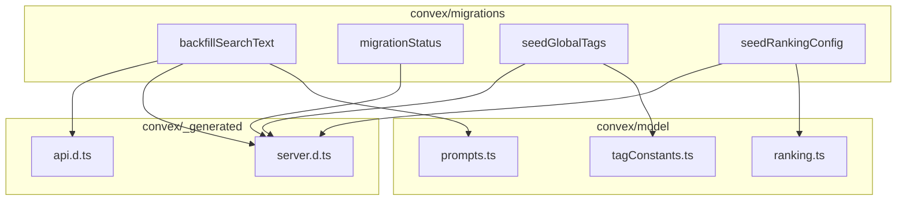
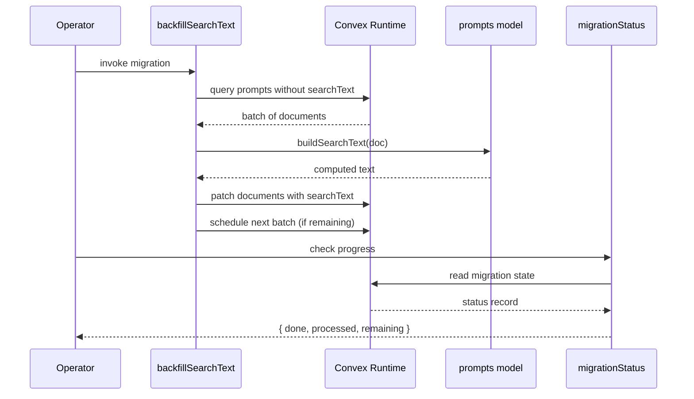

# Convex Migrations

## Overview

Data migration scripts for the LiminalDB Convex backend. This module provides one-off or repeatable migration functions for backfilling search text on prompts, seeding canonical global tags, initializing ranking configuration, and querying migration status. Each migration is a standalone Convex function that reads from domain model modules and writes to the database.

## Responsibilities

- Backfill search text fields on existing prompt documents by delegating to the prompts model
- Seed the global tags table with canonical tag definitions from tagConstants
- Initialize ranking configuration records from the ranking model defaults
- Expose a migration status query for monitoring progress of batch migrations

## Structure Diagram

## Entity Table

| Name | Kind | Role | Public Entrypoints | Depends On | Used By |
| --- | --- | --- | --- | --- | --- |
| backfillSearchText | variable (Convex mutation/action) | Iterates over prompt documents and populates their searchText field using logic from the prompts model | backfillSearchText | api.d.ts, server.d.ts, prompts.ts | none |
| migrationStatus | variable (Convex query) | Returns the current status of running or completed migrations for monitoring | migrationStatus | server.d.ts | none |
| seedGlobalTags | variable (Convex mutation) | Seeds the database with canonical global tag records defined in tagConstants | seedGlobalTags | server.d.ts, tagConstants.ts | none |
| seedRankingConfig | variable (Convex mutation) | Initializes ranking configuration records from defaults in the ranking model | seedRankingConfig | server.d.ts, ranking.ts | none |

## Key Flow

## Flow Notes

| Step | Actor/Component | Action | Output / Side Effect |
| --- | --- | --- | --- |
| 1 | Operator | Invokes a migration function (e.g., backfillSearchText) via the Convex dashboard or CLI | Migration begins executing in the Convex runtime |
| 2 | backfillSearchText | Queries for prompt documents that lack a searchText field, processing them in batches | Batch of unprocessed prompt documents |
| 3 | backfillSearchText | Delegates to the prompts model to compute the search text for each document and patches the record | Updated prompt documents with searchText populated |
| 4 | backfillSearchText | If more documents remain, schedules itself for the next batch via the Convex API | Continuation scheduled or migration marked complete |
| 5 | Operator | Calls migrationStatus to monitor progress | Status object with counts of processed and remaining documents |

## Source Coverage

- convex/migrations/backfillSearchText.ts
- convex/migrations/migrationStatus.ts
- convex/migrations/seedGlobalTags.ts
- convex/migrations/seedRankingConfig.ts

## Cross-Module Context

- convex/migrations/backfillSearchText.ts -> convex/_generated/api.d.ts (import)
- convex/migrations/backfillSearchText.ts -> convex/_generated/server.d.ts (import)
- convex/migrations/backfillSearchText.ts -> convex/model/prompts.ts (import)
- convex/migrations/migrationStatus.ts -> convex/_generated/server.d.ts (import)
- convex/migrations/seedGlobalTags.ts -> convex/_generated/server.d.ts (import)
- convex/migrations/seedGlobalTags.ts -> convex/model/tagConstants.ts (import)
- convex/migrations/seedRankingConfig.ts -> convex/_generated/server.d.ts (import)
- convex/migrations/seedRankingConfig.ts -> convex/model/ranking.ts (import)
