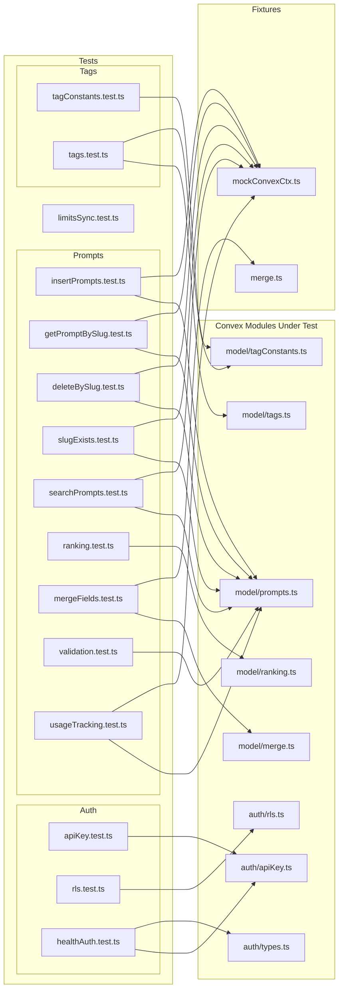
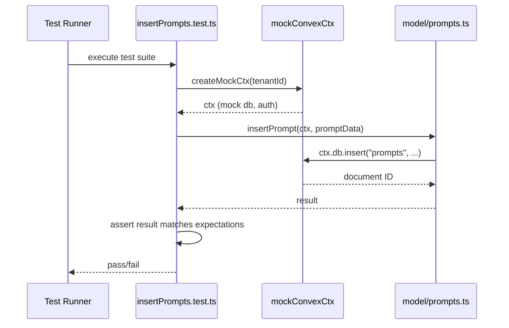

# Convex Unit Tests

## Overview

Unit test suite covering the Convex backend layer of LiminalDB. Tests are organized into four domains: **auth** (API key validation, row-level security, health-endpoint auth), **prompts** (CRUD operations, slug management, search, ranking, merge, validation, usage tracking), **tags** (tag model and constants), and **infrastructure** (limits sync). Tests use a shared `mockConvexCtx` fixture to simulate the Convex database context without requiring a live backend.

## Responsibilities

- Verify API key authentication and validation logic
- Test row-level security (RLS) enforcement across tenants
- Validate health endpoint authentication flows
- Test prompt CRUD: insert, getBySlug, deleteBySlug, slugExists
- Cover prompt search, ranking, merge-fields, validation, and usage tracking
- Ensure tag model and tag-constant consistency
- Validate limits synchronization logic

## Structure Diagram

## Entity Table

| Name | Kind | Role | Public Entrypoints | Depends On | Used By |
| --- | --- | --- | --- | --- | --- |
| apiKey.test.ts | test-file | Tests API key parsing and validation | none | convex/auth/apiKey.ts | none |
| rls.test.ts | test-file | Tests row-level security tenant isolation | none | convex/auth/rls.ts | none |
| healthAuth.test.ts | test-file | Tests health endpoint authentication using API keys and auth types | none | convex/auth/apiKey.ts, convex/auth/types.ts | none |
| limitsSync.test.ts | test-file | Tests plan limits synchronization logic | none | none | none |
| insertPrompts.test.ts | test-file | Tests prompt insertion including upsert, tagging, and validation (largest test file at 459 LOC) | none | convex/model/prompts.ts, tests/fixtures/mockConvexCtx.ts | none |
| getPromptBySlug.test.ts | test-file | Tests fetching a prompt by its slug | none | convex/model/prompts.ts, tests/fixtures/mockConvexCtx.ts | none |
| deleteBySlug.test.ts | test-file | Tests prompt deletion by slug with ownership checks | none | convex/model/prompts.ts, tests/fixtures/mockConvexCtx.ts | none |
| slugExists.test.ts | test-file | Tests slug existence check | none | convex/model/prompts.ts, tests/fixtures/mockConvexCtx.ts | none |
| searchPrompts.test.ts | test-file | Tests prompt search/filtering | none | convex/model/prompts.ts, tests/fixtures/mockConvexCtx.ts | none |
| ranking.test.ts | test-file | Tests prompt ranking/scoring algorithm | none | convex/model/ranking.ts | none |
| mergeFields.test.ts | test-file | Tests field-merge logic for prompt updates | none | convex/model/merge.ts, tests/fixtures/merge.ts | none |
| validation.test.ts | test-file | Tests prompt input validation rules | none | convex/model/prompts.ts | none |
| usageTracking.test.ts | test-file | Tests prompt usage counter increments | none | convex/model/prompts.ts, tests/fixtures/mockConvexCtx.ts | none |
| tagConstants.test.ts | test-file | Tests tag constant definitions and limits | none | convex/model/tagConstants.ts | none |
| tags.test.ts | test-file | Tests tag CRUD operations and associations | none | convex/model/tags.ts, convex/model/tagConstants.ts | none |

## Key Flow

## Flow Notes

| Step | Actor/Component | Action | Output / Side Effect |
| --- | --- | --- | --- |
| 1 | Test Runner | Discovers and executes test files across auth, prompts, tags, and infra suites | Test suites loaded |
| 2 | Test File | Creates a mock Convex context via mockConvexCtx fixture with tenant isolation | Mock ctx with simulated db and auth identity |
| 3 | Test File | Calls the Convex model function under test, passing the mock context | Function executes against mock db |
| 4 | Test File | Asserts return values, side effects, and error conditions | Pass/fail result reported to runner |

## Source Coverage

- tests/convex/auth/apiKey.test.ts
- tests/convex/auth/rls.test.ts
- tests/convex/healthAuth.test.ts
- tests/convex/limitsSync.test.ts
- tests/convex/prompts/deleteBySlug.test.ts
- tests/convex/prompts/getPromptBySlug.test.ts
- tests/convex/prompts/insertPrompts.test.ts
- tests/convex/prompts/mergeFields.test.ts
- tests/convex/prompts/ranking.test.ts
- tests/convex/prompts/searchPrompts.test.ts
- tests/convex/prompts/slugExists.test.ts
- tests/convex/prompts/usageTracking.test.ts
- tests/convex/prompts/validation.test.ts
- tests/convex/tags/tagConstants.test.ts
- tests/convex/tags/tags.test.ts

## Cross-Module Context

- tests/convex/auth/apiKey.test.ts -> convex/auth/apiKey.ts (usage)
- tests/convex/auth/rls.test.ts -> convex/auth/rls.ts (usage)
- tests/convex/healthAuth.test.ts -> convex/auth/apiKey.ts (usage)
- tests/convex/healthAuth.test.ts -> convex/auth/types.ts (usage)
- tests/convex/prompts/deleteBySlug.test.ts -> convex/model/prompts.ts (usage)
- tests/convex/prompts/deleteBySlug.test.ts -> tests/fixtures/mockConvexCtx.ts (usage)
- tests/convex/prompts/getPromptBySlug.test.ts -> convex/model/prompts.ts (usage)
- tests/convex/prompts/getPromptBySlug.test.ts -> tests/fixtures/mockConvexCtx.ts (usage)
- tests/convex/prompts/insertPrompts.test.ts -> convex/_generated/dataModel.d.ts (usage)
- tests/convex/prompts/insertPrompts.test.ts -> convex/model/prompts.ts (usage)
- tests/convex/prompts/insertPrompts.test.ts -> tests/fixtures/mockConvexCtx.ts (usage)
- tests/convex/prompts/mergeFields.test.ts -> convex/model/merge.ts (usage)
- tests/convex/prompts/mergeFields.test.ts -> tests/fixtures/merge.ts (usage)
- tests/convex/prompts/ranking.test.ts -> convex/model/ranking.ts (usage)
- tests/convex/prompts/searchPrompts.test.ts -> convex/model/prompts.ts (usage)
- tests/convex/prompts/searchPrompts.test.ts -> tests/fixtures/mockConvexCtx.ts (usage)
- tests/convex/prompts/slugExists.test.ts -> convex/model/prompts.ts (usage)
- tests/convex/prompts/slugExists.test.ts -> tests/fixtures/mockConvexCtx.ts (usage)
- tests/convex/prompts/usageTracking.test.ts -> convex/model/prompts.ts (usage)
- tests/convex/prompts/usageTracking.test.ts -> tests/fixtures/mockConvexCtx.ts (usage)
- tests/convex/prompts/validation.test.ts -> convex/model/prompts.ts (usage)
- tests/convex/tags/tagConstants.test.ts -> convex/model/tagConstants.ts (usage)
- tests/convex/tags/tags.test.ts -> convex/_generated/server.d.ts (usage)
- tests/convex/tags/tags.test.ts -> convex/model/tagConstants.ts (usage)
- tests/convex/tags/tags.test.ts -> convex/model/tags.ts (usage)
