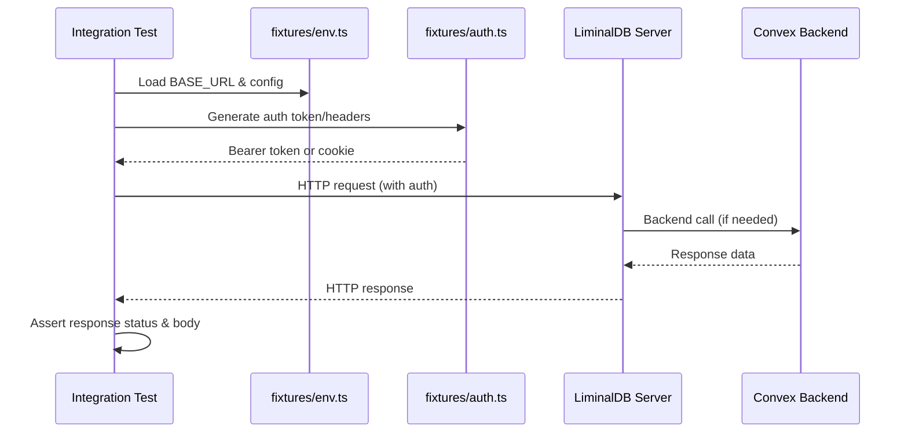

# Integration Tests

## Overview

Comprehensive end-to-end integration test suite for LiminalDB covering authentication flows (API keys, cookies, MCP tokens, OAuth), health endpoints, prompts CRUD, import/export, merge operations, user preferences, direct Convex calls, and UI interactions. All tests rely on shared fixtures for environment configuration and auth token generation.

## Responsibilities

- Validate API authentication via bearer tokens, cookies, and MCP auth headers
- Test health and authenticated health endpoints
- Exercise prompts API CRUD operations end-to-end
- Verify MCP protocol interactions and OAuth token flows
- Test import/export round-trip data integrity
- Validate merge conflict resolution logic
- Test user preferences read/write operations
- Verify direct Convex function calls (queries, mutations, actions)
- Test UI authentication and prompt management flows

## Structure Diagram

```mermaid
flowchart TD
  subgraph Fixtures
    AUTH["tests/fixtures/auth.ts"]
    ENV["tests/fixtures/env.ts"]
    JWT["tests/fixtures/jwt.ts"]
    CONVEX_API["convex/_generated/api.d.ts"]
  end

  subgraph Auth Tests
    AA["auth-api.test.ts"]
    AC["auth-cookie.test.ts"]
    AM["auth-mcp.test.ts"]
  end

  subgraph Health Tests
    H["health.test.ts"]
    HA["healthAuth.test.ts"]
  end

  subgraph API Tests
    PA["prompts-api.test.ts"]
    IE["import-export.test.ts"]
    MR["merge.test.ts"]
    PR["preferences.test.ts"]
  end

  subgraph MCP Tests
    MC["mcp.test.ts"]
    MO["mcp-oauth.test.ts"]
  end

  subgraph Convex Tests
    CT["convex.test.ts"]
    CC["convexCalls.test.ts"]
    CP["convex/prompts.test.ts"]
  end

  subgraph UI Tests
    UA["ui-auth.test.ts"]
    UP["ui-prompts.test.ts"]
  end

  AA --> AUTH & ENV & JWT
  AC --> ENV
  AM --> AUTH & ENV
  H --> ENV
  HA --> AUTH & ENV
  PA --> AUTH & ENV
  IE --> AUTH & ENV
  MR --> AUTH & ENV
  PR --> AUTH & ENV
  MC --> AUTH & ENV
  MO --> AUTH & ENV
  CT --> CONVEX_API
  CC --> CONVEX_API
  CP --> CONVEX_API
  UA --> AUTH & ENV
  UP --> AUTH & ENV
```

## Entity Table

| Name | Kind | Role | Public Entrypoints | Depends On | Used By |
| --- | --- | --- | --- | --- | --- |
| auth-api.test.ts | file | Tests API key/bearer token authentication flows | none | tests/fixtures/auth.ts, tests/fixtures/env.ts, tests/fixtures/jwt.ts | none |
| auth-cookie.test.ts | file | Tests cookie-based session authentication | none | tests/fixtures/env.ts | none |
| auth-mcp.test.ts | file | Tests MCP-specific authentication headers | none | tests/fixtures/auth.ts, tests/fixtures/env.ts | none |
| health.test.ts | file | Tests unauthenticated health endpoint | none | tests/fixtures/env.ts | none |
| healthAuth.test.ts | file | Tests authenticated health endpoint | none | tests/fixtures/auth.ts, tests/fixtures/env.ts | none |
| prompts-api.test.ts | file | Tests prompts REST API CRUD operations | none | tests/fixtures/auth.ts, tests/fixtures/env.ts | none |
| import-export.test.ts | file | Tests data import/export round-trip | none | tests/fixtures/auth.ts, tests/fixtures/env.ts | none |
| merge.test.ts | file | Tests merge and conflict resolution logic | none | tests/fixtures/auth.ts, tests/fixtures/env.ts | none |
| preferences.test.ts | file | Tests user preferences API | none | tests/fixtures/auth.ts, tests/fixtures/env.ts | none |
| mcp.test.ts | file | Tests MCP protocol interactions | none | tests/fixtures/auth.ts, tests/fixtures/env.ts | none |
| mcp-oauth.test.ts | file | Tests MCP OAuth token exchange flow | none | tests/fixtures/auth.ts, tests/fixtures/env.ts | none |
| convex.test.ts | file | Tests basic Convex connectivity | none | convex/_generated/api.d.ts | none |
| convexCalls.test.ts | file | Tests direct Convex query/mutation/action calls | none | convex/_generated/api.d.ts | none |
| convex/prompts.test.ts | file | Tests Convex prompts functions directly | none | convex/_generated/api.d.ts | none |
| ui-auth.test.ts | file | Tests UI authentication flow (login/logout) | none | tests/fixtures/auth.ts, tests/fixtures/env.ts | none |
| ui-prompts.test.ts | file | Tests UI prompt management interactions | none | tests/fixtures/auth.ts, tests/fixtures/env.ts | none |

## Key Flow

## Flow Notes

| Step | Actor/Component | Action | Output / Side Effect |
| --- | --- | --- | --- |
| 1 | Test | Load environment configuration (base URL, API keys) from fixtures/env.ts | Server URL and env vars available |
| 2 | Test | Generate authentication credentials via fixtures/auth.ts (and optionally jwt.ts) | Valid bearer token, cookie, or MCP auth header |
| 3 | Test | Send HTTP request to LiminalDB server endpoint with auth credentials | HTTP request dispatched |
| 4 | Server | Process request, authenticate, and call Convex backend as needed | Response with status code and JSON body |
| 5 | Test | Assert response status, headers, and body against expected values | Test pass or failure |

## Source Coverage

- tests/integration/auth-api.test.ts
- tests/integration/auth-cookie.test.ts
- tests/integration/auth-mcp.test.ts
- tests/integration/convex.test.ts
- tests/integration/convex/convexCalls.test.ts
- tests/integration/convex/prompts.test.ts
- tests/integration/health.test.ts
- tests/integration/healthAuth.test.ts
- tests/integration/import-export.test.ts
- tests/integration/mcp-oauth.test.ts
- tests/integration/mcp.test.ts
- tests/integration/merge.test.ts
- tests/integration/preferences.test.ts
- tests/integration/prompts-api.test.ts
- tests/integration/ui/ui-auth.test.ts
- tests/integration/ui/ui-prompts.test.ts

## Cross-Module Context

- tests/integration/auth-api.test.ts -> tests/fixtures/auth.ts (usage)
- tests/integration/auth-api.test.ts -> tests/fixtures/env.ts (usage)
- tests/integration/auth-api.test.ts -> tests/fixtures/jwt.ts (usage)
- tests/integration/auth-cookie.test.ts -> tests/fixtures/env.ts (usage)
- tests/integration/auth-mcp.test.ts -> tests/fixtures/auth.ts (usage)
- tests/integration/auth-mcp.test.ts -> tests/fixtures/env.ts (usage)
- tests/integration/convex.test.ts -> convex/_generated/api.d.ts (usage)
- tests/integration/convex/convexCalls.test.ts -> convex/_generated/api.d.ts (usage)
- tests/integration/convex/prompts.test.ts -> convex/_generated/api.d.ts (usage)
- tests/integration/health.test.ts -> tests/fixtures/env.ts (usage)
- tests/integration/healthAuth.test.ts -> tests/fixtures/auth.ts (usage)
- tests/integration/healthAuth.test.ts -> tests/fixtures/env.ts (usage)
- tests/integration/import-export.test.ts -> tests/fixtures/auth.ts (usage)
- tests/integration/import-export.test.ts -> tests/fixtures/env.ts (usage)
- tests/integration/mcp-oauth.test.ts -> tests/fixtures/auth.ts (usage)
- tests/integration/mcp-oauth.test.ts -> tests/fixtures/env.ts (usage)
- tests/integration/mcp.test.ts -> tests/fixtures/auth.ts (usage)
- tests/integration/mcp.test.ts -> tests/fixtures/env.ts (usage)
- tests/integration/merge.test.ts -> tests/fixtures/auth.ts (usage)
- tests/integration/merge.test.ts -> tests/fixtures/env.ts (usage)
- tests/integration/preferences.test.ts -> tests/fixtures/auth.ts (usage)
- tests/integration/preferences.test.ts -> tests/fixtures/env.ts (usage)
- tests/integration/prompts-api.test.ts -> tests/fixtures/auth.ts (usage)
- tests/integration/prompts-api.test.ts -> tests/fixtures/env.ts (usage)
- tests/integration/ui/ui-auth.test.ts -> tests/fixtures/auth.ts (usage)
- tests/integration/ui/ui-auth.test.ts -> tests/fixtures/env.ts (usage)
- tests/integration/ui/ui-prompts.test.ts -> tests/fixtures/auth.ts (usage)
- tests/integration/ui/ui-prompts.test.ts -> tests/fixtures/env.ts (usage)
