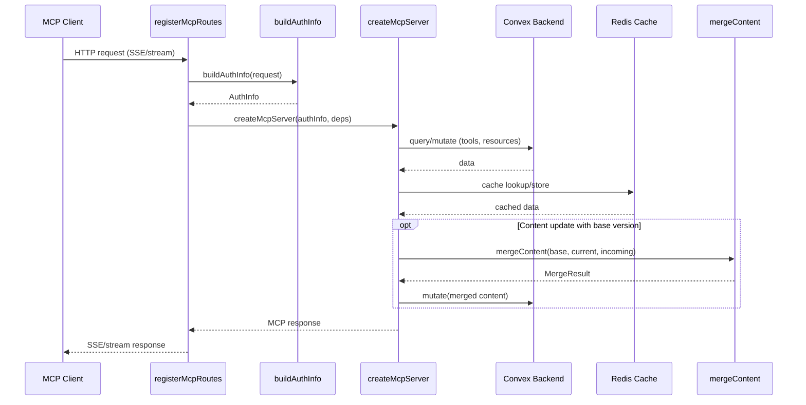

# MCP Server

## Overview

The MCP Server module implements the Model Context Protocol server for LiminalDB. It encompasses HTTP route registration for MCP and health endpoints, MCP server creation with tool/resource handlers backed by Convex and Redis, and a content merge utility used when updating prompts. The module is the primary integration surface for MCP-compatible AI clients.

## Responsibilities

- Register MCP HTTP routes with authentication and transport handling (src/api/mcp.ts)
- Register health-check routes for operational monitoring (src/api/health.ts)
- Create and configure the MCP server instance with tools, resources, and prompt handlers (src/lib/mcp.ts)
- Provide three-way content merging for concurrent prompt edits (src/lib/merge.ts)
- Build authentication info from incoming requests for MCP session context

## Structure Diagram

```mermaid
classDiagram
    class McpDependencies {
        <<interface>>
    }
    class McpTransport {
        <<interface>>
    }
    class MergeResult {
        <<interface>>
        +merged: string
        +conflicts: boolean
    }
    class registerMcpRoutes {
        <<function>>
    }
    class buildAuthInfo {
        <<function>>
    }
    class registerHealthRoutes {
        <<function>>
    }
    class createMcpServer {
        <<function>>
    }
    class mergeContent {
        <<function>>
    }

    registerMcpRoutes --> McpDependencies : accepts
    registerMcpRoutes --> McpTransport : manages
    registerMcpRoutes --> buildAuthInfo : calls
    registerMcpRoutes --> createMcpServer : calls
    createMcpServer --> mergeContent : uses
    createMcpServer --> MergeResult : produces
    createMcpServer ..> Convex : queries/mutates
    createMcpServer ..> Redis : caches
    registerHealthRoutes ..> Convex : health check
```

## Entity Table

| Name | Kind | Role | Public Entrypoints | Depends On | Used By |
| --- | --- | --- | --- | --- | --- |
| registerMcpRoutes | function | Registers MCP HTTP endpoints (SSE/streamable transport) on the Express app, wiring auth middleware and transport lifecycle. | src/api/mcp.ts:registerMcpRoutes | src/lib/auth/index.ts, src/lib/config.ts, src/lib/mcp.ts, src/middleware/auth.ts | src/index.ts, tests/service/auth/mcp.test.ts, tests/service/mcp/tools.test.ts, tests/service/mcp/resources.test.ts |
| buildAuthInfo | function | Extracts and builds authentication context from an incoming HTTP request for use in MCP sessions. | src/api/mcp.ts:buildAuthInfo | src/lib/auth/index.ts, src/middleware/auth.ts | src/index.ts, tests/service/auth/mcp.test.ts |
| McpDependencies | interface | Defines the dependency injection shape for MCP route registration (config, auth, transport factories). | src/api/mcp.ts:McpDependencies | none | src/index.ts, tests/service/mcp/tools.test.ts |
| McpTransport | interface | Describes the transport abstraction used for MCP client-server communication (SSE or streamable HTTP). | src/api/mcp.ts:McpTransport | none | src/index.ts, tests/service/mcp/tools.test.ts |
| createMcpServer | function | Instantiates the MCP server, registering all tools, resources, and prompt handlers with Convex and Redis backends. | src/lib/mcp.ts:createMcpServer | convex/_generated/api.d.ts, src/lib/config.ts, src/lib/convex.ts, src/lib/merge.ts, src/lib/redis.ts, src/schemas/preferences.ts, src/schemas/prompts.ts | src/api/mcp.ts, tests/service/mcp/toolHandlers.test.ts |
| mergeContent | function | Performs three-way content merge, returning merged text and conflict indicators. | src/lib/merge.ts:mergeContent | none | src/lib/mcp.ts, src/routes/prompts.ts, tests/service/lib/merge.test.ts |
| MergeResult | interface | Return type for mergeContent, carrying the merged output and whether conflicts were detected. | src/lib/merge.ts:MergeResult | none | src/lib/mcp.ts, src/routes/prompts.ts |
| registerHealthRoutes | function | Registers the /health endpoint for liveness and readiness checks, querying Convex for backend status. | src/api/health.ts:registerHealthRoutes | convex/_generated/api.d.ts, src/lib/config.ts, src/lib/convex.ts, src/middleware/auth.ts | src/index.ts |

## Key Flow

## Flow Notes

| Step | Actor/Component | Action | Output / Side Effect |
| --- | --- | --- | --- |
| 1 | MCP Client | Sends an HTTP request to an MCP endpoint (SSE or streamable transport). | Raw HTTP request arrives at Express router. |
| 2 | registerMcpRoutes | Invokes buildAuthInfo to extract authentication context from the request headers/token. | AuthInfo object with user identity and permissions. |
| 3 | registerMcpRoutes | Calls createMcpServer with auth info and injected dependencies to obtain a configured MCP server instance. | MCP server ready to handle tool calls, resource reads, and prompt operations. |
| 4 | createMcpServer | Executes tool/resource handlers that query or mutate data via Convex, with Redis caching. | Domain data fetched or persisted. |
| 5 | createMcpServer | For content updates, calls mergeContent to three-way merge the base, current, and incoming versions. | MergeResult indicating merged text and any conflicts. |
| 6 | registerMcpRoutes | Serializes the MCP response and streams it back to the client over the active transport. | SSE or streamable HTTP response delivered to the MCP client. |

## Source Coverage

- src/api/health.ts
- src/api/mcp.ts
- src/lib/mcp.ts
- src/lib/merge.ts

## Cross-Module Context

- src/api/health.ts -> convex/_generated/api.d.ts (import)
- src/api/health.ts -> src/lib/config.ts (import)
- src/api/health.ts -> src/lib/convex.ts (import)
- src/api/health.ts -> src/middleware/auth.ts (import)
- src/api/mcp.ts -> src/lib/auth/index.ts (import)
- src/api/mcp.ts -> src/lib/config.ts (import)
- src/api/mcp.ts -> src/middleware/auth.ts (import)
- src/index.ts -> src/api/health.ts (usage)
- src/index.ts -> src/api/mcp.ts (usage)
- src/lib/mcp.ts -> convex/_generated/api.d.ts (import)
- src/lib/mcp.ts -> src/lib/config.ts (import)
- src/lib/mcp.ts -> src/lib/convex.ts (import)
- src/lib/mcp.ts -> src/lib/redis.ts (import)
- src/lib/mcp.ts -> src/schemas/preferences.ts (import)
- src/lib/mcp.ts -> src/schemas/prompts.ts (import)
- src/routes/prompts.ts -> src/lib/merge.ts (import)
- tests/service/auth/mcp.test.ts -> src/api/mcp.ts (usage)
- tests/service/lib/merge.test.ts -> src/lib/merge.ts (usage)
- tests/service/mcp/auth-challenge.test.ts -> src/api/mcp.ts (usage)
- tests/service/mcp/resources.test.ts -> src/api/mcp.ts (usage)
- tests/service/mcp/toolHandlers.test.ts -> src/lib/mcp.ts (usage)
- tests/service/mcp/tools.test.ts -> src/api/mcp.ts (usage)
- tests/service/prompts/mcpTools.test.ts -> src/api/mcp.ts (usage)
