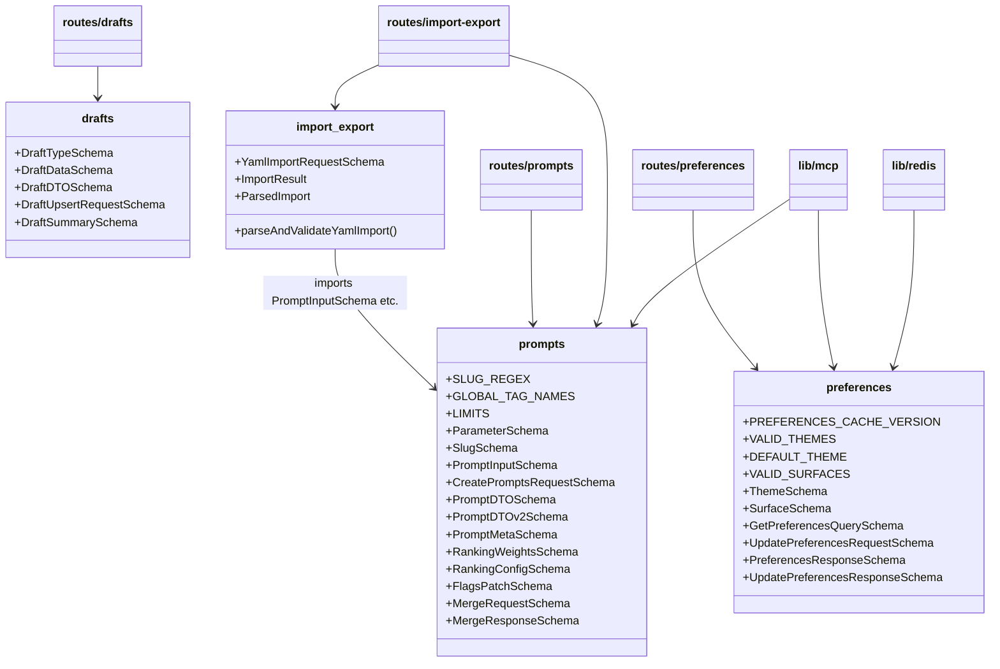
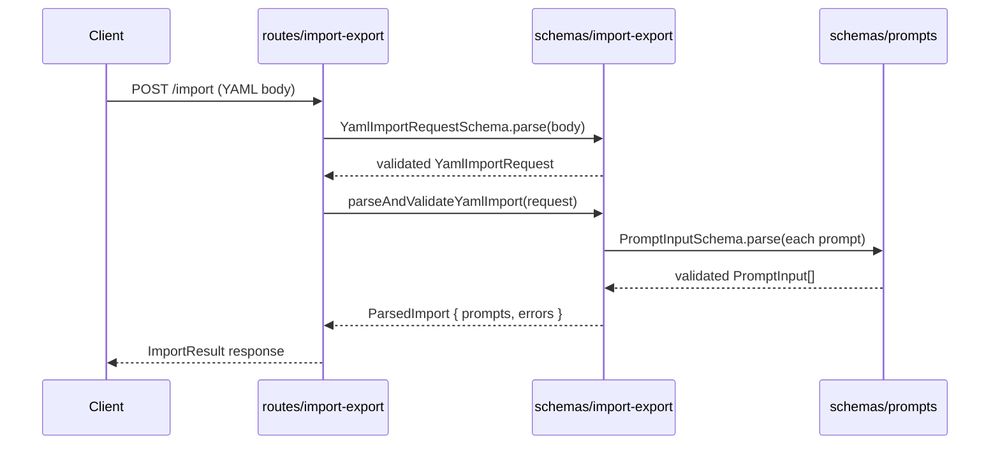

# Schemas

## Overview

The Schemas module is the single source of truth for data validation and TypeScript types across LiminalDB. It defines Zod schemas and inferred types for four domains: **prompts** (the core data model including parameters, DTOs, ranking, flags, and merge operations), **drafts** (work-in-progress prompt edits), **import/export** (YAML-based bulk prompt ingestion with a parse-and-validate helper), and **user preferences** (themes, surfaces, and caching). Every route handler, the MCP integration layer, and the Redis caching layer import from these schemas to enforce consistent validation at API boundaries.

## Responsibilities

- Define Zod validation schemas for prompt CRUD, ranking, flags, and merge operations
- Define Zod schemas and types for draft lifecycle (upsert, summary, DTO)
- Provide YAML import request validation and a `parseAndValidateYamlImport` helper function
- Define user preference schemas for themes, surfaces, and cache versioning
- Export inferred TypeScript types so consumers get compile-time safety alongside runtime validation
- Centralise domain constants such as SLUG_REGEX, LIMITS, GLOBAL_TAG_NAMES, VALID_THEMES, and VALID_SURFACES

## Structure Diagram

## Entity Table

| Name | Kind | Role | Public Entrypoints | Depends On | Used By |
| --- | --- | --- | --- | --- | --- |
| prompts.ts | schema file | Core prompt domain schemas: slugs, parameters, prompt input/DTO, ranking, flags, and merge request/response | src/schemas/prompts.ts | none | src/routes/prompts.ts, src/routes/import-export.ts, src/lib/mcp.ts, src/schemas/import-export.ts, tests/service/prompts/edgeCases.test.ts |
| drafts.ts | schema file | Draft lifecycle schemas: type enum, data, DTO, upsert request, and summary | src/schemas/drafts.ts | none | src/routes/drafts.ts, tests/service/drafts/drafts.test.ts |
| import-export.ts | schema file | YAML import validation schema and parseAndValidateYamlImport helper; ImportResult and ParsedImport interfaces | src/schemas/import-export.ts | src/schemas/prompts.ts | src/routes/import-export.ts |
| preferences.ts | schema file | User preference schemas for themes, surfaces, cache versioning, and CRUD request/response types | src/schemas/preferences.ts | none | src/routes/preferences.ts, src/routes/app.ts, src/routes/modules.ts, src/lib/mcp.ts, src/lib/redis.ts |

## Key Flow

## Flow Notes

| Step | Actor/Component | Action | Output / Side Effect |
| --- | --- | --- | --- |
| 1 | Client | Sends a POST request with a YAML payload to the import endpoint | Raw request body |
| 2 | routes/import-export | Validates the top-level request shape using YamlImportRequestSchema.parse | Typed YamlImportRequest or Zod validation error |
| 3 | routes/import-export | Calls parseAndValidateYamlImport to deserialise YAML and validate each prompt | Function invocation with validated request |
| 4 | schemas/import-export | Iterates over parsed YAML entries, validating each against PromptInputSchema from prompts.ts | ParsedImport containing validated prompts and any per-item errors |
| 5 | routes/import-export | Returns ImportResult to the client with created/skipped/errored counts | JSON ImportResult response |

## Source Coverage

- src/schemas/drafts.ts
- src/schemas/import-export.ts
- src/schemas/preferences.ts
- src/schemas/prompts.ts

## Cross-Module Context

- src/lib/mcp.ts -> src/schemas/preferences.ts (import)
- src/lib/mcp.ts -> src/schemas/prompts.ts (import)
- src/lib/redis.ts -> src/schemas/preferences.ts (import)
- src/routes/app.ts -> src/schemas/preferences.ts (import)
- src/routes/drafts.ts -> src/schemas/drafts.ts (import)
- src/routes/import-export.ts -> src/schemas/import-export.ts (import)
- src/routes/import-export.ts -> src/schemas/prompts.ts (import)
- src/routes/modules.ts -> src/schemas/preferences.ts (import)
- src/routes/preferences.ts -> src/schemas/preferences.ts (import)
- src/routes/prompts.ts -> src/schemas/prompts.ts (import)
- tests/service/drafts/drafts.test.ts -> src/schemas/drafts.ts (usage)
- tests/service/prompts/edgeCases.test.ts -> src/schemas/prompts.ts (usage)
