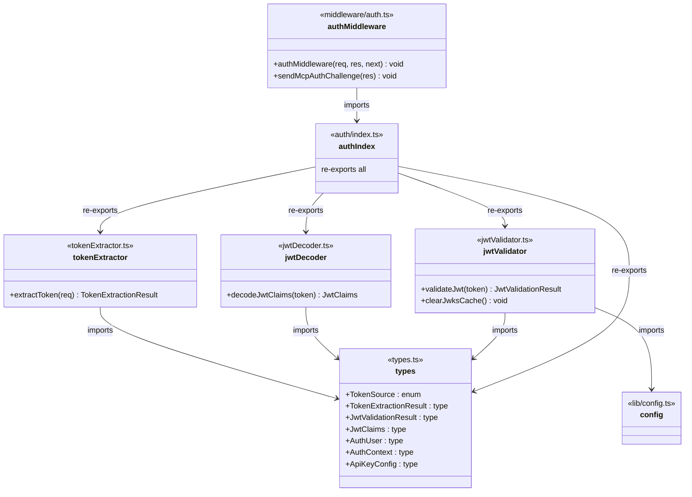
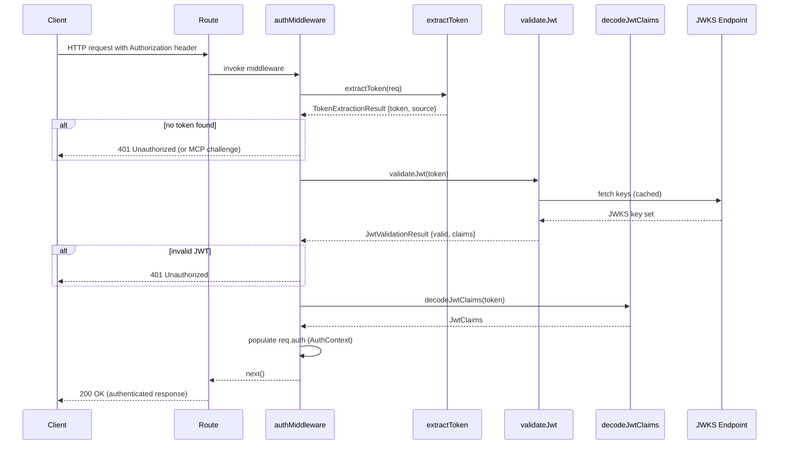

# Server Authentication

## Overview

The Server Authentication module provides JWT-based authentication for the LiminalDB HTTP service layer. It is structured as a layered pipeline: token extraction from incoming requests, JWT decoding of claims, cryptographic validation against JWKS, and an Express-compatible middleware that ties the pipeline together and gates access to all protected routes. A dedicated MCP auth challenge helper supports the Model Context Protocol authentication flow.

## Responsibilities

- Extract bearer tokens from HTTP Authorization headers and other request sources
- Decode JWT claims without cryptographic verification (for inspection/logging)
- Validate JWTs cryptographically against JWKS endpoints with caching
- Provide Express middleware that authenticates requests and populates AuthContext
- Send MCP-specific authentication challenge responses for unauthenticated MCP clients
- Define shared auth types (AuthUser, AuthContext, JwtClaims, TokenSource, etc.)

## Structure Diagram

## Entity Table

| Name | Kind | Role | Public Entrypoints | Depends On | Used By |
| --- | --- | --- | --- | --- | --- |
| types.ts | file | Defines all shared auth types and enums: TokenSource, TokenExtractionResult, JwtValidationResult, JwtClaims, AuthUser, AuthContext, ApiKeyConfig | TokenSource, TokenExtractionResult, JwtValidationResult, JwtClaims, AuthUser, AuthContext, ApiKeyConfig | none | tokenExtractor.ts, jwtDecoder.ts, jwtValidator.ts, auth/index.ts |
| extractToken | function | Extracts a bearer token from an incoming HTTP request and identifies its source | extractToken | types.ts | auth/index.ts, src/index.ts, tests (20+ test files) |
| decodeJwtClaims | function | Decodes JWT payload claims without cryptographic verification | decodeJwtClaims | types.ts | auth/index.ts |
| validateJwt | function | Validates a JWT cryptographically against a JWKS endpoint, using cached keys from config | validateJwt | types.ts, src/lib/config.ts | auth/index.ts |
| clearJwksCache | function | Clears the cached JWKS keys to force re-fetch on next validation | clearJwksCache | types.ts, src/lib/config.ts | auth/index.ts |
| auth/index.ts | file | Barrel re-export for the auth library; single import point for consumers | src/lib/auth/index.ts | tokenExtractor.ts, jwtDecoder.ts, jwtValidator.ts, types.ts | middleware/auth.ts, src/api/mcp.ts |
| authMiddleware | function | Express middleware that extracts, validates tokens and populates AuthContext on the request, rejecting unauthenticated requests | authMiddleware | auth/index.ts | src/routes/prompts.ts, src/routes/drafts.ts, src/routes/preferences.ts, src/routes/auth.ts, src/routes/app.ts, src/routes/import-export.ts, src/api/mcp.ts, src/api/health.ts, src/index.ts |
| sendMcpAuthChallenge | function | Sends an MCP-protocol-compliant authentication challenge response for unauthenticated MCP clients | sendMcpAuthChallenge | auth/index.ts | src/api/mcp.ts, src/routes/* |

## Key Flow

## Flow Notes

| Step | Actor/Component | Action | Output / Side Effect |
| --- | --- | --- | --- |
| 1 | Client | Sends HTTP request with bearer token in Authorization header | Raw HTTP request reaches route handler |
| 2 | authMiddleware | Calls extractToken to parse the token from the request | TokenExtractionResult with token string and TokenSource |
| 3 | authMiddleware | Calls validateJwt to cryptographically verify the token against JWKS | JwtValidationResult indicating validity and decoded claims |
| 4 | authMiddleware | Calls decodeJwtClaims for additional claim extraction, populates AuthContext on request | AuthContext with AuthUser attached to request object |
| 5 | authMiddleware | Calls next() to pass control to the route handler, or returns 401/MCP challenge on failure | Authenticated request proceeds to route or rejection sent to client |

## Source Coverage

- src/lib/auth/index.ts
- src/lib/auth/jwtDecoder.ts
- src/lib/auth/jwtValidator.ts
- src/lib/auth/tokenExtractor.ts
- src/lib/auth/types.ts
- src/middleware/auth.ts

## Cross-Module Context

- src/api/health.ts -> src/middleware/auth.ts (import)
- src/api/mcp.ts -> src/lib/auth/index.ts (import)
- src/api/mcp.ts -> src/middleware/auth.ts (import)
- src/index.ts -> src/lib/auth/tokenExtractor.ts (usage)
- src/index.ts -> src/middleware/auth.ts (usage)
- src/lib/auth/jwtValidator.ts -> src/lib/config.ts (import)
- src/routes/app.ts -> src/middleware/auth.ts (import)
- src/routes/auth.ts -> src/middleware/auth.ts (import)
- src/routes/drafts.ts -> src/middleware/auth.ts (import)
- src/routes/import-export.ts -> src/middleware/auth.ts (import)
- src/routes/preferences.ts -> src/middleware/auth.ts (import)
- src/routes/prompts.ts -> src/middleware/auth.ts (import)
- tests/service/auth/mcp.test.ts -> src/lib/auth/tokenExtractor.ts (usage)
- tests/service/auth/mcp.test.ts -> src/middleware/auth.ts (usage)
- tests/service/auth/middleware.test.ts -> src/lib/auth/index.ts (usage)
- tests/service/auth/middleware.test.ts -> src/lib/auth/tokenExtractor.ts (usage)
- tests/service/auth/middleware.test.ts -> src/middleware/auth.ts (usage)
- tests/service/auth/routes.test.ts -> src/lib/auth/tokenExtractor.ts (usage)
- tests/service/auth/routes.test.ts -> src/middleware/auth.ts (usage)
- tests/service/drafts/drafts.test.ts -> src/lib/auth/tokenExtractor.ts (usage)
- tests/service/drafts/drafts.test.ts -> src/middleware/auth.ts (usage)
- tests/service/mcp/auth-challenge.test.ts -> src/lib/auth/tokenExtractor.ts (usage)
- tests/service/mcp/auth-challenge.test.ts -> src/middleware/auth.ts (usage)
- tests/service/mcp/resources.test.ts -> src/lib/auth/tokenExtractor.ts (usage)
- tests/service/mcp/resources.test.ts -> src/middleware/auth.ts (usage)
- tests/service/mcp/tools.test.ts -> src/lib/auth/tokenExtractor.ts (usage)
- tests/service/mcp/tools.test.ts -> src/middleware/auth.ts (usage)
- tests/service/mcp/well-known.test.ts -> src/lib/auth/tokenExtractor.ts (usage)
- tests/service/mcp/well-known.test.ts -> src/middleware/auth.ts (usage)
- tests/service/preferences.test.ts -> src/lib/auth/tokenExtractor.ts (usage)
- tests/service/preferences.test.ts -> src/middleware/auth.ts (usage)
- tests/service/prompts/createPrompts.test.ts -> src/lib/auth/tokenExtractor.ts (usage)
- tests/service/prompts/createPrompts.test.ts -> src/middleware/auth.ts (usage)
- tests/service/prompts/deletePrompt.test.ts -> src/lib/auth/tokenExtractor.ts (usage)
- tests/service/prompts/deletePrompt.test.ts -> src/middleware/auth.ts (usage)
- tests/service/prompts/edgeCases.test.ts -> src/lib/auth/tokenExtractor.ts (usage)
- tests/service/prompts/edgeCases.test.ts -> src/middleware/auth.ts (usage)
- tests/service/prompts/flagsUsage.test.ts -> src/lib/auth/tokenExtractor.ts (usage)
- tests/service/prompts/flagsUsage.test.ts -> src/middleware/auth.ts (usage)
- tests/service/prompts/getPrompt.test.ts -> src/lib/auth/tokenExtractor.ts (usage)
- tests/service/prompts/getPrompt.test.ts -> src/middleware/auth.ts (usage)
- tests/service/prompts/importExport.test.ts -> src/lib/auth/tokenExtractor.ts (usage)
- tests/service/prompts/importExport.test.ts -> src/middleware/auth.ts (usage)
- tests/service/prompts/listPrompts.test.ts -> src/lib/auth/tokenExtractor.ts (usage)
- tests/service/prompts/listPrompts.test.ts -> src/middleware/auth.ts (usage)
- tests/service/prompts/mcpTools.test.ts -> src/lib/auth/tokenExtractor.ts (usage)
- tests/service/prompts/mcpTools.test.ts -> src/middleware/auth.ts (usage)
- tests/service/prompts/mergePrompt.test.ts -> src/lib/auth/tokenExtractor.ts (usage)
- tests/service/prompts/mergePrompt.test.ts -> src/middleware/auth.ts (usage)
- tests/service/prompts/updatePrompt.test.ts -> src/lib/auth/tokenExtractor.ts (usage)
- tests/service/prompts/updatePrompt.test.ts -> src/middleware/auth.ts (usage)
