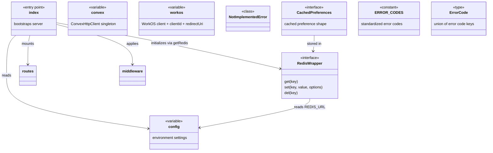
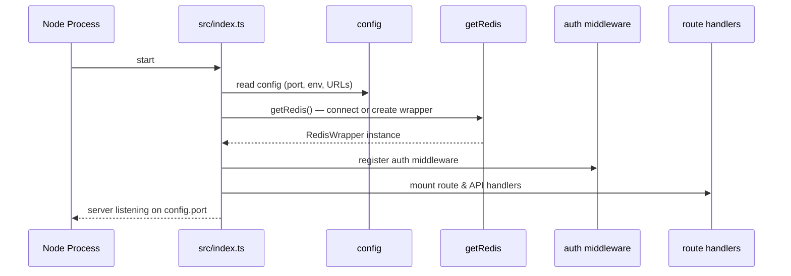

# Server Entry & Config

## Overview

This module provides the application bootstrap layer for LiminalDB. It contains the HTTP server entry point (`src/index.ts`), centralized configuration, client singletons for Convex and WorkOS, a Redis caching abstraction with preference-specific helpers, and standardized error codes. Together these files form the foundation that every route, middleware, and service layer depends on.

## Responsibilities

- Bootstrap the HTTP server, register middleware, and mount all route/API handlers
- Centralize environment-driven configuration (ports, URLs, feature flags) via `config`
- Provide a singleton Convex client for backend data access
- Provide WorkOS client, client ID, and redirect URI for authentication flows
- Abstract Redis connectivity behind a swappable `RedisWrapper` interface with preference caching helpers
- Define standardized `ERROR_CODES` and `ErrorCode` type for consistent API error responses

## Structure Diagram

## Entity Table

| Name | Kind | Role | Public Entrypoints | Depends On | Used By |
| --- | --- | --- | --- | --- | --- |
| src/index.ts | file | Application entry point — creates the HTTP server, initializes Redis, applies auth middleware, and mounts all route handlers | none | config, getRedis, src/middleware/auth.ts, src/routes/*, src/api/* | none |
| config | variable | Centralized configuration object sourced from environment variables (port, Convex URL, Redis URL, etc.) | src/lib/config.ts:config | none | src/index.ts, src/lib/redis.ts, src/lib/mcp.ts, src/lib/auth/jwtValidator.ts, src/api/health.ts, src/api/mcp.ts, src/routes/preferences.ts, src/routes/prompts.ts, src/routes/import-export.ts |
| convex | variable | Singleton ConvexHttpClient instance used for all backend data operations | src/lib/convex.ts:convex | none | src/api/health.ts, src/lib/mcp.ts, src/routes/import-export.ts, src/routes/preferences.ts, src/routes/prompts.ts |
| workos | variable | WorkOS SDK client instance for authentication and SSO | src/lib/workos.ts:workos, src/lib/workos.ts:clientId, src/lib/workos.ts:redirectUri | none | src/routes/auth.ts |
| RedisWrapper | interface | Abstraction over Redis client enabling testable, swappable cache implementations | src/lib/redis.ts:RedisWrapper, src/lib/redis.ts:getRedis, src/lib/redis.ts:setRedisClient | config | src/index.ts, src/lib/mcp.ts, src/routes/drafts.ts, src/routes/preferences.ts, tests/__mocks__/redis.ts |
| CachedPreferences | interface | Shape of user preferences stored in Redis cache, with get/set/invalidate helpers | src/lib/redis.ts:CachedPreferences, src/lib/redis.ts:getCachedPreferences, src/lib/redis.ts:setCachedPreferences, src/lib/redis.ts:invalidateCachedPreferences | config, src/schemas/preferences.ts | src/routes/preferences.ts, src/lib/mcp.ts, src/routes/drafts.ts |
| NotImplementedError | class | Error class thrown when Redis is not configured but a cache operation is attempted | src/lib/redis.ts:NotImplementedError | none | none |
| ERROR_CODES | constant | Map of standardized error code strings for consistent API error responses | src/lib/errors.ts:ERROR_CODES | none | none |
| ErrorCode | type | TypeScript union type derived from ERROR_CODES keys | src/lib/errors.ts:ErrorCode | none | none |

## Key Flow

## Flow Notes

| Step | Actor/Component | Action | Output / Side Effect |
| --- | --- | --- | --- |
| 1 | Node Process | Executes src/index.ts as the application entry point | Module-level initialization begins |
| 2 | src/index.ts | Reads centralized config for port, environment, and service URLs | Configuration values available to all downstream modules |
| 3 | src/index.ts | Calls getRedis() to initialize the Redis connection (or a no-op wrapper if unconfigured) | RedisWrapper singleton ready for preference caching |
| 4 | src/index.ts | Registers auth middleware (token extraction, JWT validation) and mounts all route handlers (auth, prompts, preferences, drafts, modules, import-export, well-known, health, MCP) | HTTP server listening and accepting requests |

## Source Coverage

- src/index.ts
- src/lib/config.ts
- src/lib/convex.ts
- src/lib/errors.ts
- src/lib/redis.ts
- src/lib/workos.ts

## Cross-Module Context

- src/api/health.ts -> src/lib/config.ts (import)
- src/api/health.ts -> src/lib/convex.ts (import)
- src/api/mcp.ts -> src/lib/config.ts (import)
- src/index.ts -> src/api/health.ts (usage)
- src/index.ts -> src/api/mcp.ts (usage)
- src/index.ts -> src/lib/auth/tokenExtractor.ts (usage)
- src/index.ts -> src/middleware/auth.ts (usage)
- src/index.ts -> src/routes/app.ts (usage)
- src/index.ts -> src/routes/auth.ts (usage)
- src/index.ts -> src/routes/drafts.ts (usage)
- src/index.ts -> src/routes/import-export.ts (usage)
- src/index.ts -> src/routes/modules.ts (usage)
- src/index.ts -> src/routes/preferences.ts (usage)
- src/index.ts -> src/routes/prompts.ts (usage)
- src/index.ts -> src/routes/well-known.ts (usage)
- src/lib/auth/jwtValidator.ts -> src/lib/config.ts (import)
- src/lib/mcp.ts -> src/lib/config.ts (import)
- src/lib/mcp.ts -> src/lib/convex.ts (import)
- src/lib/mcp.ts -> src/lib/redis.ts (import)
- src/lib/redis.ts -> src/schemas/preferences.ts (import)
- src/routes/auth.ts -> src/lib/workos.ts (import)
- src/routes/drafts.ts -> src/lib/redis.ts (import)
- src/routes/import-export.ts -> src/lib/config.ts (import)
- src/routes/import-export.ts -> src/lib/convex.ts (import)
- src/routes/preferences.ts -> src/lib/config.ts (import)
- src/routes/preferences.ts -> src/lib/convex.ts (import)
- src/routes/preferences.ts -> src/lib/redis.ts (import)
- src/routes/prompts.ts -> src/lib/config.ts (import)
- src/routes/prompts.ts -> src/lib/convex.ts (import)
- tests/__mocks__/redis.ts -> src/lib/redis.ts (import)
- tests/service/drafts/drafts.test.ts -> src/lib/redis.ts (usage)
