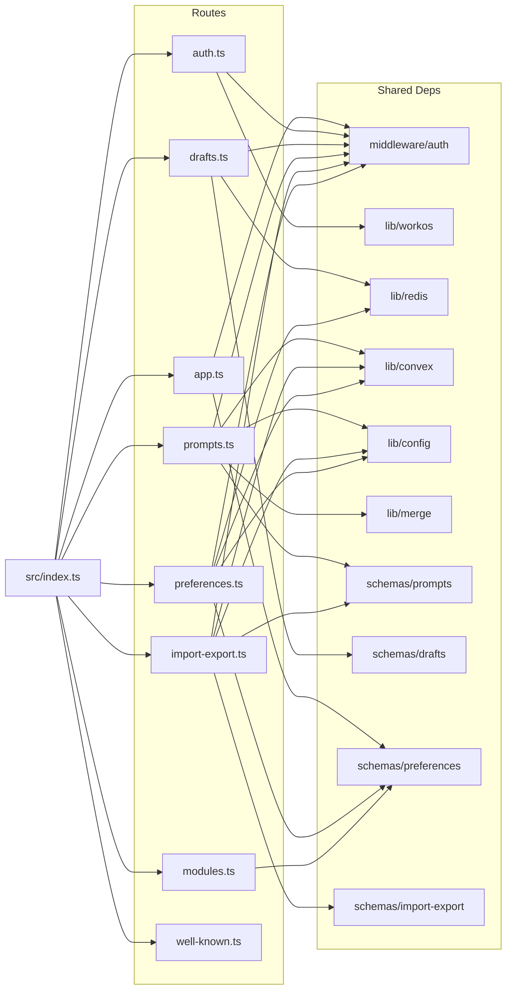
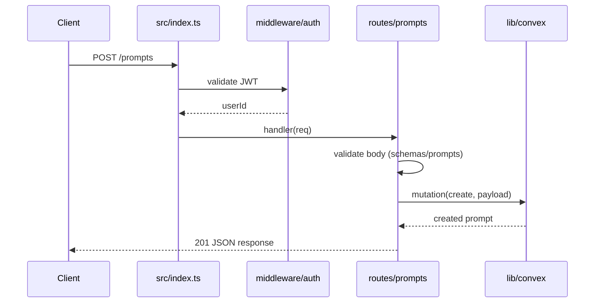

# Server Routes

## Overview

The Server Routes module contains eight route-registration functions that collectively define the HTTP surface of LiminalDB. Each function receives the application instance (from `src/index.ts`) and mounts handlers for a specific domain: app pages, authentication (WorkOS), prompts CRUD, drafts (Redis-backed), import/export, user preferences, modules, and `.well-known` MCP discovery endpoints. Most routes depend on shared auth middleware, Convex for persistence, and Zod-based schemas for validation.

## Responsibilities

- Mount app-level page routes with auth gating
- Handle OAuth login/callback/logout flows via WorkOS
- Provide full CRUD for prompts backed by Convex, with merge support for updates
- Manage ephemeral draft state in Redis
- Bulk import and export of prompts with schema validation
- Read and write user preferences to Convex with Redis caching
- Serve module-related metadata
- Expose `.well-known` endpoints for MCP protocol discovery

## Structure Diagram

## Entity Table

| Name | Kind | Role | Public Entrypoints | Depends On | Used By |
| --- | --- | --- | --- | --- | --- |
| registerAppRoutes | function | Mounts app page routes (dashboard, etc.) behind auth middleware | src/routes/app.ts:registerAppRoutes | src/middleware/auth.ts, src/schemas/preferences.ts | src/index.ts |
| registerAuthRoutes | function | Handles WorkOS OAuth login, callback, and logout flows | src/routes/auth.ts:registerAuthRoutes | src/lib/workos.ts, src/middleware/auth.ts | src/index.ts, tests/service/auth/routes.test.ts |
| registerPromptRoutes | function | Full CRUD for prompts with Convex persistence and merge-based updates | src/routes/prompts.ts:registerPromptRoutes | convex/_generated/api.d.ts, src/lib/config.ts, src/lib/convex.ts, src/lib/merge.ts, src/middleware/auth.ts, src/schemas/prompts.ts | src/index.ts, tests/service/prompts/createPrompts.test.ts, tests/service/prompts/deletePrompt.test.ts, tests/service/prompts/edgeCases.test.ts, tests/service/prompts/getPrompt.test.ts, tests/service/prompts/updatePrompt.test.ts |
| registerDraftRoutes | function | Manages ephemeral prompt drafts stored in Redis | src/routes/drafts.ts:registerDraftRoutes | src/lib/redis.ts, src/middleware/auth.ts, src/schemas/drafts.ts | src/index.ts, tests/service/drafts/drafts.test.ts |
| registerImportExportRoutes | function | Bulk import and export of prompts with validation | src/routes/import-export.ts:registerImportExportRoutes | convex/_generated/api.d.ts, src/lib/config.ts, src/lib/convex.ts, src/middleware/auth.ts, src/schemas/import-export.ts, src/schemas/prompts.ts | src/index.ts, tests/service/prompts/importExport.test.ts |
| registerPreferencesRoutes | function | Read/write user preferences with Convex persistence and Redis caching | src/routes/preferences.ts:registerPreferencesRoutes | convex/_generated/api.d.ts, src/lib/config.ts, src/lib/convex.ts, src/lib/redis.ts, src/middleware/auth.ts, src/schemas/preferences.ts | src/index.ts |
| registerModuleRoutes | function | Serves module metadata | src/routes/modules.ts:registerModuleRoutes | src/schemas/preferences.ts | src/index.ts |
| registerWellKnownRoutes | function | Exposes .well-known endpoints for MCP protocol discovery | src/routes/well-known.ts:registerWellKnownRoutes | none | src/index.ts, tests/service/mcp/well-known.test.ts |

## Key Flow

## Flow Notes

| Step | Actor/Component | Action | Output / Side Effect |
| --- | --- | --- | --- |
| 1 | Client | Sends HTTP request to a route (e.g., POST /prompts) | Request reaches src/index.ts router |
| 2 | index.ts | Delegates to the matched route handler registered at startup | Request forwarded to route module |
| 3 | middleware/auth | Validates JWT and extracts userId from session | Authenticated userId or 401 rejection |
| 4 | Route handler | Validates request body/params against Zod schema | Parsed and typed payload or 400 error |
| 5 | Route handler | Calls Convex/Redis as needed for persistence | Data returned from backend store |
| 6 | Route handler | Returns JSON response to client | HTTP response with status code and body |

## Source Coverage

- src/routes/app.ts
- src/routes/auth.ts
- src/routes/drafts.ts
- src/routes/import-export.ts
- src/routes/modules.ts
- src/routes/preferences.ts
- src/routes/prompts.ts
- src/routes/well-known.ts

## Cross-Module Context

- src/index.ts -> src/routes/app.ts (usage)
- src/index.ts -> src/routes/auth.ts (usage)
- src/index.ts -> src/routes/drafts.ts (usage)
- src/index.ts -> src/routes/import-export.ts (usage)
- src/index.ts -> src/routes/modules.ts (usage)
- src/index.ts -> src/routes/preferences.ts (usage)
- src/index.ts -> src/routes/prompts.ts (usage)
- src/index.ts -> src/routes/well-known.ts (usage)
- src/routes/app.ts -> src/middleware/auth.ts (import)
- src/routes/app.ts -> src/schemas/preferences.ts (import)
- src/routes/auth.ts -> src/lib/workos.ts (import)
- src/routes/auth.ts -> src/middleware/auth.ts (import)
- src/routes/drafts.ts -> src/lib/redis.ts (import)
- src/routes/drafts.ts -> src/middleware/auth.ts (import)
- src/routes/drafts.ts -> src/schemas/drafts.ts (import)
- src/routes/import-export.ts -> convex/_generated/api.d.ts (import)
- src/routes/import-export.ts -> src/lib/config.ts (import)
- src/routes/import-export.ts -> src/lib/convex.ts (import)
- src/routes/import-export.ts -> src/middleware/auth.ts (import)
- src/routes/import-export.ts -> src/schemas/import-export.ts (import)
- src/routes/import-export.ts -> src/schemas/prompts.ts (import)
- src/routes/modules.ts -> src/schemas/preferences.ts (import)
- src/routes/preferences.ts -> convex/_generated/api.d.ts (import)
- src/routes/preferences.ts -> src/lib/config.ts (import)
- src/routes/preferences.ts -> src/lib/convex.ts (import)
- src/routes/preferences.ts -> src/lib/redis.ts (import)
- src/routes/preferences.ts -> src/middleware/auth.ts (import)
- src/routes/preferences.ts -> src/schemas/preferences.ts (import)
- src/routes/prompts.ts -> convex/_generated/api.d.ts (import)
- src/routes/prompts.ts -> src/lib/config.ts (import)
- src/routes/prompts.ts -> src/lib/convex.ts (import)
- src/routes/prompts.ts -> src/lib/merge.ts (import)
- src/routes/prompts.ts -> src/middleware/auth.ts (import)
- src/routes/prompts.ts -> src/schemas/prompts.ts (import)
- tests/service/auth/routes.test.ts -> src/routes/auth.ts (usage)
- tests/service/drafts/drafts.test.ts -> src/routes/drafts.ts (usage)
- tests/service/mcp/well-known.test.ts -> src/routes/well-known.ts (usage)
- tests/service/prompts/createPrompts.test.ts -> src/routes/prompts.ts (usage)
- tests/service/prompts/deletePrompt.test.ts -> src/routes/prompts.ts (usage)
- tests/service/prompts/edgeCases.test.ts -> src/routes/prompts.ts (usage)
- tests/service/prompts/getPrompt.test.ts -> src/routes/prompts.ts (usage)
- tests/service/prompts/importExport.test.ts -> src/routes/import-export.ts (usage)
- tests/service/prompts/updatePrompt.test.ts -> src/routes/prompts.ts (usage)
